# 如何铸造成千上万的 NFT 游戏资产

> 原文：<https://moralis.io/how-to-mint-thousands-of-nft-game-assets/>

**如果你对** [**Web3 游戏设计**](https://moralis.io/web3-game-design-explaining-the-web3-game-design-process/) **感兴趣，你应该知道 NFT 在区块链游戏中扮演着至关重要的角色，因为它们有很多用例。此外，无数**[**【P2E】游戏实例**](https://moralis.io/how-to-build-a-play-to-earn-p2e-game/) **证明游戏玩家更青睐真正拥有游戏内资产的概念。这些 NFT 游戏资产不仅可以在游戏中使用，还可以在 NFT 市场上产生巨额利润。然而，游戏工作室发现大规模管理游戏内资产的创建是一个挑战。可以想象，一次创建一万个或更多的唯一令牌既不划算也不实用。因此，我们创建了一个资产工厂脚本，让您轻松铸造数以千计的 NFT 游戏资产。此外，这个脚本利用 Moralis API 来帮助您节省 85%以上的开发时间。因此，将 NFTs 集成到游戏中变得简单了 100 倍。**

游戏工作室的一个标准场景是，他们拥有制作所有相关视觉资产的设计团队。这些包括图像、动画视频、3D 模型等。所有或部分这些资产是我们想作为 NFT 游戏资产。此外，我们希望使用代表游戏内资产的文件作为游戏内 NFTs 的元数据。一个很好的例子就是游戏中的 NFT 角色。因此，我们将根据不同的图像和信息来创建多个角色。在这里，我们举例说明了如何使用我们的代码铸造成千上万的 NFT 游戏资产。此外，我们在脚本的底层为您提供尽可能多的上下文。尽管如此，要使用我们的代码，你需要一种方法来访问[Moralis SDK](https://moralis.io/exploring-moralis-sdk-the-ultimate-web3-sdk/) 。因此，在继续之前，请务必[创建您的免费 Moralis 账户](https://admin.moralis.io/login)。

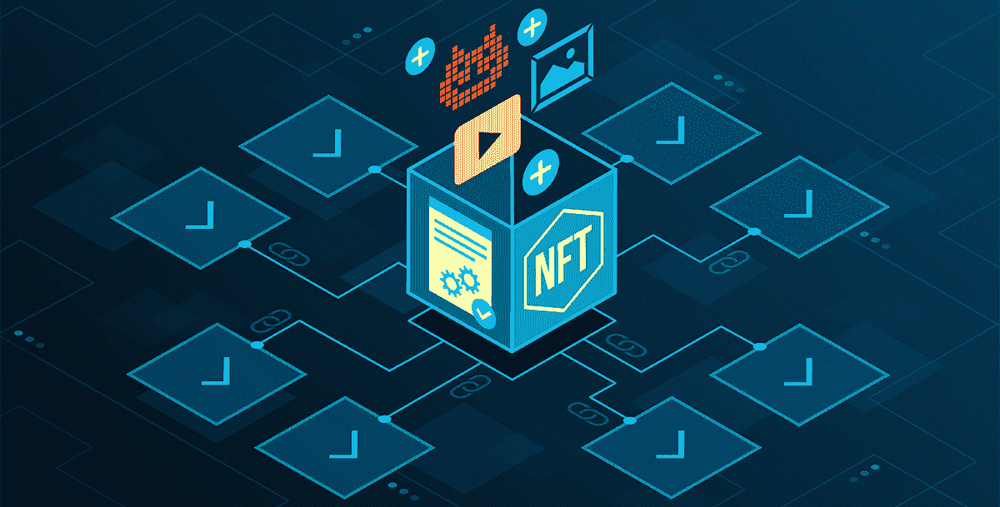

## 使用我们的资产工厂脚本铸造成千上万的 NFT 游戏资产

我们的资产工厂脚本的完整代码在 GitHub 上等待着你。确保克隆代码，并在您喜欢的代码编辑器中打开它；然而，我们更喜欢使用 Visual Studio 代码(VSC)。克隆的代码准备好了，你就可以跟随我们的“如何创造成千上万的 NFT 游戏资产”之旅了！

所以，这里是“Moralis-NFT-游戏-资产-工厂”项目的结构:

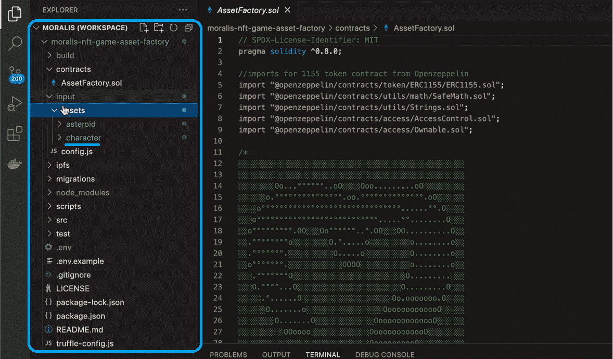

在“character”文件夹中，我们有所有的 PNG 图像文件，它们是我们游戏内 NFTs 的视觉方面:

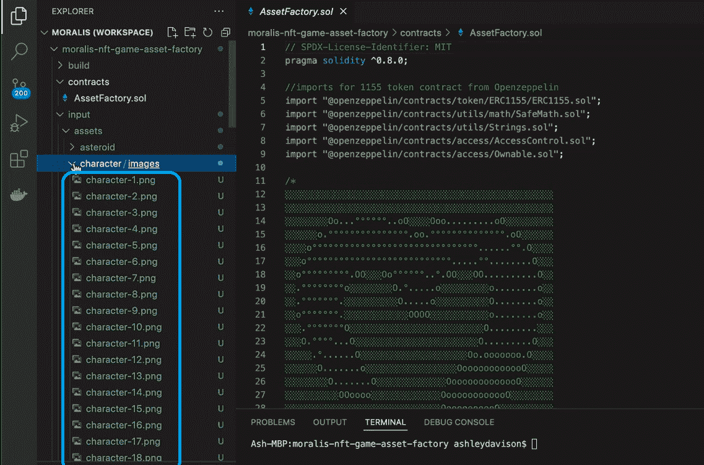

为了将这些文件转换成 NFT，我们还需要将这些文件存放在某个地方。幸运的是，Moralis 包括 [IPFS](https://moralis.io/what-is-ipfs-interplanetary-file-system/) (星际文件系统)集成。因此，我们可以毫不费力地将[上传到 IPFS](https://moralis.io/full-guide-how-to-upload-to-ipfs/) 。此外，我们为此创建了“ [upload.js](https://github.com/ashbeech/moralis-nft-game-asset-factory/blob/main/scripts/upload.js) ”文件:

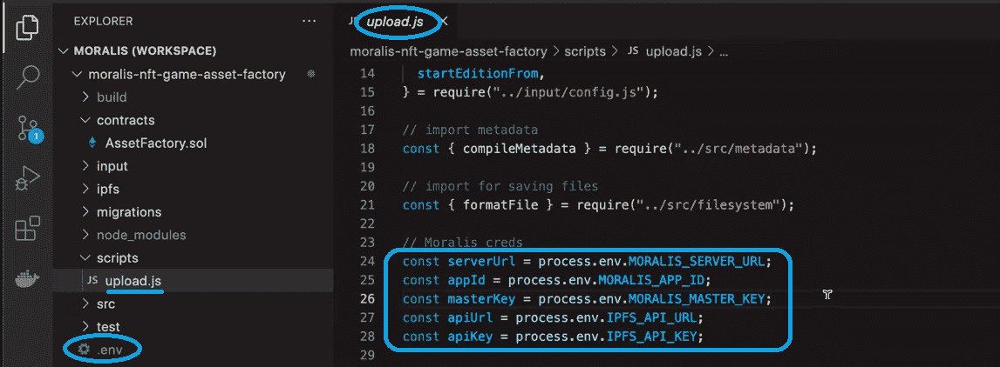

使用上面标记的 Moralis 凭证，这些凭证在。env”，我们可以将媒体文件与元数据关联起来。然后，我们有与对应于特定字符的 NFT 相关联的元数据。如果不使用 Moralis 标准，这种关联将极具挑战性且耗时。然而，当使用 Moralis 的基础设施时，这个用于加密的"[Firebase](https://moralis.io/firebase-for-crypto-the-best-blockchain-firebase-alternative/)"平台使事情变得非常简单。我们的代码使您能够简单地将所有媒体文件转储到“输入”文件夹中。然后，运行“upload”脚本，它负责创建链接到链上 NFTs 的元数据。虽然，在运行脚本之前，你需要使用你的 Moralis 账户[创建一个 Moralis dapp](https://docs.moralis.io/moralis-dapp/getting-started/create-a-moralis-dapp) 。这将使您能够获得环境变量，您需要将这些变量粘贴到。env "文件:

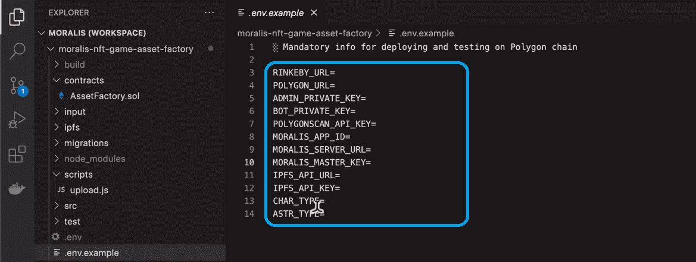

现在，在我们运行脚本之前，让我们仔细看看确保我们为角色随机生成元数据的代码。

## 通过信息自动化铸造数千个 NFT 游戏资产

关于 NFT 游戏资产(在我们的例子中是角色)的信息自动化是一个重要的方面，特别是当我们想要铸造成千上万的 NFT 游戏资产时。因此，为了创建元数据文件(“。JSON”)，我们需要合适的代码——“[metadata . js](https://github.com/ashbeech/moralis-nft-game-asset-factory/blob/main/src/metadata.js)”。后者确保自动生成关于我们资产的细节，比如名称或属性。我们还使用“ [generator.js](https://github.com/ashbeech/moralis-nft-game-asset-factory/blob/main/src/generator.js) ”文件将这些字段插入到适当的第三方 API 名称生成器中。这种方法使我们能够轻松生成数千条独特的资产数据:

```js
const nameGenerator = async (_type) => {
  try {
    if (_type == "asteroid") {
      const response = await Promise.all([
        fetchData(
          "https://story-shack-cdn-v2.glitch.me/generators/meteor-name-generator?count=12"
        ),
      ]);
      const name = pickRandom(response, _type);

      return `${name.name}`;
    } else {
      const response = await Promise.all([
        fetchData("https://www.randomlists.com/data/names-female.json"),
        fetchData("https://www.randomlists.com/data/names-surnames.json"),
      ]);

      const [firstNames, lastNames] = response;

      const firstName = pickRandom(firstNames.data.data, _type);
      const lastName = pickRandom(lastNames.data.data, _type);

      return `${firstName} ${lastName}`;
    }
  } catch (error) {
    console.error("Unable to generate name:", error);
  }
};
```

### 将文件和元数据上传到 IPFS

有了这些信息，我们就能够准备好所有需要的部分(文件和元数据)。因此，我们的“upload.js”文件可以发挥它的作用。它首先通过 Moralis 的 API 将媒体文件从“输入”文件夹上传到 IPFS 的一个目录中:

```js
const { compileMetadata } = require("../src/metadata");
```

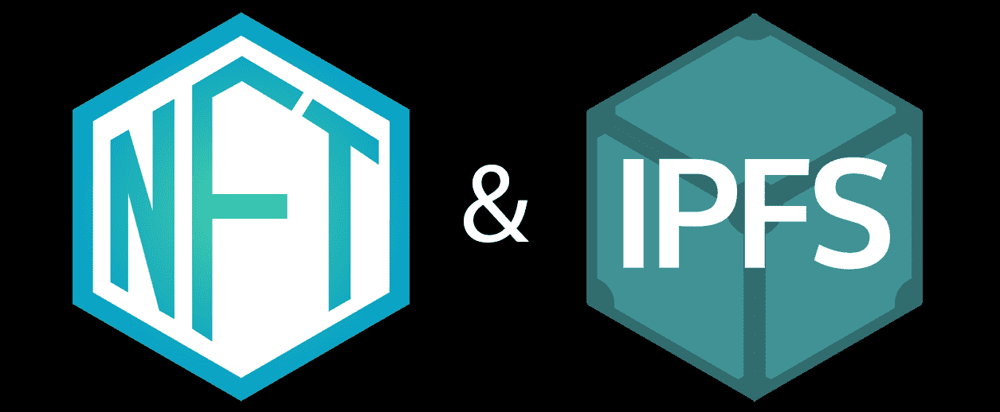

然后“metadata.js”内部的代码使用“tempMetadata.model_url”、“tempMetadata.animation_url”、“tempMetadata.badge_url”、“tempMetadata.evac_url”和“tempMetadata.external_url”返回 CID 字符串。“元数据”脚本生成元数据后，会将其上传到 IPFS。因此，它也为此返回唯一的 CID 字符串:

```js
].path = `https://gateway.moralisipfs.com/ipfs/${imageCID}/${imageDataArray[i].typimg/${paddedHex}.png`;
```

所有这一切的结果是一个不可变的文件链，完美地链接到作为我们 NFT 游戏资产背后的核心数据被引用的链上。因此，当您在“输入”文件夹中准备好媒体文件后，使用 VSC 的终端运行“上传”脚本:


上面的短命令行触发脚本，反过来，脚本负责所有的艰苦工作。在我们的例子中，我们现在有所有 100 张图片上传到 IPFS。我们还有 100 个对应于这些图像的元数据文件:

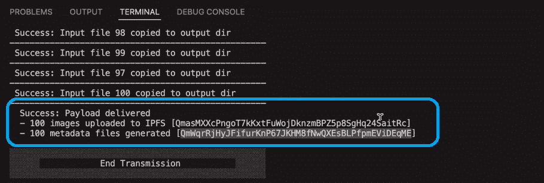

## 从上传到铸造成千上万的 NFT 游戏资产

在我们使用我们的智能合同铸造数千个 NFT 游戏资产(在我们的例子中是 100 个)之前，让我们看一下“assetfactory_migration.js”文件:

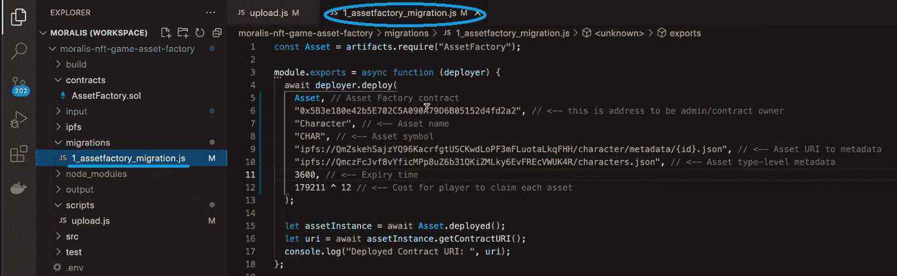

*注意* *:当你决定使用这个资产工厂时，确保使用你自己的细节，而不是本教程截图中显示的细节。*

这是您用来输入有关您的 NFT 游戏资产的详细信息的文件。这些包括管理或所有者合同地址、资产名称、它们的符号以及资产元数据的 IPFS URIs。我们的 URIs 形式遵循 [ERC-1155](https://moralis.io/erc1155-exploring-the-erc-1155-token-standard/) 标准，通常更适合[批量铸造 NFTs](https://moralis.io/how-to-bulk-mint-nfts-batch-minting-guide/) 。此外，元数据 URIs 包含先前上传的元数据的 CID:

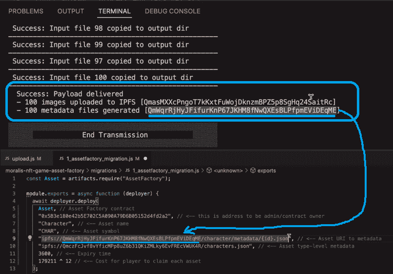

此外，“assetfactory_migration.js”还包含契约级元数据。后者包含关于资产类型的有用信息——关于我们案例中的角色。您可以将此元数据单独上传到批量上传。我们还要提到“到期时间”，这是特定资产的“白名单”用完的时间。本质上，这只是一个缓冲，以确保在发布时公平的薄荷分布。最后但同样重要的是，当玩家要求他们的 NFT 游戏资产(在我们的例子中是角色)时，我们有需要转移的默认成本。最终，“assetfactory_migration.js”文件被设置为构建我们的 [Web3 契约](https://moralis.io/what-are-web3-contracts-exploring-smart-contracts/)，这是我们的下一步。

### 构建“资产工厂”智能合约

*注意* *:在我们继续之前，我们应该让你知道我们有一个单独的教程解释* [*如何像专业人士*](https://www.youtube.com/watch?v=rTLAkS6D7hE) *一样开发智能合同。这也是我们指导你为 VSC 安装块菌的过程。如果您想通过点击一个按钮来构建“资产工厂”(见下文)，请确保完成所需的设置。*

如果您已经为 VSC 准备好了松露，您只需将鼠标悬停在“AssetFactory.sol”上，右键单击，然后选择“构建合同”:

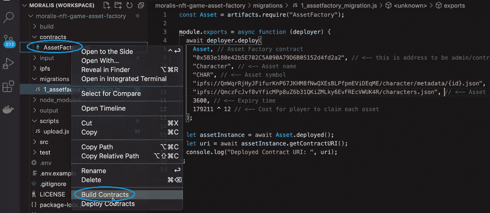

一旦构建了契约，我们需要部署它。为此，我们为 Polygon testnet (Mumbai)使用了 [Moralis Speedy Nodes](https://moralis.io/speedy-nodes/) 服务。这就是“truffle-config.js”出现的地方:

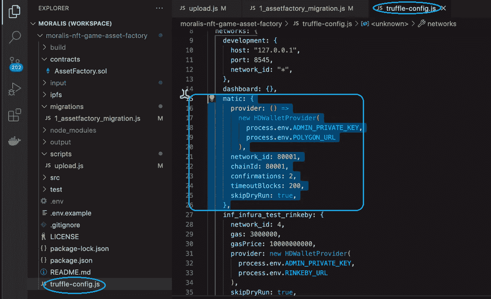

在该文件中，您可以看到已经配置的 MATIC 网络(多边形)。因此，我们可以利用“VSC 松露”提供的捷径。因此，我们右键单击“AssetFactory.sol”，但是这一次，我们使用“部署合同”选项:

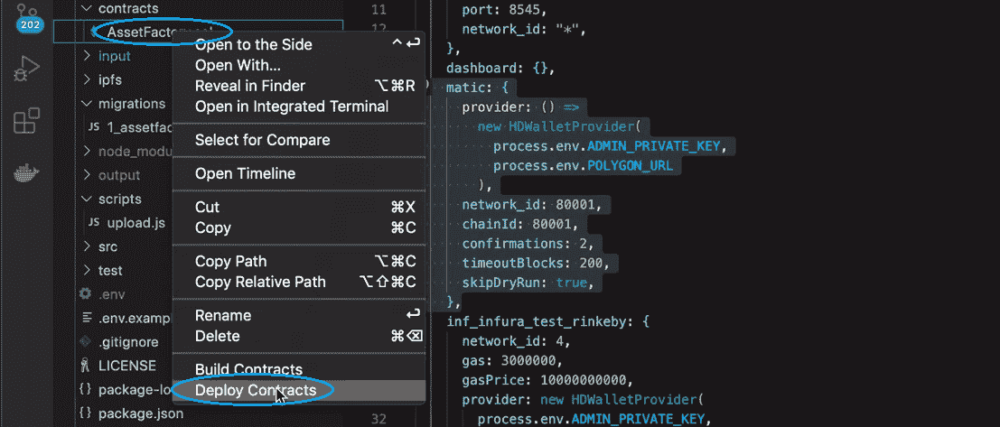

接下来，您将看到一个弹出窗口，您需要在其中选择网络。如上所述，我们将使用孟买测试网。因此，我们选择 MATIC:

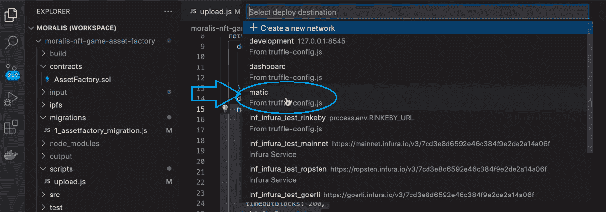

一旦智能合同被部署，你就准备好铸造成千上万的 NFT 游戏资产。作为批量铸造角色的一部分，我们将把托管的元数据分配给令牌 id。后者可以被玩家拥有和转让。

下面是一个视频教程，告诉你如何铸造成千上万的 NFT 游戏资产。它涵盖了与上述相同的步骤，但更为详细:

https://www.youtube.com/watch?v=OuRkmT7wQQE

### Moralis 入门

正如在介绍中提到的和在上面的教程中指出的，你需要你自己的 Moralis 账户来使用我们的资产工厂铸造成千上万的 NFT 游戏资产。因此，我们增加这一部分来帮助你开始使用 Moralis——最终的 [Web3 后端平台](https://moralis.io/exploring-the-best-web3-backend-platform/)。首先，[创建你的免费 Moralis 账户](https://admin.moralis.io/register)。如果您已经准备好您的帐户，请使用您的凭证登录:


就上面的教程而言，你需要一个服务器并访问 Moralis Speedy 节点。幸运的是，一旦您创建了自己的帐户，后者就会自动授予您:

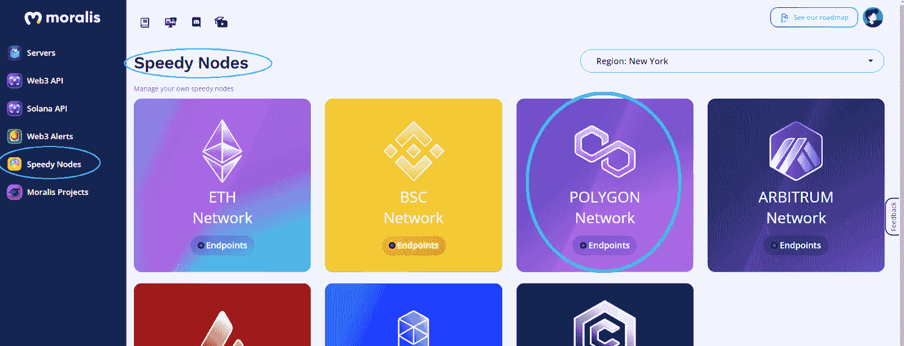

然而，就您的 Moralis 服务器而言，您需要创建它。因此，导航到 Moralis 管理区的“服务器”部分。如果这是你第一次使用 Moralis，屏幕上的指南会告诉你该怎么做:


点击“+创建新服务器”按钮后，您需要选择一个合适的服务器类型:


这里，我们建议您在开发示例项目和测试 dapps 阶段时遵循使用 testnet 服务器的实践。因此，选择“Testnet 服务器”。接下来，一个新的弹出窗口将要求您输入一些详细信息:

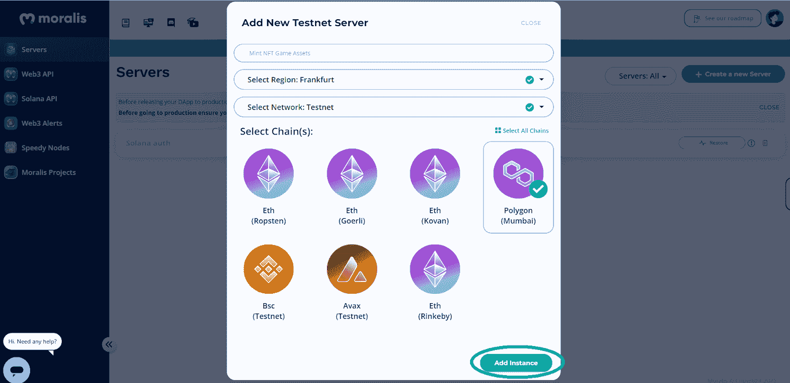

在顶部，您需要输入您的服务器名称(可以是您想要的任何名称)。此外，你需要选择离你最近的城市。接下来，选择一个可用的链。在[以太坊试验网](https://moralis.io/ethereum-testnet-guide-connect-to-ethereum-testnets/)和其他几个 [EVM](https://moralis.io/evm-explained-what-is-ethereum-virtual-machine/) 兼容的网络中选择。尽管如此，通过点击“添加实例”按钮启动您的服务器。服务器启动并运行后，使用“查看详细信息”按钮访问所有详细信息:


最后，您将能够复制服务器 URL、应用程序 ID 和其他详细信息:


## 如何铸造成千上万的 NFT 游戏资产-总结

您是否密切关注了以上部分？如果是这样，你现在知道如何铸造成千上万的 NFT 游戏资产。你可以毫不费力地用正确的工具完成这一点，即 Moralis 和 VSC 松露。当然，你需要感谢 Moralis 的一位专家创建了“资产工厂”项目，它在 GitHub 上等着你。您可以克隆代码，输入您的详细信息，并部署您的智能合约实例。此外，现在你已经准备好专注于“制造成千上万的 NFT 游戏资产”任务的前端。因此，你应该探索一下 Unity Web3 编程。例如，你可以通过连接一个 [Unity 游戏和 Web3 登录](https://moralis.io/connecting-a-unity-game-with-web3-login/)，进行[区块链游戏交易](https://moralis.io/how-to-do-blockchain-game-transactions-with-unity/)，或者甚至创建你自己的一个 [Web3 MMORPG](https://moralis.io/build-a-web3-mmorpg-with-unity-in-10-minutes/) 实例。然而，如果你更喜欢利用你的 [JavaScript](https://moralis.io/javascript-explained-what-is-javascript/) 技能，你可以构建一个 [2D Web3 游戏](https://moralis.io/how-to-build-a-2d-web3-game-full-guide%ef%bf%bc/)。

如果你真的想成为一名 Web3 开发者，你需要练习。这就是我们的教程和示例项目可以帮助您提高编程技能的地方。请务必访问[Moralis 家 YouTube 频道](https://www.youtube.com/c/MoralisWeb3)和[Moralis 家博客](https://moralis.io/blog/)。除了后续教程，这些渠道还提供了各种区块链开发主题的解释。因此，它们可以作为你的免费和持续的密码教育。例如，一些最新的话题集中在 [Web3 前端](https://moralis.io/web3-frontend-everything-you-need-to-learn-about-building-dapp-frontends/)方面，如何[将 Unity 资产上传到 IPFS](https://moralis.io/how-to-upload-unity-assets-to-ipfs/) ， [dapp 开发](https://moralis.io/dapp-development-tutorial-full-guide-to-building-a-dapp/)，创建[密码情感 dapp](https://moralis.io/how-to-create-a-crypto-sentiment-dapp/) ， [blockend 开发](https://moralis.io/blockend-development-what-is-it-and-how-to-become-a-blockend-developer/)，以及如何[使用 Phantom wallet](https://moralis.io/how-to-authenticate-solana-users-with-the-phantom-wallet/) 认证 Solana 用户，等等。然而，如果你想尽早成为区块链开发者，你需要考虑采取更专业的方法。这就是[Moralis 学院](https://academy.moralis.io/)可以改变你游戏规则的地方！