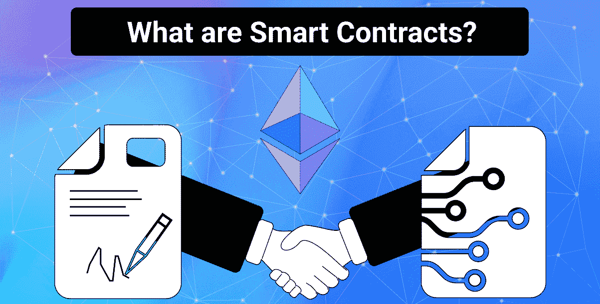
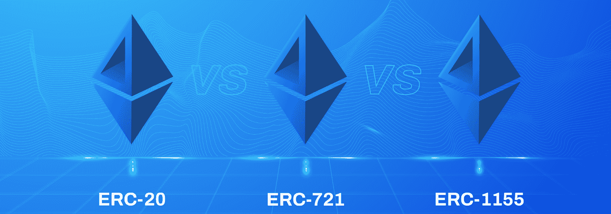
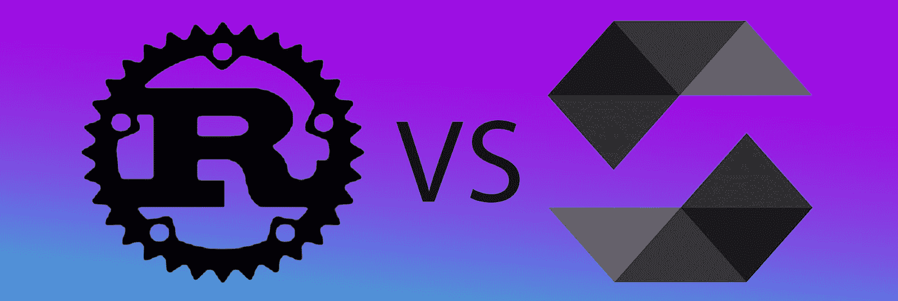
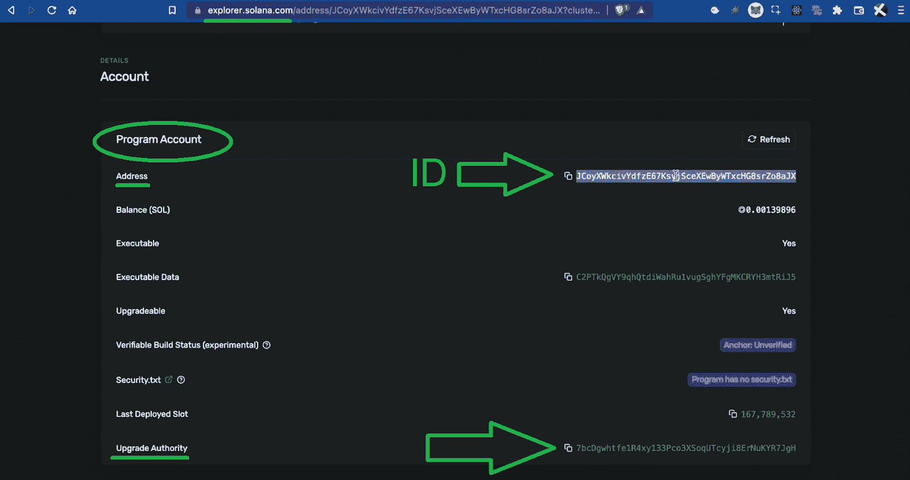
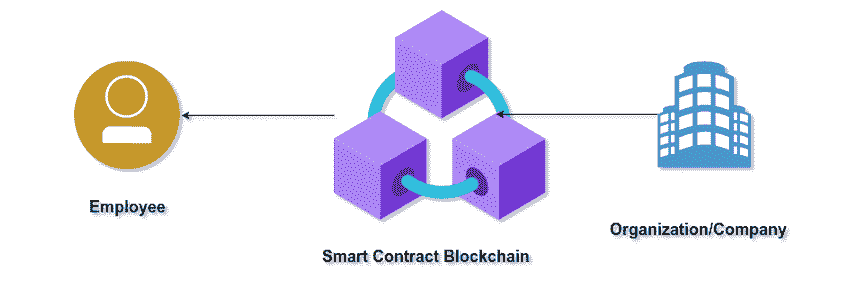
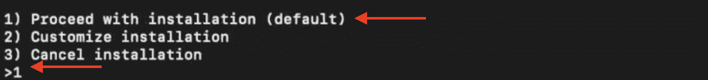
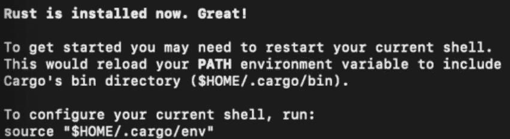
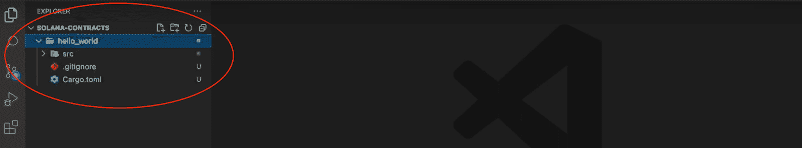
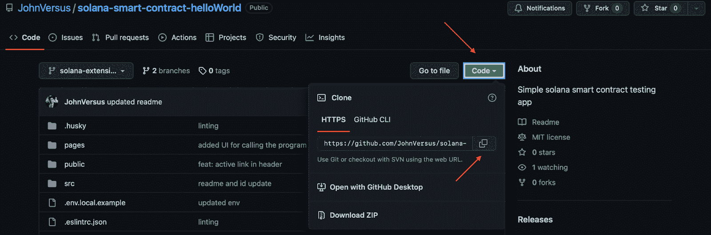
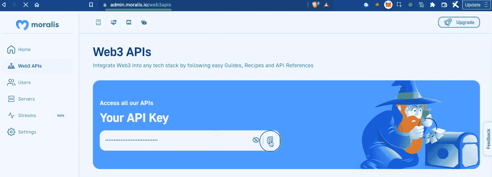

# 如何编写智能合同并在 Solana 上实现

> 原文：<https://moralis.io/how-to-program-smart-contracts-and-implement-them-on-solana/>

你如何设计智能合同并实现它们？具体来说，你如何为索拉纳网络实现这一点？请跟随本文，我们将演示如何完成上述任务的三步流程。组成 Solana 智能合同或 Solana 程序的代码行如下所示:

```js
use solana_program::{
    account_info::AccountInfo,
    entrypoint,
    entrypoint::ProgramResult,
    pubkey::Pubkey,
    msg,
};

entrypoint!(process_instruction);

pub fn process_instruction(
    program_id: &Pubkey,
    accounts: &[AccountInfo],
    instruction_data: &[u8]
) -> ProgramResult {

    msg!("Hello, world!");

    Ok(())
}

```

但是上面的代码行是没有用的，除非您已经设置了必要的先决条件。因此，请继续阅读，我们将一步一步地分解这个过程，设置先决条件，构造契约，并为您提供一个视频演示来完成这个过程。因此，您将了解如何编写智能合同并在 Solana 上实现它们！

[**Sign Up for Moralis Magazine**](https://moralis.io/joindiscord/)

### 概观

接下来，我们将首先确保您了解什么是智能合同。然后，我们将把重点放在你需要用来编写智能合同的编程语言上。这是我们将遇到的索拉纳和 EVM 相容链之间的第一个主要区别。毕竟，在 Solana 上编程智能合约需要一种不同于以太坊编程的方法。此外，在本文中，我们将重点关注索拉纳网络。然而，我们将看看以太坊和索拉纳的一些智能合约示例，以确保您正确理解它们的关键组成部分。最后但同样重要的是，我们将一步一步地讲解如何在 Solana 上编写智能合同。这也是你使用 Moralis 带给你的终极 Solana API 的地方。因此，一定要准备好你的免费 Moralis 账户。



## 智能合同简介

如果你看上面的图片，你会看到以太坊的标志。这是因为以太坊是第一个可编程链，因此，网络提出了智能合同的概念。然而，这些天来，我们有几个著名的可编程区块链，其中许多支持智能合同。此外，当谈到与 EVM 兼容的区块链时，“智能合约”是正确的术语。另一方面，当谈到索拉纳上的智能合约时，它们在技术上被称为“程序”。

因此，无论我们谈论“智能合同”还是链上“程序”，它们本质上是同一个东西。除非我们专注于如何在 Solana 或其他连锁店上编写智能合同，否则这些差异并不重要。毕竟，它们都是运行在区块链上的软件，旨在满足相应条件时触发特定的预定义操作。因此，智能合同有能力创建不可信的合同，并消除中介。反过来，在无数的用例中，这些链上程序准备在未来产生巨大的影响。



此外，值得指出的是，每个链上交易背后都有一个智能合同。因此，所有令牌(可替换的和不可替换的)铸造都是通过部署智能合约来完成的。另外，请注意，智能合约必须遵守特定的标准。例如，在以太坊网络和 EVM 兼容链上，ERC-20、ERC-721 和 ERC-1155 智能合约被用于铸造代币和控制它们的交易。此外，这些标准还使开发人员能够使用经过验证的智能合同模板。

既然你已经知道了什么是智能合约或者链上程序，我们可以把重点放在用来创建它们的编程语言上。这就是智能合同编程任务在索拉纳和 EVM 兼容链之间的不同之处。


## 智能合约使用什么编程语言？

如果你决定为以太坊或其他 EVM 兼容链编写智能合约，你将使用 Solidity 或 Vyper 编程语言。在这两个选项中，稳健更受欢迎。因此，有更多的资源、更智能的合同模板等。，为了牢固。因此，如果你决定为 EVM 兼容的连锁店开发项目，我们鼓励你从稳健开始。

另一方面，如果你想从零开始学习如何在 Solana 上编写智能合同，你不能使用 Solidity。Solana 链的编程语言是 Rust、C 和 C++，Rust 是开发人员的首选语言。因此，这是我们将在下面的“*如何在 Solana* 上编写智能合同”教程中使用的语言。



还值得注意的是，Solana 上的每个程序都有一个唯一的可识别 ID，唯一的所有者可以升级可执行代码:



尽管如此，除了不同的编程语言之外，Solana 上的智能契约开发还需要不同的工具。例如，你不能使用 MetaMask Web3 钱包来支付 Solana 的交易费用。此外，您不能使用 Hardhat 或 Remix 来编译、部署和验证智能合约。相反，您必须使用为 Solana 编程设计的工具。首先，你需要 Solana CLI，还需要使用 Solana Web3 钱包。在下面的教程中，你会学到更多创建 Solana 程序所需的工具。

*注:如果你想学习* [*铁锈编程*](https://academy.moralis.io/courses/rust-programming) *，Moralis 学院有很棒的课程。*

## 智能合同示例

当谈到寻找智能合同的例子时，以太坊提供了更多的模板。毕竟，以太坊区块链已经存在了很多年，有一个更大的社区。然而，这也意味着索拉纳为新合同的签订提供了无数机会。



此外，智能合约可以用于各种目的。然而，大多数智能合同示例都集中在这些用例上:

*   加密令牌创建(铸造)和交易
*   文件保存和可访问性
*   管理付款和账单
    *   工资单
    *   征税
    *   养老金
    *   保险
    *   账单支付
*   统计数据整理
*   健康和农业供应链
*   房地产和众筹
*   身份管理

也就是说，我们将在下一节看看 Solana 示例程序的代码行。下面，我们重点介绍以太坊的两个代币智能合约。此外，请注意，您可以在 OpenZeppelin 找到无数经过验证的 EVM 兼容智能合约。

以下是一份基本的 ERC 20 智能合约:

```js
// contracts/GLDToken.sol
// SPDX-License-Identifier: MIT
pragma solidity ^0.8.0;

import "@openzeppelin/contracts/token/ERC20/ERC20.sol";

contract GLDToken is ERC20 {
    constructor(uint256 initialSupply) ERC20("Gold", "GLD") {
        _mint(msg.sender, initialSupply);
    }
}

```

下面是一个基本的 ERC-721 智能合同的例子:

```js
// contracts/GameItem.sol
// SPDX-License-Identifier: MIT
pragma solidity ^0.8.0;

import "@openzeppelin/contracts/token/ERC721/extensions/ERC721URIStorage.sol";
import "@openzeppelin/contracts/utils/Counters.sol";

contract GameItem is ERC721URIStorage {
    using Counters for Counters.Counter;
    Counters.Counter private _tokenIds;

    constructor() ERC721("GameItem", "ITM") {}

    function awardItem(address player, string memory tokenURI)
        public
        returns (uint256)
    {
        uint256 newItemId = _tokenIds.current();
        _mint(player, newItemId);
        _setTokenURI(newItemId, tokenURI);

        _tokenIds.increment();
        return newItemId;
    }
}
```


## 教程:如何在 Solana 上编写智能合约

请按照这里介绍的步骤，并使用下面的视频来了解如何完成本教程的更多详细信息。简而言之，学习如何在 Solana 上编写智能合约包括以下三个步骤:

1.  安装 Rust 和 Solana CLI
2.  **创建并部署一个示例 Solana 程序**
3.  **创建一个测试 Dapp 来调用智能合约**

关于第一步，你必须基本遵循 Solana 文档中概述的步骤。然而，事情在第二步变得更有趣了。当然，我们的 Solana 程序示例非常简单；然而，如果你有大的想法，这是你可以创建各种智能合同的地方。不过，部署智能契约对于最简单和最复杂的代码行都是一样的。

至于第三步，你将有机会创建一个真正的 dapp。使用我们的回购，您可以在几分钟内完成。但是，您也可以使用终极以太坊样板作为起点，并应用调整来创建您独特的 dapp。此外，我们将向您展示如何获得您的 Moralis Web3 API 密钥。毕竟，后者也是通向终极 Solana API 的门户。最后，您将能够从您的 dapp 调用您的示例程序。


### 步骤 1:安装 Rust 和 Solana CLI

*注意:如果你喜欢跟随视频指示，请确保使用下面的移动图片，从 2:09 开始。此外，如果这不是您第一次使用 Solana，并且您已经安装了这两个工具，请随意跳过这一步。*

首先打开一个新的 Unix 终端，输入以下命令:

```js
curl --proto '=https' --tlsv1.2 -sSf https://sh.rustup.rs | sh
```

运行上面的命令后，在几个安装类型中，您需要选择一个类型。出于本教程的考虑，我们鼓励您使用默认选项。因此，只需输入“1”:



这个过程可能需要一些时间来完成，但这是它的铁锈安装。因此，您可以继续安装 Solana CLI(3:26)。首先，输入以下命令:

```js
sh -c "$(curl -sSfL https://release.solana.com/stable/install)"
```

安装完成后，设置“ *env path* ”。您可以在终端日志中执行后一种操作:



接下来，您必须创建一个新的本地 Solana 密钥对(本地 wallet)。因此，输入这两个命令:

```js
mkdir ~/my-solana-wallet
```

```js
solana-keygen new --outfile ~/my-solana-wallet/my-keypair.json
```

然后，您可以通过以下方式获取您的钱包地址:

```js
solana address
```

接下来，您还需要设置 devnet 集群:

```js
solana config set --url https://api.devnet.solana.com
```

最后但同样重要的是，你必须得到一些测试 SOL 来覆盖 Solana devnet 上的事务。这个命令将向您空投一个 SOL:

```js
solana airdrop 1
```

上面的命令行也结束了初始设置。

### 步骤 2:创建并部署一个示例 Solana 程序

*注* *:或者，使用下面的视频，从 5:07 开始。*

这一步是“如何在 Solana 上编写智能合同”任务的要点。我们将使用 Visual Studio 代码(VSC) IDE，我们鼓励您也这样做，以避免任何不必要的混乱。当然，任何其他 IDE 也可以做到这一点。

在 VSC 内部，创建一个新文件夹(我们的例子是:“Solana-contract”)并启动一个新的终端:


然后，使用以下命令创建一个新的 Rust 项目:

```js
cargo init hello_world --lib
```

以上命令会将货物库添加到项目的文件夹中:



接下来，进入“hello_world”文件夹。您可以通过输入以下命令来完成此操作:

```js
cd hello_world
```

进入上述文件夹后，继续更新“Cargo.toml”文件中的代码行。只需复制粘贴以下代码行:

```js
[lib]
name = "hello_world"
crate-type = ["cdylib", "lib"]
```

这是它在 VSC 的样子:

![Showing the [lib] command inside VSC.](img/c7620b0f283d457014a77c17ae6549d4.png)

然后，打开“src”文件夹中的“lib.rs”文件并删除其内容。接下来，通过输入以下命令添加 Solana 程序包:

```js
cargo add solana_program
```

#### Solana 程序示例的代码行

至此，您已经为添加代码行做好了一切准备，这些代码行将构成您的 Solana 智能合同(Solana 程序)。因此，将以下代码行粘贴到“lib.rs:

```js
use solana_program::{
    account_info::AccountInfo,
    entrypoint,
    entrypoint::ProgramResult,
    pubkey::Pubkey,
    msg,
};
entrypoint!(process_instruction);
pub fn process_instruction(
    program_id: &Pubkey,
    accounts: &[AccountInfo],
    instruction_data: &[u8]
) -> ProgramResult {
    msg!("Hello, world!");
    Ok(())
}
```

*注意* *:对于代码演练，使用下面的视频。*

有了上面的代码，您就可以继续构建项目了。因此，在您的终端中输入以下命令:

```js
cargo build-bpf
```

一旦上面的命令构建了项目，您就可以使用“ *solana program deploy* ”命令部署您的 Solana 程序。您需要用一个目标路径来补充这个命令。相应地，输入以下命令:

```js
solana program deploy ./target/deploy/hello_world.so
```

因此，您应该得到您的程序 ID(您将在第三步中使用它):


有了前两步，你就已经知道如何在 Solana 上编写智能合约了。因此，是时候学习如何利用索拉纳程序了。

### 步骤 3:创建一个测试 Dapp 来调用智能契约

正如承诺的那样，这是我们把你交给下面的视频教程的地方，从 9:38 开始。本质上，您只需要从 [GitHub](https://github.com/JohnVersus/solana-smart-contract-helloWorld) 中克隆代码，添加您的 Moralis Web3 API 密钥和您的 Solana 程序 ID:

克隆我们的代码:



获取您的 Web3 API 密钥(您需要一个 Moralis 帐户)并将其粘贴到“. env.local”文件中:



将您的 Solana 计划 ID(第二步结束)粘贴到“HelloWorld.tsx”文件的指定行中:


此外，确保使用你的新 Solana dapp 来测试它是否运行你的智能合约。

最后，这是我们在整篇文章中引用的视频教程:

[https://www.youtube.com/embed/cLuX5CvXLuY?start=302&feature=oembed](https://www.youtube.com/embed/cLuX5CvXLuY?start=302&feature=oembed)

## 如何编写智能合同并在 Solana 上实施——摘要

在今天的文章中，您有机会学习如何在 Solana 上编写智能合同。然而，在我们开始本教程之前，我们已经介绍了基础知识。因此，您了解了智能合约是存储在区块链上的可执行代码集群。这些代码行可以读取和修改链上账户。您还了解到，Solana 的智能合约被称为程序。此外，我们解释了索拉纳和 EVM 兼容链使用不同的智能合约编程语言。后者使用 Solidity 和 Vyper，而 Rust 是 Solana 最受欢迎的选项。我们还看了一些智能合同示例。最后但同样重要的是，您有机会跟随我们的领导，创建和部署您自己的 Solana 程序。此外，你还有机会通过在几分钟内创建你的 dapp 来体验 Moralis 的力量。

如果你有兴趣了解更多关于 Solana 或以太坊的开发，请务必访问 [Moralis 文档](https://docs.moralis.io/)、 [Moralis YouTube 频道](https://www.youtube.com/c/MoralisWeb3)和 [Moralis 博客](https://moralis.io/blog/)。这些资源包含教程和简单解释的完美结合，可以帮助你免费成为 Web3 开发者。我们的一些最新文章向您展示了如何将[动态 Web3 认证](https://moralis.io/add-dynamic-web3-authentication-to-a-website/)添加到网站，如何使用 [Firebase 作为 Web3](https://moralis.io/how-to-use-firebase-as-a-proxy-api-for-web3/) 的代理 API，如何集成[基于区块链的认证](https://moralis.io/blockchain-based-authentication-how-to-integrate/)，如何使用 [NodeJS Web3 示例](https://moralis.io/nodejs-web3-tutorial-create-dapps-using-a-nodejs-web3-example/)创建 dapps，等等。

此外，您可能会对更专业的加密教育方法感兴趣。如果是这样的话，[Moralis 学院](https://academy.moralis.io/)就是你需要的。在那里，你将成为区块链认证，这将有助于你去全职加密明显更快。