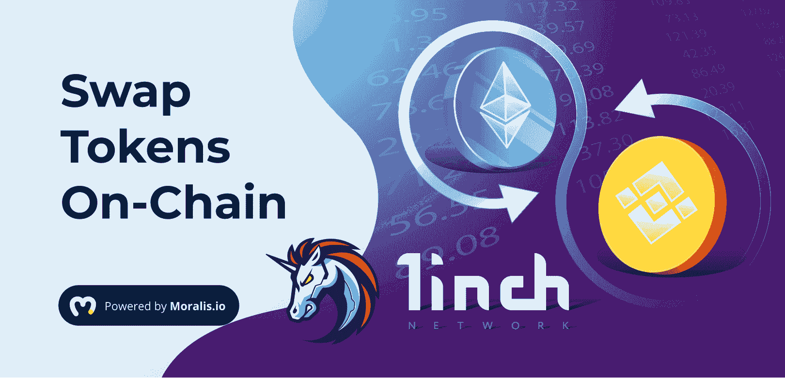
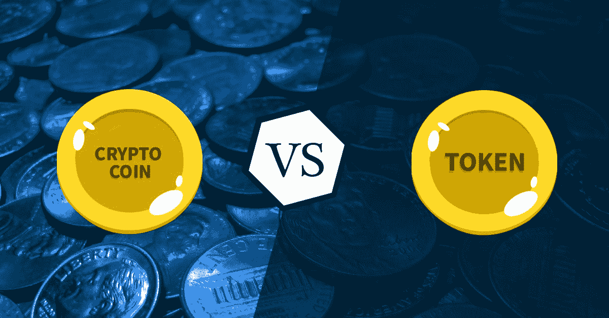
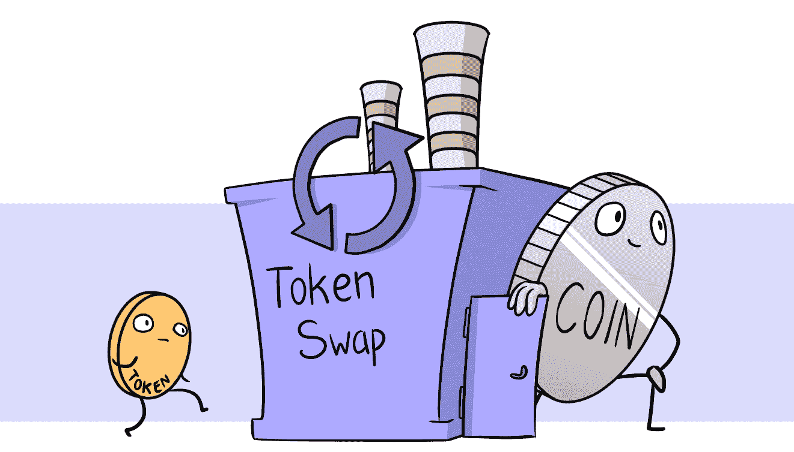
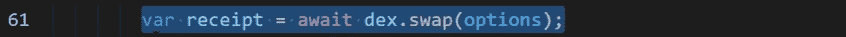
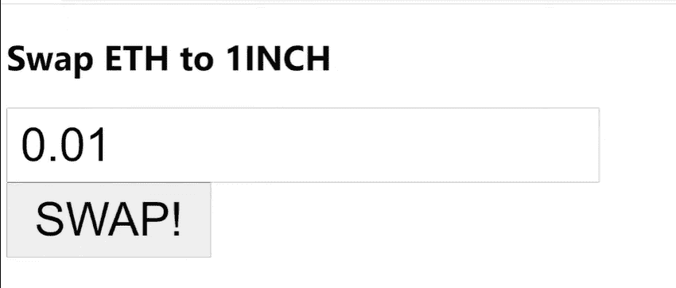
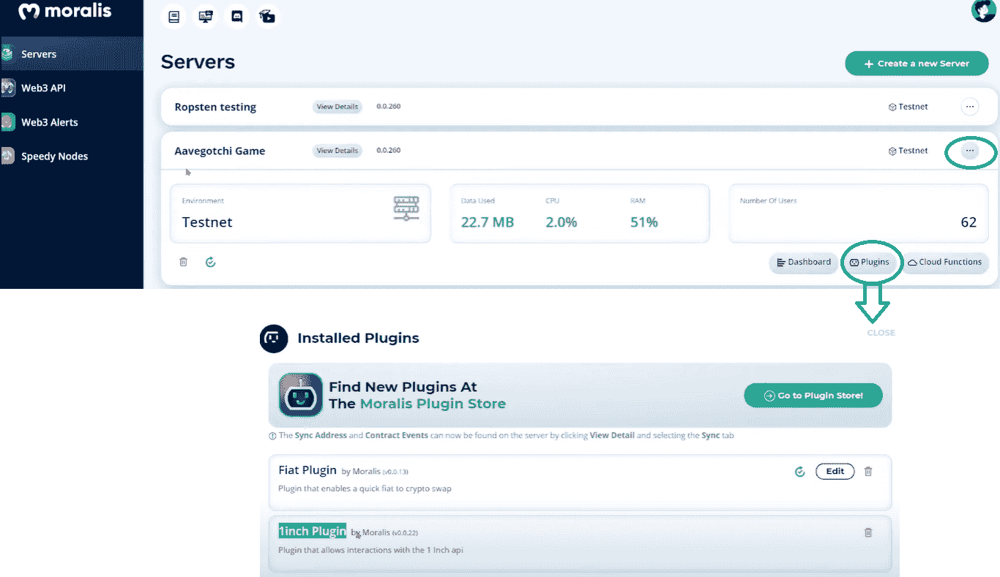
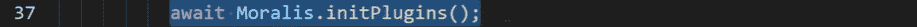
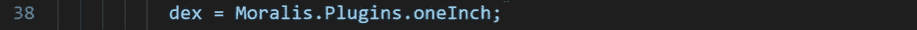
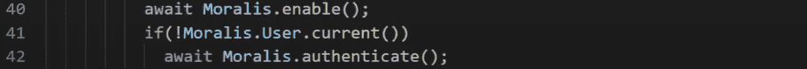
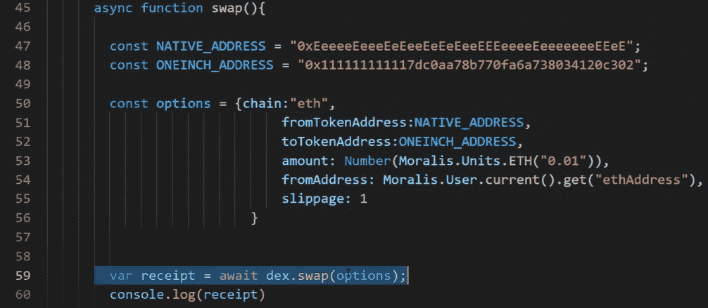

# 如何使用 1 英寸插件编程令牌交换

> 原文：<https://moralis.io/how-to-program-token-swaps-with-1inch-plugin/>

今天要建立一个有竞争力的 dApp，那些开发 dApp 的人必须能够交换代币 **。用户在各种 DeFi(去中心化金融)平台上交换这些代币。因此，** [**dApp**](https://moralis.io/decentralized-applications-explained-what-are-dapps/) **开发人员应该对实现一个允许用户在其平台上交换令牌的 DEX 聚合器很感兴趣。虽然许多人可能认为在他们的 dApp 中实现加密交换功能似乎是一个耗时的过程，但现在您可以在几分钟内将令牌交换添加到任何**[**web 3**](https://moralis.io/the-ultimate-guide-to-web3-what-is-web3/)**应用程序中？有了**[**Moralis ' 1 inch plugin**](https://moralis.io/plugins/1inch/)**一切皆有可能，在其中你可以轻松快捷地为任何 Web3 应用编写令牌交换程序。如果您喜欢这个声音，请继续阅读并学习如何使用 Moralis 的 1inch 插件进行令牌交换编程！**

无论你是一个经验丰富的 dApp 开发者，希望加快你的工作速度，还是一个前端程序员，正在寻找一个工具来解决你的 Web3 应用的后端挑战，或者是一个完全的初学者，渴望学习如何创建不可思议的 dApp，你来对地方了。通过使用最终的 Web3 开发平台 Moralis，你将获得超越竞争对手的额外优势，并节省大量时间，否则你会浪费在后端编程上。您可以使用 Moralis 提供的单行代码来快速完成工作，而不是在漫长的开发过程中浪费时间和资源。

此外，为了教你如何编程令牌交换，我们将使用 Moralis 的强大功能及其[插件功能](https://moralis.io/introducing-moralis-plugins/)。因此，请确保[今天就创建您的免费账户](https://admin.moralis.io/register)并跟进吧！

## 如何进行令牌交换——基础知识

在我们进入向您展示如何编程令牌交换的实际步骤之前，我们需要让您了解一下最新情况。如果您不是加密领域的新手，并且知道我们将要涉及的所有基础知识，请随意跳过下面的小节，直接进入本文的核心。

### 硬币、本地代币和代币

由于“硬币”、“本机令牌”和“令牌”术语存在许多混淆和不一致，我们想首先解决这个问题。说到加密货币，硬币和原生代币的意思是一样的。这些加密货币是某个特定链固有的。例如以太坊的 ETH，卡尔达诺的 ADA，多边形的 MATIC，波尔卡多特的 DOT，索拉纳的 SOL，币安的 BNB 等等。然而，本地令牌是少数。

事实上，大多数加密货币都建立在特定的链或网络之上(如上所述)。然而，它们不是硬币或原生代币。相反，它们被称为代币。此外，根据 CoinMarketCap 的数据，有超过 6000 种加密货币，每天都有新的代币和硬币出现。最流行和最常见的令牌是 ERC-20 令牌，其中 ERC-20 是以太坊链提供的标准，并由构建在其上的令牌使用。通过本质上使用以太坊链的分叉，BEP-20 代币是另一种流行的代币类型。BEP-20 令牌基于币安智能链(BSC)构建，其中 BEP-20 是为此目的而设立的标准。

如果您想了解在 Moralis 的帮助下创建 ERC-20 代币或 BSC 代币有多简单，请务必查看我们的“[如何在 10 分钟内创建自己的 ERC-20 代币](https://moralis.io/how-to-create-your-own-erc-20-token-in-10-minutes/)”和“[如何在 5 个步骤中创建 BSC 代币](https://moralis.io/how-to-create-a-bsc-token-in-5-steps/)”指南。

### 什么是代币互换？

在我们关注如何用 1inch 插件编程令牌交换之前，我们需要确保您知道什么是令牌交换。事实证明，大多数人都知道什么是密码交换；然而，他们并不真正确定什么是代币互换。

本质上，掉期交易是简化的交易(在大多数情况下，实际的交易所进行买入/卖出，这是掉期交易在后端成功的必要条件)。虽然普通用户可能会被交换界面和随之而来的所有选项弄得不知所措，但交换肯定是普通用户很容易接受的。

通常，交换使您能够以一种用户友好的方式快速交换受支持的硬币和代币，而没有交易所提供的任何高级功能。此外，互换通常有以下组成部分(对用户可见):

*   下拉菜单，您可以从中选择要交换的硬币/代币(按 enter 键)。
*   一个下拉菜单，您可以从中选择一个硬币/代币来交换您的初始硬币/代币。
*   一个字段，您可以在其中输入要交换的令牌数量。
*   显示您正在交换的预期令牌数量的字段。
*   执行或确认交换的按钮。

与可以使用限价买入的交易所不同，对于掉期交易，你只能跟随市场买入(以当前价格买入/卖出)。因此，每笔掉期交易的交易费通常会略高。费用的多少取决于所使用的链条、当前的拥堵状况，以及互换所有者是否也想收取额外的费用。

## 如何进行令牌交换–为什么要在您的 dApp 中添加令牌交换？

既然在生活中做任何事情之前有一个强烈的“为什么”总是好的，我们想告诉你为什么增加代币交换是一个好主意。考虑到这一点，您将会更有动力使用那些告诉您如何轻松编程令牌交换的指令。

当您着手创建 Web3 应用程序时，您的项目可能会包含某种令牌。如果是这样的话，你肯定不希望用户离开你的 dApp，转而使用其他平台或互换来交换代币。相反，为什么不给用户提供在你的平台上交换大量代币的选择呢？这样，你可以确保他们花时间在你需要他们的地方，同时为用户友好性加分(人们喜欢手头有东西)。

除非你的平台是下一个大事件，否则你的营销预算将真正重视用户停留时间的增加，而不是在用户去其他地方交换代币时失去他们。

此外，如果您的项目包括自己的令牌，您将不必完全依赖其他平台，而是能够让用户当场用其他硬币/令牌交换您的令牌。

如果您还没有创建您的 Moralis 帐户，请务必现在就创建。这样，您就可以轻松地按照下一节提供的步骤进行操作了。因此，您将能够充分利用 [*Moralis 的 SDK*](https://moralis.io/exploring-moralis-sdk-the-ultimate-web3-sdk/) *的优势，并适当地学习如何轻松地编程令牌交换。*

# 如何快速简便地编写令牌交换程序

在本节中，我们将进行一个简单的示例项目，该项目将向您展示如何使用 Moralis 提供的 1inch 插件对令牌交换进行编程。我们将把事情分解成简单的步骤，这样您就可以自己正确地实现它们。

向 dApp 添加令牌交换的本质在于一行代码:

我们告诉过你这很简单。通过这种简化，每个人都可以构建自己的财务应用程序。无论你是在构建一个加密钱包还是一个区块链游戏，你都可以很容易地让你的用户在不离开你的平台的情况下交换资产。你看到这的力量了吗？

## 如何进行令牌交换——一个示例项目

我们将要构建的示例交换将非常简单。它将为用户提供将 ETH 换成 1INCH 的功能，看起来是这样的:

为了扩展它的功能，使它更吸引人，把它作为你的下一个项目。

### 如何进行令牌交换–步骤 1:服务器设置

那么，我们如何使用 Moralis 和 1inch 插件创建令牌交换呢？首先登录到您的 Moralis 帐户并创建一个服务器。在您的帐户中,“服务器”选项卡位于左上角。如果尚未选定，请点按它。由于您很可能使用新帐户，因此不会显示任何服务器(与下图不同)。接下来，单击右上角的“+创建新服务器”按钮，并从出现的下拉菜单中选择三个选项之一(您可以选择“Mainnet 服务器”)。

在出现的弹出窗口中，您需要命名您的服务器，选择您所在的地区，选择您感兴趣的链(网络)，然后单击“添加实例”按钮(见下图)。如果你在这一步需要额外的帮助，请查看 [Moralis 的快速入门](https://docs.moralis.io/moralis-server/getting-started/quick-start)指南。

### 如何进行令牌交换–步骤 2:插件安装

下一步是将 [1inch 插件](https://moralis.io/plugins/1inch/)添加到您的服务器。为此，只需点击 1 英寸插件的链接，然后点击“安装插件”按钮。同样，如果您需要更多帮助，请查看 Moralis 文档的“[安装和删除插件](https://docs.moralis.io/moralis-server/plugins/untitled)”部分。

一旦你将插件安装到你的服务器上，你应该能够看到如下所示。要进入该窗口，请单击您的服务器名称旁边的三个水平点，然后单击“插件”按钮。

你可能以前听说过 1 英寸。这是以太坊区块链上一个声誉良好的智能合约，它促进了各种链上交易，并以可能的最佳方式执行它们。

### 如何对令牌交换进行编程–步骤 3:编码

我们终于到达了示例项目的编码部分。在这里，你会看到 Moralis 的真正力量。在这一节中，我们将只提供特定代码行的屏幕截图。然而，如果你想获得完整的代码，你可以在 [GitHub](https://github.com/ivan-liljeqvist/tutorials/blob/main/1inch/index.html) 上找到。现在，让我们从初始化插件开始:

然后我们添加一行代码来加载 1inch 插件:

此外，我们需要做一些初始化工作:

最后，要使用下面的代码为我们的简单案例创建实际的交换，您可以简单地使用下面的代码:

请记住，为了实现最大的简单性，我们实际上已经对这个例子的所有细节进行了硬编码。但是，您可以使用相同的原则来创建更高级的交换，为用户提供更多的选择。

查看上面的代码，我们可以看到我们在第 50 行中指定了以太坊链。在第 51 行和第 52 行，我们指定了我们想要出售的代币和想要购买的代币。在第 53 行，我们指定了我们想要出售的初始令牌的数量。此外，我们使用第 54 行来指定我们从哪个地址开始销售；在我们的例子中，我们将使用一个登录的用户。最后，我们指定我们愿意接受的滑点(价格偏离的百分比)。本质上，我们提供的信息是执行交换所需的最基本信息。

如果您想观看视频，其中 Ivan 还解释了如何获得不同的令牌地址，请单击下面的“播放”按钮。

https://www.youtube.com/embed/stRh5Scd8TY

## 如何在其他链上编程令牌交换

在上一节给出的简单例子中，我们主要关注以太坊链。然而，1 英寸插件也使我们能够创建一个币安智能链或多边形交换。后者非常实用，至少以太坊在某些场合仍然保持着相当高的费用。

再次看上面的图像(特别是在第 50 行)，你可以看到“eth”，这决定了我们关注的是以太坊链。如果我们要使用 bsc 或 polygon，我们需要用“BSC”或“Polygon”替换“eth”。

如果你想了解更多关于 1inch 插件支持的功能类型的细节，请务必查看[这个链接，它提供了关于插件](https://moralis.io/plugins/1inch/)的更多信息。

## 如何计划令牌交换—摘要

在这一点上，您可能很兴奋，并渴望开始向您的 dApp 添加令牌交换。现在，您已经了解了与令牌交换相关的所有基础知识，以及为您的用户提供在 Web3 应用程序中交换令牌的机会的重要性，现在就开始使用 Moralis 及其 1inch 插件吧！

此外，通过使用 Moralis 及其强大的插件，您可以用一行代码添加一个令牌交换。我们强烈建议您花些时间利用 [Moralis 的文档](https://docs.moralis.io/)。如果你知道如何使用[元掩码](https://moralis.io/metamask-explained-what-is-metamask/)并且知道 [JavaScript](https://moralis.io/javascript-explained-what-is-javascript/) (JS)，Moralis 就是可以使用的工具。另一方面，如果你还不熟悉 JavaScript，请确保利用“[区块链开发者 JavaScript 编程](https://academy.ivanontech.com/courses/javascript-programming-for-blockchain-developers)课程。

说到这里，我们结束了关于令牌交换的部分。现在，由您来充分利用本文中获得的信息。你能行的！