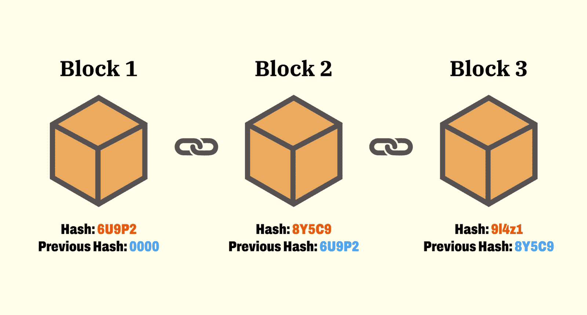
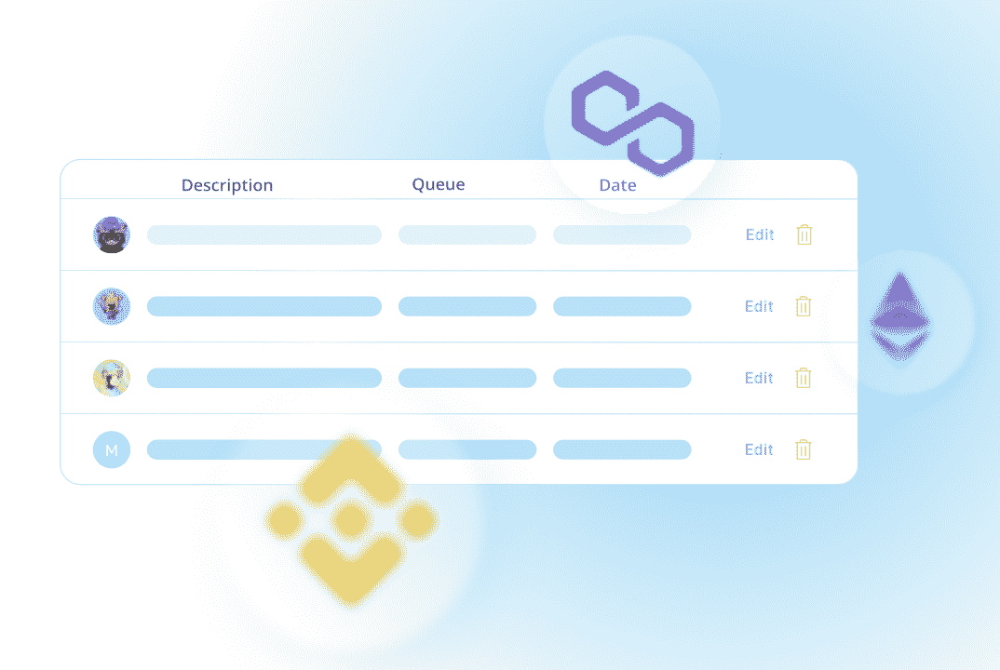
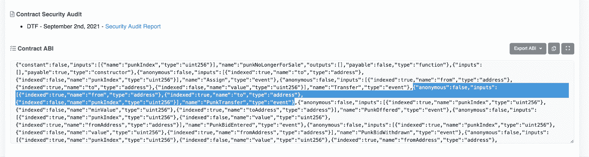
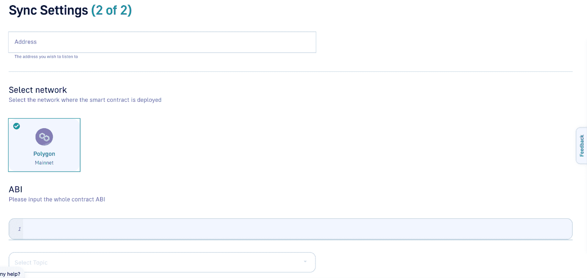
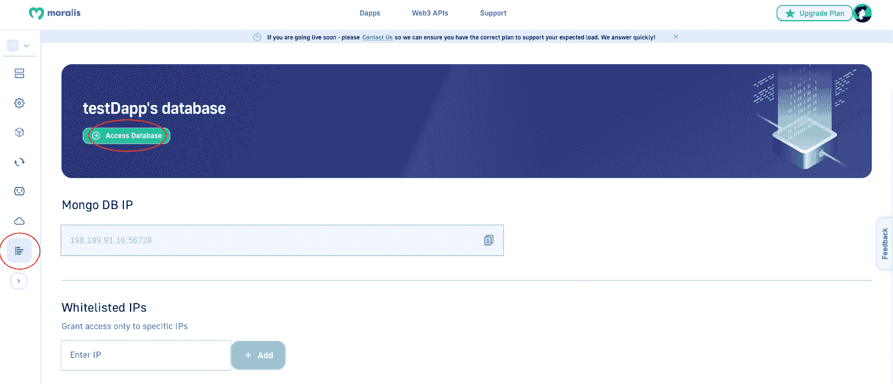

# 如何从多边形区块链拉取数据

> 原文：<https://moralis.io/how-to-pull-data-from-polygon-blockchain/>

**不可否认，区块链科技** [**Web3 开发**](https://moralis.io/how-to-build-decentralized-apps-dapps-quickly-and-easily/) **风靡全球。企业和组织越来越多地进入这个领域，互联网的这个新“阶段”正在改变大多数经济部门。区块链本质上是包含数据的不可变分布式分类帐。一个突出的例子是多边形网络。由于多边形区块链包含信息，作为开发人员，您必须能够实时访问此** [**链上数据**](https://moralis.io/on-chain-data-the-ultimate-guide-to-understanding-and-accessing-on-chain-data/) **。访问这些信息可以为所有客户提供更具吸引力的 UX(用户体验)。因此，我们将在本文中深入探讨如何从多边形区块链提取数据。**

从传统的角度来看，从任何区块链提取数据都是一件非常麻烦的事情。然而，这也是 [Moralis](https://moralis.io/) 提供更易理解的开发者体验的地方。Moralis 的 Web3 syncs 等底层后端基础设施和工具使这一过程变得更加容易。然而，这只是 Moralis 如何帮助你的发展努力的一个突出的例子。此外，Moralis 还使 [Web3 认证](https://moralis.io/authentication/)变得更加容易。这与 Moralis 的 [NFT API](https://moralis.io/nft-api/) 和 [Web3 API](https://docs.moralis.io/moralis-dapp/web3-api) 相结合，可以让你轻松创建令牌和 dapps(去中心化应用)。

例如，有了 Moralis 的可访问性，你可以创建一个 [Web3 Spotify](https://moralis.io/how-to-build-a-web3-spotify-clone/) 的克隆，也许会彻底改变音乐行业。此外，如果您对令牌开发感兴趣，请务必查看我们关于[如何构建 minting dapp](https://moralis.io/how-to-build-a-minting-dapp/) 的文章！

因此，如果你想成为一名区块链开发者，可以考虑和 Moralis 签约。这不仅需要几秒钟的时间，而且你可以完全免费地创建自己的账户！

### 什么是区块链？

在我们讨论如何从多边形区块链提取数据这一主题之前，我们需要了解一些基础知识。因此，我们将致力于探索区块链的复杂性和这项技术需要什么。所以，事不宜迟，让我们试着回答这个问题，“什么是区块链？”。

区块链的概念最早是在上世纪 90 年代提出的，但随着比特币的推出而受到关注。区块链本质上是一种数字化和分散式分类帐记录、共享和同步交易和智能合同数据的形式。

区块链通常维护一个由称为“节点”的单个计算机或设备组成的网络。这些节点充当验证者，确保网络保持安全。这些人负责跟踪和记录各种区块链的数据。这些节点验证的数据然后被组织并存储在链接在一起的块中，以形成更大的链。这些块通常对公众可用，并且分布在网络中的所有节点上。

与更传统的数据库相比，区块链提供了大量的好处。一个例子是这种技术的分散性质，消除了对中介和第三方监督的需要。此外，区块链安全可靠，可防止黑客访问它们。除了几乎不可攻击之外，区块链还是完全不可改变的。因此，它防止任何人篡改记录，这是网络用户的另一层安全。

现在，对区块链技术有了更好的理解，我们可以继续前进，仔细看看多边形区块链需要什么！

## 什么是多边形区块链？

要完全理解什么是多边形区块链以及为什么会有网络，以太坊是一个很好的起点。以太坊是 Web3 开发的主要区块链。但是，网络遇到了拥塞问题。这是网络大规模采用的直接结果，而基础设施没有能力处理这种情况。此外，拥堵问题推高了以太坊的天然气费用，使得在这个网络上发展在经济上不可行。

为了解决以太坊的拥塞问题，我们看到了“缩放解决方案”的兴起。这里最突出的例子之一就是多边形。Polygon 希望看到一个“Web3 for all”，是以太坊的去中心化扩展平台。这使得开发人员可以使用 Polygon 来构建 dapps 和其他交易成本更低的项目。同时保持与以太坊区块链相同的安全性。

由于 Polygon 的 PoS(proof-of-stage)共识机制，它可以实现更高的可扩展性和更低的费用。此外，该机制要求网络参与者以他们的令牌作为交换成为验证者。如果您完成此任务，网络将奖励您更多 MATIC(多边形的本地令牌)。与以太坊相比——以太坊利用 PoW(工作证明)共识机制——这在可伸缩性方面更有效。

如前所述，MATIC 是 Polygon 的本机令牌，它是一个 [ERC-20](https://moralis.io/what-are-erc20-contracts-full-erc20-contract-guide/) 令牌。这意味着 MATIC 令牌与其他基于以太坊的货币兼容。这个令牌也是保证网络安全的方法。网络参与者使用 MATIC 支付网络促成的交易。

对多边形网络有了更深刻的理解，我们可以继续前进，更仔细地了解为什么从链中提取数据很重要，这是这篇“如何从多边形区块链中提取数据”文章的主要主题之一！

## 为什么从区块链提取数据很重要？

不管你是从零开始建立一个 Web3 项目，一个 NFT 市场，还是仅仅想把一个现有的公司连接到 web 3；能够从区块链提取数据并对其进行索引是非常重要的。

链上数据是所有 Web3 项目和 dapps 的核心，因为这些区块链中包含的信息对于良好的 UX 至关重要。因此，同步从用户余额到交易历史的所有内容非常重要。

因此，如果要创建面 dapps，必须从面区块链获取数据。这将允许您创建更复杂的 dapps，为您的客户提供进一步的价值。然而，从传统的角度来看，对区块链进行索引是相当困难的，因为它需要大量的时间和资源。

幸运的是，你不必用 Moralis 来强调这一点。借助 Moralis 的 [Web3 syncs](https://moralis.io/syncs/) ，您可以轻松地从多边形区块链中提取数据，而不会出现任何问题。使用 Moralis 实现区块链同步允许您在实时更新的交易表中检测新的交易和事件，即使是在未确认的状态下。因此，您可以轻松地从面区块链中提取数据。

此外，Moralis 的 Web3 同步是跨链兼容的。因此，您不仅可以从多边形区块链获取数据，还可以从其他网络获取数据。这表明你有潜力为更多的链开发复杂的 dapps。如果你对此感兴趣，请查看我们的指南[如何构建以太坊 dapp](https://moralis.io/ultimate-guide-how-to-build-ethereum-dapps/)或[如何创建 BSC dapp](https://moralis.io/how-to-create-bsc-dapps-quickly/)！

## 如何用 Moralis 从多边形区块链中拉取数据

从传统的角度来看，从多边形区块链提取数据相当麻烦。幸运的是，这不再是 Moralis 的情况，因为该平台允许您轻松地索引任何区块链。然而，即使在使用 Moralis 时任务变得更加容易完成，您可能仍然会对过程有疑问。因此，本节将研究如何通过以下三个步骤从面区块链提取数据:

1.  创建 Moralis Dapp
2.  获取合同地址和 ABI
3.  添加同步事件

如果你更想观看整个过程的视频，请查看来自 [Moralis 的 YouTube](https://www.youtube.com/channel/UCgWS9Q3P5AxCWyQLT2kQhBw) 频道的指南。视频指南与以太网有关，但同样的原理也适用于多边形区块链。基于此，为了与视频保持一致，我们将在本文中为以太坊链上的加密朋克传输创建一个 Web3 sync。但是，如果您对面网络有其他想法，您仍然可以使用相同的步骤从面区块链中提取数据。

https://www.youtube.com/watch?v=LMqqxkuo7b0

如果您对 NFTs 有进一步的兴趣，请务必查看关于 [NFT 用例](https://nftcoders.com/learning-all-about-nft-use-cases-in-2022/)的优秀指南。但是，事不宜迟，让我们更进一步，仔细看看如何创建一个 Moralis dapp！

## 从多边形区块链中提取数据–创建 Moralis Dapp

如果你还没有，你需要做的第一件事就是创建一个 Moralis 账户。这只需要几秒钟，并且设置您的帐户是免费的。有了账户，你可以点击“+创建新的 dapp”按钮来创建你的 Dapp。

这将在您的浏览器中打开一个新窗口，您必须选择一个环境和网络，选择一个地区，最后命名您的 dapp。在这种情况下，我们希望为 CryptoPunks 创建一个 Web3 sync，因此我们将选择以太坊 mainnet。但是，如果您更愿意从面区块链提取数据，您选择的网络应该与此一致。

而且选择地区要根据你的地理位置，名字完全由你决定。一旦你完成了所有的选项，剩下的就是点击“创建你的 Dapp”按钮来启动服务器。

## 从 Polygon 区块链提取数据–获取合同地址和 ABI

有了服务器，第二步是获取契约地址和用于 crypto 朋克智能契约的[智能契约 ABI](https://moralis.io/what-is-a-smart-contract-abi-full-guide/) 。由于 CryptoPunks 是基于以太坊网络，我们可以利用[以太扫描](https://etherscan.io/)。如果你有一个基于多边形的契约，你可以用[多边形扫描](https://polygonscan.com/)来代替。

一旦你导航到 Etherscan，你就可以在网站的搜索栏中搜索“CryptoPunks ”,然后点击相应的选项。确保单击名称旁边带有复选标记的备选项，以获得适当的合同。

当你到达 CryptoPunks 的页面时，你可以首先复制右下角的合同地址，并保存它以备后用:

要获得 ABI，你需要点击以太网扫描中的同一个地址，向下滚动直到你找到一个有几个选项的导航栏。你要找的是“合同”标签。单击此选项后，您需要确保您处于“代码”部分:

然后你可以向下滚动到“合同 ABI”。从那里，您需要找到用于跟踪 CryptoPunks 转账的代码的正确部分，这是名为“PunkTransfers”的数组的一部分:

有了地址和 ABI，我们就可以进入最后一步，使用 Moralis 创建实际的 Web3 sync！

## 从多边形区块链提取数据–添加同步事件

要添加新的同步事件，您需要导航回 Moralis 管理面板。在那里，您可以单击有问题的服务器的“设置”按钮。这将打开一个新菜单，你会在最左边找到“同步”标签。导航到该位置后，您可以通过单击“+新智能合约事件同步”开始添加新的同步事件。

您可以点击“自定义事件”选项。这将把您带到添加区块链同步的第二个阶段，在这里您必须添加在上一步中获取的地址和 ABI。

填写完这两个字段后，您可以选择一个主题、命名表并添加描述。在我们的例子中，我们将表命名为“TransferPunks ”,并添加一个相同标签的描述。在那里，您可以决定是否要包括历史数据，这是我们选择的。现在，剩下的就是点击“继续”按钮，你将添加同步到你的 Moralis dapp！

### Moralis 的 Web3 同步结果

现在 sync 已经添加到您的 dapp 中，您可以在数据库中查看有关当前和未来事件的详细信息。要找到这些信息，您可以导航回 Moralis 并再次点击“设置”。接下来，您可以单击仪表板的选项卡，只需点击“Access Database”即可启动数据库页面。

您现在可以访问数据库中的新类“TransferPunks ”,它是通过同步自动添加的。它应该是这样的:

请记住，这与以太坊区块链有关。但是，如果您正在从多边形索引数据，您应该能够遵循相同的过程，在这里和那里做一些调整。因此，您现在很可能已经掌握了从多边形区块链轻松获取数据的足够知识！

## 从多边形区块链中提取数据—摘要

在这里，我们仔细研究了如何从多边形区块链提取数据。然而，在我们深入研究区块链索引的复杂性之前，我们先回顾一下基础知识。在此过程中，我们简要解释了什么是区块链，并进一步关注多边形网络。

接下来，我们了解了更多关于索引区块链数据的重要性。随着区块链状况的不断变化，掌握最新数据至关重要。这为所有用户提供了更具吸引力的 UX。然而，从历史的角度来看，将区块链指数化是一件非常具有挑战性的事情。幸运的是，随着 Moralis 的 Web3 syncs 使索引和同步链上数据变得更加容易，这种情况不再存在。事实上，多亏了 Moralis，我们可以通过以下三个步骤从多边形区块链提取数据:

1.  创建 Moralis Dapp
2.  获取合同地址和 ABI
3.  添加同步事件

此外，尽管这些步骤与 CryptoPunks 和以太网有关，但同样的索引原理和基础同样适用于 Polygon 的区块链。因此，您可以按照相同的过程从面区块链中提取数据。

如果你资助这个有益的指南，并想要更多与区块链有关的精彩内容，请务必访问 [Moralis 博客](https://moralis.io/blog/)。在博客上，除了其他内容，你还会找到教你如何[实时收听智能合约交易的内容](https://moralis.io/how-to-listen-to-smart-contract-transactions-in-real-time/)、[用 MetaMask 认证 dapp 用户](https://moralis.io/how-to-authenticate-dapp-users-with-metamask/)、[用 Unity 运行智能合约](https://moralis.io/how-to-run-a-smart-contract-with-unity/)等等。

你还可以学习[如何认证 Web3 用户](https://moralis.io/how-to-authenticate-web3-users/)并轻松设置自己的 [Web3 webhooks](https://moralis.io/web3-webhooks-the-ultimate-guide-to-blockchain-webhooks/) ！这将允许你立刻创建先进的 Web3 项目，并在市场上击败你的竞争对手。所以，如果你想让[成为一名区块链开发者](https://moralis.io/how-to-become-a-blockchain-developer/)，[马上和 Moralis 家](https://admin.moralis.io/login)签约吧！