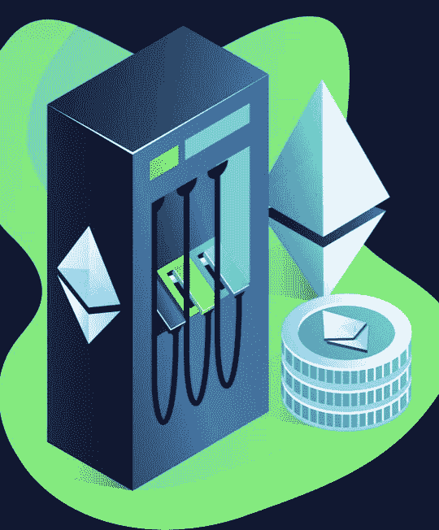
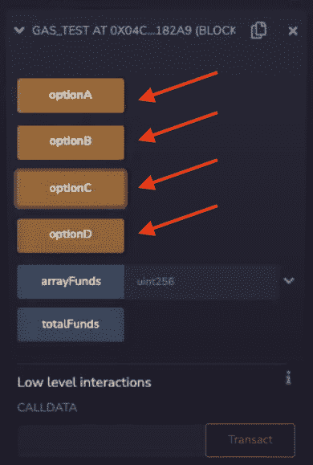
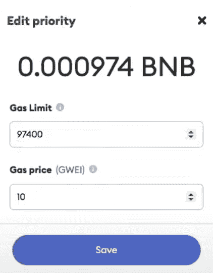
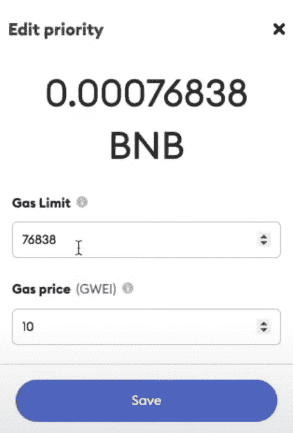
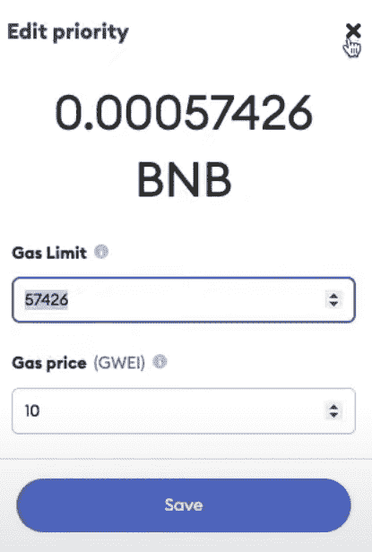
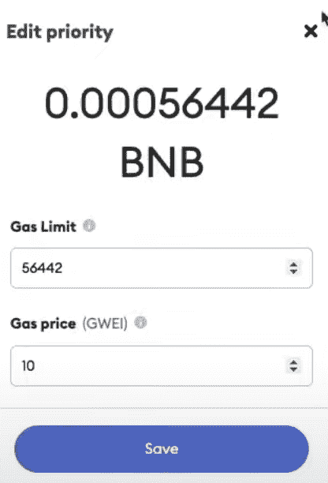

# 如何降低固体气体成本——完整指南

> 原文：<https://moralis.io/how-to-reduce-solidity-gas-costs-full-guide/>

在本文中，我们将仔细研究如何在开发智能合同时降低固体天然气成本。为了说明优化过程，我们将使用一个已经准备好的包含几个函数的智能契约。如果您愿意，可以直接跳到以下 GitHub 存储库中的合同代码:

**完整的气体优化文档—**[**【https://github.com/DanielMoralisSamples/32_Gas_Optimization】**](https://github.com/DanielMoralisSamples/32_Gas_Optimization)

**降低成本是经营企业的一个重要组成部分——无论你在哪个行业经营——因为这是获得竞争优势和价值最大化的潜在途径。因此，如果你正在 EVM 兼容(以太坊虚拟机)链上开发 [dapps](https://moralis.io/decentralized-applications-explained-what-are-dapps/) (去中心化应用程序)，首要任务应该是降低 Solidity gas 成本。然而，如果你对 [Web3 开发](https://moralis.io/how-to-build-decentralized-apps-dapps-quickly-and-easily/)领域不熟悉或不熟悉，这将是一个不习惯的任务。由于这种情况，本文将说明如何优化您的智能合同开发，以降低固体气成本。**

**我们测量天然气的 EVM 使用量，这意味着使用越密集，我们需要的天然气就越多。这表明有可能优化智能合约功能，以减少 EVM 的使用，从而降低[可靠性](https://moralis.io/solidity-explained-what-is-solidity/)成本。为了展示其工作原理并提供一个清晰的示例，我们将进一步研究一个简单的实度函数，以及如何以三种不同的方式对其进行优化，以降低区块链的计算能力。**

**了解如何优化智能合同以降低固体气成本将有助于未来的任何开发工作。此外，如果你真的想成为一名区块链开发者，就和 [Moralis](https://moralis.io/) 签约吧，因为这个操作系统提供了市场上最好的开发者体验！**

## **什么是固体气体成本？**

**在探索降低固体气体成本的过程之前，我们需要理解“气体”的概念及其重要性。此外，要完全理解 gas 在可靠性方面意味着什么，我们必须首先对以太坊虚拟机(EVM)有更深入的了解。那么，什么是 [EVM](https://moralis.io/evm-explained-what-is-ethereum-virtual-machine/) ？**

**如果您熟悉区块链的发展，您就会知道 EVM 是一个由矿商网络驱动的全球处理器。矿工们执行与 EVM 兼容的合同——比如本教程中的稳固合同——并通过创建新区块并将它们附加到区块链来应用他们的工作。本质上，EVM 网络提供了执行智能合同和链上交易的计算能力。**

**

然而，利用 EVM 的计算能力并不是免费的。因此，社区称驱动这个全球 EVM 处理器的燃料为“气体”。此外，gas 也是系统的测量单位，用于跟踪执行合同或功能时使用了多少计算能力。这表明，更多地使用 EVM 需要更多的天然气。

在[以太坊](https://moralis.io/full-guide-what-is-ethereum/)网络上，所有的具体操作都有特定的气价；然而，天然气的价值和价格取决于供求因素。这意味着 gwei 中不存在固定价格，因此很难预测执行智能合约的长期成本。

这表明，固体天然气成本是指某人在执行固体智能合同时必须支付的实际价格。此外，随着对 Web3 开发越来越多的关注，天然气价格已经飙升，使得运行智能合同变得非常昂贵。因此，优化汽油费比以往任何时候都更为紧迫。然而，究竟什么是气费优化？

## 什么是气费优化？

随着 Web3 领域内的竞争加剧以及固体气体成本居高不下，降低成本以提高市场竞争力变得比以往任何时候都更加重要。降低固体天然气成本可以通过天然气进料优化来实现；然而，这究竟意味着什么？

正如我们在上一节中所述，气体既是测量工具，也是与 EVM 使用相关的燃料。我们执行合同所需的计算能力越强，我们需要的汽油就越多。此外，设置执行交易所需的 gas 然而，天然气的实际价格因供求因素而异。基于此，有可能确定影响天然气价格的变量的两个例子:1)计算能力和 2)供给和需求。



因此，优化天然气费用的一种方法是在一天中网络不太拥挤的特定时间执行功能和合同。这意味着运行合同的价格可能会根据合同执行的特定时间而变化。

此外，影响汽油费用的额外变量是我们执行交易或功能所需的计算能力。因此，还可以通过减少所有区块链交互的数量和复杂性来优化天然气费用。

在接下来的几节中，我们将更仔细地研究后者。这意味着，我们将通过降低执行 Solidity smart 合同所需的区块链交互的复杂性和数量，更深入地了解天然气费用优化的工作原理。所以，事不宜迟，让我们仔细看看如何降低固体气体成本！

## 如何降低固体天然气成本——智能合同示例

在本文的以下部分中，我们将研究一个智能契约，它包含存储在区块链上的两个状态变量和四个简单函数。每个功能的基本功能是相同的；然而，我们逐渐优化每个功能，以降低固体气体成本。

这些函数的基本功能是遍历一个名为“arrayFunds”的包含几个整数的数组，将所有元素相加，最后用数组的总和填充“totalFunds”变量。

这些功能被标为“A”到“D ”,其中第一个功能需要的汽油最多，最后一个功能需要的汽油最少。此外，我们将进一步了解这四个功能，看看它们是如何优化的，以及“幕后”到底发生了什么。

一旦我们知道如何减少固体气体成本，我们也将简要介绍每个功能的结果。这将有助于确定差异，并说明未来优化您的智能合同的力量。

然而，如果你更想看完整教程的视频指南，请仔细看看下面来自 [Moralis YouTube](https://www.youtube.com/c/MoralisWeb3) 频道的剪辑。该视频进一步详细解释了整个合同:

https://www.youtube.com/watch?v=IkdoQI7API0

此外，如果您想了解更多关于智能合同开发的信息，请访问 Moralis 博客，查看我们关于如何创建智能合同的文章！

## 如何降低固体气体成本:功能 A–C

让我们从仔细研究第一个函数“optionA()”开始，它需要最高的固体气体成本。但是为什么这个比其他的贵呢？为了充分理解这一点，我们需要分析函数本身:

### 功能

```js
  function optionA() external {
        for (uint i =0; i < arrayFunds.length; i++){
            totalFunds = totalFunds + arrayFunds[i];
        }
    }
```

从上面的代码可以看出，功能比较简单。然而，“optionA()”在函数的“*”for*循环的每次迭代中直接与区块链通信。这意味着该函数在执行过程中多次从“arrayFunds”中获取信息，并填充“totalFunds”状态变量。结果，发生了几种不同的和不必要的区块链相互作用，这推高了天然气成本。那么，我们该如何改进呢？

逐步优化函数的一种方法是为“totalFunds”变量添加一个内存变量；这正是我们在“optionB()”中所做的:

### 功能

```js
function optionB() external {
        uint _totalFunds;
        for (uint i =0; i < arrayFunds.length; i++){
            _totalFunds = _totalFunds + arrayFunds[i];
        }
        totalFunds = _totalFunds;
    }
```

在循环之前，我们创建一个名为“_totalFunds”的内存变量。然后，在循环的每次迭代中，我们填充这个变量，而不是状态变量“totalFunds”。因此，当循环执行时，我们不会写入区块链。这让我们节省了大量的气体，因为我们减少了与区块链的相互作用。现在，我们如何进一步改进它呢？

在“optionC()”中，我们基本上遵循相同的主题，为“arrayFunds”变量创建一个内存变量。因此，这就是函数:

### 功能

```js
function optionC() external {
        uint _totalFunds;
        uint[] memory _arrayFunds = arrayFunds;
        for (uint i =0; i < _arrayFunds.length; i++){
            _totalFunds = _totalFunds + _arrayFunds[i];
        }
        totalFunds = _totalFunds;
    }
```

在这个选项中，我们创建一个名为“_arrayFunds”的内存变量，它等于“arrayFunds”。然而，由于它存储在本地，我们不需要在每次循环迭代中从“arrayFunds”变量中获取信息。这表明，当我们进一步减少区块链相互作用的数量时，我们改进了函数。

## 如何降低固体燃气成本:功能 D

最后一个函数是“optionD()”，这个有点复杂。然而，要理解这个选项，我们需要更深入地探究坚固性的历史。

在 Solidity 早期版本的编程语言中，Solidity 没有恢复变量溢出的功能。“SafeMath”库就是为了解决这个问题而开发的，它变得非常流行。尽管如此，随着 Solidity 新版本的出现，这种语言得到了进一步的发展。这增加了恢复变量溢出的能力，使“安全数学”过时。


然而，这是有代价的，因为固体的算法在汽油方面变得更加昂贵。注意，我们在前面的选项中执行了“检查算法”;但是，做“不检查”更便宜。此外，这样做是可能的，因为变量“I”很难溢出。

因此，为了实现这一点，我们利用了名为“unsafe_inc(unit x)”的帮助函数:

```js
  function unsafe_inc(uint x) private pure returns (uint) {
        unchecked { return x + 1; }
    }
```

我们将在执行“optionD()”时利用这个函数。因此，这是最终且最便宜的函数:

```js
 function optionD() external {
        uint _totalFunds;
        uint[] memory _arrayFunds = arrayFunds;
        for (uint i =0; i < _arrayFunds.length; i = unsafe_inc(i)){
            _totalFunds = _totalFunds + _arrayFunds[i];
        }
        totalFunds = _totalFunds;
    }
```

此外，如果你想了解更多关于 Web3 开发和所需技能的知识，请查看我们关于区块链开发的最佳语言的文章！

### 测试功能——有什么不同？

四个函数处于四个不同的优化级别，看到它们之间的差异变得很有趣。因此，可以通过运行每个函数来说明优化合同的价值。

为了测试契约，我们将使用 [Remix](http://remix.ethereum.org/) 来编译和部署它。如果你想自己做，导航到 Remix 界面中的“Solidity 编译器”标签。一旦你已经编译了合同，你可以点击“部署&运行事务”标签。从那里，您需要选择“注入的 Web3”，并且您应该能够部署契约。

随着契约的部署，我们可以通过 Remix 直接测试每个功能。要测试每个功能，您可以点击以下按钮，这将提示您的[元掩码](https://moralis.io/metamask-explained-what-is-metamask/)钱包:



下面，我们将公布每种替代方案，以展示固体气价格的差异:

**选项 A():**



**optionB():**



**optionC():**



**optionD():**



通过每次优化，您可以看到我们逐渐降低了固体气体成本。

本教程到此为止；你现在有希望知道如何通过优化你的智能合同来降低固体气成本。此外，即使本教程涵盖了一个基本功能，您也应该能够将相同的逻辑用于更复杂的合同，并在未来大幅削减天然气成本。

如果您有任何进一步的问题，请查看我们在本文前面链接的视频。你会发现我们的一个开发人员在视频中更详细地解释了整个过程！你也可以通过仔细阅读下面这篇文章来了解更多关于以太坊燃气费的信息:“[以太坊燃气费——2022 年终极指南](https://moralis.io/ethereum-gas-fees-the-ultimate-2022-guide/)”。

## 如何降低固体气体成本——总结

随着 Web3 行业走向主流和大众化，竞争变得越来越激烈。因此，最大限度地降低运营成本和最大限度地提高客户价值以获得竞争优势变得至关重要。实现这一目标的一个有效策略是通过优化[智能合同](https://moralis.io/smart-contracts-explained-what-are-smart-contracts/)来降低固体气成本。

在本文中，我们向您展示了一个包含四个不同函数的合同示例，这些函数已被逐步改进以最小化天然气价格。主要的担忧是降低区块链互动的数量，这将推高天然气价格。在这种情况下，这是通过创建内存变量来实现的，允许契约避免循环中不必要的区块链交互。

这只是如何优化智能合同以降低固体气成本的一个简单说明。然而，如果您将这种策略应用于更复杂的事务，逻辑仍然是一样的。因此，本教程将有望让您在未来开发更优化的智能合约，以降低成本。


如果你觉得这篇文章有帮助，请随意浏览 [Moralis 的博客](https://moralis.io/blog/)。在这里，您可以找到更多的文章，帮助您提升 Web3 开发水平。此外，Moralis 提供了最令人惊叹的开发工具，如 [Moralis Speedy Nodes](https://moralis.io/speedy-nodes/) 、[元宇宙 SDK](https://moralis.io/metaverse/) 、 [NFT API](https://moralis.io/ultimate-nft-api-exploring-moralis-nft-api/) 等。

那么，你有雄心成为一名区块链开发者吗？嗯，那么你旅程的下一步应该是去[和 Moralis](https://admin.moralis.io/register) 签约。创建一个帐户是免费的，你可以立即开始创建 dapps！**