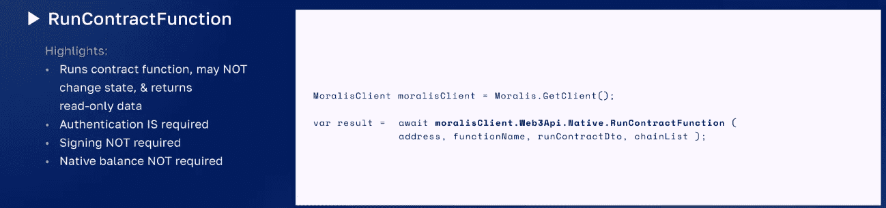
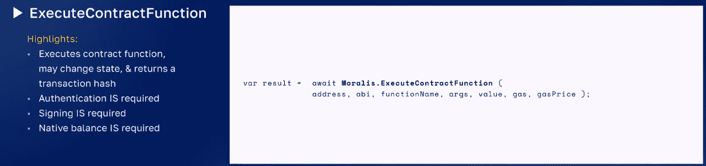
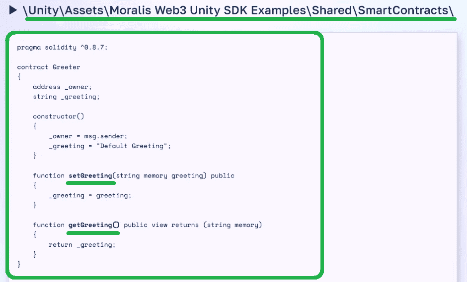
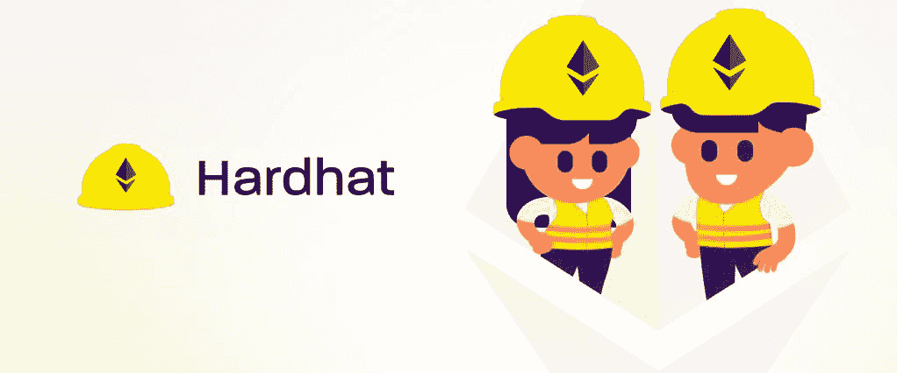
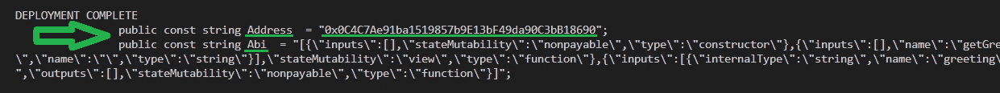

# 如何使用 Unity 运行智能合同

> 原文：<https://moralis.io/how-to-run-a-smart-contract-with-unity/>

在我们向您展示如何使用 Unity 运行智能合同之前，我们想提醒您，Web3 开发提供了无数的机会。因此，那些专注于构建 Web3 应用程序的人将成为佼佼者。尤其是介入早的，在 [**桥接 Web2 和 Web3**](https://moralis.io/web2-to-web3-bridging-web2-and-web3/) **刚刚起步的时候。然而，在过去的几年里，** [**Web3 栈**](https://moralis.io/web3-stack-the-full-guide-to-web3-development/) **取得了长足的进步。因此，您不再需要处理 RPC 节点的限制。这意味着您不必运行自己的节点，也不需要构建自己的后端基础设施。事实上，您可以使用**[**Moralis**](https://moralis.io/)**用 Unity 运行一个智能契约。因此，您可以创建各种各样的分散式应用程序(dapps)。实质上，Moralis 允许您利用现有的 Web3 后端基础设施。因此，您可以专注于创建最佳前端。**

在今天的文章中，我们将通过一个简单的示例项目向您展示如何使用 Unity 运行智能合同。有了这些知识，你就能发挥你的 Unity 技能，开始开发杀手级的 Web3 游戏。然而，在深入示例项目之前，我们需要确保我们都掌握了基础知识。因此，我们将首先告诉你什么是智能合同。而且，对于不熟悉 Unity 的你们，我们也会快速解释一下什么是 Unity。此外，由于您需要几个有用的工具来运行与 Unity 的智能合同，如果您决定跟随我们的领导，您将会学到很多。您将学习如何使用 Hardhat 来编译、部署和验证智能契约。此外，您将了解如何开始使用 Moralis 以及如何在 Polygon 的 testnet 上工作。


## 什么是智能合同？

智能合约，也称为 Web3 合约，基本上是运行在可编程区块链上的软件。并且，由于以太坊是第一个可编程链，正是以太坊链催生了这些令人惊叹的程序。当谈到以太坊和其他 [EVM](https://moralis.io/evm-explained-what-is-ethereum-virtual-machine/) 兼容链(例如:多边形、BNB 链、雪崩)时，Solidity 是开发人员用来编写智能合同的编程语言。另一方面，在 Solana 的例子中，智能合同被称为程序，开发人员用 Rust 编写它们。


此外，智能合约可以确保事情按照预先定义的规则正常运行。因此，智能合约会在满足预定条件时执行预定义的操作。通过这样做，它们发出所谓的智能合约事件。通过监听智能合约事件，我们可以将它们用作 dapps 中其他特性和功能的触发器。因此，很明显，智能合约是可编程链的逻辑。此外，我们的项目可以调用智能合约中的函数来与区块链交互。这正是我们与 Unity 签订智能合同的方式。从智能合约中调用该函数后，它使用返回值和事件进行通信。

然而，在使用智能合约之前(除非我们正在使用现有的合约)，我们需要部署它。这意味着我们需要执行一个链上事务，将有问题的合同存储到一个特定的链中。当然，有几种方法可以部署智能合约。不过，我们认为 Hardhat 是涵盖这一方面的最简单、最整洁的方式之一。因此，我们将在前进的过程中使用这一工具。现在，在我们查看从 Unity 调用智能合约的图表之前，让我们确保我们都知道 Unity 是什么。


### 什么是团结？

自从 2005 年发布以来，Unity 走过了一段漫长的路。它现在是最受欢迎的游戏引擎之一。此外，Unity 是跨平台的，这意味着你可以用它来开发各种应用。无论你的目标是桌面、移动、控制台还是虚拟现实(VR)平台，Unity 都可以帮助你到达终点。

Unity 的界面让你不用编码就能走得更远。然而，当事情变得严重时，脚本可以完成任务。这就是 C#和 C++技能派上用场的地方。总而言之，如果你对游戏开发感兴趣，Unity 值得你关注。此外，由于 Web3 游戏设计具有突出的潜力，使用 Unity 来创建杀手级 Web3 游戏是显而易见的。

### 从 Unity 调用智能合同

如前所述，让我们使用下图来看看如何从 Unity 调用智能合同:


查看上图，您可以看到我们首先需要部署我们的智能合同。然后，您(作为 Unity 用户)能够以只读模式运行合同功能。作为对该函数的响应，智能协定返回所需的类型。此外，您还可以执行契约函数，在这种情况下，您具有读写能力。此外，对“ExecuteContractFunction”的响应没有返回值。相反，在这种情况下，智能协定返回事务哈希。尽管如此，契约本身能够在需要时发出事件。使用 Unity，您可以订阅这些事件来观察和获取返回值。

现在，问题是“我们如何调用“RunContractFunction”和“ExecuteContractFunction”？。这就是 Moralis 进入场景的地方。

调用智能合同与 Moralis:

*   " RunContractFunction ":



*   " ExecuteContractFunction ":



# 使用 Unity 运行智能合同–示例项目

有了智能合约和 Unity 的基础知识，我们可以专注于一个示例 Unity 项目。接下来，我们将关注两个场景——“RunContractFunction”和“ExecuteContractFunction”。我们在 [GitHub](https://github.com/MoralisWeb3/web3-unity-sdk-examples) 上为您提供了该项目。此外，正如场景名称所暗示的，我们的示例项目完全是关于运行一个与 Unity 的示例智能契约。这意味着您将直接看到上面介绍的只读和读/写特性。此外，至此，您已经知道执行契约函数需要本机平衡。因此，我们还需要一些“测试”程序来在孟买网络上执行这些交易。

然而，在我们运行 Unity 的智能合同之前，我们需要首先部署它。如前所述，我们将在 polygon 的 testnet (Mumbai)上这样做。此外，我们将使用 Hardhat 来完成这项任务。如果这是你第一次听说 Polygon，一定要看下面的视频，从 3:45 开始。这也是你可以了解更多关于多边形水龙头，特别是关于多边形孟买测试网水龙头。后者将帮助您获得“测试”MATIC，您将需要它来部署您的智能合约并执行合约功能。


### 智能合同工作流

智能合同工作流的第一步是编写智能合同。幸运的是，有开源平台，如 OpenZeppeling，为您提供经过验证的智能合同模板。因此，您很少需要从头开始。此外，在这种情况下，您可以使用我们的智能合同，它可以在“Assets”文件夹中找到:



当谈到我们的智能契约时，您可以在上面的图像中看到,“setGreeting”和“geGreeting”方法是我们将重点关注的。由于我们为您提供了合同，您只需复制代码。然后，设置 Hardhat 并使用一个配置文件和一个部署文件来部署智能合约。在这个配置文件中，您需要输入一些特定的值。一旦您运行了部署文件，合同将启动并运行。因此，您将能够运行 Unity 的智能合约。

为了帮助您以最小的摩擦使用 Hardhat，请使用下面的分步说明。另外，你可以自己看下面的视频，从 5:55 开始。



#### 使用安全帽-逐步说明

1.  安装节点 JS

2.  在 GIT 之外创建一个空文件夹。在文本编辑器中打开(例如:VSC)

3.  使用命令行安装 Hardhat。您需要输入以下命令:
    1.  *npm i -D 安全帽*
    2.  *npx 安全帽*

4.  使用命令行安装 Hardhat。您需要输入以下命令:
    1.  *NPM I-D @ open zeppelin/contracts*
    2.  *NPM I-D @ nomic labs/hard hat-waffle*
    3.  *NPM I-D @ nomic labs/hard hat-ethers can*

5.  重命名”。/contracts/Greeter.sol" to "。/contracts/{YourContractName}。sol" *(当然没有" { } ")*

6.  变”。/scripts/sample_script.js" to "。/scripts/deploy { YourContractName }。js" *(同样没有" { } "*

7.  里面”。/scripts/deploy { YourContractName }。sol "，将“greeter”重命名为{YourContractName}，“Greeter”重命名为{yourContractName} *(考虑现有字母大小写)*

8.  在”。/scripts/deploy { YourContractName }。sol”，确保“deploy()”函数具有正确的协定构造函数参数

9.  里面”。/scripts/deploy { YourContractName }。sol "添加下面的代码*(用实际名称替换{ YourContractName })*:

```js
    await {YourContractName}.deployTransaction.wait(5);

    //verify the contract
    await hre.run("verify:verify", {
        address: {YourContractName}.address,
        constructorArguments: [],
    });
```

10.  在”。/hardhat.config.js "，在顶部添加这行代码:

```js
require("@nomiclabs/hardhat-etherscan");
```

11.  里面”。/hardhat.config.js”，在“module.exports”部分之前添加这些字段:

```js
const PRIVATE_KEY = "";
const MUMBAI_NETWORK_URL = "";
const POLYGONSCAN_API_KEY = "";
```

12.  在”。/hardhat.config.js "，修改" module.exports ":

```js
    module.exports = {
      solidity: "0.8.7",
      networks: {
        mumbai: {
          url: MUMBAI_NETWORK_URL,
          accounts: [PRIVATE_KEY]
        }
      },
      etherscan: {
        apiKey: POLYGONSCAN_API_KEY 
      }
    };
```

```js
 13.  使用以下命令编译您的智能合约: 1.  *npx 安全帽清洗* 2.  *npx 安全帽编译* 14.  使用以下命令部署您的智能合约:

```
npx hardhat run scripts/deployProperty.js --network mumbai
```js

*注意:* *确保在步骤 12 中输入孟买网络 URL、你钱包的私钥和你的 Polygonscan API 密钥。*初始 Moralis 设置在继续之前，请确保在 Unity 中打开我们的项目。然后输入您的 Moralis dapp 凭据，以访问 Moralis 的 Web3 unity SDK。以下是您需要完成的步骤: 1.  访问 Moralis 的官方网站，通过“免费开始”按钮创建您的免费帐户。*如果您已经有一个活动帐户，只需使用您的凭据登录:* 2.  在您的 Moralis 管理区，点击“创建新的 Dapp”: 3.  首先，选择环境。*由于这是一个示例项目，请选择“Testnet”*: 4.  然后，您需要选择您想要关注的链。*在此，我们将关注“多边形孟买”:* 5.  第二，你需要选择你的地区。*从给出的选项中选择离您实际位置最近的城市:* 6.  第三，你需要命名你的 dapp，点击“创建你的 Dapp”按钮旋转它: 7.  现在您的 dapp 已经启动并运行，您可以获得它的凭证(URL 和 ID): 8.  使用“复制”图标复制您的 dapp 凭据: 9.  最后，将上面复制的凭证粘贴到 Unity 中，并单击“完成”:*注意* *:如果在 Unity 中看不到“Moralis Web3 设置”窗口，请重新打开:*与 Unity 签订智能合同此时，您已经成功部署了我们的智能合约实例。这意味着您的终端返回了合同细节(地址和 ABI)。因此，您可以复制这些详细信息:您需要将上面复制的代码行粘贴到“GreeterContractData”脚本中(9:00):因为“RunContractFunction”接受字符串格式的协定 ABI，所以您可以只粘贴终端提供的内容。但是，“ExecuteContractFunction”需要对象格式的协定 ABI。这意味着您需要将字符串重新创建为对象(9:21)。在下面视频的 9 点 35 分，可以看到“ExecuteContractFunction”演示。当运行这个示例场景时，您将需要使用一些上面获得的“test”MATIC。另一方面，当您通过“RunContractFunction”场景(10:12)运行与 Unity 的智能合约时，您不需要任何资金。如果你记得，那是因为这是一个只读函数。最后，从 10:25 开始，您还可以快速浏览“运行”和“执行”函数的代码。https://www.youtube.com/watch?v=0S8JTkcjpsA 如何使用 Unity 运行智能合同–总结如果你想用 Unity 开发 Web3 游戏，了解智能合约的基础知识肯定会有所帮助。这正是今天的文章所涵盖的内容。除了智能合约的简单定义，您还有机会学习如何使用 Hardhat 来编译、部署和验证 Web3 合约。此外，如果您承担了我们在此讨论的示例项目，您实际上部署了我们的智能合同。此外，您还将了解“运行”和“执行”功能之间的区别。此外，使用我们的脚本并用您的智能合约的细节填充它，您有机会用 Unity 测试运行一个智能合约。因为您在 Polygon 的 testnet 上完成了这项工作，所以您还学习了如何获得一些“测试”MATIC，以及如何将 Mumbai 网络添加到元掩码中。如果这是你第一次使用 Moralis 的 Web3 Unity SDK，你可能会不知所措。因此，我们鼓励您再次完成上述步骤，或者从我们的其他 Unity 教程开始。你可以在[Moralis 利斯的 YouTube 频道](https://www.youtube.com/c/MoralisWeb3)和[Moralis 利斯的博客](https://moralis.io/blog/)上找到大量关于 [Unity Web3 编程](https://moralis.io/unity-web3-beginners-guide-to-unity-web3-programming/)的宝贵资源。这些也是可以帮助你扩展你的加密视野，甚至免费成为一名 Web3 开发者的途径。然而，如果你对全职加密感兴趣，你应该考虑报名参加[Moralis 学院](https://academy.moralis.io/)。    

```