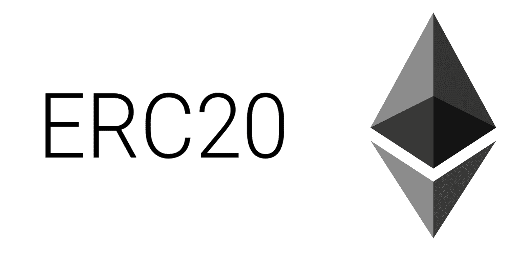
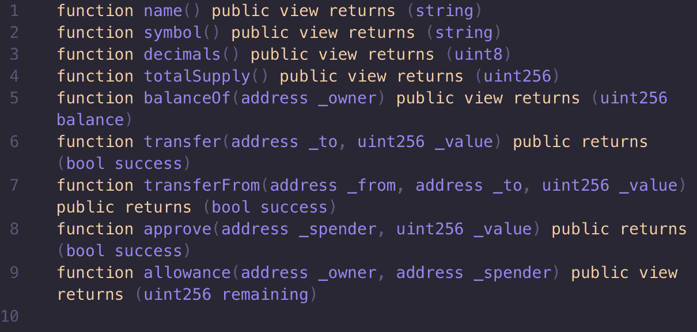
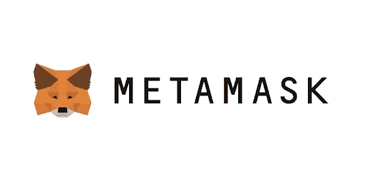
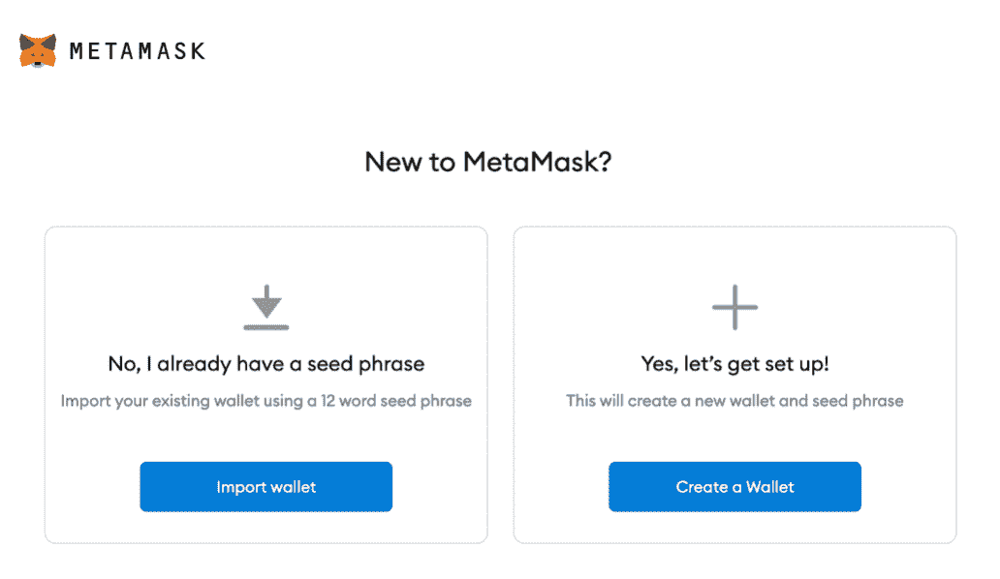
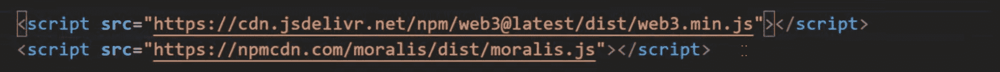
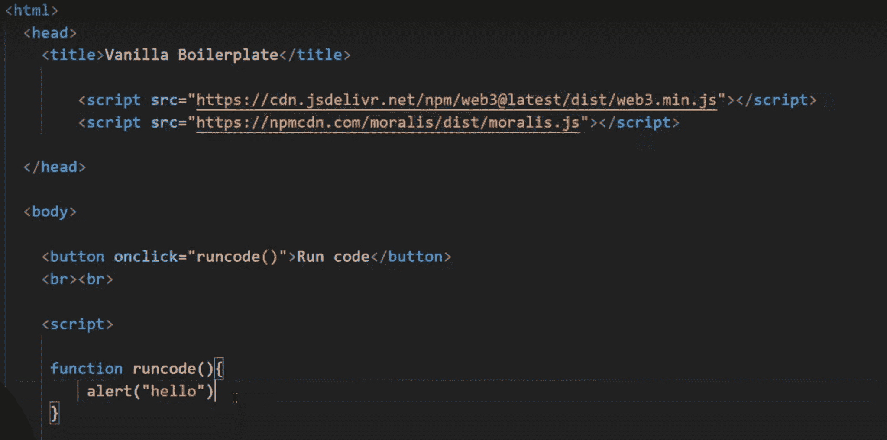
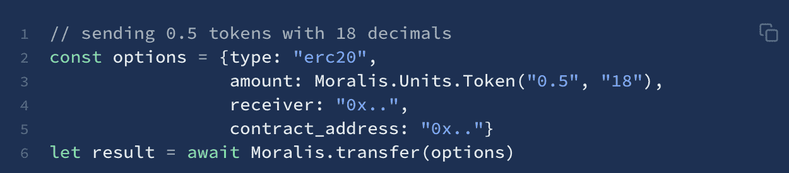
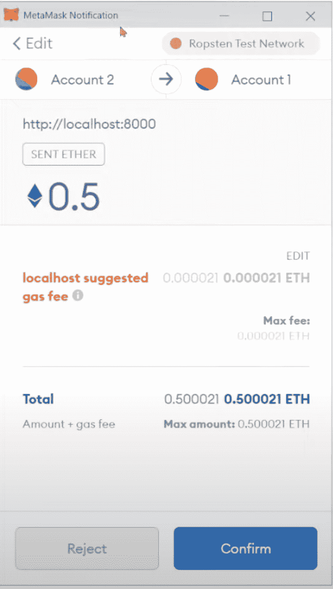

# 如何发送 ERC-20 代币

> 原文：<https://moralis.io/how-to-send-erc-20-tokens/>

使用钱包和 MetaMask 或比特币基地等平台时，在账户之间转移或发送 ERC-20 代币相对简单。然而，在这些平台的背后，需要复杂的底层基础设施，这需要时间来开发。因此，当涉及到 [**dApp**](https://moralis.io/decentralized-applications-explained-what-are-dapps/) **(分散应用)开发时，如果没有合适的工具，转移 ERC-20 以太坊令牌是相对困难的。这就是**[**Moralis**](https://moralis.io/)**的用武之地，它允许我们只用一行代码就能添加这个功能。出于这个原因，我们将在本文中仔细研究如何使用 Moralis 发送 ERC-20 令牌的过程。**

从传统的角度来看，实现向 dApps 发送 ERC-20 令牌的能力是一项繁琐的任务。其主要原因是复杂的底层数据结构需求和对工作 API 的需求。然而，这不再是 Moralis 的情况。作为平台用户，可以利用 Moralis 已经开发的基础设施。这意味着平台负责所有的重物提升。与此同时，您可以将注意力集中到开发 dApps 的前端和[智能合约](https://moralis.io/smart-contracts-explained-what-are-smart-contracts/)上。

此外，预先构建的后端基础设施和附加功能的组合，如 [Moralis Speedy Nodes](https://moralis.io/speedy-nodes/) 、 [NFT API](https://moralis.io/announcing-the-moralis-nft-api/) 、 [Price API](https://moralis.io/introducing-the-moralis-price-api/) 等。，使 Moralis 成为 Web3 开发的终极中间件。这意味着该平台为您提供了开发和部署 dApps 所需的一切。

所以，如果你想进入 dApp 开发，那就马上和 Moralis 签约吧！通过注册，您将立即获得所有平台的工具，这将有利于您未来所有的区块链项目。

### 什么是以太坊 ERC 20 代币？

在我们深入研究如何将 ERC-20 以太币从一个地址发送到另一个地址之前，最好先了解一下 ERC-20 代币是什么。因此，我们将在本节中更仔细地研究以太坊代币以及“ERC-20”的实际含义。

首先，ERC-20 代币是所谓的可替换代币，它们是以太坊生态系统中最强大的功能之一，另外还有 [NFTs](https://moralis.io/non-fungible-tokens-explained-what-are-nfts/) 。在区块链的游戏中，代币几乎可以代表从法定货币到技能点数的任何东西。由于这些令牌的用例几乎是无限的，拥有一个监管标准是非常有益的。

这正是 ERC-20 标准发挥作用的地方。该标准对可替换令牌进行管理，以确保它们具有相同的属性。因此，应用这个标准的令牌共享相同的值和类型，使它们可以互换。因此，例如，我们可以用一种醚交换另一种醚，因为它们具有相同的性质。

ERC-20 令牌经常与以太坊联系在一起，这是理所当然的，因为这是标准起源的链条。然而，它并不局限于以太坊，因为其他使用 [EVM](https://moralis.io/evm-explained-what-is-ethereum-virtual-machine/) (以太坊虚拟机)的连锁店通常也应用该标准。这意味着 ERC-20 令牌也存在于其他链的生态系统中，如 Polygon 和 BSC。

该标准为使用智能合约的令牌实现了一个 API。它为 ERC-20 代币提供各种功能，例如在账户之间转移代币和设置总供应量。

此外，以下事件和方法是被认为是 ERC-20 令牌所必需的:

### 转让 ERC-20 与 Moralis 代币

只用一行代码就能把 ERC 20 代币从一个地址转移到另一个地址，这听起来像是魔术。然而，这实际上只是 Moralis。为了让你更好地理解这是如何可能的，我们将在这一部分更深入地解释 Moralis。

目前有超过 5000 个区块链项目利用了 Moralis 平台。这允许他们开发 dApps，而没有不必要的成本和复杂性。此外，不仅可以用 Moralis 来发展 dApps。还可以开发[令牌](https://moralis.io/how-to-create-ethereum-tokens-in-4-steps/)、[创建智能合约](https://moralis.io/how-to-create-smart-contracts/)等。此外，使用 Moralis 的 API 和软件为您的项目提供了极好的可伸缩性机会。

Web3 开发最复杂的问题之一是开发后端基础设施。这需要大量的时间和资源，但是通过使用 Moralis 可以避免。该平台提供了一个底层基础设施，使您能够缩短所有项目的上市时间，消除最麻烦的 Web3 开发过程。

此外，除了前面提到的一些工具，Moralis 还具有对 [IPFS](https://moralis.io/what-is-ipfs-interplanetary-file-system/) 的原生支持、跨链兼容性和实时警报等。该平台还提供了一个博客，你可以在那里找到指南和教程，使你成为一名更好的开发人员。例如，最近发表了一篇文章，为初学者解释了[以太坊开发](https://moralis.io/ethereum-development-for-beginners/)。

由于 Moralis 提供基础设施和开发工具，成为 dApp 开发者的正确途径是加入 Moralis。注册该平台完全免费，您将立即获得该平台的所有功能！

# 如何用一行代码发送 ERC-20 代币

向 dApp 添加转移 ERC-20 令牌的能力一直是一个紧迫的问题。这样做的主要原因是，这个过程需要我们建立一个复杂的数据结构，这需要不必要的时间和资源。然而，我们可以通过利用 Moralis 已经管理的后端基础设施来避免这种迂回。利用该平台，我们只需一行代码就可以添加这一功能！

在接下来的部分中，我们将展示 Moralis 的强大功能，并通过创建一个简单的 web 应用程序，带您完成如何转移 ERC-20 令牌的完整过程。我们将用一个包含所有必要代码的 HTML 文件从头创建一个项目。该文件将包括一些导入、一个按钮和一个负责发送令牌的逻辑的函数。

但是，在开发 app 之前，我们必须首先创建一个 MetaMask 帐户。一般来说，拥有一个元掩码帐户是很好的，但在这种情况下，我们将在转移 ERC-20 令牌时使用该帐户作为发送地址。因此，让我们从更深入地了解什么是元掩码以及如何使用这个加密钱包开始本教程。

### 元掩码解释

MetaMask 是市场上最大、最完善的加密钱包，拥有超过 1000 万活跃用户。有可能获得两个不同版本的元掩码，要么是浏览器扩展，要么是移动应用程序。然而，在这种情况下，我们建议获取扩展，因为它更适合本教程。

钱包为用户提供了全面管理其所有加密资产的所有基本功能。因此，MetaMask 用户可以通过该平台交换、购买和出售资产。此外，除了作为钱包，MetaMask 还充当 dApps 广泛以太坊生态系统的门户。

设置元掩码非常简单；我们需要做的就是从 [MetaMask 官网](https://metamask.io/)下载扩展。一旦我们下载了扩展并将其添加到浏览器中，我们就可以通过单击“开始”按钮来开始这个过程。点击后，我们会收到两个不同的选项:导入钱包或从头创建一个新的。

如果我们选择导入选项，我们需要输入我们已经存在的钱包的种子短语。这是一个 12 个单词的种子短语，您需要按照特定的顺序输入。如果选择了另一个选项，我们将从头开始创建一个新的钱包。

然而，如果你在创建账户时遇到了麻烦，看看下面这篇来自 [Moralis 博客](https://moralis.io/blog/?utm_source=blog&utm_medium=post&utm_campaign=Want%2520the%2520Latest%2520in%2520%253Cspan%253EBlockchain%2520Development%253F%253C%252Fspan%253E)的文章，它会给你一个关于 [MetaMask](https://moralis.io/metamask-explained-what-is-metamask/) 以及如何创建账户的完整分析。

## 如何发送 ERC-20 令牌-创建一个新的 HTML 文件

设置好元掩码帐户后，我们可以继续讨论本文的主题:“如何转移 ERC-20 代币”。因此，为了将 ERC-20 以太币从一个加密地址发送到另一个加密地址，我们将创建自己的应用程序。因此，第一步是建立一个新项目并创建一个新的 HTML 文件。我们称它为什么并不重要，但是在这个例子中，我们称这个文件为“index.html”。

我们要添加到文件中的第一件事是一些导入。我们将导入 [Web3](https://moralis.io/the-ultimate-guide-to-web3-what-is-web3/) 和 Moralis。因此，这是导入在代码本身中的样子:

随着导入的实现，我们可以添加一个我们称之为“运行代码”的按钮。这个按钮将有一个“onclick”事件，当它被点击时，将触发我们的应用程序的功能。在本例中，我们将运行“runcode()”函数。下图中，该函数只打印“hello”；但是，我们将在下一步中对此进行更改，以便此函数负责发送 ERC-20 令牌的所有逻辑。

## 如何发送 ERC-20 令牌—“runcode()”逻辑

既然我们已经完成了应用程序的基本结构，我们可以继续将我们的逻辑添加到“runcode()”函数中。这个过程很简单，我们所需要的只是一行代码，可以从 [Moralis 文档](https://docs.moralis.io/moralis-server/sending-assets?utm_source=blog&utm_medium=post&utm_campaign=Want%2520the%2520Latest%2520in%2520%253Cspan%253EBlockchain%2520Development%253F%253C%252Fspan%253E)中获取。从文档中，我们需要获得 ERC-20 令牌的代码，它看起来像这样:

如你所见，这实际上是五行代码；然而，我们以这种方式组织代码是为了让它更容易理解。此外，如果我们愿意，我们可以将其缩短到只包含调用 Moralis“transfer()”函数的最后一行。

然而，让我们分析一下代码，以便更好地理解实际发生了什么。我们正在创建一个具有一些属性的新对象。首先，我们指定类型，在本例中是“erc20”。

添加类型后，我们可以继续设置数量。在这种情况下，数量设置为 0.5 ETH，后跟小数，小数设置为 18。此外，请注意，我们在这里使用了 Moralis 的一个助手函数，以使确定数量的过程变得更加简单。一旦我们设置了适当的数量，我们就可以添加接收者地址，然后添加令牌地址。

新对象完成后，我们可以在调用执行事务的 Moralis“transfer()”函数时将它作为参数传递。

## 如何发送 ERC-20 令牌—测试应用程序

代码完成后，我们可以继续测试我们的应用程序。一旦应用程序启动并单击“运行代码”按钮，就会触发“Run code()”函数。一旦我们运行这个函数，就会弹出一个 MetaMask 窗口，要求您确认交易。

因此，您登录的当前帐户将是 ERC-20 令牌的发送地址。此外，该窗口还将显示发送代币的交易费用。需要注意的是，每笔交易都会收取少量费用，该费用可能会根据当前的油价而有所不同。

就是这样；这就是创建我们自己的应用程序，可以用来转移 ERC 20 以太坊令牌！我们所做的就是创建一个对象，当我们调用 Moralis 函数时，我们将它作为参数传递，这样我们只用一行代码就可以传递 ERC-20 令牌。

然而，如果你对这一过程仍有疑问，请查看以下来自 [Moralis 的 YouTube 频道](https://www.youtube.com/channel/UCgWS9Q3P5AxCWyQLT2kQhBw)的视频。在这里，您将看到一个更加清晰的演示，Ivan 将带您完成整个教程:

https://www.youtube.com/watch?v=suZYvqrc_Hg

## 如何发送 ERC-20 代币-摘要

传统上来说，使 dApps 能够将 ERC-20 令牌从一个地址转移到另一个地址是复杂的。最紧迫的问题是这个过程需要一个庞大而复杂的数据结构。这样的结构需要时间和资源来开发，使得它对商业没有吸引力。然而，我们现在可以通过简单地利用 Moralis 的平台和 [Moralis SDK](https://moralis.io/exploring-moralis-sdk-the-ultimate-web3-sdk/) 来避免这种情况。

已经开发的 Moralis 基础设施允许我们只需一行代码就能发送 ERC-20 令牌。因此，我们可以大大缩短这一过程，并在几分钟内完成相同的功能。我们需要做的就是创建一个新的 HTML 文件，进行一些导入，添加一个按钮，最后创建一个简单的函数。

此外，使用 Moralis 的可能性是无限的，这意味着我们可以做的远不止发送 ERC-20 代币。Moralis 使 Web3 开发变得既快又容易。为了展示这一点，请查看下面的文章“[如何创建 BSC 令牌](https://moralis.io/how-to-create-a-bsc-token-in-5-steps/)”和“[如何验证智能合约](https://moralis.io/how-to-verify-a-smart-contract-with-hardhat/)”。

使用 Moralis 的工具和基础设施将使您和您的企业节省大量资源，并缩短所有未来区块链项目的上市时间。所以，如果你想开始 Web3 的开发，今天就向 Moralis 注册吧！