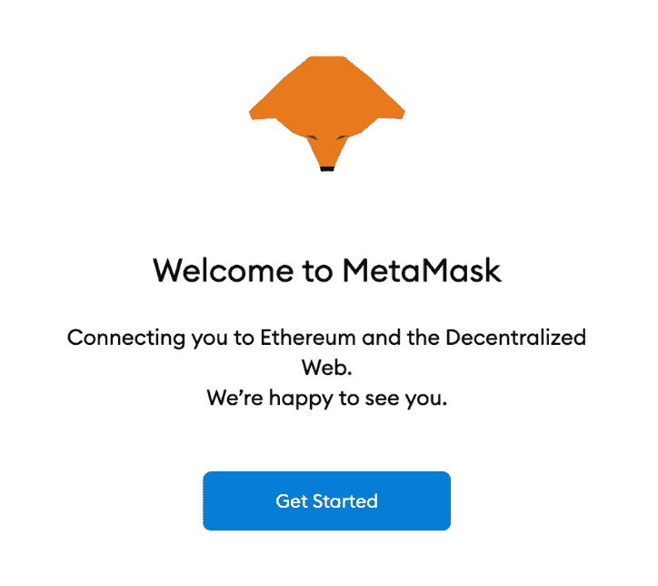
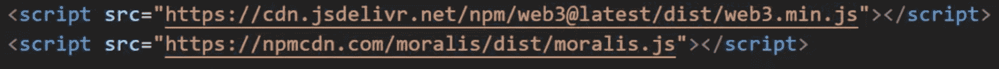
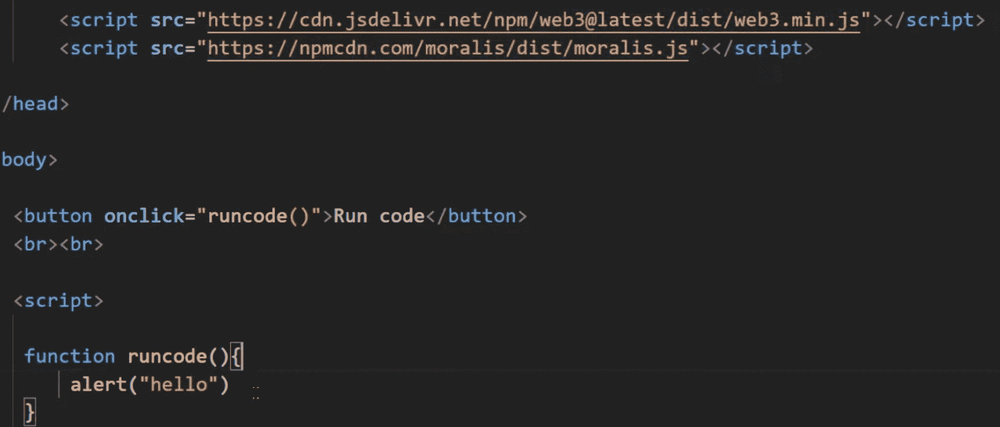
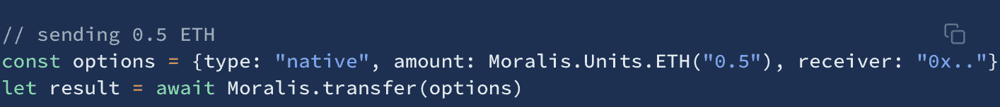
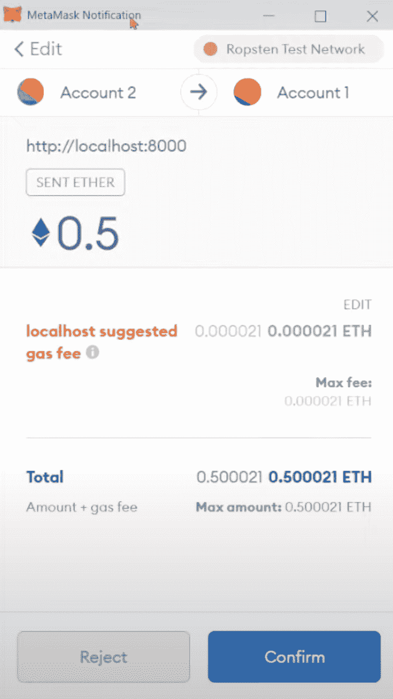

# 如何用一行代码发送 ETH

> 原文：<https://moralis.io/how-to-send-eth-with-one-line-of-code/>

**开发具有转移 ETH 资产功能的** [**dApps**](https://moralis.io/decentralized-applications-explained-what-are-dapps/) **(分散式应用)需要复杂的数据结构和 API。开发这样的结构既费时又费钱，使得发送 ETH 或任何其他加密货币的过程成为一项繁琐的任务。然而，有了合适的工具，就有可能忽略底层结构的开发，允许程序员用更少的努力来实现功能。最好的解决方案是**[**Moralis**](http://moralis.io/)**‘web 3 开发平台，它提供了开发和部署 dApps 所需的一切。因此，在本文中，我们将仔细研究如何使用 Moralis 平台，只用一行代码发送 ETH。**

Moralis 的力量使开发人员只需一行代码就能转移 ETH 资产，这主要是由于已经开发的后端基础设施以及 [Moralis SDK](https://moralis.io/exploring-moralis-sdk-the-ultimate-web3-sdk/) (软件开发工具包)。由于用户可以访问完全托管的基础设施，因此有可能大大减少各种 dApps 的开发时间。

此外，这些平台提供了各种开发工具，供您在整个开发过程中使用。几个例子是[Moralis NFT API](https://moralis.io/announcing-the-moralis-nft-api/) 、[价格 API](https://moralis.io/introducing-the-moralis-price-api/) 、跨链兼容性，以及对 [IPFS](https://moralis.io/what-is-ipfs-interplanetary-file-system/) 的本地支持。此外，Moralis 的博客每天都提供新的文章供你阅读。例如，有关于如何建立一个加密钱包的指南和关于 DuckDAO Moralis 合作的信息。

所以，马上注册 Moralis，我们可以通过仔细研究如何用一行简单的代码发送 ETH 来开始！

### 以太坊和 ETH 是什么？

在本节中，我们将在深入探讨如何转移 ETH 资产的流程之前，对以太坊和 ETH 进行简要概述。以太坊是 dApp 开发的头号区块链，这个生态系统是大量应用程序的宿主。再者，以太坊是第二大加密货币，仅次于比特币巨头。

以太坊基于工作验证(PoW)共识机制。这意味着链中的块是基于谁能找到块的正确散列的试错过程来验证的。这也是比特币使用的相同共识机制。然而，由于以太坊是一个开发链，它被证明在某种程度上是有缺陷的。这种做法的主要缺点是网络拥挤，导致天然气价格高昂，使得网上交易成本高昂。由于从传统的角度来看这是有问题的，以太坊计划随着以太坊 2.0 的推出而改变为利益证明(PoS)机制。然而，即使有这些挫折，以太坊仍然是最突出的发展链，并被广泛使用。

我们在上一段提到了气价，这是以太坊必不可少的概念。每当在链条上进行交易时，都需要支付汽油费。该费用各不相同，但总是以以太坊的本地令牌 ETH 支付。截至目前，one ETH 的当前价格在 3300 美元左右，正如我们提到的，它是市值第二大的加密货币。

# 如何使用 Moralis 用一行代码发送 ETH

从传统的角度来看，增加通过 dApps 直接发送 ETH 的能力是一项相对麻烦的任务。这个过程需要开发复杂的数据结构，开发人员需要找到有效的 API。然而，在主要的 Web3 中间件 Moralis 的帮助下，我们可以完全避免这种情况，并大大缩短这个过程。事实上，我们只需一行代码就可以将此功能添加到我们的任何 dApps 中！

为了展示 Moralis 的威力，我们将在接下来的几节中创建一个简单的 web 应用程序，我们可以用它来转移 ETH 资产。我们将要做的项目将由一个带有导入的 HTML 文件、一个按钮和一个发送 ETH 的简单函数组成。然而，如果你更想看一段解释整个过程的视频，看看下面这段来自 [Moralis 的 YouTube 频道](https://www.youtube.com/channel/UCgWS9Q3P5AxCWyQLT2kQhBw)的视频。在那里，您可以跟随 Ivan 从头开始创建应用程序的过程:

https://www.youtube.com/watch?v=suZYvqrc_Hg&t=207s

此外，在开发应用程序本身之前，我们需要准备好一个元掩码帐户。这样做的主要原因是，您的元掩码帐户将是您发送 ETH 的地址。因此，我们将在下一节开始创建一个全新的元掩码帐户。这进一步意味着我们应用程序的任何用户也需要一个元掩码来利用这个特性。

### 什么是 MetaMask？

因此，测试我们的应用程序的一个必要元素是一个[元掩码](https://moralis.io/metamask-explained-what-is-metamask/)帐户。因此，我们将简要介绍什么是元掩码，以及如何快速创建帐户。

首先，MetaMask 是市场上排名第一的加密钱包，拥有超过一千万的活跃用户。钱包允许用户完全管理他们的资产并执行任务，例如转移、购买和出售代币/硬币。

MetaMask 平台与以太坊高度融合，使这款钱包成为以太坊 dApps 生态系统的门户。这意味着，有了一个 MetaMask 账户，就可以访问区块链以太坊上的 DeFi 平台、DEXes(分散交易所)和加密游戏。因此，元掩码帐户不仅对本教程有好处，对一般的加密也有好处。

建立一个账户相当容易，你需要做的就是从他们的官方网站下载 MetaMask。钱包可以是浏览器的扩展，也可以是手机应用程序；但是，我们建议在本教程中使用扩展。

一旦添加了扩展，您可以简单地点击“开始”按钮，这将为您提供两个选项。这将允许您从头创建一个新的钱包或导入一个已存在的钱包。对于导入选项，您需要现有钱包的种子短语。如果你从头开始创建一个新的，你会收到一个新的种子短语。记住这句话至关重要，因为如果你的手机出了什么问题，这将是你找回钱包的唯一方法。因此，一旦完成了选项的选择，剩下的就是按照 MetaMask 提供的说明进行操作了。

## 如何发送 ETH —创建新项目

现在，您大概已经有了一个 MetaMask 帐户，我们可以继续深入了解如何转移 ETH 资产的流程。正如我们在前面的部分中提到的，我们将创建一个 web 应用程序，我们将向其中添加传输 ETH 的功能。所以，我们要做的第一件事是创建一个新项目和一个 HTML 文件。我们基本上可以随意命名这个文件，但是对于这个示例项目，我们决定将其命名为“index.html”。

在添加允许我们转移 ETH 资产的特性之前，我们需要进行一些导入。因此，让我们通过导入 [Web3](https://moralis.io/the-ultimate-guide-to-web3-what-is-web3/) 和 Moralis 来启动这个过程。这些导入看起来会像这样:

导入 Moralis 和 Web3 后，我们可以继续为我们的网站创建一个按钮。我们称这个按钮为“运行代码”，它会有一个“onclick”事件。这意味着我们可以将一个功能连接到按钮上，一旦它被点击，这个功能就会被触发。在本例中，我们将运行函数“runcode()”。因此，在我们的文件中实现了导入、按钮和函数后，它看起来会像这样:

## 如何发送 ETH —创建函数

查看上一节中的最终图像，可以看到该函数只打印“hello”。这意味着我们的应用程序现在做不了多少事情。但是，我们将为该函数添加一些逻辑，使我们能够转移 ETH 资产。

我们要做的第一件事是导航到 [Moralis 文档](https://docs.moralis.io/moralis-server/sending-assets?utm_source=blog&utm_medium=post&utm_campaign=Want%2520the%2520Latest%2520in%2520%253Cspan%253EBlockchain%2520Development%253F%253C%252Fspan%253E)。在那里你可以找到关于[如何发送 ERC-20 代币](https://moralis.io/how-to-send-erc-20-tokens/)、[如何转移非正规货币](https://moralis.io/how-to-transfer-nfts-with-one-line-of-code/)等信息。但是，对于本教程，您需要查找的标题是发送本机资产的标题。直接来自文档的代码如下所示:

上面代码片段中最关键的一行是绝对的最后一行。这是 Moralis 传递函数，实际上就是这一行允许我们发送 ETH。但是，您可能已经注意到，在调用这个函数时，传递了一个“选项”形式的参数。因此，我们做的第一件事是创建一个新的“选项”对象并添加一些属性。

我们声明的第一件事是我们想要发送的令牌的类型。从片段中可以看出，类型等于“native”。这正是我们想要的，因为我们计划发送以太坊的本地令牌:ETH。在这之后，我们利用一个助手函数，该函数允许我们指定想要发送的金额，而不必在 Wei 中输入数字。为了最终确定代码，我们需要添加的只是我们希望将令牌发送到的地址。指定了所有属性后，我们现在在调用“Moralis.transfer()”函数时将对象作为参数传递。

### 使用 Web 应用程序

现在所有的代码都已完成，我们可以通过测试应用程序来确保一切正常。一旦应用程序启动，将显示的只是一个写着“运行代码”的按钮，这是我们之前指定的。要启动应用程序，用户只需单击按钮，就会执行“runcode()”函数。这将创建“选项”对象，并在调用传递函数时将其作为参数传递。

一旦该函数触发，用户将从他们的元掩码扩展中收到一个弹出窗口。这将提供有关转让的具体细节。因此，用户能够看到交易金额以及燃气费。这是用户看到的样子:

需要注意的是，每一笔交易都要缴纳燃气费，就像以太坊区块链上的所有交易一样。此外，跟踪该信息可能是有趣的，因为在某些情况下，天然气价格可能在相对较宽的区间内波动。

一旦你确认交易通过，你就大功告成了！如果应用程序按预期工作，那么您就创建了自己的 web 应用程序，只需一行代码就可以进行 ETH 交易！

## 如何发送 ETH —摘要

通过 MetaMask 或[比特币基地](https://www.coinbase.com/)等平台，发送 ETH 或任何其他令牌是一项相对容易的任务。然而，这些平台基于复杂的后端基础设施，允许这种类型的功能。至少从传统的角度来看，将这种功能添加到我们自己的应用程序中是一件很有问题的工作。其主要原因是该特性通常需要复杂的数据结构才能正常工作。然而，我们现在可以通过简单地利用 Moralis 来避免这个过程，这将允许我们用一行代码发送 ETH。

Moralis 是 Web3 开发的头号中间件，该平台带有一个已经托管的后端基础设施。这允许用户利用“开箱即用”的功能。为此，我们能够在本教程中创建一个简单的应用程序，允许用户用一行代码转移 ETH 资产。所需要的只是一些导入、一个按钮和 Moralis 传递函数。

然而，这只是 Moralis 平台派上用场的众多实例之一。该平台提供了一系列有助于整个区块链开发的开发工具。一个例子是 [Moralis Speedy Nodes](https://moralis.io/speedy-nodes/?utm_source=blog&utm_medium=post&utm_campaign=Want%2520the%2520Latest%2520in%2520%253Cspan%253EBlockchain%2520Development%253F%253C%252Fspan%253E) ，它提供了一些目前可用的最快、最可靠的节点。此外，如果你对开发 dapp 感兴趣，那么看看下面这篇来自 [Moralis 博客](https://moralis.io/blog/)的文章，解释如何构建 ETH dapp:“[如何快速构建 ETH dapp](https://moralis.io/how-to-build-eth-dapps-quickly/)”。

所以，如果你想成为一名开发者，那么[马上加入 Moralis】！注册该平台是完全免费的，你将获得后端基础设施和该平台非常有用的工具。](https://admin.moralis.io/register?utm_source=blog&utm_medium=post&utm_campaign=Want%2520the%2520Latest%2520in%2520%253Cspan%253EBlockchain%2520Development%253F%253C%252Fspan%253E)