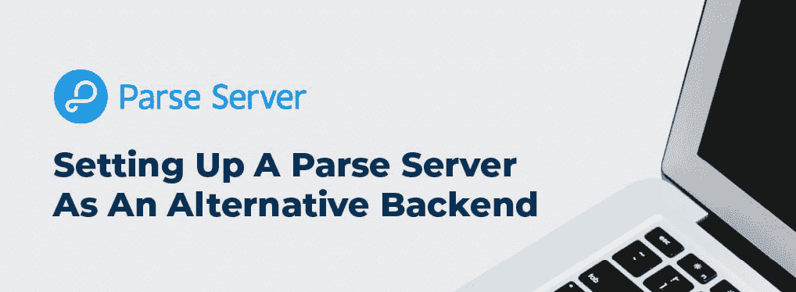
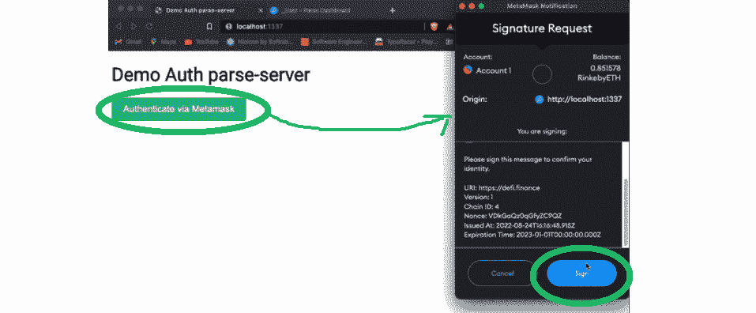
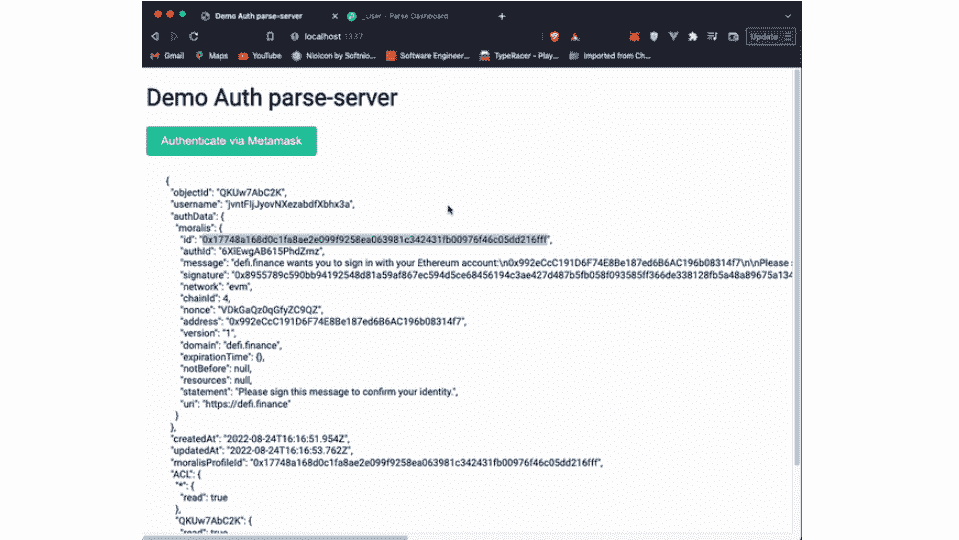
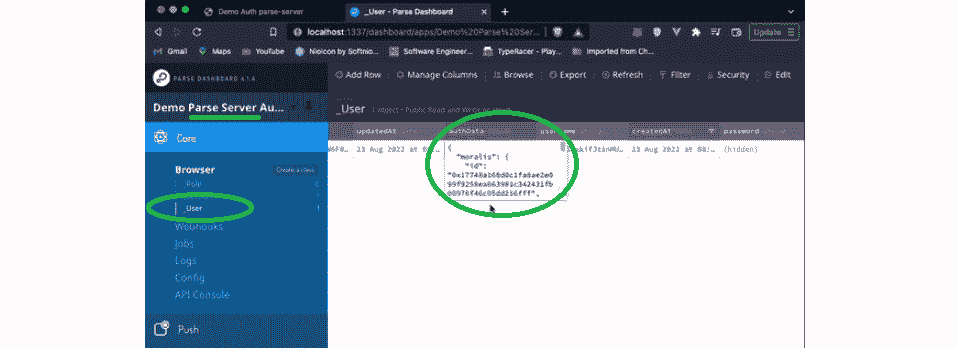
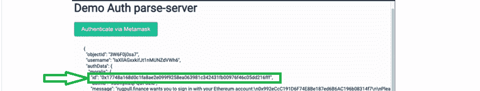
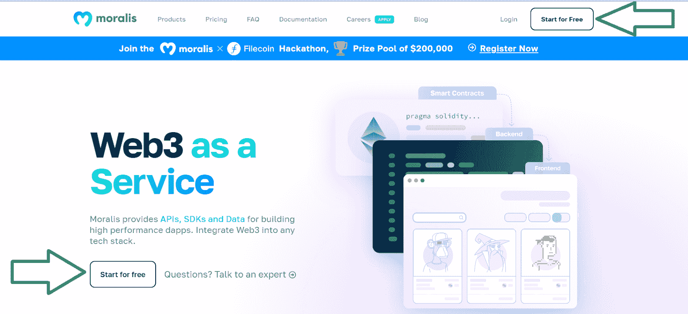
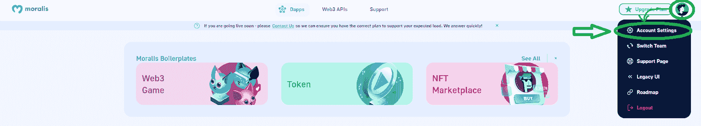
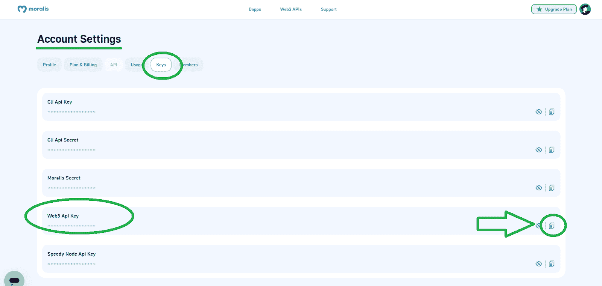
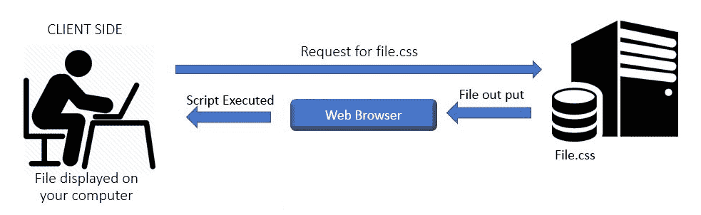

# 如何设置自托管解析服务器

> 原文：<https://moralis.io/how-to-set-up-a-self-hosted-parse-server/>

**如果你已经使用了** [**Moralis**](https://moralis.io/) **一段时间，那么你知道向 Moralis 2.0 的过渡正在使 Moralis 服务器过时。相反，Moralis 正在引入对自托管服务器的支持。因此，devs 现在可以建立一个自托管的解析服务器，并使用 Moralis。此外，本文还演示了如何毫不费力地设置自托管解析服务器。随着本文的深入，我们将首先设置一个解析服务器来开始这篇文章。然后，我们将设置服务器的仪表板来访问数据库。最后，我们还将把 Moralis** [**Web3 认证**](https://moralis.io/authentication/) **与自托管解析服务器集成在一起。尽管如此，我们也知道有些人不知道什么是解析服务器。因此，我们将从解决基础问题开始讨论！**

Moralis 是最终的 [Web3](https://moralis.io/the-ultimate-guide-to-web3-what-is-web3/) 开发平台。2022 年 8 月，这个令人难以置信的工具发布了其更新版本，主要关注三个核心 Web3 功能。这包括 Web3 认证、 [Web3 同步](https://moralis.io/syncs/)和 Web3 APIs。此外，一个免费的 Moralis 帐户是你需要利用所有这三个功能。此外，Moralis 继续致力于跨链互操作性，该平台已经支持大多数领先的可编程区块链，并不断添加新的知名链。此外，Moralis 甚至加倍了它的跨平台互操作性。因此，它现在使您能够使用任何遗留开发平台来添加 Web3 功能。因此，创建 dapps 从未如此简单。说到容易，建立一个自托管的解析服务器并将其与 Moralis 集成也不是什么难事。只需[创建你的免费 Moralis 账户](https://admin.moralis.io/register)并跟随我们的脚步。



## 什么是解析服务器？

Parse 是 Parse Server 的创始人，Parse Server 是一个开源的后端即服务框架。它可以部署到任何能够运行 NodeJS 的基础设施上。您可以在自己的基础设施中轻松部署和运行解析服务器。因此，您可以使用 NodeJS 在本地开发和测试应用程序。而且 Parse Server 使用 MongoDB 或者 PostgreSQL 作为数据库。

除了本地访问 Parse Server，您还可以将它部署到云服务提供商，从任何地方访问它，并使您的应用程序可以公开访问。但是，在公开访问解析服务器之前，必须正确地修改它的配置。要了解更多细节，请确保更深入地阅读解析服务器文档。


### 什么是自托管服务器？

为了让您完全理解“自托管解析服务器”的含义，让我们看看什么是自托管服务器。简而言之，“自我托管”是一个形容词，来源于自我托管的活动。后者指的是拥有和管理自己的服务器，通常是在家里。这意味着托管你的个人数据和服务，而不是依赖第三方。此外，自托管服务器通常用于托管和管理应用程序。因此，自托管解析服务器是您在本地托管的解析服务器。

# 如何设置自托管解析服务器以利用 Moralis

现在您已经知道了什么是自托管解析服务器，让我们来关注本教程。正如在简介中提到的，我们将向您展示如何设置 Parse Server，它的仪表板来访问数据库，以及如何集成 Moralis 的 Web3 Auth API。通过本教程，您将能够构建一个简单的示例 dapp。后者将能够使用元掩码对用户进行身份验证。而且，这里有一张这个演示 dapp 的截图:



从上图可以看出，我们的示例 dapp 包括“演示验证解析-服务器”标题和“通过元掩码验证”按钮。当用户点击该按钮时，后端代码会提示用户的元掩码扩展和我们的签名请求。因此，用户必须点击“Sign”按钮来完成他们的 Web3 登录。此外，一旦通过身份验证，用户就可以看到他们钱包的详细信息:



正如上面的截图所示，我们的 dapp 只专注于提供功能。因此，我们没有创建一个简洁的 UI 来显示细节或者以一种独特的方式利用链上数据。我们让您来探索这些可能性。毕竟，本教程的主要目标是帮助您设置一个自托管的解析服务器，它包括一个为用户登录建立索引的数据库:



如果您看一下我们的演示 dapp 的截图，您会看到 ID 与示例用户相匹配:



希望上述功能能给你留下深刻印象。如果是这样，您可能渴望建立一个自托管的解析服务器并实现 Moralis 的 Web3 Auth API。所以，让我们卷起袖子开始吧。尽管如此，值得指出的是，我们将使用 Express 进行构建，这是一个用于 NodeJS 的 web 框架。

## 设置自托管解析服务器

首先，您需要安装解析服务器包。为此，使用" *yarn add parse-server* "命令。然后，您需要初始化您的解析服务器。因此，创建“parseServer.ts”文件并添加以下代码行:

```js
import { ParseServer } from 'parse-server';

export const parseServer = new ParseServer({
  databaseURI: config.DATABASE_URI, // Connection string for your MongoDB database
  cloud: config.CLOUD_PATH, // Absolute path to your Cloud Code
  appId: config.APPLICATION_ID, // Application ID
  masterKey: config.MASTER_KEY, // Master key
  serverURL: config.SERVER_URL, // Server URL
});
```

既然您已经初始化了自托管解析服务器，现在是时候设置服务器的仪表板了。此外，后者将使您能够访问您的数据库。


## 设置自托管解析服务器的仪表板

如上所述，如果您想要访问数据库，您必须设置一个仪表板。因此，使用" *yarn add parse-dashboard* "命令。此外，就像您使用解析服务器一样，您需要按照相同的步骤初始化您的仪表板。因此，创建“parseDashboard.ts”文件并粘贴以下代码行:

```js
import ParseDashboard from 'parse-dashboard';

export const parseDashboard = new ParseDashboard({
  apps: [
    {
      appId: config.APPLICATION_ID, // Server Application ID
      masterKey: config.MASTER_KEY, // Server Master Key
      serverURL: config.SERVER_URL, // Server URL
      appName: config.APP_NAME, // Application Name
    },
  ],
});
```

有了自己托管的 Parse 服务器及其仪表板，就可以集成 Moralis Web3 身份验证了。

## 将 Moralis Web3 Auth 与解析服务器集成

现在，您将学习如何集成 Moralis Web3 Auth API。此外，在本节中，您的目标是能够使用元掩码对用户进行身份验证。您还希望您的自托管解析服务器能够索引经过身份验证的用户，如上所述。此外，由于 Moralis Web3 Auth API 的强大和简单，您将完全不必担心您的 Web3 身份验证流程。此外，您将利用 Parse Server 的 0Auth 支持来创建您的自定义身份验证。

要开始集成过程，首先使用" *yarn add moralis* "命令安装 Moralis SDK。接下来，用以下代码行初始化 Moralis:

```js
import Moralis from 'moralis';

Moralis.start({
  apiKey: 'your_api_key_here',
});
```

当然，您必须将“ *your-api-key_here* ”替换为您实际的 Moralis Web3 API 密钥。

#### 获取您的 Moralis Web3 API 密钥

为了获得您的 Moralis Web3 API 密钥，您必须首先创建您的免费 Moralis 帐户。因此，请使用开头所述的“创建您的免费 Moralis 账户”或访问 Moralis 主页。此外，如果您决定访问主页，您会看到“免费开始”按钮，如下所示:



在下一页，您需要输入您的凭据。此外，不要忘记点击确认链接来确认您的帐户，该链接将发送到您的电子邮件收件箱。因此，创建了您的帐户后，您将可以访问您的 Moralis 管理区(见下图)。此外，您需要点击右上角的个人资料图标。此外，从下拉菜单中选择“帐户设置”选项:



在“帐户设置”页面上，单击“密钥”选项卡。最后，您可以使用“Web3 API 密钥”旁边的“复制”图标来复制您的 Moralis Web3 API 密钥:



现在用您的密钥替换“ *your-api-key_here* ”。

### 创建您的身份验证适配器

因此，安装并启动了 Moralis SDK 之后，您必须创建自己的身份验证适配器。此外，后者将结合 Moralis Web3 Auth API 来验证身份验证请求。相应地，创建“MoralisAuthAdapter.ts”文件，并用以下代码行填充它:

```js
function validateAuthData(authData: any) {
  const { message, signature, network, id, authId } = authData;

  return Moralis.Auth.verify({
    message,
    signature,
    network,
  })
    .then((result) => {
      const data = result.toJSON();

      if (id === data.profileId && authId === data.id) {
        authData.chainId = result.result.chain.decimal;
        authData.nonce = data.nonce;
        authData.address = result.result.address.checksum;
        authData.version = data.version;
        authData.domain = data.domain;
        authData.expirationTime = data.expirationTime;
        authData.notBefore = data.notBefore;
        authData.resources = data.resources;
        authData.statement = data.statement;
        authData.uri = data.uri;
        return;
      }

      throw new Parse.Error(Parse.Error.OBJECT_NOT_FOUND, 'Moralis auth failed, invalid data');
    })
    .catch(() => {
      throw new Parse.Error(Parse.Error.OBJECT_NOT_FOUND, 'Moralis auth failed, invalid data');
    });
}

function validateAppId() {
  return Promise.resolve();
}

export default {
  validateAuthData,
  validateAppId,
};
```

此外，为了正确设置您的身份验证适配器，您需要将它添加到您的自托管解析服务器初始化器中。因此，相应地更新您的“parseServer.ts”文件:

```js
import { ParseServer } from 'parse-server';
import MoralisAuthAdapter from './auth/MoralisAuthAdapter';

export const parseServer = new ParseServer({
  databaseURI: config.DATABASE_URI,
  cloud: config.CLOUD_PATH,
  appId: config.APPLICATION_ID,
  masterKey: config.MASTER_KEY,
  serverURL: config.SERVER_URL,
  auth: {
    moralis: {
      module: MoralisAuthAdapter,
    },
  },
});
```

注意:为了避免混淆，我们建议您听从我们的指示。因此，将您的身份验证适配器命名为“moralis”。

### 创建您的身份验证服务

有了身份验证适配器，还需要创建身份验证服务。此外，后者将负责向解析服务器请求消息和验证。因此，创建“authService.ts”文件，并用以下代码行填充它:

```js
import Moralis from 'moralis';
import { authRequests } from '../store';
import { ParseServerRequest } from '../utils/ParseServerRequest';

export async function requestMessage({ address, chain, network }: { address: string; chain: string; network: 'evm' }) {
  const result = await Moralis.Auth.requestMessage({
    address,
    chain,
    network,
    domain: 'defi.finance',
    statement: 'Please sign this message to confirm your identity.',
    uri: 'https://defi.finance',
    expirationTime: '2023-01-01T00:00:00.000Z',
    timeout: 15,
  });

  const { message, id, profileId } = result.toJSON();
  authRequests.set(message, { id, profileId });

  return message;
}

export async function verifyMessage({ network, signature, message }) {
  const storedData = authRequests.get(message);

  if (!storedData) {
    throw new Error('Invalid message');
  }

  const { id: storedId, profileId: storedProfileId } = storedData;

  const authData = {
    id: storedProfileId,
    authId: storedId,
    message,
    signature,
    network,
  };

  // Authenticate
  const user = await serverRequest.post({
    endpoint: `/users`,
    params: {
      authData: {
        moralis: authData,
      },
    },
    useMasterKey: true,
  });

  // Update user moralisProfile column
  await serverRequest.put({
    endpoint: `/users/${user.objectId}`,
    params: {
      moralisProfileId: storedProfileId,
    },
    useMasterKey: true,
  });

  // Get authenticated user
  const updatedUser = await serverRequest.get({
    endpoint: `/users/${user.objectId}`,
    useMasterKey: true,
  });

  return updatedUser;
}
```

#### “*请求消息*和“*验证消息*功能

上面的代码包括导出两个重要的函数:“ *requestMessage* 和“ *verifyMessage* ”。此外，前者允许您利用 Moralis Web3 Auth API 来请求认证消息。因此，这给了你一个向用户发送消息的机会。此外，他们然后使用他们的 Web3 钱包(例如元掩码)来签署该消息。此外，“ *requestMessage* ”函数存储“ *id* ”和“ *profileId* ”，这是您在验证消息时将使用的细节。

另一方面，“ *verifyMessage* ”函数检索存储的“ *id* ”和“ *profileId* ”值，并准备“ *authData* ”。后者将用于上面创建的" *moralis* "身份验证适配器。

### 使用 Express 将所有东西放在一起

这些代码行将所有这些联系在一起，以便您的后端正常运行:

```js
import Moralis from 'moralis';
import express from 'express';
import cors from 'cors';
import { parseDashboard } from './parseDashboard';
import { parseServer } from './parseServer';
import { errorHandler } from './middlewares/errorHandler';
import config from './config';

const app = express();

Moralis.start({
  apiKey: config.MORALIS_API_KEY,
});

app.use(express.urlencoded({ extended: true }));
app.use(express.json());

app.use(cors());

app.use('/server', parseServer);
app.use('/dashboard', parseDashboard);
app.use(errorHandler);

app.use(express.static('public'));

app.listen(config.PORT, () => {
  console.log(`${config.APP_NAME} is running on port ${config.PORT}`);
});
```

但是，如果您想要创建前面提到的示例身份验证 dapp，您还需要客户端。



### 创建您的前端

因此，在这一点上，是时候创建你的前端。因此，为了确保前端的所有功能都正常，您需要从添加" *ethers* 和" *axios* 依赖关系开始:

```js
<script src="https://cdn.jsdelivr.net/npm/axios/dist/axios.min.js"></script>
<script src="https://cdn.ethers.io/lib/ethers-5.2.umd.min.js" type="application/javascript"></script>
```

此外，您需要适当的代码行来检索关于用户钱包的基本信息。由于我们决定使用元掩码，下面的方法可以解决这个问题:

```js
const connectToMetamask = async () => {
  const provider = new ethers.providers.Web3Provider(window.ethereum, 'any');

  const [accounts, chainId] = await Promise.all([
    provider.send('eth_requestAccounts', []),
    provider.send('eth_chainId', []),
  ]);

  const signer = provider.getSigner();
  return { signer, chain: chainId, account: accounts[0] };
};
```

因此，随着拼图的最后一块就位，您已经做好了用自己托管的解析服务器对用户进行身份验证的一切准备。此外，这是身份验证流程遵循的模式:

1.  读取用户钱包的基本信息。
2.  您的后端函数生成一条需要用户签名的消息。
3.  用户利用元掩码对消息进行签名。
4.  该代码将签名的消息发送到" *verifyMessage* "后端函数，该函数通过解析服务器进行验证和认证。

此外，这是包括上述认证流程的功能:

```js
const handleAuth = async () => {
  // Connect to Metamask
  const { signer, chain, account } = await connectToMetamask();

  if (!account) {
    throw new Error('No account found');
  }
  if (!chain) {
    throw new Error('No chain found');
  }

  const { message } = await requestMessage(account, chain);

  const signature = await signer.signMessage(message);

  const { user } = await verifyMessage(message, signature);

  renderUser(user);
};
```

尽管如此，我们还是希望您可以随意使用整个代码。因此，我们在 [GitHub](https://github.com/MoralisWeb3/Moralis-JS-SDK/blob/main/demos/parse-server/src/auth/authController.ts) 上提供了与示例项目相关的全部代码。探索它，克隆它，使用它！

## 如何设置自托管解析服务器——摘要

在这篇文章中，我们讨论了相当多的内容。我们首先确保大家都知道什么是自托管解析服务器。然后，我们向您展示了如何设置它。您还了解了如何设置解析服务器的仪表板。我们还通过演示如何将 Web3 身份验证与解析服务器集成来增加趣味。此外，这是您使用 Moralis 的能力并创建自己的身份验证适配器和身份验证服务的地方。最后，您使用 Express 将后端连接在一起。最后但同样重要的是，您还创建了一个简单的前端来实际利用新的自托管解析服务器。因此，您现在知道了如何设置解析服务器，以及如何将这个优秀的工具用于 Moralis。因此，你已经准备好开始创造一些杀手 dapps。

然而，如果这是你第一次使用 Web3 开发，我们建议你花些时间练习。因此，这就是[Moralis 博客](https://moralis.io/blog/)和[Moralis YouTube 频道](https://www.youtube.com/c/MoralisWeb3)简化事情的地方。此外，这两个商店都有无数的教程。简而言之，他们可以教你如何用简单的方法创建各种 dapps。此外，在这个过程中，您还将学习如何最大限度地利用 Moralis 并节省大量开发时间。此外，不要忘记探索[Moralis 文件](https://docs.moralis.io/docs/why-moralis)，这是一个很好的起点。

另一方面，你可能有兴趣尽快成为全职加密员。如果是这样，一定要考虑报名参加[Moralis 学院](https://academy.moralis.io/)。除了顶级的加密开发课程，Moralis 学院是会见一些了不起的 Web3 开发者和企业家的地方。尽管如此，在这里你可以得到专家的指导，轻松克服任何挑战。