# 如何设置自托管的 Web3 服务器

> 原文：<https://moralis.io/how-to-set-up-a-self-hosted-web3-server/>

如果你已经使用 [**Moralis 利斯**](https://moralis.io/) **很长一段时间，你可能已经运行了一个 Moralis 利斯服务器。随着我们过渡到 Moralis 2.0，该功能不再可用，但您现在可以设置一个自托管的 Web3 服务器。这使您可以访问同样强大的 Moralis 功能，并轻松访问 Moralis 的 Web3 APIs。在这里，我们向您展示了如何完成这一点的确切过程，并将您的服务器连接到 Moralis。此外，通过自托管的 Web3 服务器，您可以完全控制后端、数据和数据库。此外，你可以微调你的主机，以减少托管成本。此外，Web3 的自托管服务器使您能够调整任何客户代码、插件和包，提供更好的开发人员体验。**

因此，如果您有兴趣为您的 Moralis 服务器建立一个自托管的替代品，请继续阅读！为了让这个过程尽可能的简单明了，我们还准备了几个代码库。因此，随着我们的发展，您可以通过克隆我们的代码或从 GitHub 下载合适的 ZIP 文件来节省大量时间。我们还将利用一些优秀的工具来完成今天的挑战。除了 Moralis，您还将使用 MongoDB、Redis 和 Heroku。因此，您将能够获得您的 Mongo 数据库，设置您的连接字符串，并将您的服务器部署到生产环境中。简而言之，设置一个自托管的 Web3 服务器大约需要 20 分钟。

也就是说，如果您刚刚开始使用 Moralis 或者希望迁移您的 Moralis 数据库，您可以使用今天的文章。我们将一步一步带你完成这个过程。在这篇文章的底部，我们还有一个简洁的视频教程等着你，让你更清楚地了解如何为 Web3 设置一个自托管服务器！

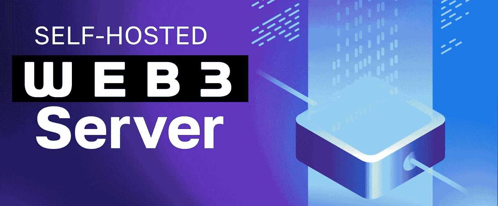

## 通过在本地运行 Parse Server 来设置自托管的 Web3 服务器

设置自托管 Web3 服务器的第一步需要您在本地运行一个解析服务器。为此，您必须安装 NodeJS 的兼容版本(v16 或更高版本)。你还需要准备好一个包管理器——要么是 *npm* 要么是 *yarn* 。接下来，我们将使用后者。

接下来，下载"[migration-demo-parse-server](https://moralisweb3.github.io/Moralis-JS-SDK/demos/parse-server-migration/parse-server-migration.zip)"项目的 ZIP 文件。然后，解压缩文件并在 Visual Studio 代码(VSC)中打开它。接下来，您希望使用“ *yarn install* ”命令安装所有依赖项:

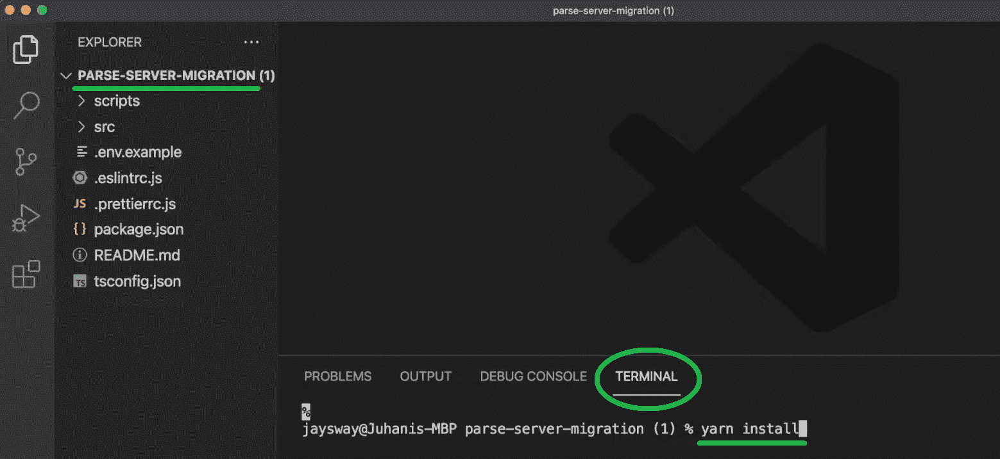

在依赖项安装过程中，打开“. env.example”文件。首先将该文件重命名为"。env”。此外，在文件内部，您将看到几个重要的环境变量。因此，您需要获得它们的值:

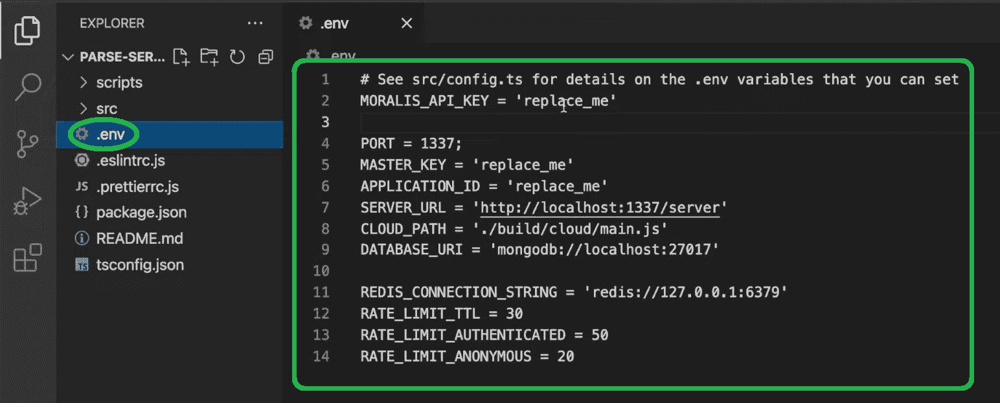

查看上面的截图，您可以看到第一个变量是您的 Moralis Web3 API 密钥。要获取该密钥，请登录您的 Moralis 仪表板，并在侧边菜单中选择“Web3 APIs”选项:

保持端口值不变。至于主密钥，你可以自己设置(确保它是安全的)。您可以跟随我们的脚步，使用“ *001* ”作为您的应用 ID。关于服务器 URL，您现在可以使用本地服务器。但是，一旦我们进入生产阶段，您将使用不同的 URL。此外，一旦构建了项目，您将生成云路径。此外，为了生成您的数据库 URI，您将使用您的 MongoDB 帐户。

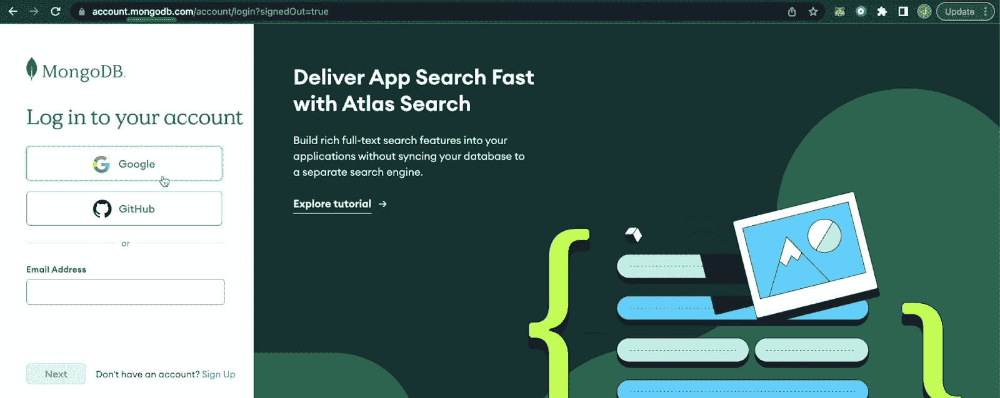

### 使用 MongoDB 生成您的数据库 URI

如果您没有 MongoDB 帐户，现在就创建一个。然后，完成初始设置，包括集群设置。在此基础上，您将会看到这样的内容:

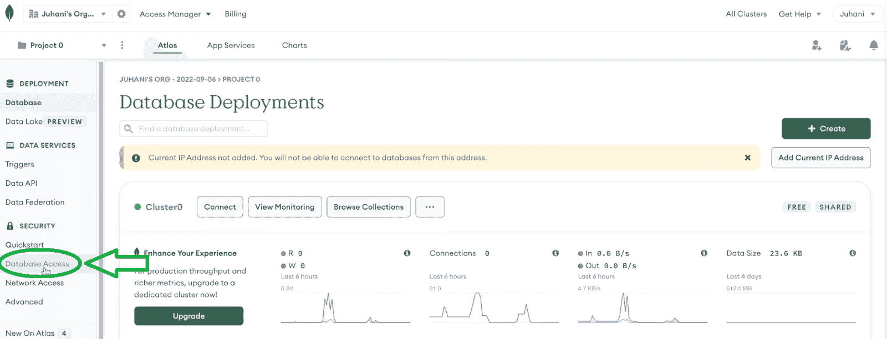

此外，如上图所示，您必须点击侧边栏中的“数据库访问”选项。在“数据库访问”页面上，使用“密码”身份验证方法添加一个新的数据库用户。然后，输入您的用户名并创建您的密码:

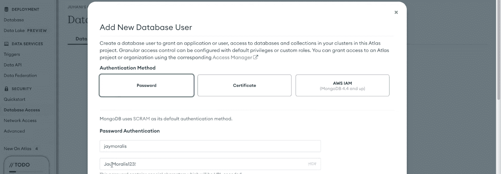

另外，不要忘记给这个用户“读”和“写”的角色。然后，点击“添加用户”按钮:

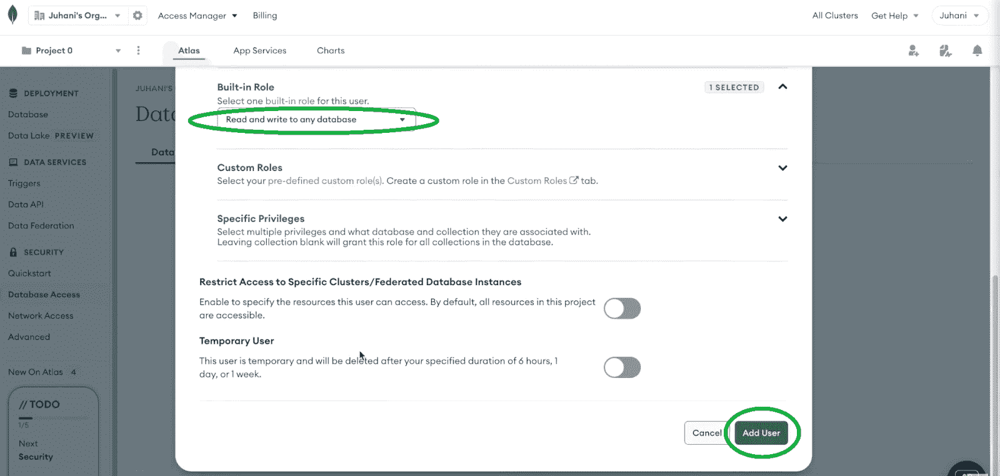

新用户就位后，转到“网络访问”页面并添加 IP 地址:

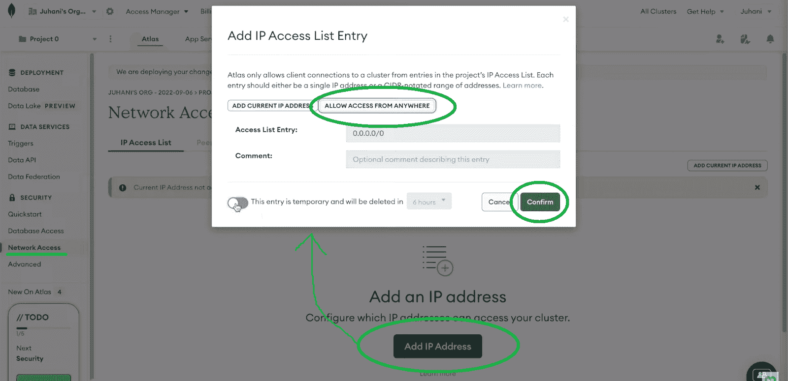

正如你在上面的截图中看到的，你可以允许从任何地方访问。接下来，转到“数据库部署”页面，使用“连接”选项:

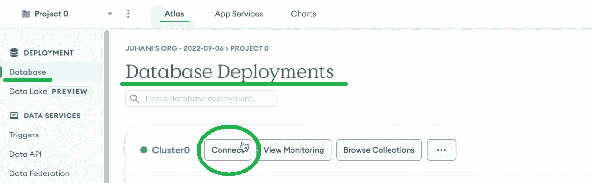

然后，选择“连接您的应用程序”选项:

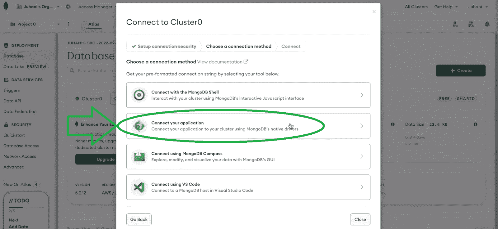

最后，您将能够复制您的数据库 URI:

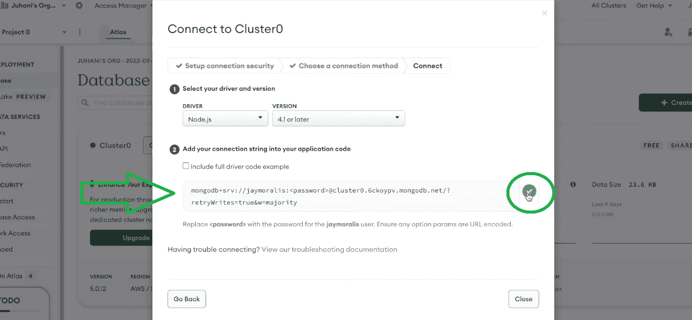

然后，回到你的”。env”文件并将上面复制的 URI 粘贴到指定区域:

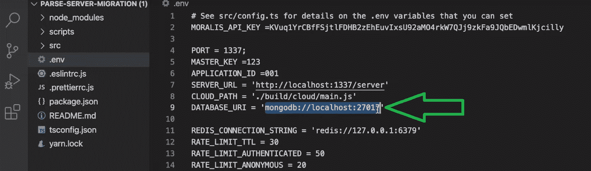

有了 MongoDB URI，您还必须调整 URI。首先，用您的实际密码替换“ *<密码>* ”，并添加您的数据库名称(例如*解析*):

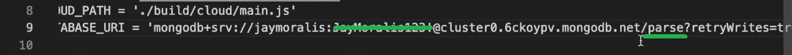

您的自托管 Web3 服务器的初始设置已经完成了一半以上。接下来，你需要获得你的 Redis URI。

### 获得你的 Redis URI

“看着你。env”文件，可以看到“ *REDIS_CONNECTION_STRING* 是下一个变量。因此，请务必访问 Redis 企业云页面，并单击“免费试用”按钮:

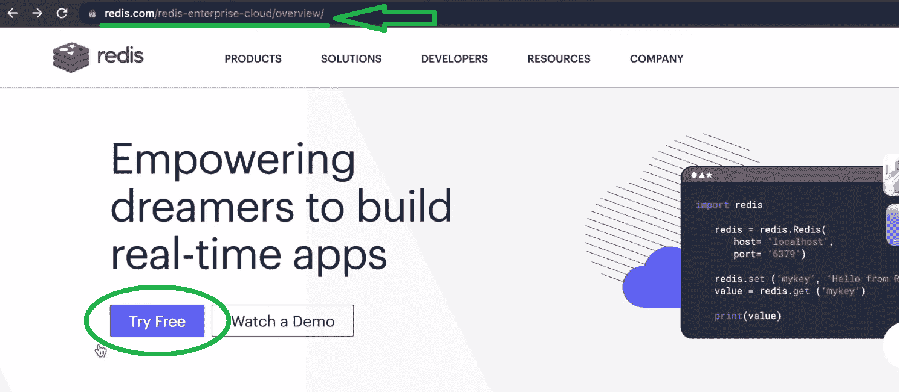

完成初始设置后，您很可能会创建自己的数据库。但是，如果您还没有，请在您的仪表板中操作一次:

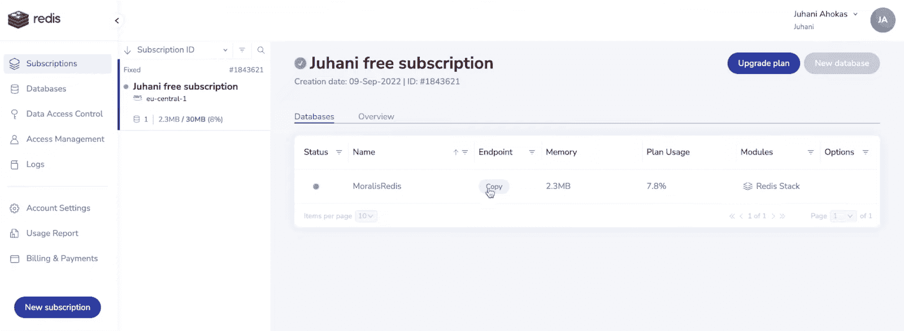

接下来，转到“数据访问控制”页面，选择“角色”选项卡，然后单击“添加新角色”按钮:

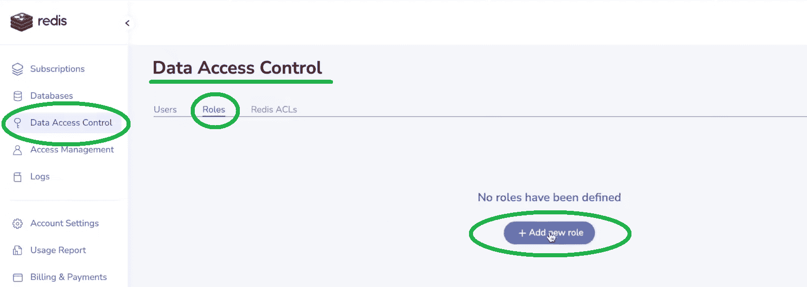

在“创建新角色”窗口中，输入该角色的名称并选择您的订阅(创建 Redis 数据库时创建的订阅)。此外，请确保授予该角色完全访问权限。另外，请记住保存更改并保存您的新角色:

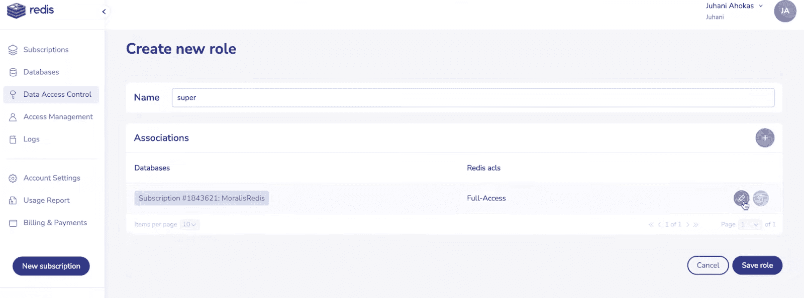

新角色就位后，您可以使用“数据访问控制”页面的“用户”选项卡来创建新用户。角色应该与上面创建的角色相匹配(例如，超级)；因此，您需要提供用户名和密码:

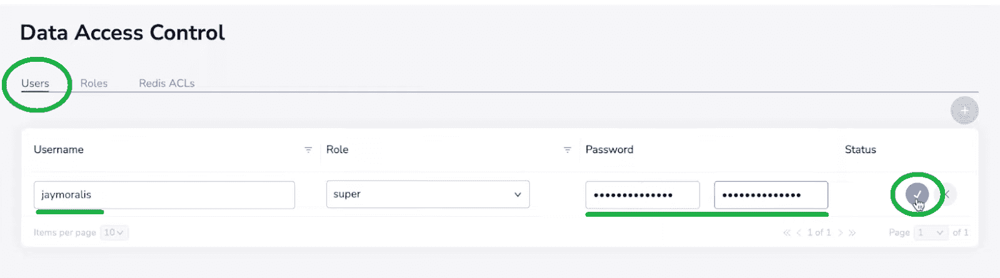

一旦上述用户准备就绪，您就可以从“数据库”页面复制您的端点:

复制完端点后，返回 VSC，将其粘贴到" *REDIS_CONNECTION_STRING* "值下，保留" *redis://* "不变:

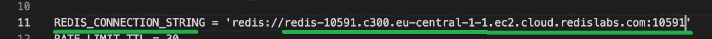

接下来，在字符串的开头添加您的 Redis 用户的用户名和密码，后跟“ *@* ”:

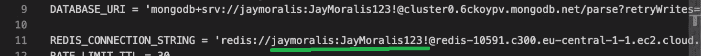

*注意:我们在 MongoDB 和 Redis 中使用了相同的用户名和密码。*

### 在本地运行自托管的 Web3 服务器

至于" *RATE* "变量，您可以使用默认值。此外，您可以使用您的终端并输入“*纱线构建*”命令，这将创建“构建”文件夹。接下来，使用“ *yarn dev* ”命令来获得后端解析服务器的开发服务器:

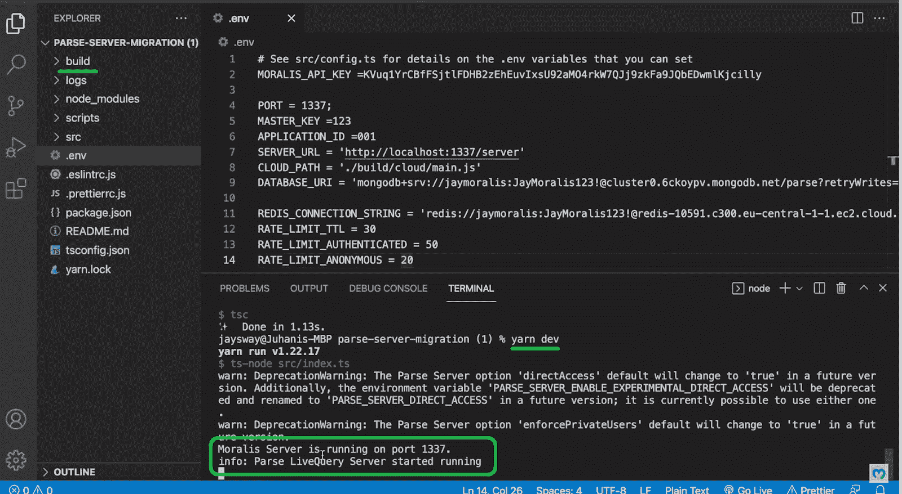

现在，您可以使用浏览器转到“localhost:1337/server”:

上述错误表明服务器已经启动并正在运行。因此，您可以继续创建一个客户端，在那里您可以调用服务器并访问 Moralis。

## 设置和运行客户端

当您的自托管 Web3 服务器在本地运行时，您必须设置并运行一个客户端。通过使用我们的"[parse-server-migration-react-client](https://moralisweb3.github.io/Moralis-JS-SDK/demos/parse-server-migration-react-client/parse-server-migration-react-client.zip)"项目，您可以节省一些时间。因此，从 GitHub 下载 ZIP 文件，解压缩，并在 VSC 打开项目。然后，将“. env.example”文件重命名为“”。env "并打开它:

如果你熟悉使用 Moralis 1.0 创建 dapp，你应该知道你必须获得你的应用 ID 和服务器 URL。但是，由于您在上面创建了自己的本地服务器，因此您可以使用该服务器的详细信息。因此，利用上一节中使用的值:

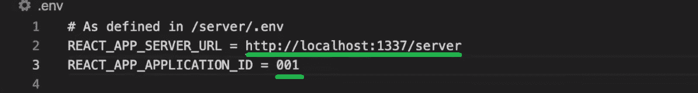

接下来，使用“ *yarn install* ”命令安装所有依赖项。然后，您可以使用“ *yarn start* 命令在本地运行该项目。因此，您应该能够在浏览器中看到这个样板 dapp。因此，你可以使用它已经内置的 [Web3 认证](https://moralis.io/authentication/):

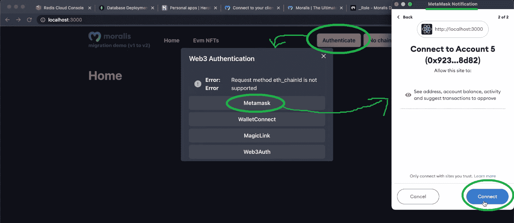

一旦您将钱包连接到 dapp，您就可以使用“EVM NFTs”选项。通过这样做，您可以探索不同链上的 NFT:

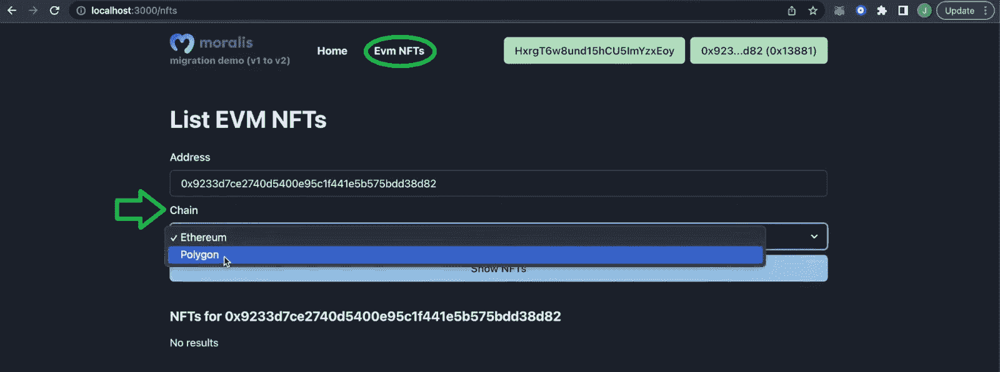

如果钱包中有实际的 NFT，dapp 将在您点击“显示 NFT”按钮后显示它们:

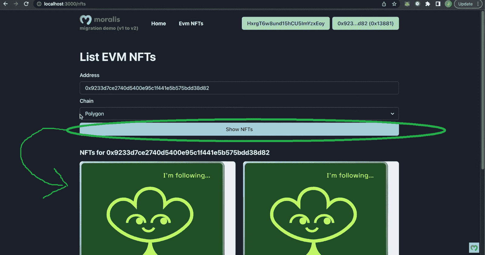

要浏览“NftGrid.tsx”文件，请使用下面的视频，从 10:55 开始。在这里，您可以看到 Moralis Web3 API 如何与您的自托管 Web3 服务器一起工作。本质上，该代码遵循了与 Moralis 服务器相同的原则。

### 写入 MongoDB 的示例

现在，您已经拥有了自托管的 Web3 服务器和本地运行的示例 dapp，您可以使用这些功能了。例如，您可以在“Home.tsx”脚本中添加特定的代码行来写入 MongoDB (11:28)。首先，您需要从“ *react-moralis* ”中导入“ *useMoralis* ”。然后，添加一个简单的函数，将一个示例对象添加到数据库中:

最后，您还想添加一个按钮，使您能够调用上面的示例函数:

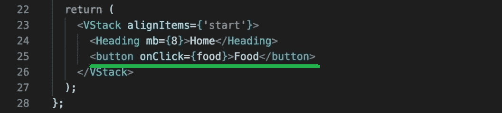

如果您现在使用“ *yarn start* ”命令重启 dapp，您应该会看到“Food”按钮:

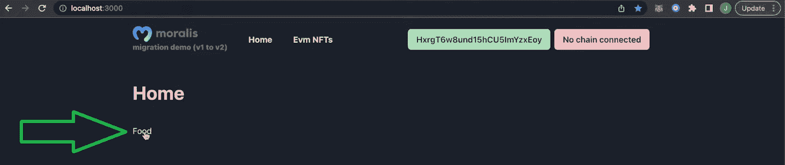

如果您单击那个按钮，它会将上述对象添加到您的 MongoDB 中。因此，通过返回“数据库部署”页面并单击“浏览集合”选项，您可以看到:

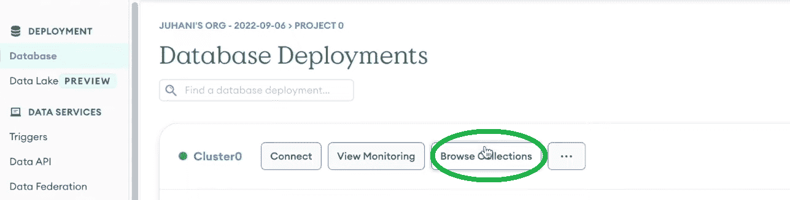

在“Collections”选项卡上，您将能够看到您的“parse”数据库(如果您使用了与我们相同的名称)和“Food”对象:

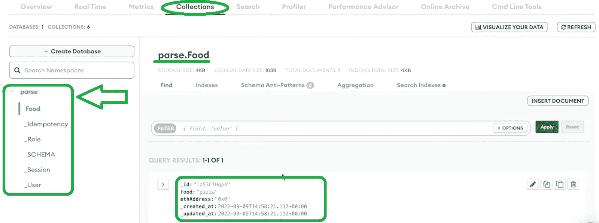

您还可以看到其他类已经从您的 Moralis 数据库添加到您的数据库中(0:45)。此外，您可以从 Moralis 数据库中的唯一类中迁移元素(13:52)。

## 使用 Heroku 部署您的自托管 Web3 服务器

到目前为止，您一直在本地运行自己托管的 Web3 服务器。但是，现在是时候学习如何部署您的服务器了，这样每个人都可以访问它。这就是我们要用 Heroku 的地方。因此，创建或登录您现有的 Heroku 帐户，并创建一个新的应用程序:

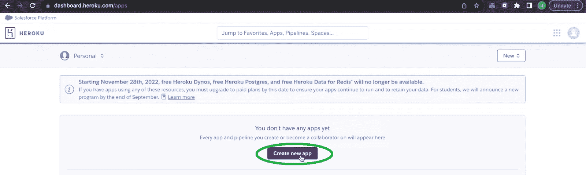

随意命名您的应用程序，选择您所在的地区，然后点击“创建应用程序”按钮:

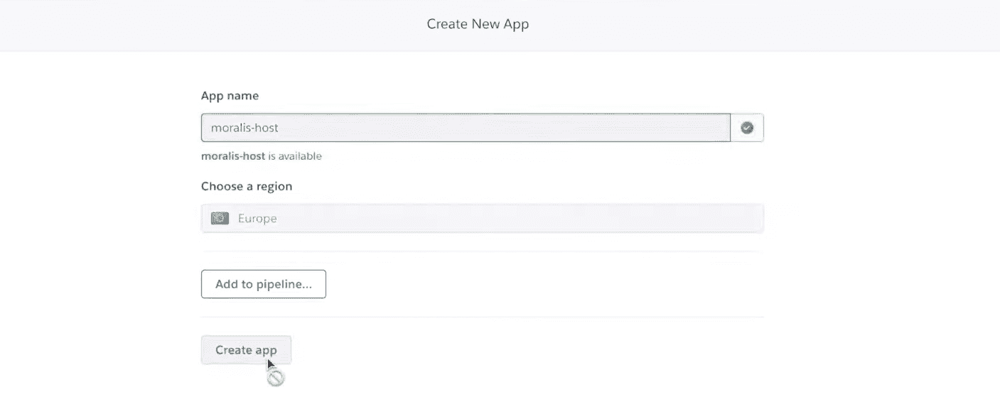

然后你可以用你的终端把你的 dapp 推送到 Heroku。为此，您需要下载并安装 Heroku CLI。然后，您将能够使用" *heroku 登录*"命令(17:51):

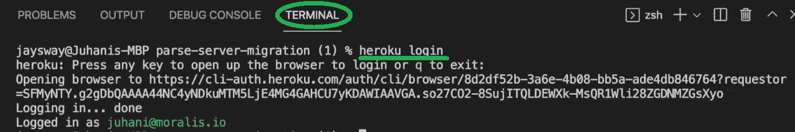

注意:确保你回到了“pare-server-migration”项目。

使用终端登录 Heroku 后，输入" *git init* "命令。然后，使用"*heroku git:remote-a moralis-host*"命令。如果你给你的 Heroku 应用起了不同的名字，用那个名字代替“ *moralis-host* ”。接下来，使用" *git add 将所有文件夹添加到这个存储库中。*"命令，后面是这个: *git commit -am "make it better "。*

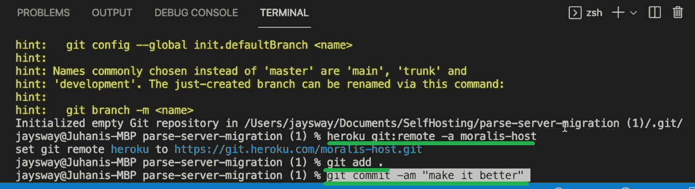

最后，用“ *git push heroku master* ”命令将其推送到 Heroku master 分支。

此外，您必须手动输入您的环境变量及其值(从"。env”)到 Heroku。因此，您需要进入 Heroku 应用程序的“设置”选项卡:

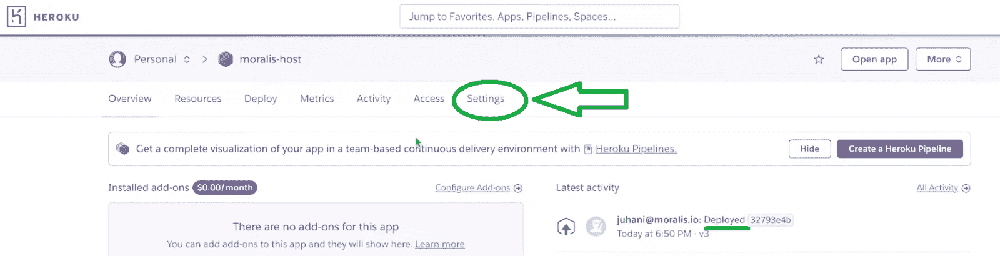

进入“设置”选项卡后，您必须单击“显示配置变量”按钮:

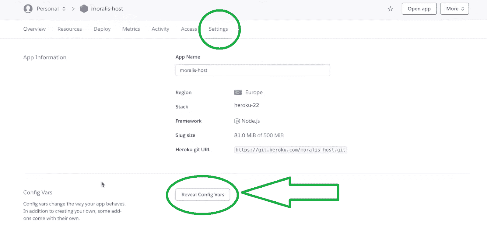

然后，只需输入所有变量及其值。最后但同样重要的是，您还需要添加您的服务器 URL，它需要包括您的 Heroku 应用程序名称，后跟“ *.herokuapp.com/server* ”:

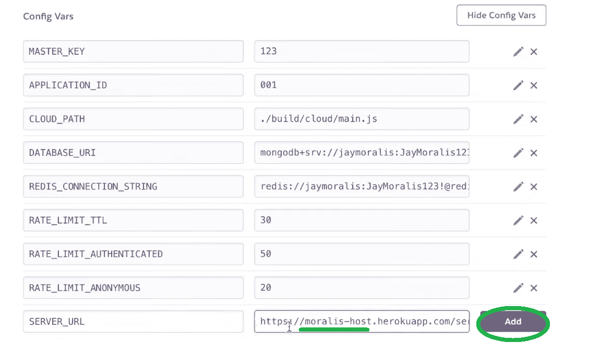

现在，您可以将上述服务器 URL 粘贴到您的客户端 React 应用程序中。env "文件:

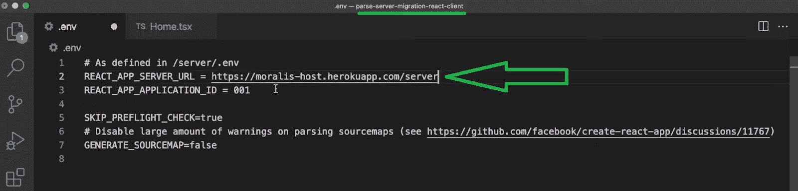

*最后，这里是所有细节的视频教程:*

https://www.youtube.com/watch?v=l2qTyc-V9cM

## 如何设置自托管的 Web3 服务器–摘要

今天，您学习了如何设置自托管 Web3 服务器。您可以使用这里的步骤毫不费力地迁移您现有的 Moralis 数据库。在这个过程中，您有机会学习如何使用 MongoDB 和 Redis。因此，您现在知道了如何设置数据库和建立连接字符串。我们首先关注在本地运行自托管的 Web3 服务器。此外，我们甚至向您展示了如何设置和运行客户端。最后，您还学习了如何使用 Heroku 部署 Web3 服务器。

既然您已经知道了如何启动和运行 Web3 服务器，那么是时候更深入地研究 dapp 开发了。这就是 Moralis 的跨平台互操作性让事情变得简单明了的地方。毕竟，它使您能够使用遗留的开发工具和编程语言来创建杀手级应用程序([分散式应用程序](https://moralis.io/decentralized-applications-explained-what-are-dapps/))。例如，你可以使用 Firebase 或 Unity 来创建令人敬畏的 Web3 游戏。凭借您对 JavaScript 的精通，您可以部署各种 DeFi dapps。如果这听起来很有趣，一定要去探索一下[Moralis 观 YouTube 频道](https://www.youtube.com/c/MoralisWeb3)、[Moralis 观博客](https://moralis.io/blog/)和[Moralis 观文档](https://docs.moralis.io/)。在这些宝贵资源的帮助下，你可以免费成为一名 Web3 开发者。

另一方面，你可能有兴趣尽快成为全职加密员。如果是这样的话，成为区块链认证可能对你很有意义。因此，你可以考虑报名参加 Moralis 学院。除了顶级的加密课程，这是获得专家指导、个性化学习路径和行业最先进社区之一的会员资格的地方。

