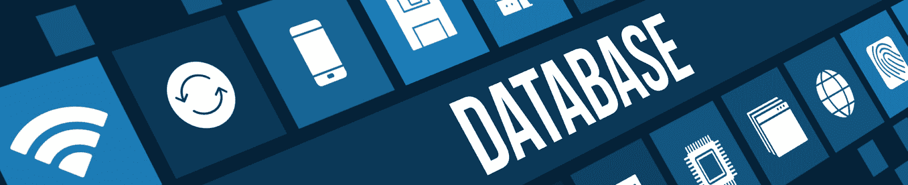
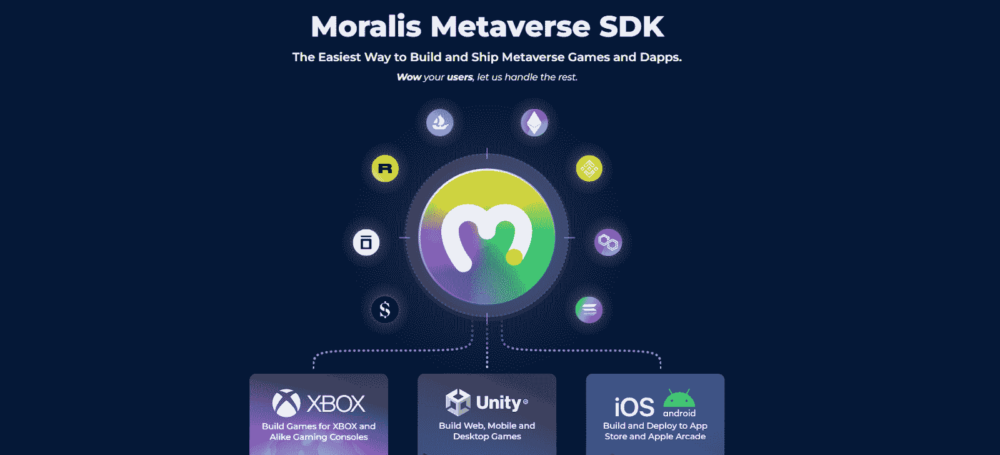
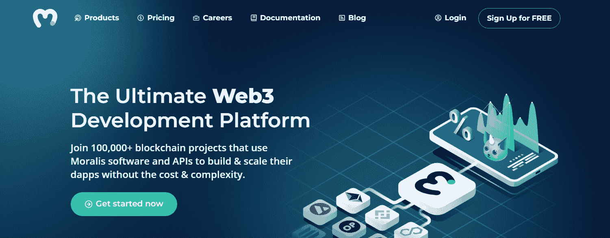
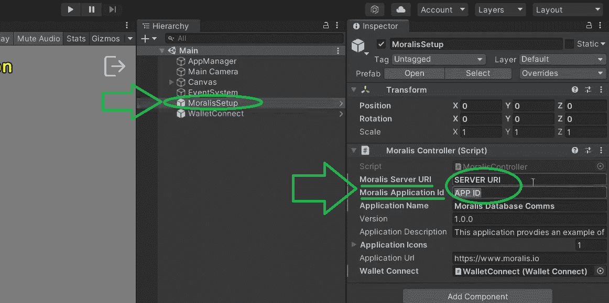
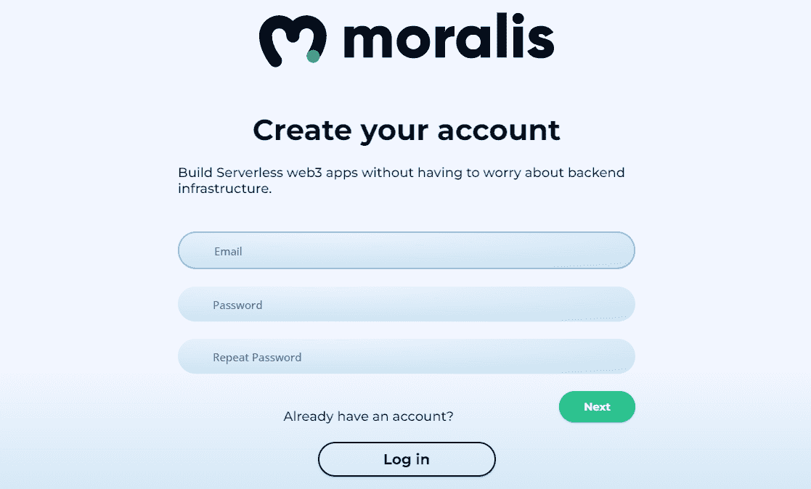
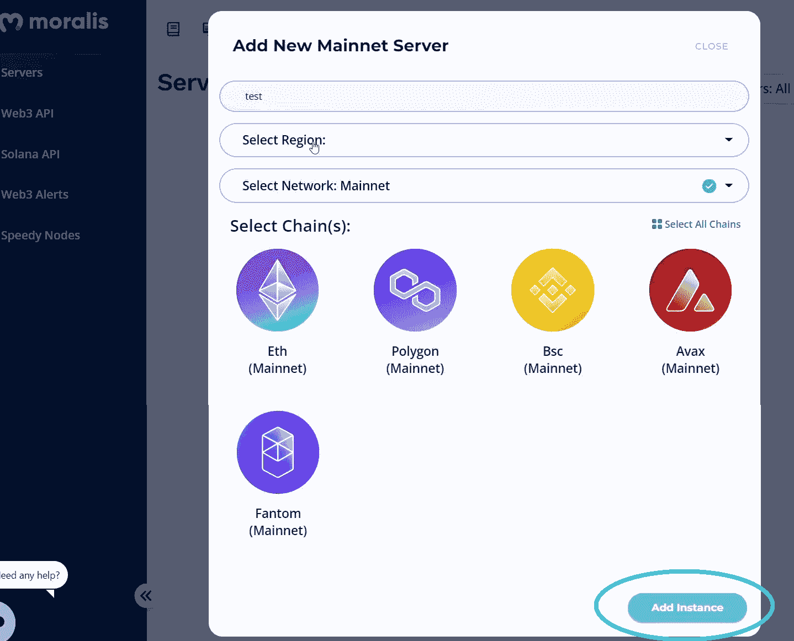
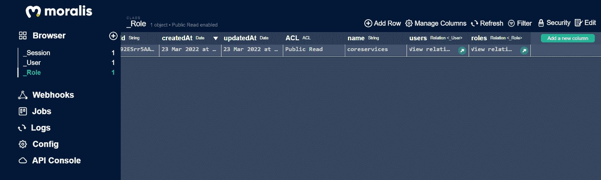

# 如何存储离线数据–Unity web 3 数据库

> 原文：<https://moralis.io/how-to-store-off-chain-data-unity-web3-database/>

创建[**Unity web 3**](https://moralis.io/unity-web3-beginners-guide-to-unity-web3-programming/)**游戏时，能够处理链上和链下数据是至关重要的。幸运的是，终极的** [**Web3**](https://moralis.io/the-ultimate-guide-to-web3-what-is-web3/) **后端平台、**[**Moralis**](https://moralis.io/)**，为那些想知道“如何存储离线数据”的人提供了一个极好的解决方案。此外，这个“**[**Firebase for crypto**](https://moralis.io/firebase-for-crypto-the-best-blockchain-firebase-alternative/)**”平台使您可以将链外和链内数据整齐地索引到一个地方。当您** [**创建您的免费 Moralis 账户**](https://admin.moralis.io/register) **并启动 Moralis 服务器时，您将自动访问您的 Moralis 仪表盘。后者作为一个数据库，满足您所有的 Web3 开发需求。这也是当你想将** [**索引到【区块链】**](https://moralis.io/how-to-index-the-blockchain-the-ultimate-guide/) **时要使用的工具。结合 Moralis 的"同步"功能，您可以轻松地** [**同步和索引智能合约事件**](https://moralis.io/sync-and-index-smart-contract-events-full-guide/) **。然而，在本文中，我们将关注如何存储离线数据。**

在这里，我们将承担一个 Unity 示例项目。我们将向您展示如何将 Unity 连接到 Moralis Web3 数据库。此外，我们还将介绍如何存储离线数据以及如何从数据库中检索这些数据。此外，我们在这里寻求的一个重要部分将是最初的 Moralis 设置。后者是访问 [Moralis 的 SDK](https://moralis.io/exploring-moralis-sdk-the-ultimate-web3-sdk/) 和[元宇宙的 SDK](https://moralis.io/metaverse/) 的关键。有了这个部分，我们可以开始使用 [Moralis 的 Web3 API](https://docs.moralis.io/moralis-server/web3-sdk/intro) 创建各种脚本。因此，我们可以从 [Moralis 的文档](https://docs.moralis.io/)中复制简短的代码片段，并将其投入使用。此外，如果这是你第一次使用 Moralis 的元宇宙 SDK 和 Unity Web3，请务必密切关注即将到来的第一部分。另一方面，如果你熟悉 SDK 和 Unity，可以直接跳到关于如何存储外链数据的部分。

### Unity Web3 编程已简化

如果你已经有一些 Unity 的经验，那么 Moralis 的元宇宙 SDK 将简化向 Web3 游戏开发的过渡。除了 Web3 基础，你所需要的就是你的 Unity 技能。此外，这是我们第一次向您展示如何为您的 Unity 项目存储外链数据。然而，到目前为止，我们已经介绍了相当多的其他 Unity Web3 示例项目。我们的初学者指南(简介中的“Unity Web3”链接)是一个很好的起点。此外，它还涵盖了元宇宙的基本知识。此外，该指南还解释了为什么现在是深入研究 Web3 游戏和 [GameFi](https://moralis.io/gamefi-tutorial-how-to-create-a-gamefi-game/) 开发的最佳时机。

在我们的其他 Unity 示例项目中，我们还介绍了如何进行[区块链游戏交易](https://moralis.io/how-to-do-blockchain-game-transactions-with-unity/)，将 [Unity 游戏与 Web3 登录](https://moralis.io/connecting-a-unity-game-with-web3-login/)连接，以及如何[将 Unity 应用程序连接到 Web3 钱包](https://moralis.io/how-to-connect-a-unity-app-to-a-web3-wallet/)。我们还向您展示了如何构建一个 [Web3 MMORPG](https://moralis.io/build-a-web3-mmorpg-with-unity-in-10-minutes/) 和一个[中世纪元宇宙游戏](https://moralis.io/how-to-build-a-medieval-metaverse-game/)。因此，如果您加入了我们的任何一个示例项目，那么您已经了解了基础知识。因此，您知道如何覆盖初始的 Moralis 设置，并将 Unity 与 Moralis 的 SDK 连接起来。因此，你可以跳到“如何为你的 Unity 游戏存储外链数据”一节。尽管如此，你也可以在这里随意地重复同样的步骤来刷新你的记忆。然而，在我们处理初始设置之前，让我们确保你们都知道什么是 Moralis。

### Moralis——超越 Unity Web3 开发的关键

当然，Moralis 是 Unity Web3 开发的关键；然而，它是如此之多。这是当前 Web3 技术的巅峰之作。它使得精通 JavaScript 的开发人员能够无缝过渡到区块链领域。这也使得 Moralis 成为开发[去中心化应用](https://moralis.io/decentralized-applications-explained-what-are-dapps/) (dapps)的终极工具。其广泛的 Web3 API，包括[以太坊 API](https://moralis.io/ethereum-api-develop-ethereum-dapps-with-moralis/) 和 [NFT API](https://moralis.io/ultimate-nft-api-exploring-moralis-nft-api/) ，使你能够将最大的注意力集中在前端。因此，你可以花更多的时间和资源来创造一个非凡的 Web3 UI。平均而言，Moralis 帮助 dapp 创建者节省了 87%的开发时间。因此，您可以更快地部署产品，也可以更快地收到用户的反馈。反过来，这给你一个无与伦比的优势。

此外，Moralis 完全是关于跨链互操作性的。这意味着您可以使用相同的代码在所有支持的区块链上部署 dapps。因此，你获得了更广泛的影响，并且你也通过不被任何特定的链所束缚而使你的工作经得起未来的考验。当然，目前来看，[以太坊](https://moralis.io/full-guide-what-is-ethereum/)仍然是可编程区块链中的“王者”，但是谁知道未来会发生什么。已经有几个著名的替代品显示出令人印象深刻的牵引力。现在，他们中的确有许多人(如[雪崩](https://moralis.io/how-to-connect-to-avalanche-nodes/)、[多边形](https://moralis.io/how-to-connect-to-polygon-nodes/)、 [BNB 链](https://moralis.io/how-to-create-a-bnb-chain-token-in-5-minutes/)等。)是否与 EMV 兼容。然而，以太坊的未来目前看起来相当稳固。尽管如此，有了 Moralis，你可以解决这个蓬勃发展的行业的所有利基。从 [NFT 市场](https://moralis.io/how-to-launch-an-nft-marketplace/)到 [DeFi](https://moralis.io/how-to-create-a-defi-dashboard-in-5-steps/) 交易所，Moralis 是你的后盾(完)。所以，如果你还没有创建你的免费 Moralis 账户，现在就创建吧。我们前进的时候你会需要它的。

## 如何存储链外数据–初始设置

为了让事情尽可能简单，我们将这个示例项目的全部代码放在了 [GitHub](https://github.com/MoralisWeb3/youtube-tutorials/tree/main/unity-web3-database) 上。然而，获得您需要的所有文件的最简单方法是下载我们的[示例项目的 ZIP 文件](https://github.com/MoralisWeb3/youtube-tutorials/releases/tag/v1.0.0-unity-web3-database):

有了上面的 ZIP 文件，您首先需要解压缩它，然后用 Unity 打开它。接下来，进入“场景”文件夹，在那里你会找到“主”文件。打开它:

看上面的截图，可以看到“Main”包含了两个重要的预设:“MoralisSetup”和“WalletConnect”。在前者中，我们需要输入可以从 Moralis 获得的具体细节。

### 连接到您的 Web3 数据库

从层次中选择“Moralis 设置”预设。然后，你可以在右边看到这个预设的细节。如果您将注意力集中在“Moralis 控制器(脚本)”上，您会注意到两个输入字段询问您的 Moralis 服务器的详细信息:

查看上面的图片，您可以看到您需要您的 Moralis 服务器 URL 和应用程序 ID。这意味着是时候创建自己的 Moralis 服务器并复制所需的细节了。

#### 初始 Moralis 设置

当您想要使用 Moralis SDK 时，需要执行以下步骤。所以，无论你是做 Web3 游戏还是其他 dapps，这都是你的起点。因此，以下是您需要完成的步骤:

1.  **登录您的 Moralis 账户**–现在，您可能已经创建了免费的 Moralis 账户。因此，你可以简单地用[登录](https://admin.moralis.io/login)。*另一方面，如果你还没有 Moralis 账户，使用简介中提到的“创建你的免费 Moralis 账户”链接。它会带你到注册页面，在这里你需要输入你的电子邮件，创建你的密码，然后点击确认链接(检查你的电子邮件收件箱)。*

2.  [**创建一个 Moralis 服务器**](https://docs.moralis.io/moralis-server/getting-started/create-a-moralis-server)–登录后，您将进入“服务器”选项卡。在那里，单击位于右上角的“+创建新服务器”按钮。*作为新用户，可以按照页面上的教程:*

然后，你会看到三个网络类型的选项(见下面的截图)。现在，例如项目或测试 dapps，“本地 Devchain 服务器”或“Testnet 服务器”是最好的选择。然而，要使用 dapp，您需要选择“Mainnet 服务器”。

接下来，一个弹出窗口将要求您输入您的服务器详细信息。因此，请输入您的服务器名称，然后选择您所在的地区、网络类型和链。要启动服务器，请单击“添加实例”:

3.  **访问您服务器的详细信息**–现在您的服务器已经启动并运行，您可以访问它的详细信息了。您可以通过“查看详情”按钮来完成:

点击“查看详情”后，您将在一个新窗口中看到您需要的信息。然后，使用右侧的复制图标复制服务器的 URL 和应用程序 ID:

4.  **填充 Unity***–*最后，您可以将上面复制的详细信息粘贴到 Unity 中“Moralis Controller”的相应字段中:

### 如何访问你的 Web3 数据库

一旦你创建了你的 Moralis 服务器，你也可以访问你的 Web3 数据库。为此，请单击“查看详细信息”右侧的箭头。这样，您将打开其他详细信息并访问另外三个按钮——“仪表盘”、“插件”和“云功能”:

要访问您的仪表板，请单击“仪表板”按钮。因为我们还没有教你如何存储外链数据，你应该看到一个空的数据库和默认的类:

接下来，您将学习如何为您的 Unity 游戏存储离线数据并填充您的仪表盘。有了正确索引的外链数据，你也可以将这些数据用于游戏中的各种功能。

## 如何为你的 Unity 游戏存储离线数据

在我们将您交给 Moralis Unity 专家之前，让我们快速回顾一下我们示例项目的结果。我们“如何存储链外数据”的探索将会产生一个相对简单的 Unity 应用程序。此外，界面将非常简单。实际上， [Web3 认证](https://moralis.io/web3-authentication-the-full-guide/)屏幕看起来是这样的:

由于 Moralis 的 [WalletConnect](https://moralis.io/what-is-walletconnect-the-ultimate-walletconnect-guide/) 集成，用户可以通过扫描上面的二维码使用他们的 [Web3 钱包](https://moralis.io/what-is-a-web3-wallet-web3-wallets-explained/)登录。一旦登录，用户就可以编辑他们的用户名并创造敌人:

我们选择这两个功能来最好地演示如何存储链外数据。因此，您将学习如何将新数据保存到 Web3 数据库，以及如何检索保存的数据。接下来，如果用户单击“编辑用户名”按钮，他们将访问此屏幕:

默认情况下，用户名是用户的钱包地址。但是，通过使用上面的输入字段和“提交”按钮，用户可以更改他们的用户名。当然，这些更改存储在 Moralis 数据库中。另一方面，用户也可以从上一个屏幕中选择“创建敌人”:

在“创建敌人”面板中(如上所示)，用户可以命名他们想要创建的敌人，然后点击“创建”按钮确认他们的行动。此外，新创造的敌人也储存在我们的 Moralis 数据库。实际上，你可以在下面的截图中看到我们数据库中的用户名和敌人索引:

*   **用户名索引:**

*   **敌人索引:**

现在你已经知道我们将要建立什么，是时候卷起袖子把事情做好了。如果您还没有完成上面介绍的初始设置，请在进入代码演练之前完成。

## 如何存储链外数据–代码演练

就算你不是视频人，也要看看下面的视频。它将为您提供“编辑用户名”和“创建敌人”功能的详细代码演练。要深入了解前者，请跳到下面视频的 4:07。您将首先看到我们的示例 Unity 应用程序如何将数据存储到我们的 Web3 数据库中。接下来，您将有机会仔细看看“AppManager”脚本。在那里，您将看到登录的细节，重点是“WalletConnectHandler”，它完成了繁重的工作。您还将看到“WalletConnect”预设的内部。此外，您将了解应用程序如何从“选择”面板激活“用户名”面板。为了正确理解这一部分，您将有机会更详细地了解“UsernamePanel”脚本(8:14)。

从 10:16 开始，你将有机会看到“创造敌人”功能的相同详细介绍。这包括确保事情顺利运行的脚本和代码片段。

最后，这是我们在本部分一直引用的视频:

https://www.youtube.com/watch?v=ypbXe91CTkA

## 如何存储离线数据–Unity web 3 数据库–总结

即使你是一个 Web3 Unity 的完全初学者，你也能够了解入门所需的一切。您现在知道如何完成 Unity 和 Moralis 的初始设置，以及如何访问您的 Moralis 数据库。此外，您还知道如何使用 Moralis 的 SDK 存储链外数据。如果你喜欢这个示例项目，我们建议你看看我们的其他 Unity Web3 任务。您可以在“Unity Web3 编程简化版”部分找到链接。

然而，如果你有兴趣探索区块链发展的其他方面，一定要使用[Moralis 博客](https://moralis.io/blog/)和[Moralis YouTube 频道](https://www.youtube.com/c/MoralisWeb3)。这两个渠道都提供了各种加密术语的简明解释和无数的教程。此外，它们可以为你的免费网络教育打下坚实的基础。此外，一些最新的主题教你[如何减少 Solidity gas 成本](https://moralis.io/how-to-reduce-solidity-gas-costs-full-guide/)使用 [gas 优化 Solidity](https://moralis.io/gas-optimizations-in-solidity-top-tips/) ，[如何创建以太坊 NFT](https://moralis.io/how-to-create-an-ethereum-nft-full-guide/) ，[如何创建 2D Web3 游戏](https://moralis.io/how-to-build-a-2d-web3-game-full-guide%ef%bf%bc/)，如何创建 [Web3 音乐平台](https://moralis.io/web3-music-platform-create-a-web3-music-streaming-service/)，等等。

尽管如此，如果你渴望更自信地进入 Web3，你可能需要采取更专业的方法。因此，你应该考虑报名参加[Moralis 学院](https://academy.moralis.io/)。除了获得高质量的[课程](https://academy.moralis.io/all-courses)，你还将获得个性化的学习路径，成为最不可思议的社区之一的成员，并获得专家指导。有了这些宝贵的资源，你很快就会成为一名 Web3 开发者。