# 如何代币交换 ERC 20 代币

> 原文：<https://moralis.io/how-to-token-swap-erc-20-tokens/>

**对于区块链开发者来说，允许用户在他们的 dapp (** [去中心化应用](https://moralis.io/decentralized-applications-explained-what-are-dapps/) **)上互换 ERC-20 代币是非常有利的。例如，启用此功能将降低用户跳到其他平台交换令牌的比率。因此，您平台上的用户参与度将大幅提高。但是，为 ERC-20 代币实现这样的代币交换功能似乎很有挑战性。然而，在** [企业级 web 3 API](https://moralis.io/)**和 SDK 的帮助下，你可以毫不费力地实现这样的特性，包括构建一个令牌交换 ERC-20 令牌组件！如果你看到了其中的力量，请跟随这篇文章，我们一起探索如何交换 ERC-20 代币的过程！**

随着我们向前推进，我们将首先向您展示我们的示例 ERC-20 令牌交换 dapp 的快速演示。这样做会让你对今天的教程有一个清晰的了解。此外，它将帮助您决定是否要卷起袖子，为 ERC-20 代币构建您自己的代币交换 dapp 实例。如果是这样，您将学习如何使用 Web2 工具(如 NextJS)深入 Web3 开发。此外，多亏了 Moralis 规范，这一切才成为可能。此外，通过 Moralis SDK，您将了解如何使用 1inch 聚合器和“*wag mi”*挂钩。因此，这些工具的组合将使今天的挑战变得相当简单。毕竟，你可以用自己的 dapp 在 20 分钟内兑换 ERC-20 代币。因此，如果这听起来很有趣，[创建你的免费 Moralis 账户](https://admin.moralis.io/register)，跟随我们的脚步吧！

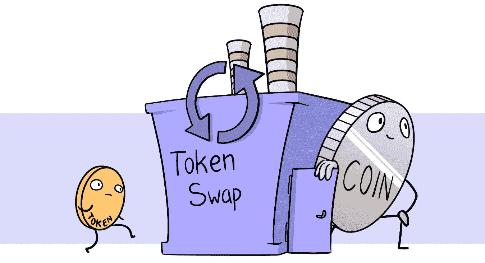

## 代币交换 ERC-20 代币–我们的示例演示 Dapp

下面是我们的示例 ERC-20 代币互换 dapp 的屏幕截图:

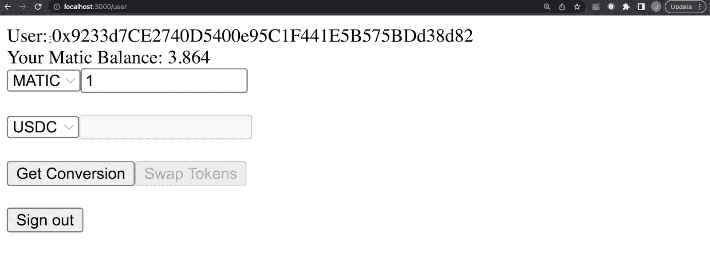

通过查看上面的图片，你可以看到，我们专注于创建一个简单而整洁的用户界面。因此，我们的示例 dapp 在顶部显示用户的钱包地址。当然，要做到这一点，用户必须首先验证自己。这就是我们使用 Moralis 的 [Web3 认证](https://moralis.io/authentication/)解决方案的地方。

在已连接的 Web3 wallet 地址下方，我们的 UI 还显示了本机令牌余额。由于我们把重点放在多边形区块链，你可以看到 MATIC(多边形的原生硬币)的平衡。然而，值得一提的是，Moralis 完全是关于跨链互操作性的。因此，您可以在以太坊或任何其他 EVM 兼容链上部署 dapp。

在我们 dapp 的 UI 中，用户可以选择“入口”令牌——他们想要交换的令牌。该菜单的右侧是一个输入字段。后者允许用户输入或选择他们希望交换的“进入”令牌的数量:

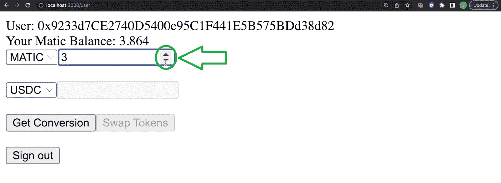

继续，您可以看到第二个下拉菜单，它让用户选择“输出”令牌——他们想要交换的令牌。这是我们添加“USDC”和“WETH”的地方，如下所示。但是，您可以向该列表中添加任意数量的 ERC-20 令牌:

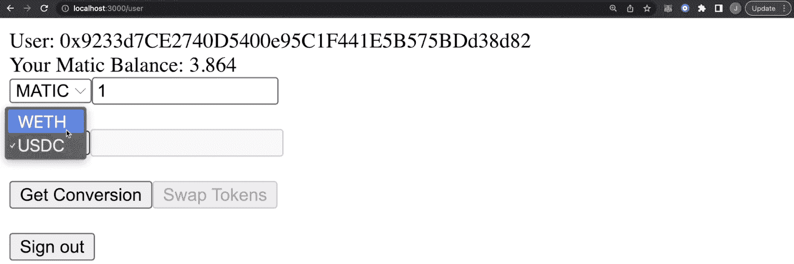

所以，用户输入想要互换的原生代币金额，选择“输出”代币后，需要点击“获取换算”。此按钮可确保用户看到他们可以收到的“输出”令牌数量:

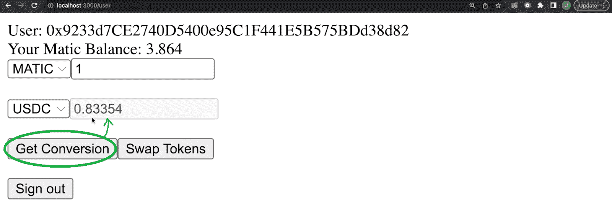

### 交换 ERC 20 代币

尽管如此，看看上面的两个截图，获得当前的兑换率激活了“交换代币”按钮。因此，用户可以点击该按钮，最终令牌交换 ERC-20 令牌。因此，当用户点击“交换令牌”按钮时，他们的元掩码扩展会弹出，要求他们确认:

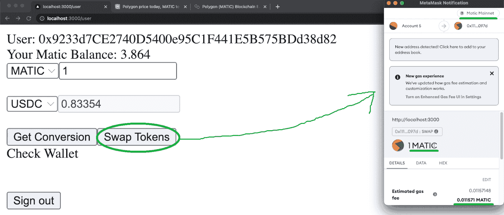

上面的截图表明 MetaMask 连接到多边形链(“Matic Mainnet”)。您还可以看到与这一特定互换相关的一些汽油费。当然，你可能知道汽油费对于任何类型的区块链上的所有连锁交易都是必不可少的。实际上，用户需要通过点击“确认”按钮来确认上述通知:

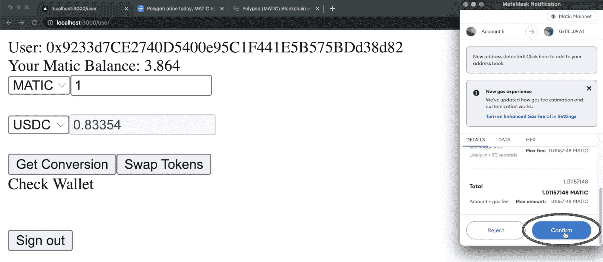

在用户令牌交换 ERC-20 令牌后，我们的 dapp 还会显示他们的交易哈希:

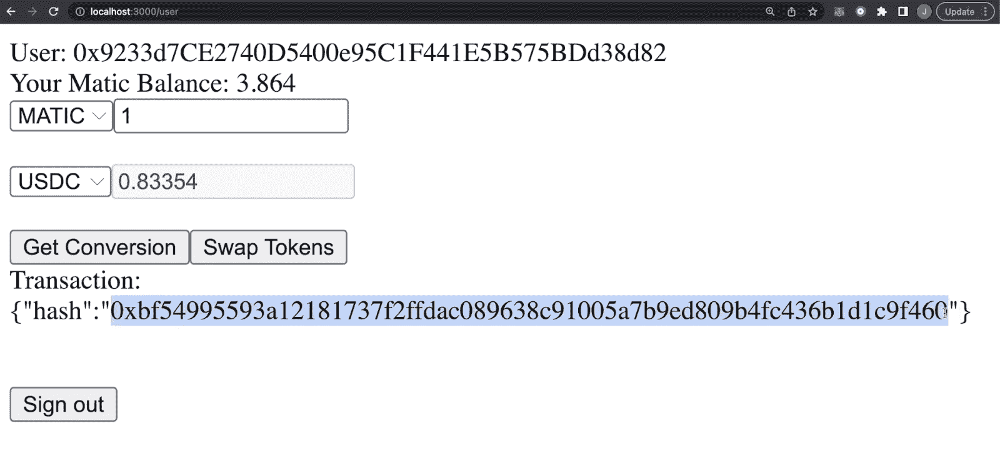

此外，用户可以复制事务哈希，并将其用于相关的区块链浏览器。这样，他们可以查看相关交易的详细信息。由于我们的 dap 基于多边形链，用户需要使用 PolygonScan 来探索他们的事务:

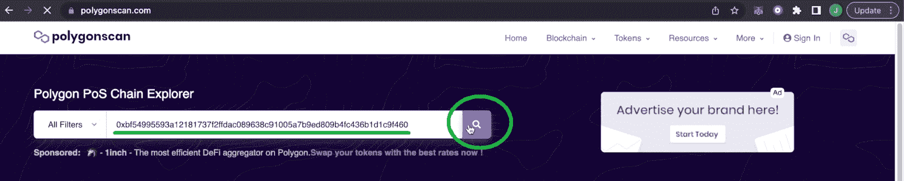

交易完成后，PolygonScan 会显示所有细节:

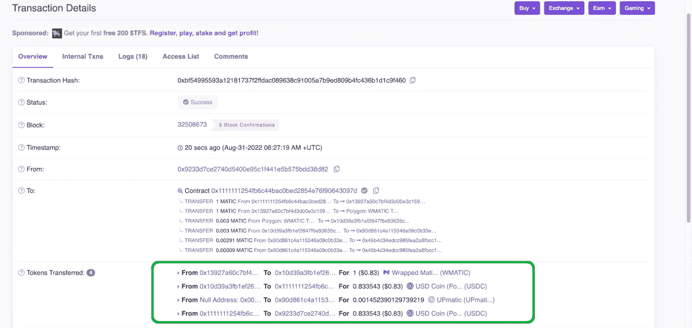

此外，用户的钱包也反映了他们的代币交换:

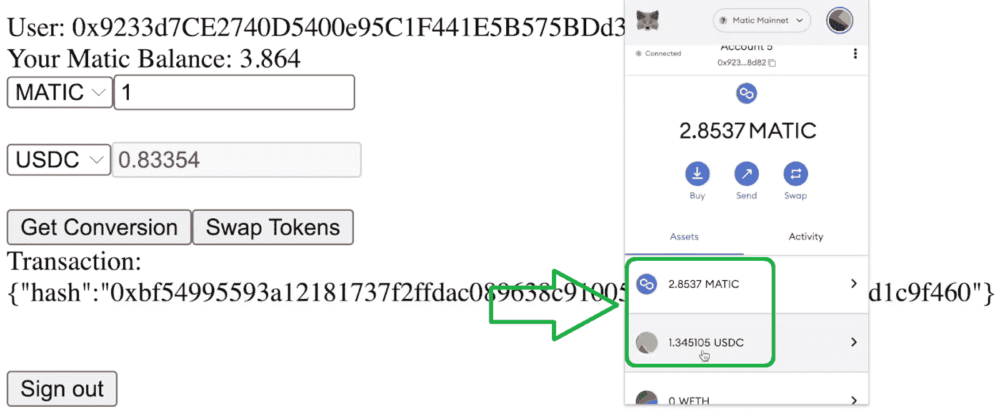

此外，当用户刷新 dapp 的页面时，它会显示他们更新后的余额:

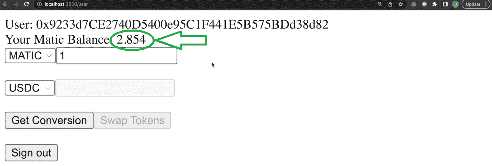

最后但同样重要的是，我们的示例 dapp 还让用户通过点击“退出”按钮来断开他们的钱包。

如果你喜欢上面的演示，你可能急于开始建设。如果是这样，我们邀请你跟随我们的领导，创建你自己的令牌交换 dapp 实例。

## 向用户提供代币交换 ERC-20 代币-使用 NextJS、Moralis、1inch 和 Wagmi 构建

我们将在过去的一个示例项目的基础上构建今天的项目，该项目已经包含了 Web3 身份验证。因此，转到 [GitHub](https://github.com/MoralisWeb3/youtube-tutorials/tree/main/MultipleWalletAuthentication) 并克隆“*MultipleWalletAuthentication*代码(启动代码)。另一方面，你也可以克隆我们的[成品代码](https://github.com/MoralisWeb3/youtube-tutorials/tree/main/SimpleSwap)。但是，请记住，我们假设您是从开始代码开始的。

### 入门指南

克隆了起始代码后，就该打开项目了。为了避免任何混淆，我们建议您遵循我们的指导，使用 Visual Studio 代码(VSC)。然后，使用 VSC 的终端安装所有需要的依赖项。您可以使用“ *npm i* ”命令来完成:

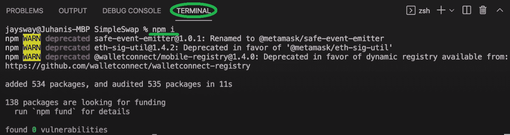

接下来，打开“. env.local”文件，在这里您需要粘贴您的 Moralis Web3 API 键:

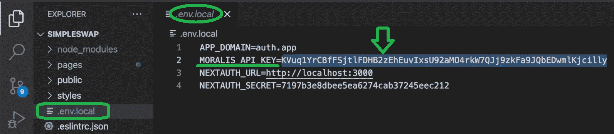

这是获取 Moralis Web3 API 密钥的提示。所以，你需要准备好你的 Moralis 账户。如果您还没有这样做，请使用简介中的“创建您的免费 Moralis 账户”链接。设置好你的 Moralis 账户后，你就可以进入你的管理区了。在那里，您将复制您的 Web3 API 密钥。一旦您成功设置了您的 Moralis 帐户，这应该不会花费您超过一分钟的时间，您将访问您的 Moralis 仪表板。这是您将在侧边菜单中看到“Web3 APIs”选项卡的地方:

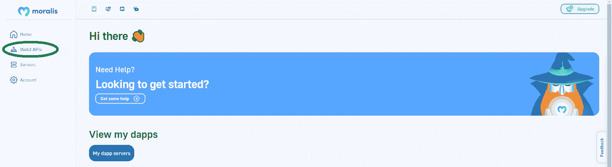

进入“Web3 API”页面后，使用“复制”图标获取您的 Moralis Web3 API 密钥:


最后，返回到“. env.local”文件并粘贴您的密钥。

接下来，使用“ *npm run dev* ”命令打开开发服务器。完成后，您将能够使用浏览器预览 swap dapp 的初始阶段:

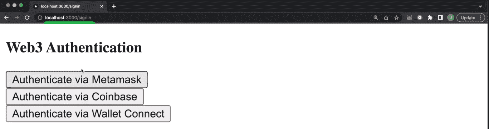

我们鼓励您使用“通过 MetaMask 认证”按钮进入“用户”页面:

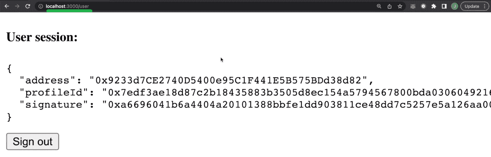

随着我们的继续，我们将专注于调整上面的“用户”页面。我们将添加令牌交换 ERC-20 令牌所需的功能，如上面的演示所示。

## 编码" *user.js* "以令牌交换 ERC-20 令牌

首先打开“user.js”文件，该文件位于“pages”文件夹中:

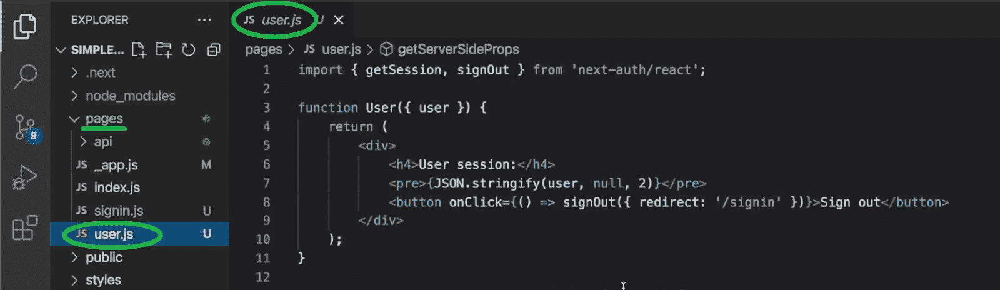

看看最初的几行代码，它已经包含了一些关于联网钱包的细节。因此，您可以以此为基础添加令牌交换功能。

因此，转到文件的顶部，导入 Moralis:

```js
import Moralis from "moralis";
```

然后，使用“ *getServerSideProps* ”异步函数初始化 Moralis。此外，还使用了莫拉斯 EVM API 的“*账户*”API 类型的“ *getNativeBalance* ”端点:

```js
  await Moralis.start({ apiKey: process.env.MORALIS_API_KEY });

  const response = await Moralis.EvmApi.account.getNativeBalance({
    address: session.user.address,
    chain: 0x89,
  });
```

*注:* *可以看到上面用的“0x89”。这是多边形链 ID。如果您想在任何其他 EVM 兼容链上交换 ERC-20 代币，您需要使用该链的 ID。使用 Moralis 文档来研究受支持链的 id。*

接下来，调整“ *getServerSideProps* ”函数的“ *return* 部分，以获得正确的响应:

```js
  return {
    props: { user: session.user, balance: response.raw },
  };
```

尽管如此，请确保也传递“*用户*函数中的“*余额*”道具:

```js
function User({ user, balance }) {
```

接下来，您需要调整“ *User* ”函数的代码，以便它能够呈现用户的余额。

### 实现 ERC-20 令牌交换功能

首先返回到“user.js”文件的顶部，从 React 导入“ *useState* :

```js
import { useState } from "react";
```

然后，返回到“*用户*”函数，添加以下常量:

```js
  const [fromToken] = useState("0xEeeeeEeeeEeEeeEeEeEeeEEEeeeeEeeeeeeeEEeE");
  const [toToken, setToToken] = useState(
    "0x2791Bca1f2de4661ED88A30C99A7a9449Aa84174"
  ); //USDC ERC20 Contract
  const [value, setValue] = useState("1000000000000000000");
  const [valueExchanged, setValueExchanged] = useState("");
  const [valueExchangedDecimals, setValueExchangedDecimals] = useState(1e18);
  const [to, setTo] = useState("");
  const [txData, setTxData] = useState("");

  const { data, isLoading, isSuccess, sendTransaction } = useSendTransaction({
      request: {
          from: user.address,
          to: String(to),
          data: String(txData),
          value: String(value),
      },
})
```

*注意:当前代码还不使用上述常量。随着你的前进，你会利用它们。*

常量就绪后，开始添加适当的函数。这些函数必须正确显示选定的令牌及其值。您将通过“ *changeToToken* ”和“ *changeValue* ”函数来实现:

```js
  function changeToToken(e){
    setToToken(e.target.value);
    setValueExchanged("");
  }

  function changeValue(e){
    setValue(e.target.value * 1E18);
    setValueExchanged("");
  }
```


#### 实施 1 英寸聚合器

要实现 1inch 聚合器，请在“*用户*函数中添加“ *get1inchSwap()* ”函数。该功能将使用户能够用代币交换 ERC-20 代币。以下是所需的代码行:

```js
  async function get1inchSwap(){
    const tx = await axios.get(`https://api.1inch.io/v4.0/137/swap?fromTokenAddress=${fromToken}&toTokenAddress=${toToken}&amount=${value}&fromAddress=${user.address}&slippage=5`);    
    console.log(tx.data)
    setTo(tx.data.tx.to);
    setTxData(tx.data.tx.data);
    setValueExchangedDecimals(Number(`1E${tx.data.toToken.decimals}`));
    setValueExchanged(tx.data.toTokenAmount);
    }
```

如果您有兴趣了解有关 1 英寸聚合器的更多信息，请观看下面的视频(9:22)。在这里，我们的内部专家将向您展示如何生成上述“ *get1inchSwap()* ”函数中使用的 URL 地址。然而，正如你所看到的，我们已经调整了这个 URL，使它接受上面定义的常量。当然，你可以根据需要调整上述常数。

尽管如此，您还可以看到“ *get1inchSwap()* ”函数也使用了“ *axios* ”。因此，请确保跳回到“user.js”文件的顶部，并导入 HTTP 客户端:

```js
import axios from "axios";
```

此外，还可以看到我们在“ *get1inchSwap()* ”函数内部设置了适当的状态变量。


#### 魏米胡克斯

因此，为了将数据放入" *get1inchSwap()* "函数中，您的代码需要发送事务。这就是“*和歌*进入场景的地方。通过使用这个 React 挂钩工具，您可以向“交换令牌”按钮添加执行功能。更准确地说，您将使用“ *useSendTransaction* ”。因此，返回到“user.js”文件的顶部，从“ *wagmi* ”导入该钩子:

```js
import { useSendTransaction } from "wagmi";
```

这是拼图的最后一块，使用户能够交换 ERC-20 代币。现在，您的 dapp 将能够向 1inch 聚合器发送掉期交易。

因此，您现在需要设置一个包含按钮的适当的 UI，这将触发适当的功能。

### 用户界面到令牌交换 ERC-20 令牌

下面的“*用户*”函数的“*返回*”部分负责 ERC-20 交换 dapp 的用户界面:

```js
  return (
    <div>
      <div>User: {user.address}</div>
      <div>Your Matic Balance: {(balance.balance / 1e18).toFixed(3)}</div>
      <select>
        <option value="0xEeeeeEeeeEeEeeEeEeEeeEEEeeeeEeeeeeeeEEeE">
          MATIC
        </option>
      </select>
      <input
        onChange={(e) => changeValue(e)}
        value={value / 1e18}
        type="number"
        min={0}
        max={balance.balance / 1e18}
      ></input>
      <br />
      <br />
      <select name="toToken" value={toToken} onChange={(e) => changeToToken(e)}>
        <option value="0x7ceB23fD6bC0adD59E62ac25578270cFf1b9f619">WETH</option>
        <option value="0x2791Bca1f2de4661ED88A30C99A7a9449Aa84174">USDC</option>
      </select>
      <input
        value={
          !valueExchanged
            ? ""
            : (valueExchanged / valueExchangedDecimals).toFixed(5)
        }
        disabled={true}
      ></input>
      <br />
      <br />
      <button onClick={get1inchSwap}>Get Conversion</button>
      <button disabled={!valueExchanged} onClick={sendTransaction}>Swap Tokens</button>
      {isLoading && <div>Check Wallet</div>}
      {isSuccess && <div>Transaction: {JSON.stringify(data)}</div>}
      <br />
      <br />
      <button onClick={() => signOut({ redirect: "/signin" })}>Sign out</button>
    </div>
  );
}
```

查看上面的代码行，您可以看到“获取转换”和“交换令牌”按钮。您还可以看到它们触发了上面定义的函数。此外，从上面可以看出，这段代码主要关注“USDC”和“韦瑟”。因此，值得重申的是，您可以轻松添加许多其他 ERC-20 令牌并扩展选项列表。为此，您只需要一个令牌的 ticker 和地址，并添加一个额外的“选项值”。当然，1inch 聚合器还需要有一个交易对池，以便用户能够交换感兴趣的 ERC-20 令牌。

### 代码走查

如果您有兴趣更深入地研究上面介绍的代码，请使用下面的视频。这也是您可以看到我们的示例 dapp 在上述几个阶段的预览。尽管如此，我们还要提醒您，您可以使用上面的“已完成代码”链接访问整个代码:

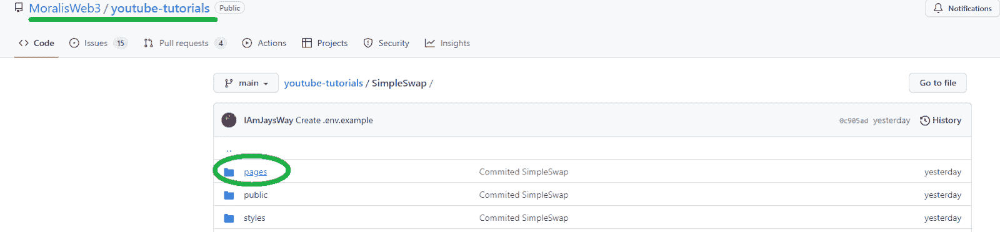

打开“pages”文件夹访问“user.js”文件:

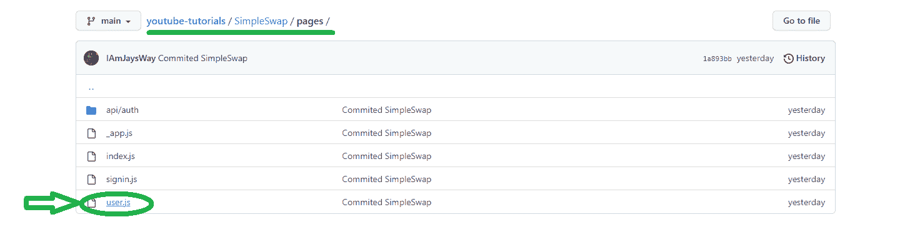

这给了你一个选择整个代码并粘贴到 VSC 的机会，并确保没有错误。

最后但同样重要的是，这是我们在整篇文章中引用的视频教程:

https://www.youtube.com/watch?v=FoQPUQIsxNo

## 如何进行代币交换 ERC-20 代币–摘要

今天的文章让您有机会了解如何构建一个 dapp，使用户能够交换 ERC-20 令牌。我们从快速演示我们的示例令牌交换 dapp 开始，然后带您完成构建步骤。通过克隆我们的“启动”代码，您不需要担心实现 Web3 认证功能。您只需获得 Moralis Web3 API 密钥并将其粘贴到“. env.local”文件中。然后，您将重点放在调整“user.js”文件上，其中大部分附加代码都放在“ *User* 函数中。在这个过程中，您导入了 Moralis 的 SDK、1inch 和 wagmi，并使用这些工具创建了一个合适的 dapp。最终，您现在可以使用这个 dapp 来交换 ERC-20 代币。

此外，我们鼓励你专注于创建一个更吸引眼球的用户界面。确保添加额外的 ERC-20 代币或尝试关注其他连锁店。尽管如此，尝试构建一个更高级的 dapp，其中令牌交换功能只是众多优秀特性中的一个。因此，出于这个目的，你可以使用 YouTube 频道和 T2 的 Moralis 博客。毕竟，这两个网站都有大量优秀的教程。

尽管如此，值得指出的是，加密领域提供了无数的就业机会。所以，成为全职加密员可能是你的正确选择。在这种情况下，成为区块链认证可以使所有的差异。如果你想获得所需的知识并增强自信，可以考虑报名参加[Moralis 学院](https://academy.moralis.io/)。