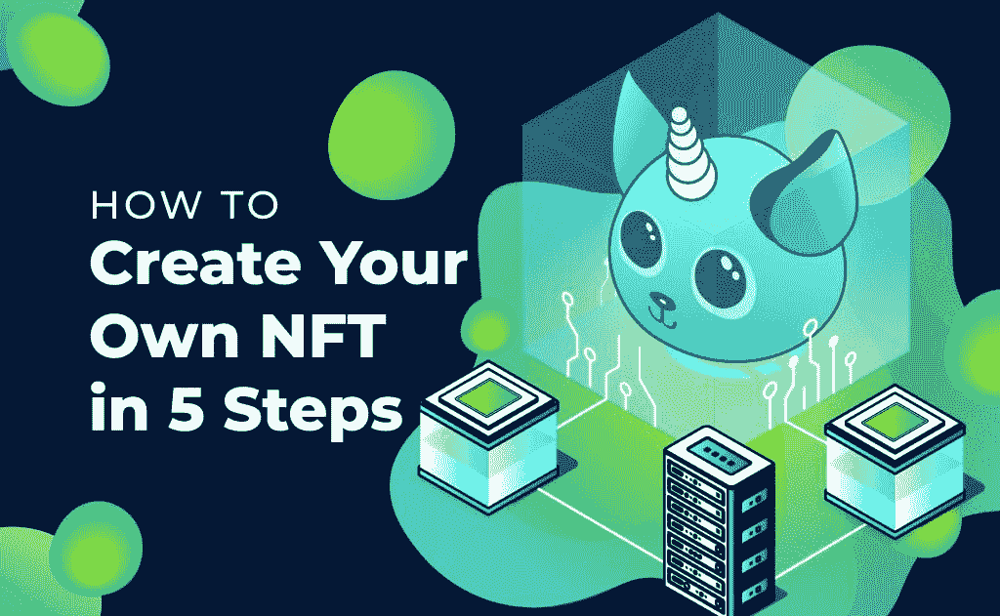
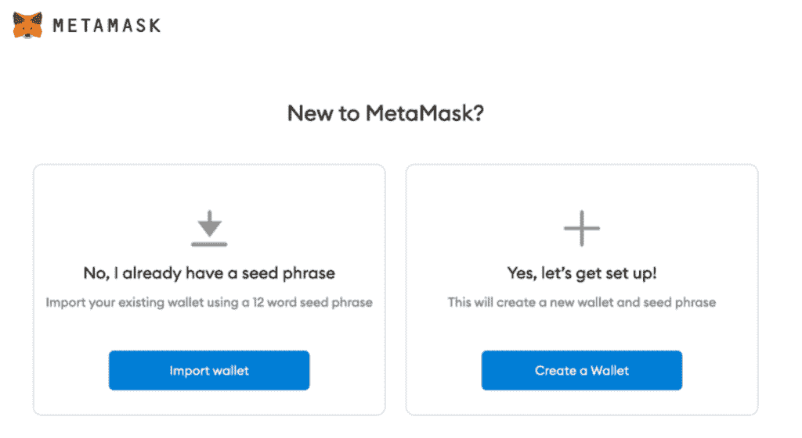
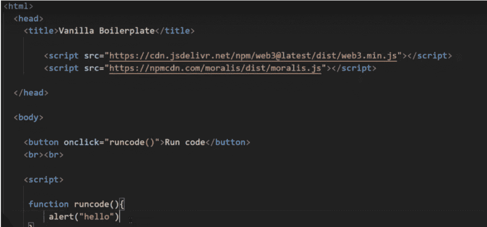
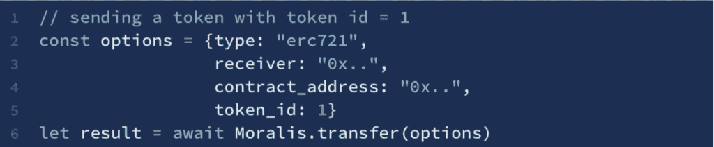

# 如何用一行代码传输 NFTs

> 原文：<https://moralis.io/how-to-transfer-nfts-with-one-line-of-code/>

对于开发人员来说，在没有合适工具的情况下实现转移 [**NFTs**](https://moralis.io/non-fungible-tokens-explained-what-are-nfts/) **的能力可能是一项繁琐的任务。这是因为，从传统的观点来看，这个过程需要建立一个复杂的数据结构，寻找一个 API，等等。因此，会涉及许多不必要的工作，这些工作可能会变得昂贵且耗时。然而，有了**[**Moralis**](https://moralis.io/)**，我们可以大大缩短这个过程，让它变得更加简单快捷。因此，在本文中，我们将更仔细地研究如何使用 Moralis 用一行代码传递 NFT。**

“只需一行代码就能发送 NFTs？”你可能会问。这听起来好得令人难以置信。然而，在使用 Moralis 时，我们只需要使用一行代码来完成这项任务。Moralis 为开发和部署 dApps 提供了完整的解决方案，使其成为 Web3 开发的首选。该平台为所有用户提供了一个底层基础设施，允许您将繁重的工作交给 Moralis。因此，您可以将您的时间和精力分配到其他重要职能上，以创建市场上最好的区块链项目。

此外，如果你经常阅读 [Moralis 的博客](https://moralis.io/blog/) ，那么你会知道这个平台提供了如何提高你的开发技能的指南。举个例子，博客里有很棒的指南，解释了 [如何创建智能合约](https://moralis.io/how-to-create-smart-contracts/) 和 [如何创建以太坊 dapp](https://moralis.io/how-to-create-ethereum-dapps/)。

因此，如果你想成为一名更好的区块链开发者并学习如何发送 NFT，那么第一步就是注册 Moralis。您将可以访问平台的底层后端基础设施和几个有用的开发工具。加入 Moralis 也是完全免费的，不要犹豫；立即注册！

### 什么是 NFT？

NFTs 是“不可替换令牌”的缩写，这正是它们的本来面目，不可替换。术语“不可替代”是一个传统的经济学术语，用来描述具有独特特征和属性的货物或产品。因此，[NFT](https://moralis.io/non-fungible-tokens-explained-what-are-nfts/)完全是唯一的，因此是不可互换的资产。

不可替代的传统资产的两个例子是歌曲或房子。歌曲和不同的属性都有独特的特点，很难将一个换成另一个，因为它们不会以相同的价格估价。此外，这意味着 NFT 是能够表示唯一项目所有权的令牌。

在过去的几年里，非功能性传播媒介的需求激增，甚至引起了主流媒体的关注。然而，这并不奇怪，因为一些代币已经卖到天文数字，高达几百万美元。此外，它彻底改变了数字艺术界，让艺术家获得前所未有的资金支持。

不久前，创造独一无二的数字资产还是一个问题，现在很难确保所有数字资产的稀缺性、唯一性和所有权证明。然而，区块链和 NFTs 等技术不再是这种情况。因此，这些代币支持新的分散式资产互联网。

### 什么是 Moralis？

在我们深入研究如何用一行简单的代码来传递 NFT 之前，我们将更好地理解什么是 Moralis，以便让您更好地了解这是如何实现的。

Moralis 是最终的 Web3 开发平台，支持更快、更简单的开发过程。该平台提供了开发和部署 dApps 所需的一切，目前有超过 5000 个区块链项目使用该平台的工具。因此，这些项目在没有不必要的成本或复杂性的情况下成功地扩展和构建了他们的 dApps。

从传统的角度来看，Web3 最紧迫的问题之一是后端开发。然而，这也是 Moralis 进入 Web3 领域的原因。该平台为用户提供了一个无限可扩展的底层基础设施，使您作为开发人员可以避免开发过程中的繁重工作。因此，将后端开发的复杂性交给 Moralis 家是可能的。同时，你可以把时间集中在开发你的应用的前端和 [智能合约](https://moralis.io/smart-contracts-explained-what-are-smart-contracts/) 上。

此外，Moralis 还提供了一系列优秀的开发工具，如[Moralis Speedy Nodes](https://moralis.io/speedy-nodes/)[web 3 API](https://docs.moralis.io/moralis-server/web3-sdk/intro)[NFT API](https://moralis.io/announcing-the-moralis-nft-api/)，原生支持[【IPFS](https://moralis.io/what-is-ipfs-interplanetary-file-system/)等。这些只是平台的一些工具，它们在开发时都有很大的帮助。

因此，如果你想开发 dApps、tokens 或任何其他区块链项目，那么我们强烈建议你加入 Moralis。这将使您能够使用该平台的所有开发工具，并大大缩短您的上市之路。

# 如何用一行代码传递 NFTs】

从传统的角度来看，创建能够将 NFT 从一个账户转移到另一个账户的[【dapp】](https://moralis.io/decentralized-applications-explained-what-are-dapps/)一直是一项艰巨的任务。其中一个原因是它需要一个庞大的数据结构，开发起来既复杂又耗时。然而，现在情况不再是这样了，因为我们可以利用已经建立的 Moralis 平台的基础设施。通过使用 Moralis，我们只用一行简单的代码就可以完成同样的结果。

在本文中，我们将通过创建一个允许我们发送 NFT 的基本 web 应用程序来展示 Moralis 的强大功能。我们将从头开始创建一个项目，其中我们将建立一个包含所有必要代码的 HTML 文件。然而，为了让我们的应用程序工作，用户必须有一个元掩码帐户。出于这个原因，我们将通过仔细研究 MetaMask 以及如何轻松设置帐户来开始本教程。

然而，如果你更想看一段解释这一过程的视频，那么一定要从 [Moralis YouTube 频道](https://www.youtube.com/channel/UCgWS9Q3P5AxCWyQLT2kQhBw) 查看这段视频。在这里，你可以跟随 Ivan 带你完成整个教程:

[https://www.youtube.com/embed/suZYvqrc_Hg?feature=oembed](https://www.youtube.com/embed/suZYvqrc_Hg?feature=oembed)

### 什么是元掩码？

MetaMask 是市场上最大的加密钱包，每月活跃用户超过一千万。作为一个加密钱包，MetaMask 为用户提供了全面管理其资产的必要功能。此外，MetaMask 为用户提供了安全登录、密钥库、令牌钱包和对各种交换的访问。因此，可以通过该平台执行基本任务，如购买、出售和交换硬币/代币。

此外，MetaMask 不仅是一款成熟的加密钱包，还是 dApps 重要以太坊生态系统的门户。因此，MetaMask 允许用户访问分散交易所(dex)、DeFi 平台、游戏和其他令人兴奋的应用程序。

使用 MetaMask 设置帐户非常简单，第一步是将扩展下载到您的浏览器中。要启动该流程，您需要访问 [MetaMask 网站](https://metamask.io/) ，并点击浏览器右上角的“下载”。

接下来，你需要点击“开始”按钮，这将为你提供两种选择。您可以导入现有的钱包，也可以从头开始创建新的钱包。如果您已经有一个钱包，您可以使用现有的种子短语创建帐户。如果你想创建一个新的，只需按照说明，你会得到一个全新的短语。

此外，你必须有一个账户，因为在转账时你需要一个账户。设置元掩码帐户是一个相对简单的任务，只需要几分钟。但是，如果您想了解更多关于该过程和扩展本身的信息，那么可以查看 Moralis 的以下文章，它更详细地解释了什么是 [元掩码](https://moralis.io/metamask-explained-what-is-metamask/):[元掩码解释——什么是元掩码](https://moralis.io/metamask-explained-what-is-metamask/) 。

## 如何用一行代码传输 NFTs–创建一个 HTML 文件

有了元掩码帐户和安装的扩展，我们可以继续创建我们的应用程序。我们要做的第一件事是创建一个新的 HTML 文件，我们称之为“index.html”。这个文件将包含一些导入:我们的应用程序的 HTML 代码和执行事务的函数。因此，在添加函数逻辑之前，代码看起来是这样的:

首先，我们需要在“Vanilla Boilerplate”行下面导入两个文件，如上图所示。其中一行用于导入 Moralis，另一行用于导入 Web3。一旦我们完成了 Web3 和 Moralis 脚本的导入，我们就创建了一个“运行代码”按钮。这个按钮有一个“onclick”事件，这意味着一旦用户点击网站上的按钮，就会触发一些事件。

在这个例子中，每当点击按钮时，我们将运行函数“runcode()”。从上图中可以看出，这个函数现在所做的就是打印“hello”。现在，我们将继续添加逻辑，让我们有机会转移 NFT。

## 如何用一行代码传输 NFTs–向“runcode()”函数添加逻辑

最后，我们将向“runcode()”函数添加逻辑，允许我们传输 NFT。为此，我们可以从访问 [Moralis 文件](https://docs.moralis.io/moralis-server/sending-assets) 开始，在那里我们会找到一些已经准备好的代码。在这个页面中，我们对发送 NFTs 或 ERC-721 令牌的代码感兴趣，它看起来像这样:

我们可以继续复制这段代码，并将其实现到“runcode()”函数中。从代码中可以看出，我们首先创建了一个名为“options”的对象，它有几个属性:类型、接收者、契约地址和令牌 ID。

类型已经设置为“erc721”，这是发送 NFTs 或 ERC-721 令牌的正确类型。因此，我们可以让这条线保持原样。然后，我们需要添加一个接收者，这是我们希望将令牌发送到的钱包地址。此后，我们添加契约地址，后跟令牌 ID。最后，当我们调用 Moralis 传递函数时，我们使用这个对象作为参数。

你可能已经注意到了，我们只添加了接收 NFT 的地址，并没有提到我们发送令牌的地址。然而，这正是我们在本文前面创建元掩码帐户的原因。因此，发送地址将是您当前登录的元掩码帐户。

现在，剩下的就是通过点击“运行代码”按钮启动应用程序并执行代码。

恭喜你！这就是我们使用 Moralis 平台用一行代码发送 NFT 所需的一切！

## 如何用一行代码传输 NFTs 概要

添加使 dApps 能够传输 NFT 的功能在传统上是一项要求相对较高的任务。其原因是该过程通常需要复杂的数据结构。开发这样的结构是一个困难且耗时的过程。然而，这可以通过利用 Moralis 来避免。

因此，我们可以使用该平台，只需一行简单的代码，就可以将 NFTs 从一个地址转移到另一个地址。这个过程基本上由两部分组成:获取元掩码钱包和创建一个简单的应用程序。该应用程序只包含一个 HTML 文件，其中包含导入、HTML 代码和一个简单的函数。

该函数所做的只是调用一个带有几个参数的额外的 Moralis 传递函数。这些参数是令牌类型、接收地址、合同地址和令牌 ID。这就是它的全部，没有比这更简单的了。

此外，添加发送 NFT 的能力并不是 Moralis 平台的限制，您可以做的事情还有很多，并且用例是无穷无尽的。Moralis 是 Web3 开发的最佳平台，除了其基础设施，该平台还具有一些工具，如 [Moralis 价格 API](https://moralis.io/introducing-the-moralis-price-api/) 、跨链兼容性、实时警报等。

此外，Moralis 博客经常更新无与伦比的 Web3 内容。刚刚最新的两篇文章解释了 [【币安】智能连锁发展](https://moralis.io/bsc-programming-guide-intro-to-binance-smart-chain-development-in-10-minutes/) 以及 Moralis 现在 [支持雪崩](https://moralis.io/moralis-announces-avalanche-support/) 使得这篇博客值得一读！

所以， [与 Moralis 家](https://admin.moralis.io/register?utm_source=blog&utm_medium=post&utm_campaign=Want%2520the%2520Latest%2520in%2520%253Cspan%253EBlockchain%2520Development%253F%253C%252Fspan%253E) 签约是成为 dApp，token，或者 NFT 开发者的第一步。加入该平台后，您可以立即访问该平台的所有工具和已经建立的基础设施。因此，在开发未来的区块链项目时，您可以通过提高效率来节省时间和资源。