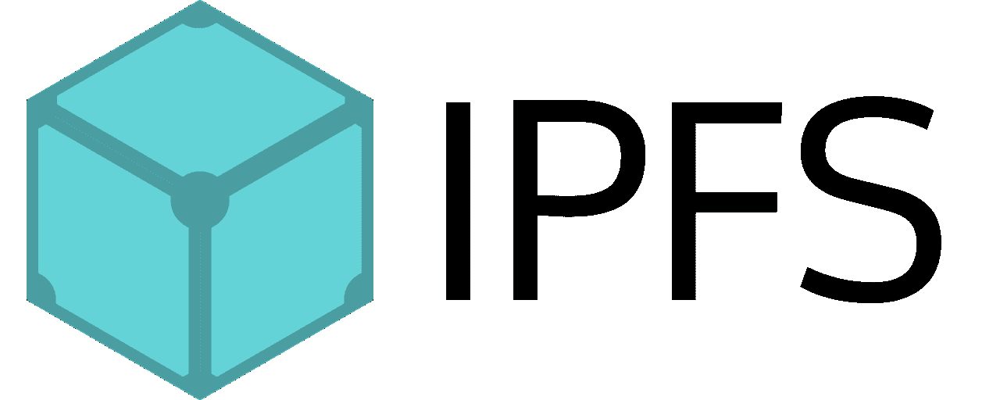
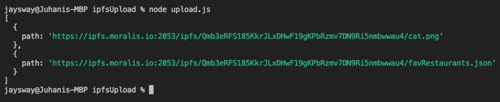
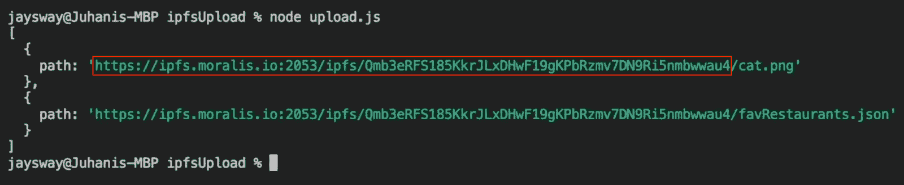
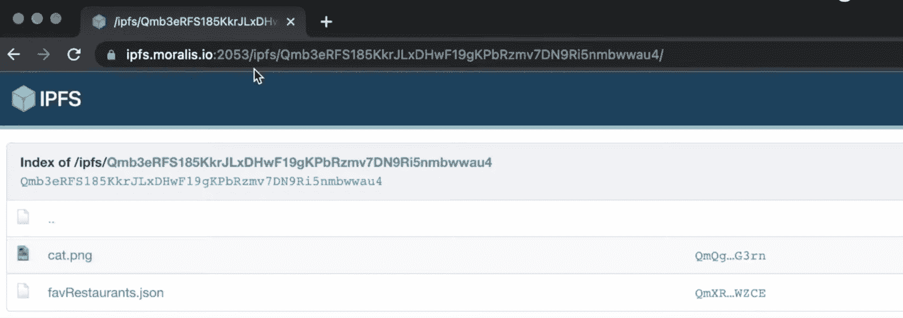

# 如何上传文件到 Files 完整指南

> 原文：<https://moralis.io/how-to-upload-files-to-ipfs-full-guide/>

得益于 Moralis 的企业级 Web3 APIs，将文件上传到 IPFS 是一个简单的过程。如果您想将文件上传到 IPFS，请继续阅读，我们会一步一步地解释如何设置完整的“upload.js”文件，这样您就可以利用以下 Moralis 端点:

```js
const response = await Moralis.EvmApi.ipfs.uploadFolder({
```

如果您已经掌握了扎实的开发技能，并且不觉得有必要演示实现过程，请随时访问上述端点的文档页面，并立即开始。只需点击以下按钮即可访问:

[**Access IPFS Upload Files Docs**](https://docs.moralis.io/reference/uploadfolder)

### 概观

大多数人熟悉的传统网络存在于集中式服务器上，可以通过基于位置的寻址来访问。然而，传统互联网的集中方面带来了潜在的问题，例如单点故障。因此，服务器容易受到攻击或崩溃，使用户无法获得信息和数据。这就是 IPFS(星际文件系统)出现的地方。IPFS 是领先的分布式 P2P(点对点)存储网络，有可能消除一些与传统 web 存储系统相关的问题。IPFS 的潜力是巨大的，这就是为什么这篇文章展示了如何用 [Moralis](https://moralis.io) 将文件上传到 IPFS！

多亏了 Moralis 优秀的 Web3 APIs，无缝上传文件到 IPFS 成为可能。更具体地说，本指南使用 Moralis 的“上传文件夹”端点，通过三个简单的步骤来演示流程:

1.  创建文件并初始化 Moralis
2.  定义文件数组
3.  上传文件到 IPFS

结合“上传文件夹”端点，Moralis 提供了其他伟大的工具来帮助您的开发工作。最近推出的 [Web3 Streams API](https://moralis.io/streams/) 就是一个很好的例子。这个 API 允许你通过 [Web3 webhooks](https://moralis.io/web3-webhooks-the-ultimate-guide-to-blockchain-webhooks/) 将[的链上数据](https://moralis.io/on-chain-data-the-ultimate-guide-to-understanding-and-accessing-on-chain-data/)传输到你的 Web3 项目的后端！

然而，如果你想以一种可访问的方式将文件上传到 IPFS 或者创建复杂的 Web3 项目，[立即注册 Moralis](https://admin.moralis.io/register) 。创建一个帐户是免费的，你将立即获得 Moralis 的各种 API！

## 什么是 IPFS？

在演示如何将文件上传到 IPFS 之前，这一部分将探索 IPFS 的复杂性。如果您已经熟悉该系统，请随意跳过这一初始部分，直接跳到“*使用 Moralis* 将文件上传到 IPFS”部分！



IPFS 是“星际文件系统”的缩写。此外，它是一个分布式系统，用于上传、存储和访问网站、应用程序、数据和文件。此外，这个 P2P(对等)超媒体协议是由组织协议实验室开发的，目的是保存和增长人类的知识。IPFS 通过让网络具有弹性、可升级性和开放性来实现这一目标。

由于 IPFS 是一个 P2P 文件共享协议，它使用户能够以分散的方式托管和访问内容。在该协议中，用户运营商托管全部数据的一部分，创建了一个独特的创新系统来存储和共享文件或其他内容。与传统的 HTTP 系统基于位置不同，IPFS 采用了内容寻址策略。因此，IPFS 用户可以找到任何文件，网站，数据等。，基于其内容而不是位置。

在 IPFS 生态系统中，所有内容都有一个唯一的 CID(内容标识符)，这是一个哈希。因此，为了找到特定的数据，IPFS 利用对所请求的内容唯一的加密散列。此外，IPFS 不仅使用内容寻址来识别内容，还将内容链接在一起。尽管如此，后来，这篇文章在“*IPFS 如何工作”中进一步探究了 IPFS 如何工作的错综复杂之处？*”一节。

随着对 IPFS 和系统基础的更深刻理解，是时候探索如何用 Moralis 上传文件到 IPFS 了！

## 用 Moralis 上传文件到 IPFS

现在是时候更深入地研究本指南的主要部分，并探索如何上传文件到 IPFS。因此，为了使这个过程尽可能容易理解，本文将演示如何使用 Moralis 存储文件。此外，如前所述，我们将利用 Moralis 的"[上传文件夹](https://docs.moralis.io/reference/uploadfolder)"端点，让您无缝上传文件到 IPFS！虽然我们之前已经查看了这些步骤，但是让我们提醒自己本教程的三步过程:

1.  创建文件并初始化 Moralis
2.  定义文件数组
3.  上传文件到 IPFS

如果你按照上面的步骤，你可以在几分钟内轻松上传文件到 IPFS！然而，如果你更喜欢看一个快速的 [Moralis YouTube](https://www.youtube.com/channel/UCgWS9Q3P5AxCWyQLT2kQhBw) 视频，该视频讲述了 IPFS 的错综复杂，并概述了上传文件的过程，请查看下面的剪辑:

[https://www.youtube.com/embed/8YGPCNhuyKU?feature=oembed](https://www.youtube.com/embed/8YGPCNhuyKU?feature=oembed)

### 步骤 1:创建文件并初始化 Moralis

首先，您可以打开首选的 IDE(集成开发环境)并创建一个新的 JS (JavaScript)文件。在我们的例子中，我们使用 VSC (Visual Studio 代码)并将文件命名为“upload.js”。

有了一个文件，您需要启动一个新的 Moralis 实例。这相对简单，您可以将以下内容添加到您的文件中:

```js
const Moralis = require("moralis").default;
const fs = require("fs"); 

async function uploadToIpfs() {

    await Moralis.start({
        apiKey: "MORALIS_API_KEY",
    });
}
```

但是，您需要通过替换“ *MORALIS_API_KEY* ”来将您的 Moralis API 密钥添加到上面的代码片段中。要获得密钥，您需要一个 Moralis 帐户。所以，如果你还没有,[马上和 Moralis 家](https://admin.moralis.io/register)签约。创建一个帐户只需要几秒钟，而且完全免费！

然而，一旦您登录并在 Moralis 管理面板上找到自己，您应该能够通过单击左侧的“Account”并导航到“Keys”选项卡来找到 API 密钥，这应该会将您带到下面的页面，在那里您可以找到 Web3 API 密钥:


从那里，您将需要复制密钥并替换代码中的“ *MORALIS_API_KEY* ”!

### 步骤 2:定义文件数组

既然您已经初始化了一个新的 Moralis 实例，那么您必须定义一个想要上传到 IPFS 的文件数组。为此，您必须定义一个路径来存储文件和要上传的内容。它应该是这样的:

```js
const uploadArray = [
        {
            path: "cat.png",
            content: fs.readFileSync('./Cat.png', {encoding: 'base64'})
        },
        {
            path: "favResturants.json",
            content: {
                one: "Red Lobster",
                two: "Chipotle", 
                three: "Chic-Fil-A"
            },
        },
    ];
```

使用上面的结构，并在初始化 Moralis 实例之后添加带有您的特定配置的代码。此外，如上面的代码片段所示，您可以选择以 Base64 或 JSON 格式添加数组内容！

### 第三步:上传文件到 IPFS

剩下的工作就是启动 Moralis 的“上传文件夹”端点，并将文件数组作为参数传递:

```js
const response = await Moralis.EvmApi.ipfs.uploadFolder({
        abi: uploadArray,
    });
```

从那里，您可以添加下面的代码来记录响应，当您最终调用端点时，它提供 IPFS 内容标识符:

```js
console.log(response.result)
```

然而，这应该是“upload.js”文件的完整代码:

```js
const Moralis = require("moralis").default;
const fs = require("fs"); 

async function uploadToIpfs() {

    await Moralis.start({
        apiKey: "MORALIS_API_KEY",
    });

    const uploadArray = [
        {
            path: "cat.png",
            content: fs.readFileSync('./Cat.png', {encoding: 'base64'})
        },
        {
            path: "favResturants.json",
            content: {
                one: "Red Lobster",
                two: "Chipotle", 
                three: "Chic-Fil-A"
            },
        },
    ];

    const response = await Moralis.EvmApi.ipfs.uploadFolder({
        abi: uploadArray,
    });

    console.log(response.result)
}

uploadToIpfs();
```

此外，一旦您将自己的配置添加到代码中，您将需要运行一个终端命令来将文件上传到 IPFS。如果您使用的是 VSC，单击顶部的“终端”，然后单击“新终端”，打开一个新的终端:


在那里，确保您位于之前设置的文件的正确位置，并使用您的文件名运行以下命令:

```js
node "FILE_NAME"
```

终端应该做出响应，为您上传的文件提供唯一的 IPFS 内容标识符。此外，您应该会得到类似以下的回应:



您现在可以在浏览器中查看您的文件，方法是在 IPFS 网关后添加您的 CID。您可以在您的终端中复制提供给您的链接之一。在末尾排除特定文件的路径，并将其输入浏览器:



因此，您应该会看到一个类似于下图的页面:



以上就是这篇《*如何将文件上传到 IPFS* 》的指南！你现在应该知道如何轻松上传文件到 IPFS。但是，您可能仍然想知道为什么要利用 IPFS 以分散的方式存储文件。由于可能是这种情况，下面的章节将回答“*为什么上传文件到 IPFS？*“问题！

## 为什么上传文件到 IPFS？–IPFS 的优势

由于 IPFS 是一个分散的 P2P 协议，它为传统的存储和访问内容的方式提供了几个好处。因此，探索 IPFS 的一些主要优势来回答“*为什么要上传文件到 IPFS”这个问题是很有趣的。*”。


*   **高效廉价**–在传统的 HTTP 系统中，文件是一次从一台服务器上下载的。相比之下，IPFS 的 P2P 系统同时从多个节点检索内容。这有助于更有效的系统，因为它能够节省大量带宽。此外，效率的提高有助于降低系统成本。

*   根据 IPFS 的网站，一个网站的平均寿命是 100 天，然后它就会完全消失，IPFS 不认为这个系统会那么脆弱。IPFS 简化了创建数据镜像网络的过程，从而提供了一个更具弹性的系统。此外，内容寻址确保了 IPFS 的内容是自主版本化的。

*   **去中心化**–当前互联网和内容存储方法的一个普遍特征是集中化。集中化使审查信息变得容易，并产生了单点故障问题。IPFS 的去中心化性质通过提供一个扁平和开放的网络消除了这些问题。

*   **可用性**–IPFS 促进了弹性网络的创建，从而实现更持久的可用性。例如，这导致发展中国家的连接增加，或者只是在使用糟糕的咖啡店 WiFi 时。

这涵盖了该系统的一些主要好处，以及为什么你应该上传文件到 IPFS。现在，如果你想更深入地了解 IPFS，下面一节将简要介绍 IPFS 是如何错综复杂地运作的！

## IPFS 是如何工作的？

IPFS 是一个 P2P 存储网络，内容和文件可以通过对等点访问。这些对等体可以位于任何地方并中继/存储信息。IPFS 的一个核心方面是内容寻址，文件、网站等。，是根据内容而不是位置找到的。


然而，要理解这是如何工作的，你需要掌握三个基本原则:

*   **通过内容寻址识别**–IPFS 使用所谓的内容寻址来查找文件、网站、应用等。内容是通过“里面有什么”而不是“它在哪里”找到的。本质上，这意味着 IPFS 协议中的每一条内容都有一个 CID(内容标识符)，它是一个散列。每个哈希对于内容的来源都是唯一的。

*   **通过 Dag(有向无环图)进行内容链接**–IPFS 使用一种分布式系统，该系统利用一种称为 Dag(有向无环图)的数据结构。更具体地说，IPFS 利用 Merkle DAGs，其中所有节点都有一个以节点内容散列形式的标识符。

此外，为了建立用户内容的 Merkle DAG 表示，IPFS 通常将它分成块的不同部分。因此，不同的文件部分可以来自多个来源，并且可以有效地进行身份验证。这类似于使用 BitTorrent，它可以同时从几个对等点获取一个文件。

*   **通过 DHT(分布式哈希表)发现内容**–为了找出哪些对等点托管了您正在查询的内容，IPFS 使用了 DHT(分布式哈希表)。哈希表是键值的数据库。因此，DHT 是一个分散在分布式网络中的对等体上的表，要找到内容，您需要询问这些对等体。

如果你想更深入地了解 IPFS 是如何运作的，请点击这里查看他们的官方文档。

## 摘要–如何将文件上传到 IPFS

借助 Moralis 的“上传文件夹”终端，可以轻松地将文件上传到 IPFS。事实上，使用这个 Moralis 工具，您只需三个简单的步骤就可以将文件上传到 IPFS:

1.  创建文件并初始化 Moralis
2.  定义文件数组
3.  上传文件到 IPFS

如果你遵循上面的步骤，你现在将能够以一种分散的方式存储文件。此外，IPFS 还提供了一些好处，例如提高了效率、弹性和可用性等。，这对您的 Web3 开发工作大有裨益！

如果你觉得这个“*如何上传文件到 IPFS* ”的指南很有帮助，请务必在 Moralis [Web3 博客](https://moralis.io/blog/)查看更多内容。例如，学习如何使用 [Firebase 作为 Web3 的代理 API](https://moralis.io/how-to-use-firebase-as-a-proxy-api-for-web3/)或者如何[编写 Solana 智能合同](https://moralis.io/how-to-write-a-solana-smart-contract/)！


另外，如果你想提高你的 Web3 开发熟练程度，请随意报名参加[Moralis 学院](https://academy.moralis.io)。学院为新老开发者提供各种令人兴奋的[区块链课程](https://academy.moralis.io/all-courses)！

然而，如果你想创建 Web3 项目或者上传文件到 IPFS，[立即注册 Moralis](https://admin.moralis.io/register) ！