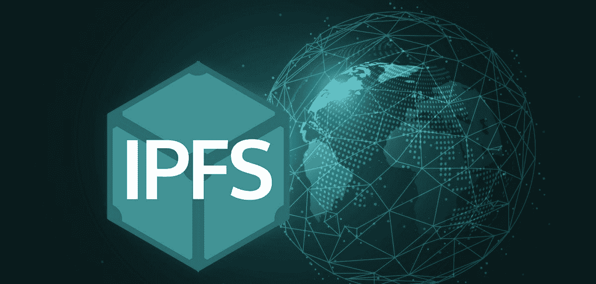
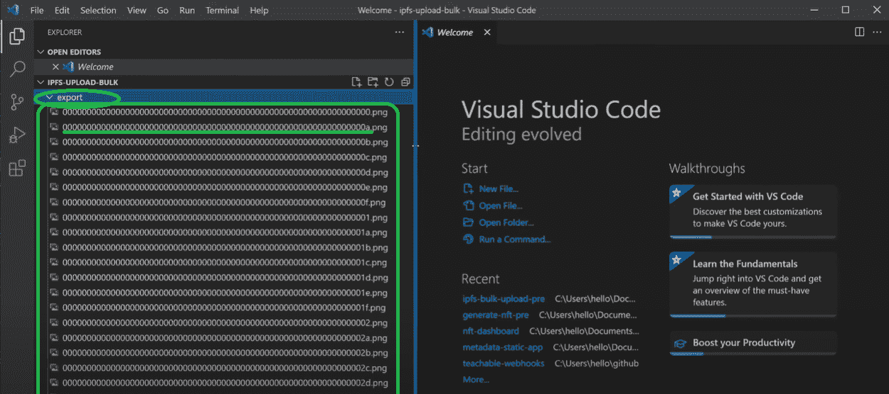
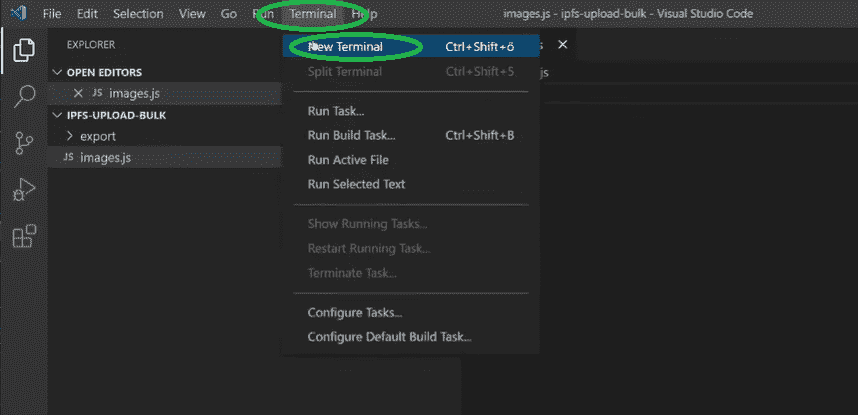
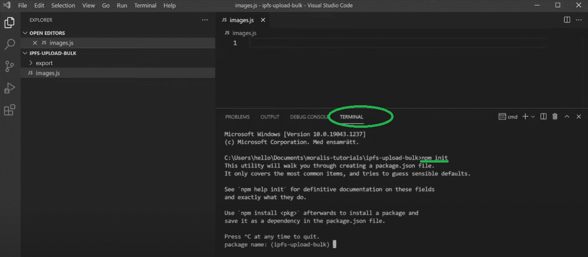
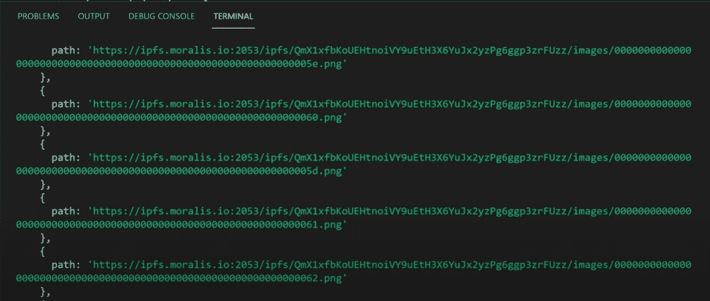
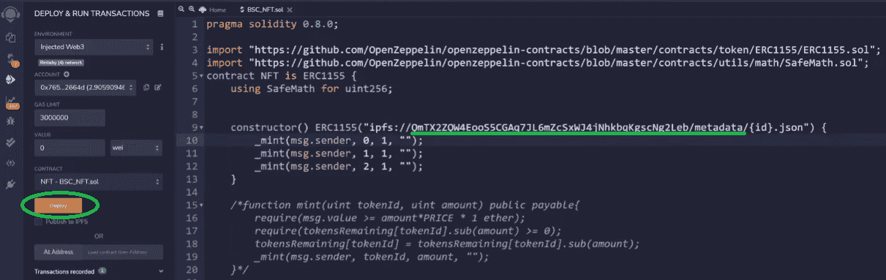
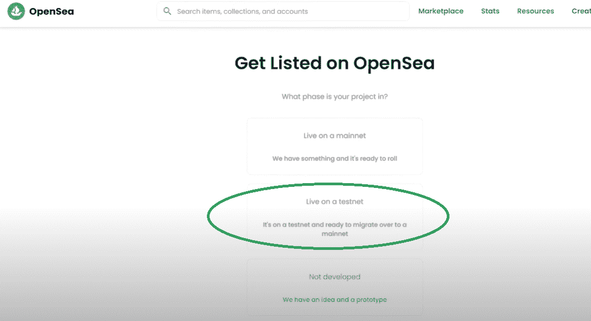
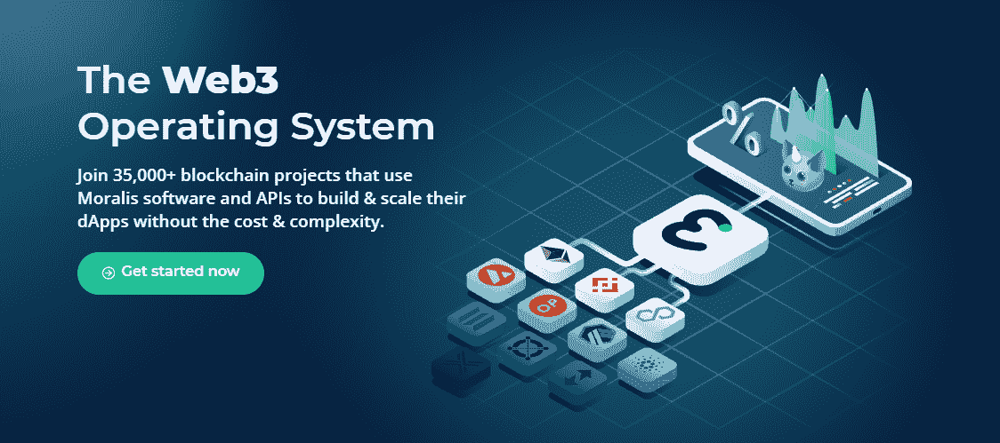

# 如何将文件夹上传到 IPFS

> 原文：<https://moralis.io/how-to-upload-folders-to-ipfs/>

谈到分布式文件系统，就不能不谈到 IPFS。具体来说，[](https://moralis.io/what-is-ipfs-interplanetary-file-system/)****及其去中心化协议允许开发者克服与中心化相关的障碍和问题。此外，为了确保完全去中心化，所有文件、数据和应用程序都需要以去中心化的方式存储，这也是 IPFS 的解决方案成为首选的原因。当使用适当的工具，开发人员可以很容易地上传到 IPFS 和利用其存储解决方案。此外，由于项目需要存储大量数据，上传文件夹到 IPFS 会非常有益。因此，在本文中，我们将进一步了解将文件夹上传到 IPFS 的过程，我们将展示如何使用**[**Moralis**](https://moralis.io/)**将文件夹上传到 IPFS。****

**Moralis 是最终的 [Web3](https://moralis.io/the-ultimate-guide-to-web3-what-is-web3/) 开发平台，为 IPFS 提供[本地支持。当然，它使您能够保存文件和对象；但是，您不希望单独处理每个数据文件。对于这种情况，能够执行批量上传是非常有用的。这意味着您可以创建一个文件夹，其中包含您想要以分散方式存储的所有文件，然后将该文件夹上传到 IPFS。因此，我们将在下一节向您展示如何实现这一点。此外，最棒的是，多亏了](https://docs.moralis.io/moralis-server/files/ipfs) [Moralis 的 SDK](https://moralis.io/exploring-moralis-sdk-the-ultimate-web3-sdk/) ，我们将能够使用简短的代码来完成这项工作。**

**

## 什么是 IPFS？

如果这是你第一次听说 IPFS，请允许我们向你介绍一下。IPFS 代表“星际文件系统”，是一种可靠的分散存储解决方案，早在 2015 年就开始开发。IPFS 背后的公司是 Protocol Labs，它从一个小开发团队开始，现在是存储内容的最重要的协议之一。后者包括数据、网站、文件和应用程序。此外，除了存储各种信息，IPFS 还提供了一种以分散方式访问这些数据的方法。它提供了一种基于内容的寻址解决方案，而不是使用基于地址的文件检索。这意味着通过使用 IPFS 协议，我们可以克服审查和集中式文件存储解决方案的单点故障限制。


## 为什么上传文件夹到 IPFS？

正如开始时提到的，今天的许多项目需要存储大量的数据和文件。在这种情况下，将每个文件单独上传到 IPFS 会非常耗时。幸运的是，你可以不费吹灰之力将文件夹上传到 IPFS，尤其是在使用 Moralis 及其平台的时候。此外，当使用 Moralis，你会节省大量的时间和资源。此外，通过一些简单的 [JavaScript](https://moralis.io/javascript-explained-what-is-javascript/) 编码，您可以自动化这个过程。

如果你只需要上传几个文件，那么学习一下 [*如何上传文件到 IPFS*](https://moralis.io/full-guide-how-to-upload-to-ipfs/) *，我们在以前的文章中已经详细介绍过了。*

# 用 Moralis 上传文件夹到 IPFS

如上所述，我们将致力于向您展示将文件夹上传到 IPFS 是多么容易。此外，为了让事情变得更有趣，我们将进行一个示例项目，我们将上传一个包含图像的文件夹，然后[批量创建 NFT](https://moralis.io/how-to-mint-nfts-full-tutorial-to-minting-an-nft/)。因此，你不仅将学习如何上传文件夹到 IPFS，而且你也能够使用这些信息作为指南[创建 NFT](https://moralis.io/how-to-create-nfts-and-upload-to-opensea/)。此外，如果您打算制作 ERC-1155 NFT，那么本教程将特别有用，因为 ERC-1155 NFT 需要一个统一的 URL 结构。当你学会上传文件夹到 IPFS 时，这很容易实现。

此外，我们将使用 Moralis 及其强大的 [Web3 API](https://docs.moralis.io/moralis-server/web3-sdk/intro) 来尽可能简化流程。如果你还没有 Moralis 账户，请确保现在就在[免费注册](https://admin.moralis.io/register)一个。这样的话，你就能跟上每一步的发展。此外，您还将看到 Moralis 如何用单行代码解决单调乏味的后端编码。


## 上传文件夹到 IPFS-一个示例项目

让我们从一个包含一百张图片的文件夹开始“上传文件夹到 IPFS”的任务。我们的目标是将图像和 NFTs 元数据上传到 IPFS。因此，我们将可以访问一个充满文件 IPFS(由于批量上传，它们将具有相同的哈希)、名称和描述的数组:


*注意* *:为了跟上进度，你需要一堆图像。我们将使用 100 个 png，但是您可以用更少的文件完成工作。当然，你也可以部署”。没有图像的 json”文件；然而，因为我们的例子关注的是 NFTs，所以包含图像也是有意义的。*

出于代码编辑的目的，我们将使用 Visual Studio 代码(VSC)。但是，可以随意使用任何其他代码编辑器。如下图所示，我们将从一个包含 100 个图像文件的文件夹开始:



文件名包含 64 个字符。我们沿着这条路走下去，因为这是 ERC-1155 NFTs 的元数据标准。然而，我们的首要目标是确保我们开始拍摄的图片能够上传到 IPFS。完成后，我们将通过创建 JSON 文件来覆盖元数据，这些文件将包含保存在 IPFS 上的图像的链接。此外，元数据也将被保存到 IPFS。

### 上传文件夹到 IPFS-上传图片

利用 VSC，我们创造一个新的”。js”文件，我们将其命名为“images”。在开始编写代码之前，我们需要打开终端(见下图)，在命令行中键入“***NPM init****”*。我们继续输入*"****NPM install fs****"*，这将使我们能够读写文件。接下来，我们键入*"****NPM install axios****"*，以确保我们的项目所需的一切都已就绪。



我们终于准备好为" *images.js"* 文件编写代码了。为了使用上面安装的“npm 包”,我们从导入这两个包开始:

```js
let fs = require("fs");
let axios = require("axios");
```

接下来，我们需要创建一个代码来浏览我们所有的图像，从文件读取到 JavaScript，然后将它们上传到 IPFS。为了做到这一点，我们将使用一些简单的“循环”。然而，繁重的工作将由 Moralis 完成，它将确保我们的文件夹被上传到 IPFS。确切的说，这将是 Moralis 的端点名为“**上传文件夹**”。为了使用 Moralis 提供的这种快捷方式，我们还需要将图像分配给一个数组(对于我们的例子，我们需要在数组中有一个数组)。让我们定义这两个数组:

```js
let ipfsArray = [];
let promises = [];
```

接下来，我们创建一个循环来遍历图像文件并正确导出它们。以下是用于此目的的代码行:

```js
for (let i = 0; i < 100; i++) {
    let paddedHex = ("0000000000000000000000000000000000000000000000000000000000000000" + i.toString(16)).substr("-64");

    promises.push(new Promise( (res, rej) => {
        fs.readFile(`${__dirname}/export/${paddedHex}.png`, (err, data) => {
            if(err) rej();
            ipfsArray.push({
                path: `images/${paddedHex}.png`,
                content: data.toString("base64")
            })
            res();
        })
    }))
}
```

### Moralis 将文件夹上传到 IPFS 的端点

要获取 Moralis 端点和 API 密钥，您需要访问您的 Moralis 管理面板，并单击左侧菜单中的“Web3 API”选项。


然后向下滚动，直到找到“存储”部分。在顶部，你会看到“***ipfs/upload folder***”。点击它，你会看到详细信息(如下所示)。它请求路径和内容:


作为回报，它为您提供了一个新的路径，其中包括哈希(对所有文件都是一样的)、文件夹名和文件名:


### 用 Moralis 的 API 上传文件夹到 IPFS

接下来，我们将使用上面几行代码作为例子。请记住，不要只是复制详细信息，请务必访问 [Moralis 的文档](https://docs.moralis.io/)了解更多详细信息，以便在有任何更新时获得最新版本。下面是我们的“*image . js”*文件中的其余代码:

```js
Promise.all(promises).then( () => {
    axios.post("https://deep-index.moralis.io/api/v2/ipfs/uploadFolder", 
        ipfsArray,
        {
            headers: {
                "X-API-KEY": 'API KEY',
                "Content-Type": "application/json",
                "accept": "application/json"
            }
        }
    ).then( (res) => {
        console.log(res.data);
    })
    .catch ( (error) => {
        console.log(error)
    })
})
```

查看上面的代码，您需要从 Moralis 粘贴您的 API 密匙，并用它替换“API 密匙”。接下来，我们使用终端运行代码。我们通过在终端中输入 *"* ***节点 image.js*** *"* 来做到这一点:


请注意，可能需要几分钟才能得到响应。但是，一旦完成，您将看到类似这样的内容:



使用(复制并粘贴到浏览器中)任何路径(在前面的步骤中获得)，您应该能够查看您的图像，因为他们已经被上传到 IPFS。如果您使用的是“Brave”浏览器，您可以跳过路径的“https://ipfs . moralis . io:2053/ipfs/”部分，直接在“ipfs://”后面使用哈希和图像文件部分(见下图):


### 将文件夹上传到 IPFS–上传元数据

我们通过创建一个新文件来开始示例项目的这一部分。姑且称之为“metadata.js”。由于我们将使用许多与“images.js”文件中相同的原则和细节，我们可以从复制该文件中的代码行并进行必要的更改开始。

如上所述，我们的示例项目集中于 ERC-1155 NFTs。这意味着我们必须遵循该协议的规则(ERC-1155 协议的细节可在网上获得)。遵循后者，我们需要包括图像、名称和描述。至于名称和描述，您可以使用任何您想要的。然而，我们希望使用相同的散列来确保我们使用刚刚上传到 IPFS 的图像。下面是代码的样子:

```js
let fs = require("fs");
let axios = require("axios");

let ipfsArray = [];
let promises = [];

for (let i = 0; i < 100; i++) {
    let paddedHex = ("0000000000000000000000000000000000000000000000000000000000000000" + i.toString(16)).substr("-64");
    ipfsArray.push({
        path: `metadata/${paddedHex}.json`,
        content: {
            image: `ipfs://QmX1xfbKoUEHtnoiVY9uEtH3X6YuJx2yzPg6ggp3zrFUimg/${paddedHex}.png`,
            name: `My Youtube test NFT #${i}`,
            description: "Awesome NFT for my youtube video"
        }
    })
}
axios.post("https://deep-index.moralis.io/api/v2/ipfs/uploadFolder", 
    ipfsArray,
    {
        headers: {
            "X-API-KEY": ‘API KEY',
            "Content-Type": "application/json",
            "accept": "application/json"
        }
    }
).then( (res) => {
    console.log(res.data);
})
.catch ( (error) => {
    console.log(error)
})
```

正如" *images.js"* 文件一样，确保在上面的代码中插入您的 API 密钥。所以，是时候运行 *"metadata.js* 文件了，在终端中键入*"****node metadata . js****"*。与 *"images.js* "一样，我们获取元数据的路径；然而，我们得到的不是 PNG 文件，而是 JSON 文件:


### 最终确定“将文件夹上传到 IPFS”示例项目

此时，我们已经将图像和相应的元数据部署到 IPFS。因此，就“如何将文件夹上传到 IPFS”而言，我们都准备好了。然而，由于我们的示例项目围绕 ERC-1155 令牌，因此我们也铸造 NFT 似乎是合适的。您可能知道，要创建 NFT，您需要使用[智能契约](https://moralis.io/smart-contracts-explained-what-are-smart-contracts/)；然而，[创建自己的智能契约](https://moralis.io/how-to-create-smart-contracts/)超出了本文的目的。因此，我们将非常简要地介绍这一部分。

我们可以使用 [Remix](https://moralis.io/remix-explained-what-is-remix/) 和 OpenZeppelin 提供的智能合约，并稍微调整一下代码，最终得到这样的结果:



带下划线的行包含先前生成的元数据的细节。此外，我们不会铸造所有的 100 个代币，在本例中只铸造三个。由于这是一个示例项目，我们将在 testnet 上进行铸造。单击橙色按钮(“部署”)后，我们的 NFT 将被创建。

接下来，我们将在 OpenSea 上列出那些 NFT。为此，我们必须访问“opensea.io/get-listed/”。在那里，我们需要选择项目的阶段(因为我们在测试网上创建了 NFT，所以我们选择了“在测试网上运行”选项):



在下一步中，我们选择用于铸造的 testnet，输入我们的 ERC-1155 合同地址，并单击“提交”按钮:


这可能需要一段时间，但是如果您遵循了上面的步骤，您现在应该能够在您的 OpenSea 仪表板中查看三个创建的 NFT。

*这里还有一个视频介绍了相同的步骤:*

https://www.youtube.com/watch?v=VglTdr0n5ZQ

*此外，我们示例项目中使用的完整代码可以在* [*GitHub*](https://github.com/MoralisWeb3/youtube-tutorials/tree/main/ipfs-bulk-upload) *上获得。*

## 如何将文件夹上传至 IPFS–摘要

现在，您已经知道如何轻松地将文件夹上传到 IPFS。多亏了 Moralis 的 API，你只需复制和粘贴简短的代码片段，就能快速覆盖编码部分。此外，您已经看到了在批量创建 NFT 时将文件夹上传到 IPFS 是多么有用。我们已经关注了 ERC-1155 标准；然而，您也可以将相同的原则应用于 [ERC721 令牌](https://moralis.io/erc-721-token-standard-how-to-transfer-erc721-tokens/)标准。

此外，您应该记住，Moralis 的 IPFS 集成只是该平台全部武库的一小部分。例如，Moralis 为您提供了一个[终极 NFT API](https://moralis.io/ultimate-nft-api-exploring-moralis-nft-api/) ,使您能够围绕不可替代的前端令牌进行 Web3 开发。无论你想创建一个 NFT 市场，NFT 游戏，还是 NFT 造币应用，Moralis 都能让这个过程变得轻而易举。Moralis 还附带了 [React 原生支持](https://moralis.io/moralis-introduces-react-native-support/)。



此外，Moralis 还为不仅仅是[以太坊](https://moralis.io/full-guide-what-is-ethereum/)链提供[快速节点](https://moralis.io/speedy-nodes/)。这使得它成为雪崩的最佳[Infura](https://moralis.io/infura-for-avalanche-exploring-infura-avalanche-alternatives/)和 BSC 的最佳[Infura](https://moralis.io/infura-bsc-alternatives-the-best-alternative-to-infura-for-bsc/)替代品。此外，有了这样一套强大的工具，您可以轻松克服 RPC 节点的所有[限制。](https://moralis.io/exploring-the-limitations-of-rpc-nodes-and-the-solution-to-them/)

此外，如果你正在寻找开发以太坊 dApps 的最简单快捷的方法，Moralis 的[以太坊 API](https://moralis.io/ethereum-api-develop-ethereum-dapps-with-moralis/) 是最好的选择，使[以太坊认证](https://moralis.io/ethereum-authentication-full-tutorial-to-ethereum-login-programming/)成为一个简单明了的过程。此外，开发 React dApp 的一个很好的方法是使用 [React dApp 模板](https://moralis.io/react-dapp-template-how-to-build-a-react-dapp/)。而且，这个平台的 DNA 里有跨链的互操作性；因此，你可以很容易地将你所有的以太坊 dApps 部署在其他主要的区块链上，这样你的 Web3 应用程序就不会过时。

我们鼓励您查看 [Moralis 的博客](https://moralis.io/blog/)和 [Moralis 的 YouTube 频道](https://www.youtube.com/c/MoralisWeb3)以获得更多高质量的内容。在那里，您将找到许多示例项目来帮助提升您的区块链开发技能。**