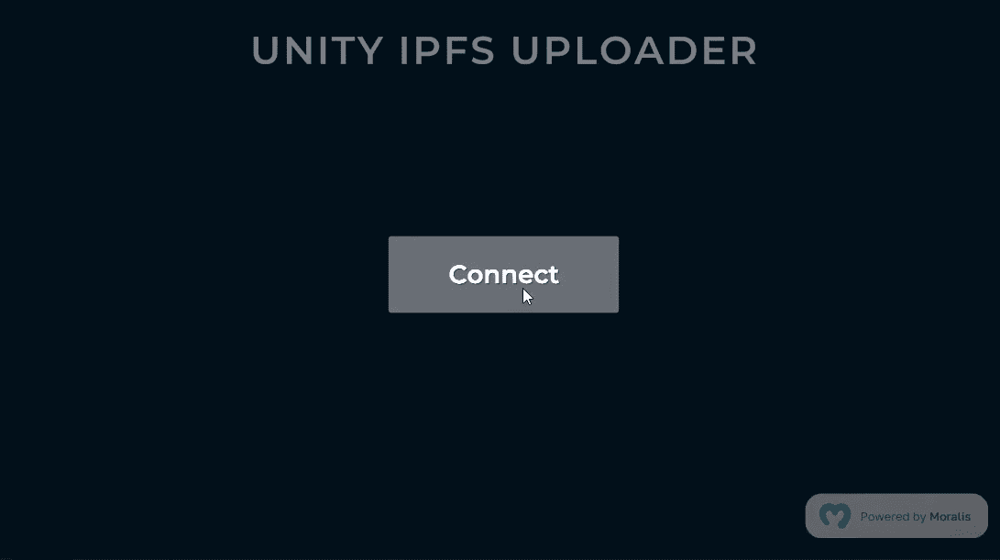
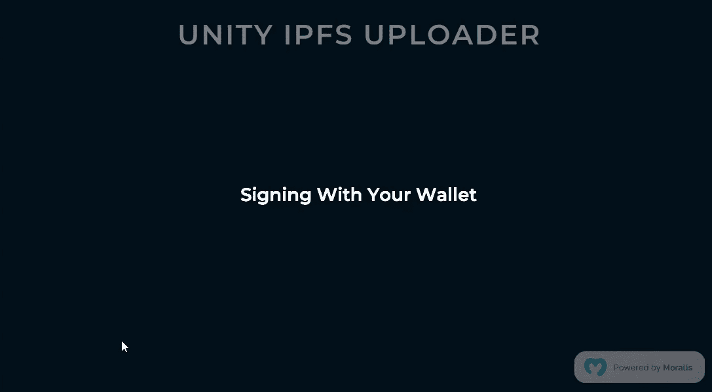
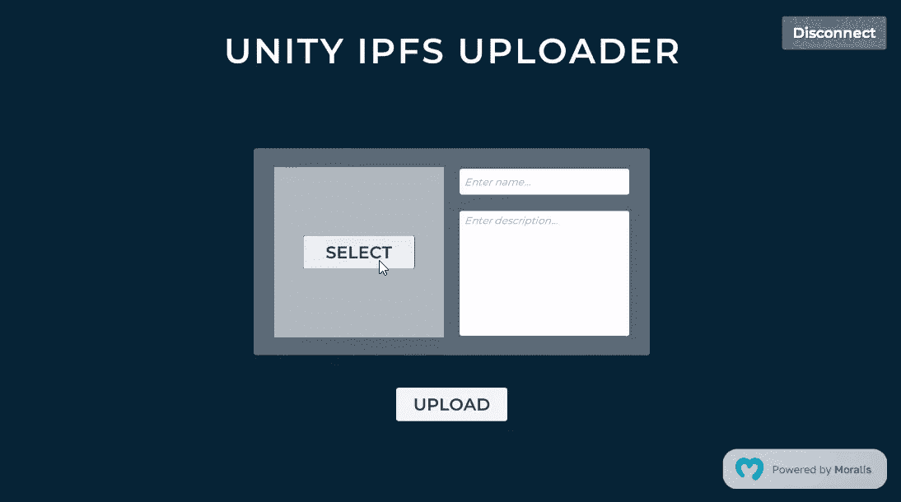
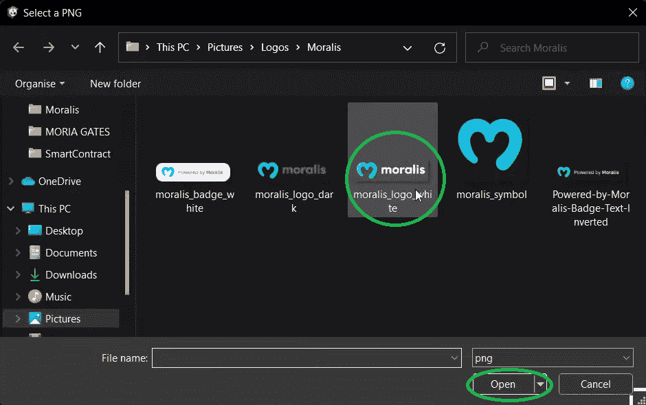
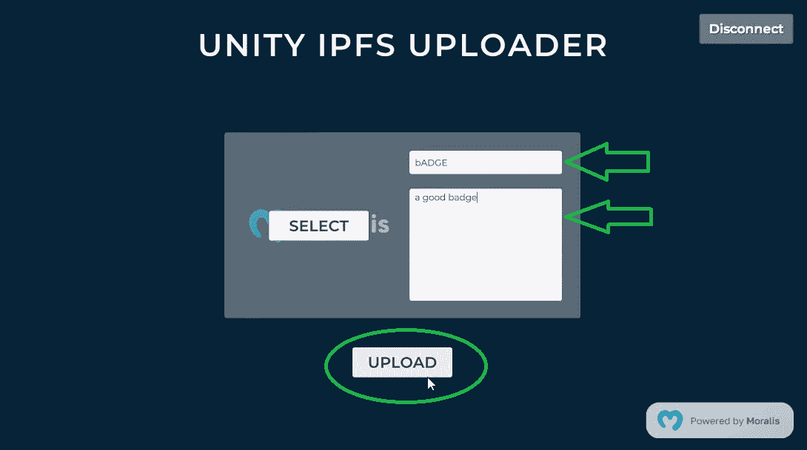
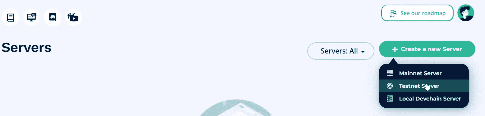
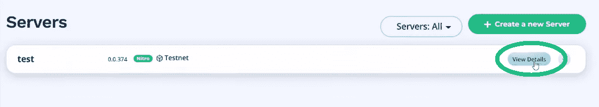
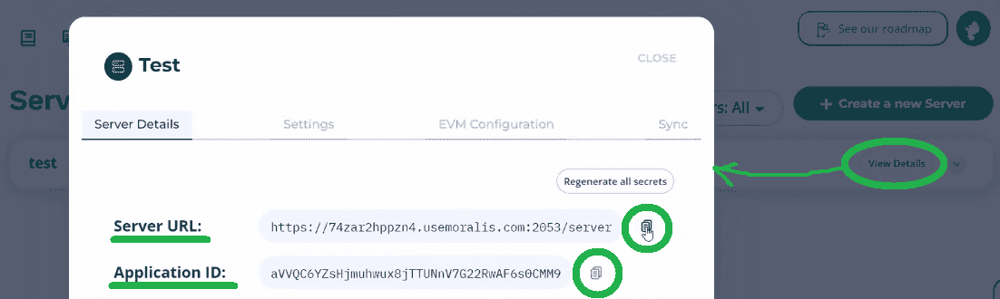
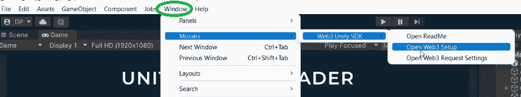
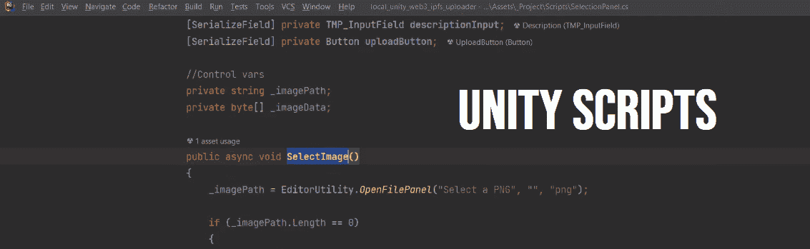

# 如何将 Unity 资产上传到 IPFS

> 原文：<https://moralis.io/how-to-upload-unity-assets-to-ipfs/>

**如你所知，区块链博彩公司凭借其去中心化的本质正在彻底改变博彩业。所以，当使用 Unity 等平台开发** [**GameFi**](https://moralis.io/gamefi-tutorial-how-to-create-a-gamefi-game/) **或** [**P2E 游戏**](https://moralis.io/how-to-build-a-play-to-earn-p2e-game/) **时，开发者必须坚持保持分散化。这包括不要以集中的方式上传和存储资产。为此，开发人员可以使用 IPFS (** [**星际文件系统**](https://moralis.io/what-is-ipfs-interplanetary-file-system/)**)——一种以分散方式存储内容的协议。然而，您可能想知道，“如何将 Unity 资产上传到 IPFS？”。幸运的是，本文解决了这个问题。继续前进，我们探索我们的“** [**”上传到 IPFS 的**](https://moralis.io/full-guide-how-to-upload-to-ipfs/)**“dapp(**[**)分散应用**](https://moralis.io/decentralized-applications-explained-what-are-dapps/) **)我们使用 Unity 和** [**构建的**](http://moralis.io/) **。因此，您将知道如何快速轻松地将 Unity 资产上传到 IPFS！**

如果你决定探索我们的例子 dapp，你将学会如何使用 Moralis 的力量。在创建这个 [Web3](https://moralis.io/the-ultimate-guide-to-web3-what-is-web3/) 应用程序的实例时，您将完成初始的 Moralis 设置。后者将让您访问 [Moralis SDK](https://moralis.io/exploring-moralis-sdk-the-ultimate-web3-sdk/) ，其中包括 IPFS 集成。因此，将 Unity 资产上传到 IPFS 成为可能。当然，这取决于你把这个“IPFS 上传者”dapp 进一步使用。希望你在创建自己的 Web3 游戏时会发现它很有用。这也是 Moralis 将满足你所有与 Web3 相关的后端需求的地方。例如，你可以很容易地用这个“ [Firebase for crypto](https://moralis.io/firebase-for-crypto-the-best-blockchain-firebase-alternative/) ”平台涵盖诸如 [Web3 认证](https://moralis.io/web3-authentication-the-full-guide/)等特性。此外，由于 Moralis 的跨链互操作性，您可以针对所有支持的区块链。因此，您的 Web3 开发过程是面向未来的。因此，在继续之前，请确保[创建您的免费 Moralis 账户](https://admin.moralis.io/register)。

## 将 Unity 资产上传到 IPFS–演示

在我们展示如何使用我们的“上传者”dapp 将 Unity 资产上传到 IPFS 之前，我们想确保你们都知道它会带来什么。因此，让我们从快速演示我们的 dapp 开始。看下面的截图，你可以看到为了使用“上传者”dapp，你需要完整的 Web3 登录:

点击“连接”按钮后，此 Unity dapp 要求我们扫描二维码:

我们用我们最喜欢的 [Web3 钱包](https://moralis.io/what-is-a-web3-wallet-web3-wallets-explained/)、 [MetaMask](https://moralis.io/metamask-explained-what-is-metamask/) 来扫码。因此，我们将使用元掩码对[进行认证。一旦我们扫描了代码，界面会让我们知道这个过程正在进行中:](https://moralis.io/how-to-authenticate-with-metamask/)

在您的手机钱包中确认“签名”流程后，您将看到用于将 Unity 资产上传至 IPFS 的界面:

### 上传 PNG 文件

看上面的截图，你可以看到我们的 dapp 相当简单直观。即使没有我们的指导，你也很可能知道如何使用它。不过，为了以防万一，我们还是一起过一遍细节吧。在右上角，有一个“断开”按钮。后者会将你注销(断开你的 Web3 钱包)。虽然，就上传 Unity 资产到 IPFS 来说,“选择”和“上传”按钮就可以了。但是，如您所见，还没有选择任何文件。因此，我们从这里开始。因此，一旦我们单击“选择”按钮，就会出现一个弹出窗口:

*注意:* *对于这个例子，我们重点介绍 PNG 文件；但是，您也可以使用相同的 dapp 将其他 Unity 资产上传到 IPFS。*

使用上面的弹出窗口，我们选择一个 PNG 文件，然后单击“打开”按钮。通过这样做，我们的 dapp 收集文件的细节，并在“选择”按钮下创建图像的预览:

在我们上传选择的文件之前，我们需要输入它的名称和描述。一旦我们有了文件的详细信息，我们可以点击“上传”按钮，上传我们的 Unity 资产到 IPFS。此外，它还创建了我们文件的元数据(“。JSON 文件”)，该文件也存储到 IPFS:

*   元数据:

*   PNG 文件:

我们的演示到此结束。我们希望您喜欢我们 dapp 的简单和高效。如果是这样，你一定很想知道如何使用它将你的 Unity 资产上传到 IPFS。

*注:* *如果你更喜欢视频，你可以在本文末尾查看我们 dapp 的视频演示。*

## 使用我们的 Dapp 和 Moralis 将 Unity 资产上传到 IPFS

看完上面的演示，你已经知道如何使用我们的 dapp 了。所以，现在让我们来帮助你设置它——这是我们将依靠 Moralis 的地方。然后，我们还将带您浏览脚本。因此，您将了解我们的 dapp 如何使用原生 Windows 文件浏览器选择图像文件。此外，你会发现它如何上传选定的 Unity 资产到 IPFS。那是你能看到 Moralis 力量的地方。当前 [Web3 技术栈](https://moralis.io/exploring-the-web3-tech-stack-full-guide/)的顶峰帮助你避免处理 RPC 节点的所有[限制。](https://moralis.io/exploring-the-limitations-of-rpc-nodes-and-the-solution-to-them/)

由于 Moralis 的单一工作流程，如此高度的简单性成为可能。例如，Moralis 提供了一小段负责认证用户的代码。用户登录后，Moralis 会建立会话并创建身份配置文件。与该会话相关的信息随后被存储在实时在线数据库(Moralis 的仪表板)中。后者是 Moralis 使你能够[指数化区块链](https://moralis.io/how-to-index-the-blockchain-the-ultimate-guide/)的方式。此外，您可以更进一步——您可以[同步和索引智能合约事件](https://moralis.io/sync-and-index-smart-contract-events-full-guide/)。当然，这个终极 [Web3 后端平台](https://moralis.io/exploring-the-best-web3-backend-platform/)还为你提供了 Web3 SDKs 和 API([以太坊 API](https://moralis.io/ethereum-api-develop-ethereum-dapps-with-moralis/) 、 [NFT API](https://moralis.io/ultimate-nft-api-exploring-moralis-nft-api/) 等。)与数据库通信。尽管如此，Moralis 也是关于跨链和跨平台的互操作性。因此，它为您提供了许多选择，并将使您的工作经得起未来的考验。所以，如果你还没有这样做，在继续之前创建你的免费 Moralis 账户。

## 获取我们的统一 IPFS 上传 Dapp

从下载我们的项目开始——所有的文件和文件夹都在 [GitHub](https://github.com/MoralisWeb3/youtube-tutorials/tree/main/unity/unity-web3-ipfs-uploader) 上等着你。然后，在 Unity 中打开项目。在 Unity 中，您首先会看到的是 Moralis 设置面板:

查看上面的截图，您可以看到面板在底部为您提供了说明:

1.  创建您的 Moralis 帐户或[登录](https://admin.moralis.io/login)您现有的帐户。
2.  [创建一个 Moralis dapp](https://docs.moralis.io/moralis-dapp/getting-started/create-a-moralis-dapp) ，这意味着你需要[创建一个 Moralis 服务器](https://docs.moralis.io/moralis-dapp/getting-started/create-a-moralis-dapp#2.-create-a-moralis-server)。
3.  一旦您的服务器启动并运行，请使用“查看详细信息”按钮获取您的 dapp URL 和 ID。

然而，为了让事情对你更明显，让我们通过上述步骤来指导你。

### Moralis Web3 安装指南

由于您已经准备好了您的 Moralis 帐户，请使用您的凭据登录:

一旦进入 Moralis 管理区域，您需要创建一个新的服务器。*如果这是您第一次使用 Moralis，您将看到以下屏幕指南:*

单击“+创建新服务器”按钮后，将出现一个弹出窗口，提供不同类型的服务器:

对于这个示例项目，选择“Testnet 服务器”。我们建议将测试网用于所有教育和测试目的。除了[以太坊试验网](https://moralis.io/ethereum-testnet-guide-connect-to-ethereum-testnets/)和它的 mainnet，你还有其他的 [EVM](https://moralis.io/evm-explained-what-is-ethereum-virtual-machine/) 兼容网络供你使用。但是，在选择网络之前，请输入服务器的详细信息:

您的服务器名称可以是您想要的任何名称。对于地区，请选择离您最近的城市。然后，选择您想要的链，最后用“添加实例”按钮启动服务器。服务器启动并运行后，您可以访问其详细信息。这样，您就可以使用我们的 dapp 将 Unity 资产上传到 IPFS。使用上面创建的服务器的“查看详细信息”按钮:

点击上面的按钮后，您将看到一个新窗口，显示所有的详细信息，包括服务器 URL 和应用程序 ID。最后，使用“复制”图标将数值复制到 Unity 中的“Moralis Web3 设置”面板:

将 dapp URL 和 ID 粘贴到指定的输入字段后，单击“完成”按钮:

*注意* *:使用你的服务器的详细信息。* ***不要*** *使用上面显示的细节。*

此外，我们必须指出，您可以随时更改您的 dapp URL 和 dapp ID。如果您创建了一个新的服务器，并想用它将 Unity 资产上传到 IPFS，您需要这样做。所以，这就是你如何访问上面的面板:

### 启动统一 IPFS 上传 Dapp

完成上述设置后，您就可以像前面演示的那样使用我们的 dapp 了。为此，只需点击播放图标:

一旦重新加载完成，您将看到“连接”按钮，这是我们上面演示的起点。

## 将 Unity 资产上传到 IPFS–代码演练

如果您还记得演示，使用我们的 dapp 将 Unity 资产上传到 IPFS 有两个方面。首先，我们需要选择一个文件(在我们的例子中，是一个图像)。其次，我们必须将选定的文件上传到 IPFS。那么，让我们从“选择”部分开始。

### 代码演练–选择文件

正如您在下面的截图中看到的，我们有“SelectPanel”对象，它负责选择图像:

此外，我们通过使用“AuthenticationKit”进行设置，这样一旦用户通过身份验证，就会自动激活“SelectionPanel”。

我们还来看看“ [SelectionPanel](https://github.com/MoralisWeb3/youtube-tutorials/blob/main/unity/unity-web3-ipfs-uploader/Assets/_Project/Scripts/SelectionPanel.cs) ”脚本。点击“选择”按钮后，“选择图像()”功能完成了大部分繁重的工作(参见演示)。该函数使用“OpenFilePanel”方法打开本机 Windows 文件浏览器:

*_imagePath = EditorUtility。OpenFilePanel("选择一个 PNG "，""，" PNG ")；*

*注意* *:如果你想使用我们的“上传器”dapp 来上传其他类型的文件，你需要修改上面一行代码中的“png”。*

“SelectImage”函数然后使用所选文件的路径，读取所有字节，并返回图像数据。接下来，它使用“LoadImage”创建一个 sprite。

### 代码演练–上传文件

一旦我们准备好雪碧，我们需要上传它。这就是“OnUploadButtonPressed()”(仍在“SelectionPanel”脚本中)发挥作用的地方:

*public void OnUploadButtonPressed()*

*{*

*if(image . sprite = = null | | name input . text = = string。empty | | description input . text = = string。空)*

*{*

*调试。Log("所有字段(图像、名称和描述)都需要填写")；*

*返回；*

*}*

*上传按钮已按下？。Invoke(nameInput.text，descriptionInput.text，_imagePath，_ imageData)；*

*upload button . interact able = false；*

*}*

查看上面的代码行，您可以看到“上传”按钮只有在三个条件都满足时才能工作。也就是说，直到我们选择了一个图像(创建了一个精灵)，输入了我们的文件名和它的描述。一旦所有条件都满足了，那么“ [AppManager](https://github.com/MoralisWeb3/youtube-tutorials/blob/main/unity/unity-web3-ipfs-uploader/Assets/_Project/Scripts/AppManager.cs) ”脚本就会接管一切。在这个脚本中，“UploadToIpfs”确保我们的 dapp 正确地将 Unity 资产上传到 Ipfs。这个函数接受文件的名称、描述、路径和数据(在我们的例子中是图像数据)。而且“UploadToIpfs”先用“SaveImageToIpfs”保存选中的图片。这就是 Moralis 的魔力通过“上传文件夹”方法进入画面的地方:

列出<ipfs file>resp = await Moralis。GetClient(). web 3 API . storage . upload folder(请求)；

实际上，上面的单行代码将 Unity 资产上传到 IPFS。尽管如此,“AppManager”脚本也确保了上传文件的元数据是使用“BuildMetadata”创建的。然后，它使用“SaveToIpfs”将元数据保存到 Ipfs。

在上传了图像和元数据并创建了它们的 URL 之后，“AppManager”还会重置上传按钮。它使用“ResetUploadButton”功能来防止再次上传相同的文件。

这里还有一个上述 dapp 的视频教程:

https://www.youtube.com/watch?v=rVlh2BzjmU4

## 如何将 Unity 资产上传至 IPFS–摘要

此时，您应该有自己的“将 Unity 资产上传到 IPFS”dapp 实例供您使用。根据我们的说明，您可以通过输入您的 Moralis 服务器的详细信息来激活它。由于上面的演示，你也有机会学习如何使用这个 dapp。尽管如此，我们也向您展示了确保我们的 dapp 正常运行的脚本。此外，让我们指出，这个 dapp 是一个有用的工具，当你用 Unity 承担 [Web3 游戏设计](https://moralis.io/web3-game-design-explaining-the-web3-game-design-process/)时，你会看到这一点。尽管如此，在你解决你自己的想法之前，我们建议你完成一些其他的 Unity 教程。这样，你将学会如何[将一个 Unity 应用连接到一个 Web3 钱包](https://moralis.io/how-to-connect-a-unity-app-to-a-web3-wallet/)(连接一个 [Unity 游戏与 Web3 登录](https://moralis.io/connecting-a-unity-game-with-web3-login/))，[与来自 Unity 的 Web3 数据库](https://moralis.io/how-to-communicate-with-a-web3-database-from-unity/)通信，用 Unity 做[区块链游戏交易](https://moralis.io/how-to-do-blockchain-game-transactions-with-unity/)，甚至[创建一个元宇宙 dapp](https://moralis.io/how-to-create-a-metaverse-dapp-with-unity/) 。

另一方面，您可能渴望探索其他区块链发展主题。如果是这样，一定要访问[Moralis 博客](https://moralis.io/blog/)和[Moralis YouTube 频道](https://www.youtube.com/c/MoralisWeb3)。这两个渠道都提供了大量有价值的内容，可以作为你继续免费加密教育。例如，一些最新的文章包括[crypto perspective dapp](https://moralis.io/how-to-create-a-crypto-sentiment-dapp/)教程、 [blockend 开发](https://moralis.io/blockend-development-what-is-it-and-how-to-become-a-blockend-developer/)指南、如何[使用 Phantom wallet](https://moralis.io/how-to-authenticate-solana-users-with-the-phantom-wallet/) 认证 Solana 用户、NFT [在线库存系统](https://moralis.io/create-an-nft-on-chain-inventory-system-for-gaming/)、 [Solidity smart contracts](https://moralis.io/what-are-solidity-smart-contracts-full-solidity-tutorial/) 教程以及构建[去中心化 Twitter](https://moralis.io/2022-guide-to-building-a-decentralized-twitter/) 等等。此外，我们鼓励你加入 [Moralis 项目](https://moralis.io/projects/)参加每周挑战，并有机会获得一些很酷的 NFT。尽管如此，如果你真的想成为一名 Web3 开发者，你应该考虑报名参加 T21 Moralis 学院。