# 如何在 Unity 中使用 Filecoin 进行存储

> 原文：<https://moralis.io/how-to-use-filecoin-in-unity-for-storage/>

**分散式存储解决方案是几个受欢迎的区块链用例之一。毕竟，我们欣赏使用云存储而不依赖于任何特定的中央实体的实用性。这就是 Filecoin 通过向 IPFS 添加激励性和持久性存储来突破界限的地方。此外，由于 Web3 游戏提供了无数的机会，我们决定探索如何在 Unity 中使用 Filecoin。我们的想法是利用分散存储来保存和加载图像。这个用例可以应用于 Web3 游戏、NFTs 和其他类型的 dapps。此外，我们决定使用一些令人敬畏的** [**Web2 和 Web3**](https://moralis.io/web2-to-web3-bridging-web2-and-web3/) **工具的力量将我们的想法变成一个优秀的 dapp。**

我们使用 Moralis 的认证解决方案来覆盖 Web3 登录、Filecoin 存储和 Unity 游戏引擎。当然，我们将由您来决定是否采纳我们的概念，并以您独特的方式在 Unity 中使用 Filecoin。接下来，我们将进一步了解我们的 Filecoin 利用率示例应用程序。后者是通过存储和检索 PNG 文件在 Unity 中使用 Filecoin 的一种简洁方式。当我们展示这个示例项目时，您将学习 Filecoin 的基础知识。因此，您还会发现更容易决定这是否是适合您的存储解决方案。此外，您还将了解 Moralis——最终的 Web3 后端解决方案。虽然我们在这里将重点介绍如何使用 Moralis Web3 Auth API，但 Moralis 还可以提供更多内容。

除了 [Web3 认证](https://moralis.io/authentication/)，Moralis 的 [Web3 同步](https://moralis.io/syncs/)和 Moralis Web3 API 帮助你毫不费力地创建各种杀手级 dapps(去中心化应用)。因此，[创建你的免费 Moralis 账户](https://admin.moralis.io/register)，让你的 Web3 开发尽可能简单。

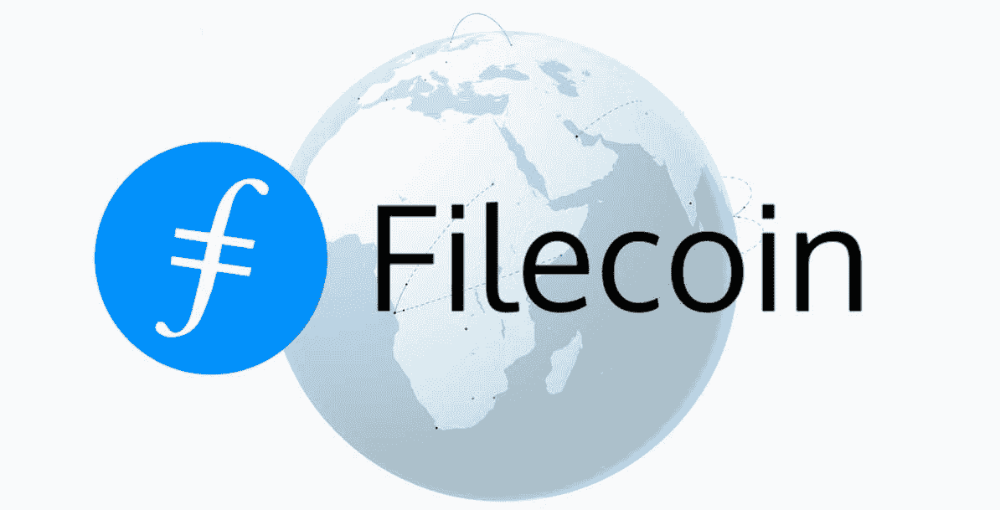

## 钱币网络 101

了解 Filecoin 的基础知识可以帮助你在 Unity 中正确使用 Filecoin。所以，我们先指出 Filecoin 是一个开源的解决方案。这是一个云存储市场、协议和激励层。Filecoin 网络建立在 IPFS 之上，提供分散和安全的数据存储和检索。根据 Filecoin.io 的说法，这个分散的存储网络致力于提供一个不受公司控制的更高效、更安全的网络。

此外，Filecoin 网络实现了惊人的规模经济。它允许任何人作为存储提供商参与进来，从而确保极具竞争力的价格。因此，Filecoin 网络由大量不同的存储提供商和开发商组成。这种多样性创造了强大而可靠的服务。本质上，这种开源存储是由每个人构建和拥有的。

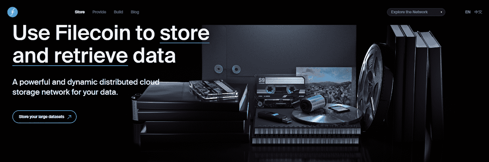

Filecoin 提供可证明的安全性和真实性。得益于内容寻址和加密存储证明，网络可以验证数据随着时间的推移是否得到了正确和安全的存储。此外，您可以通过调整冗余、检索速度和成本策略来定制此存储解决方案，以满足您的需求。尽管如此，Filecoin 网络是一个由工具、库、提供商和集成组成的快速增长的生态系统。*更多详情，请浏览 Filecoin 官方网站。*

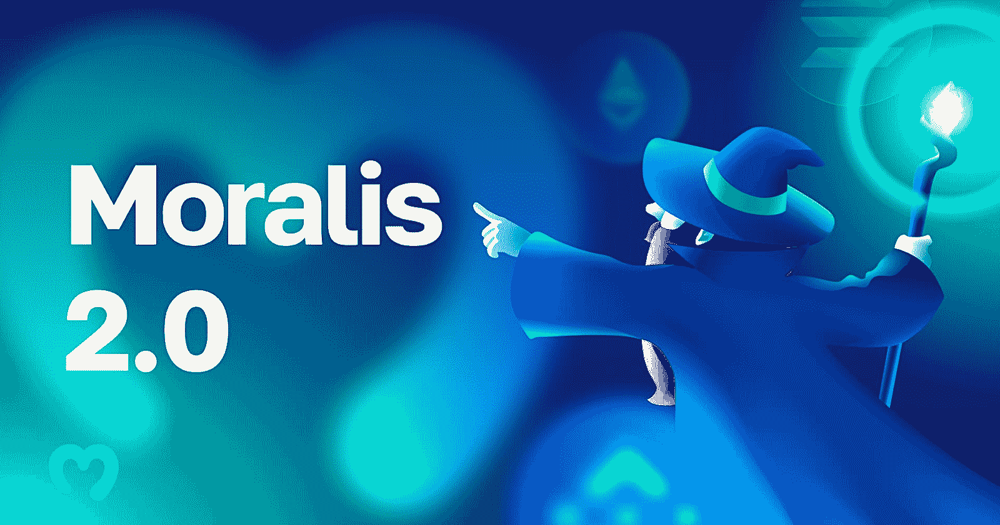

### 认识 Moralis——轻松开发 Web3 的门户

由于 Moralis 的 Unity SDK 使我们能够使用这个流行的游戏引擎进行 Web3 开发，因此，在 Unity 中使用 Filecoin，您应该了解更多关于这个优秀工具的信息。然而，除非你一直生活在岩石下，否则你很可能已经熟悉 Moralis。如果没有别的，你在介绍中了解到 Moralis 是最终的 Web3 后端平台。这一切都是为了让传统开发者能够轻松加入 Web3 革命。

因为 Moralis 是跨平台互操作的，所以您可以在不同的平台和编程语言上使用它。此外，Moralis 从一开始就考虑到了跨链的互操作性。因此，该平台支持所有领先的可编程链，包括以太坊、索拉纳、BNB 链、Polygon、Avalanche、Cronos、Fantom 等。因此，您可以使用相同的代码行来扩展您的范围。此外，事实上，Moralis 继续不断地添加对新链的全面支持，也是对您工作的未来证明。

最终，Moralis 使您能够用单行代码向您的应用程序添加 Web3 身份验证、Web3 同步和无数其他 Web3 特性。此外，您可以从一个结构整洁的 [Moralis 文档](https://docs.moralis.io/)中复制这些代码行。因此，您可以在后端开发上节省大量的时间和资源。此外，这使您能够将最大的注意力放在创建最好的 UI 和 UX 上。因此，如果你还没有这样做，请确保现在就创建你的免费 Moralis 帐户，并开始部署令人敬畏的 Web3 应用程序。

## 如何在 Unity for Storage 中使用 Filecoin–示例项目

我们通过问自己“我们有什么选择来将 Filecoin 和 Unity 结合起来？”来着手这个项目。此外，我们希望能够存储和获取资产。此外，我们决定特别关注图像(png ),并以各种方式使用它们。这种思维方式让我们来到了 Web3。存储，它提供存储和一个 HTTP API。因此，我们知道我们可以使用 API 从 Unity 内部调用我们需要的任何东西。因此，为了跟随我们的领导继续前进，您还需要完成这个简洁工具的初始设置。此外，您还会想要克隆我们的代码或下载我们的项目 ZIP 文件，这些文件在 [GitHub](https://github.com/MoralisWeb3/web3-unity-sdk-examples) 上等待着您:

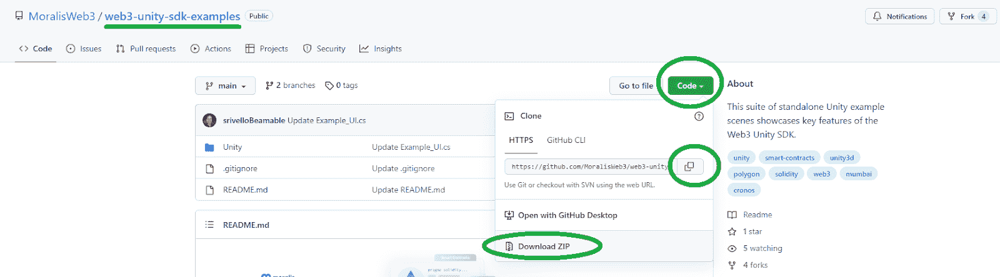

然而，在您打开我们的示例项目之前，让我们仔细看看我们的 Unity dapp。

## 利用我们的 Dapp 演示在 Unity 中使用 Filecoin 进行存储

*注意* *:在 Unity 中打开我们的项目并完成初始设置后，你就可以玩我们的 dapp 了。下面呈现的截图围绕“Example_Filecoin_Storage_01”场景。*

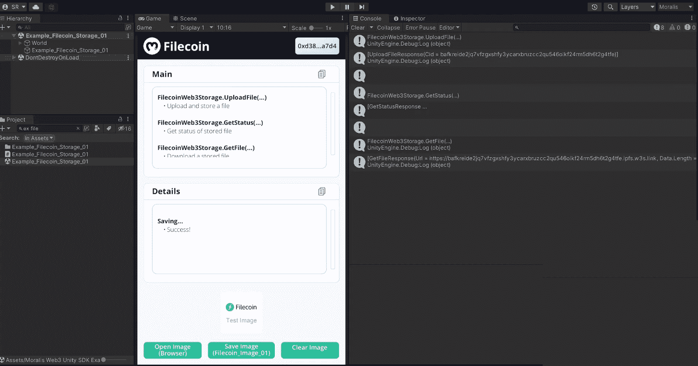

上面的截图表明我们的例子 dapp 的界面在中间。如您所见，我们将 dapp 命名为“Filecoin ”,并将其分为“Main”和“Details”两个部分。此外，dapp 会在右上角显示我们的地址，因为我们已经通过了身份验证。此外，在“细节”部分下面，您还可以看到一个我们正在上传到 Filecoin 的示例 PNG 图像。尽管如此，如果你决定与我们的 dapp 合作，在 Unity 中使用 Filecoin，你还可以探索底部的三个按钮。在最左侧，有一个“打开图像(浏览器)”按钮，可以在浏览器中打开上传的图像。然后，我们有“保存图像”按钮，它将选择的图像保存到 Filecoin。最后但同样重要的是，还有一个“清除图像”按钮，它可以从你的 dapp 中删除图像。

而且，如果您查看“Main”部分，您可以看到我们的 dapp 首先上传文件，然后获取其状态，最后下载一个存储的文件。我们的 dapp 完成了整个循环，只是为了演示 PNG 文件的存储和检索。

此外，现在让我们单击“清除图像”按钮:

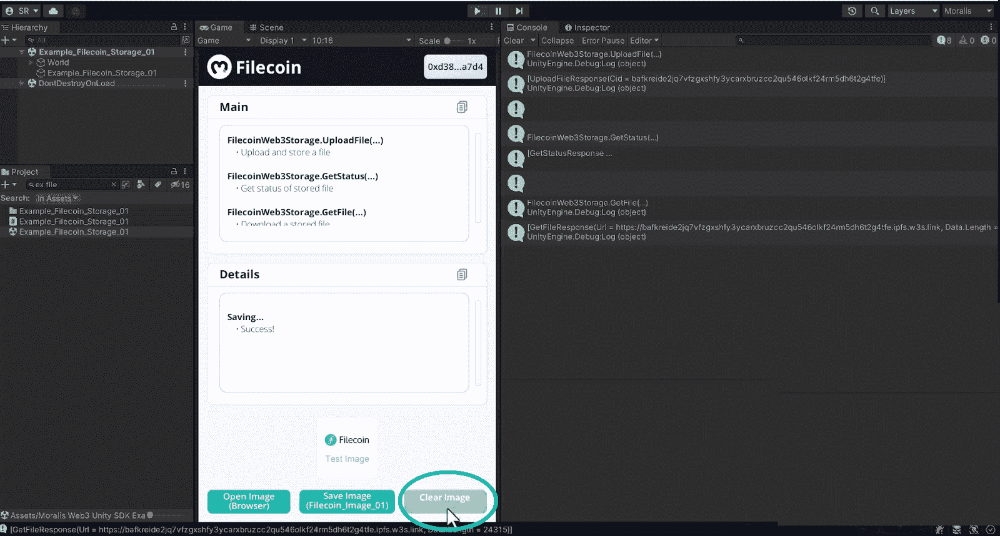

如上所述，这个按钮从 UI 中清除图像(它的精灵):

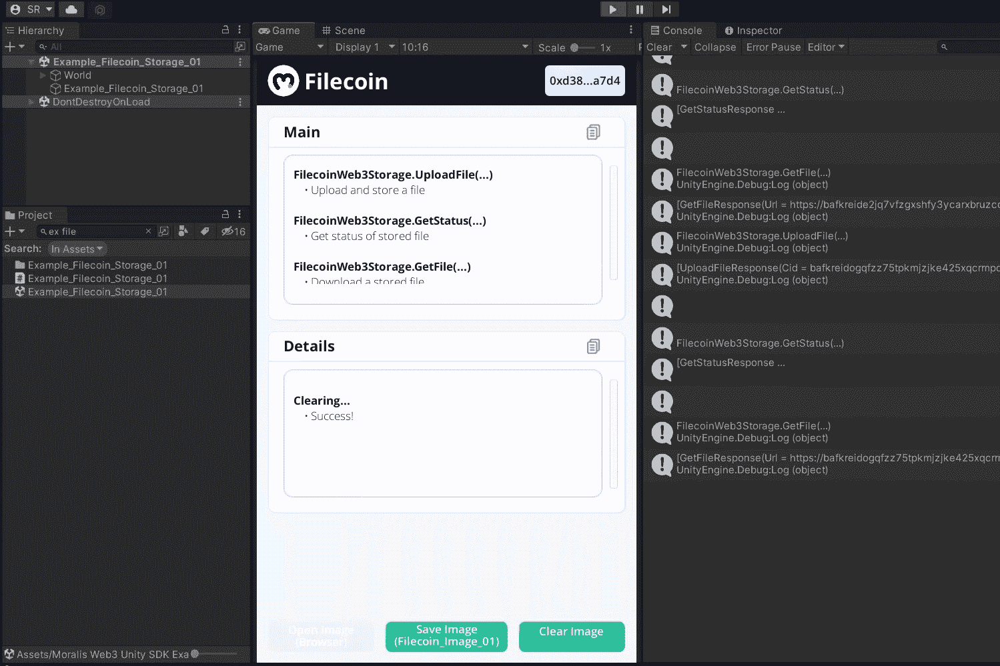

如果我们要重复保存图像的过程，我们需要使用“保存图像”按钮。这也将重新激活“打开图像”按钮。此外，如果您想要存储不同的图像，您需要使用“检查器”标签并更改“要保存的精灵”旁边的文件:

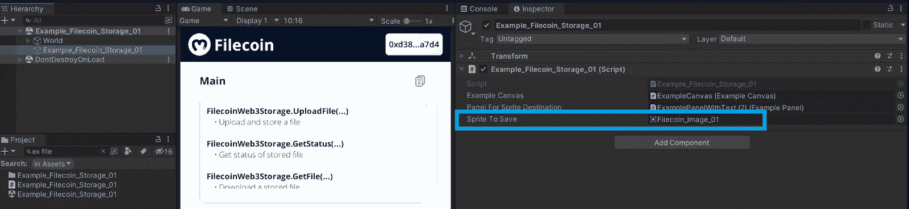

## 在 Unity 中使用 Filecoin 进行 Web3 游戏

现在您已经知道了我们的示例 dapp 会带来什么，是时候打开它并完成初始设置了。我们建议您从“Documentation”文件夹中的“ReadMe”资产开始。它将带您完成在 Unity 中使用 Filecoin 和我们的 dapp 所需的所有步骤。另外，不要忘记创建你的网站。存储 API 令牌。

### Web3。存储–连接 Filecoin 和 Unity

如果你想用 Web3。存储，访问该工具的官方网站，注册并创建您的 API 令牌:

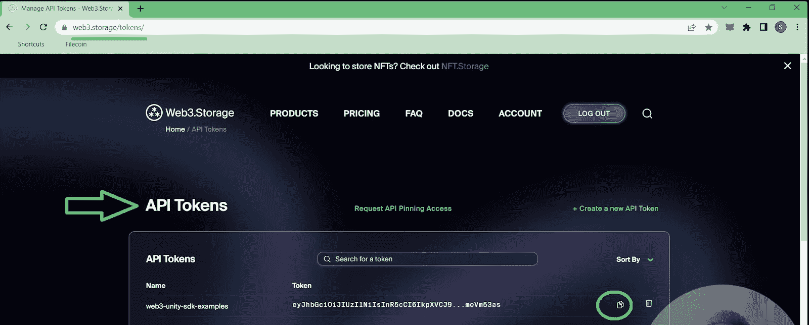

此外，在你的账户里，你可以看到所有在 Unity 里的上传活动。这在项目的调试阶段非常有用:

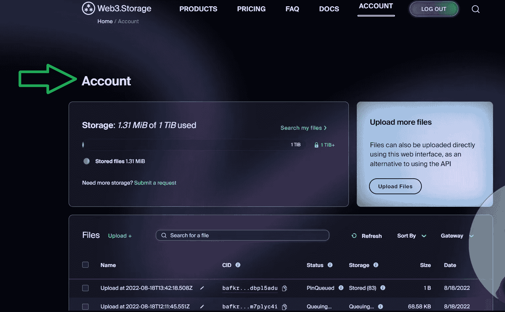

*注:* *您也可以使用 Web3 上传文件。存储的仪表板，然后在 Unity 中检索这些文件。*

一旦进入“ReadMe”资产的第五步，您将可以对我们的 dapp 进行测试。一旦你习惯了使用它，你就可以想出一些很酷的方法来使用这个工具来完成你的 Web3 游戏壮举。如果你有一些好主意，我们强烈建议你注册参加 Moralis x Filecoin 1，2，Web3 黑客马拉松，并有机会获得 190，000 美元的奖金，并开始计算奖金池！

### 代码走查

在这一节中，我们将仔细看看支持“Filecoin”dapp 的脚本。详情我们会在下面给你指出视频教程的具体部分。在本视频中，您将直接从我们内部的 Unity 专家“Filecoin”Unity dapp 的创建者那里听到它。因此，您将有机会在不同的层面上了解我们的 dapp 示例。但是，请确保您首先花一些时间来探索项目布局。如果没有什么，这将帮助你更顺利地四处走动:

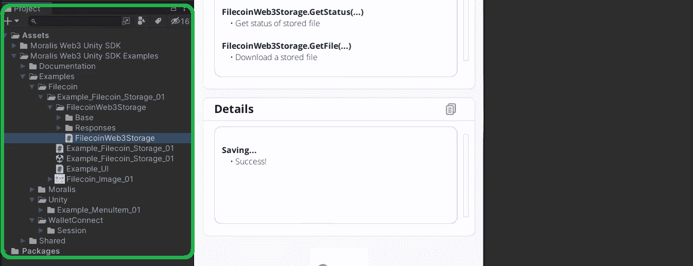

上述示例 dapp 的主脚本名为“Example_Filecoin_Storage_01”，用 C#编写。此外，从下面视频的 6:40 开始，我们的 Unity 专家将介绍该脚本的一些关键方面。其中一个关键方法是"*Filecoin _ UploadAndGetFile*"，正如它的名字所说:

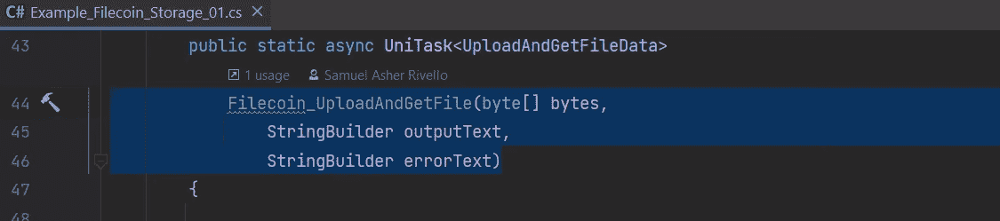

此外，为了方便起见，该脚本包含了许多有用的注释，包括 Web3 的设置说明。存储:

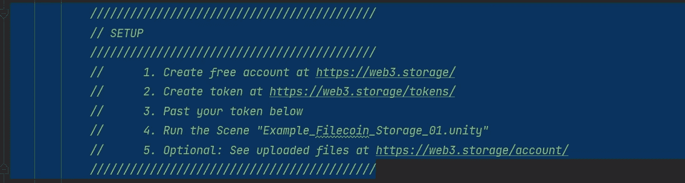

然而，由于我们已经在上面讨论过了，您知道您只需要粘贴您的 API 令牌。此外，查看"*Example _ file coin _ Storage _ 01*"脚本，您还会看到" *UploadFile* "函数接受我们的开发人员通过转换示例图像创建的字节:

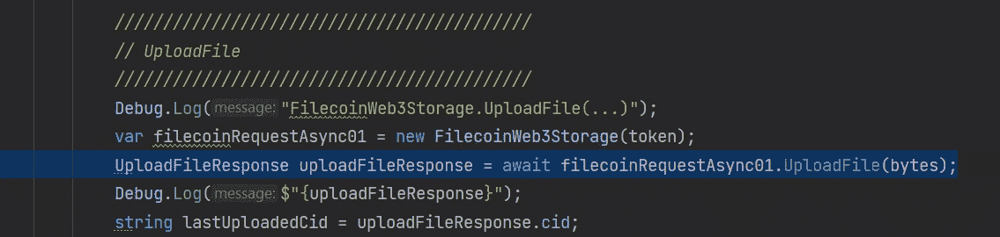

然后，在 7:29，您可以仔细看看" *GetStatus* "方法，它在某些情况下会很有用。接下来，您将看到获取 PNG 文件的代码行。“*GetFile*”API 调用为我们的文件提供了字节。因此，我们需要渲染字节来创建一个精灵。最后，您还将有机会查看以适合我们 UI 的格式提供数据的代码行(8:10)。

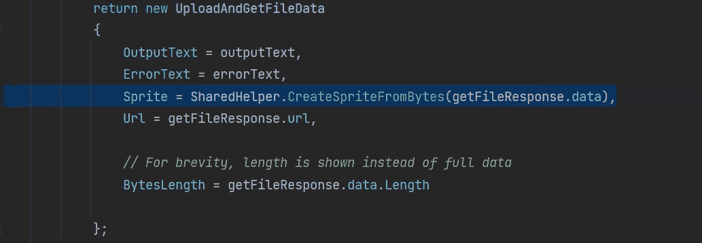

#### Filecoin，Unity，Web3。储物和 Moralis——我们的视频教程

最后，这是我们上面提到的视频教程。除了更详细的代码演练之外，在这里你可以学到关于 Filecoin、Unity、Moralis 和 Web3 的所有知识。储物件，让你的双手变脏。从 8:47 开始，你可以了解更多关于前面提到的黑客马拉松的细节，包括奖金池细分。

https://www.youtube.com/watch?v=ksivvqiK95I

## 如何在 Unity for Storage 中使用 Filecoin–总结

在这篇文章中，我们讨论了相当多的内容。首先，我们的讨论确保了你知道 Filecoin 是什么。因此，您了解了这种分散存储解决方案的基础知识。接下来，我们向您介绍了 Moralis——这是您轻松开发 Web3 的门票。因此，您发现这个终极的 Web3 开发平台为您提供了一个简单的方法来使用您最喜欢的 Web2 开发平台创建 dapps。接下来，我们将重点放在如何在 Unity 中使用 Filecoin。这也是你了解 Web3 的地方。Storage，它为您提供了一个 API 来与 Unity 的 Filecoin 进行通信。此外，您还有机会查看我们的示例“Filecoin”dapp，甚至创建自己的实例。最后，我们的内部专家向您展示了我们的示例 dapp 背后的代码。

此外，您还了解了 Moralis x Filecoin 1，2，Web3 黑客马拉松，它提供了相当可观的奖金池。所以，如果你熟悉 C#，就在 Unity 中使用 Filecoin，创造出令人敬畏的 Web3 游戏。然而，如果你首先需要打磨一下你的 Web3 技能，那么接一些有趣的例子项目应该是你的主要关注点。幸运的是，你可以在 [Moralis 的 YouTube 频道](https://www.youtube.com/c/MoralisWeb3)和 [Moralis 的博客](https://moralis.io/blog/)上找到很多教程。当然，学习如何用 Moralis 的 Unity SDK 将 Unity 转换成一个强大的 Web3 开发工具只是其中的一小部分。本质上，这两个出口可以告诉你如何快速和容易地创建各种 dapps。

尽管如此，除了“在 Unity 中使用 Filecoin”这个话题之外，另一个更专业的途径是报名参加[Moralis 学院](https://academy.moralis.io/)。Moralis 学院是排名第一的 Web3 在线教育平台。在那里，你可以很快成为区块链认证，并去全职加密在任何时候！