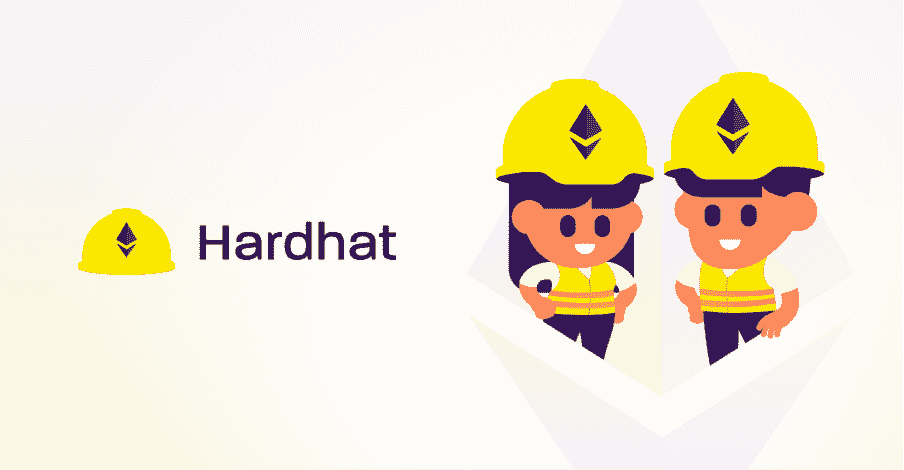
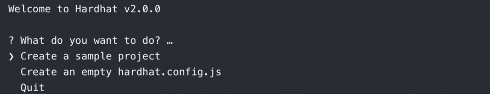
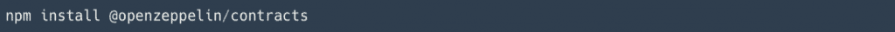
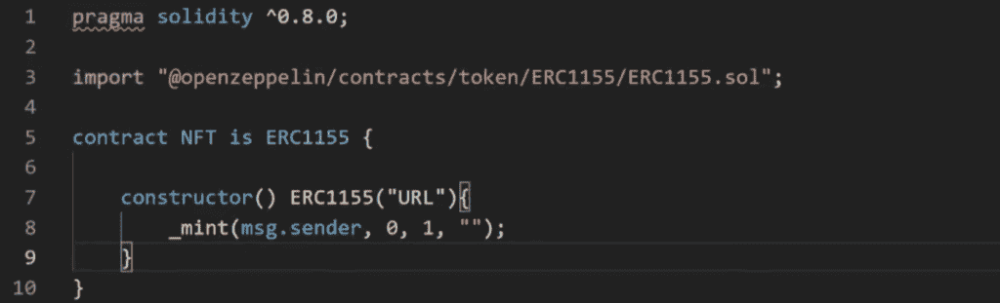
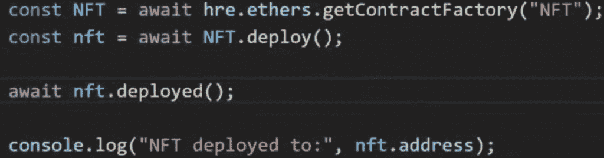
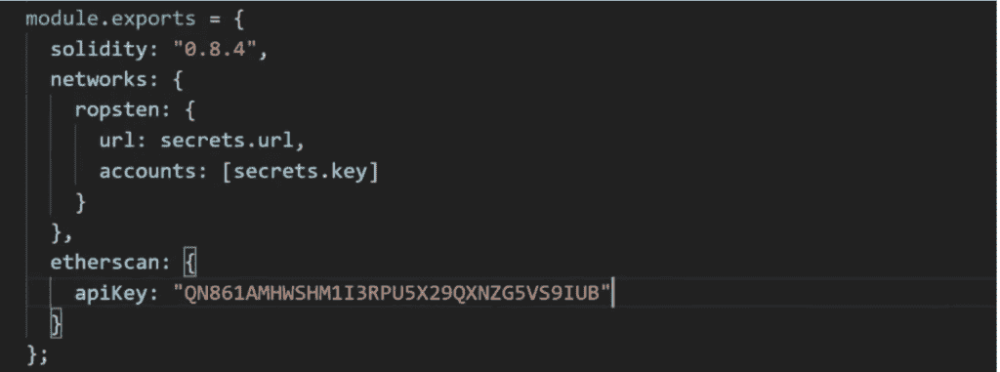
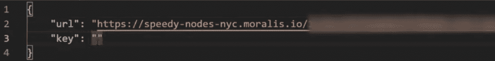
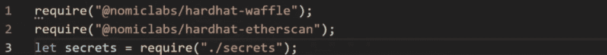

# 如何用 Hardhat 验证智能合同

> 原文：<https://moralis.io/how-to-verify-a-smart-contract-with-hardhat/>

****智能合约是** [**Web3**](https://moralis.io/the-ultimate-guide-to-web3-what-is-web3/) **开发的重要组成部分，在**[**dApps**](https://moralis.io/decentralized-applications-explained-what-are-dapps/)**的区块链生态系统中扮演着至关重要的角色。由于它们具有如此重要的功能，因此它们按预期工作并保持完全安全是至关重要的。这是因为不完整和失灵的智能合约会给企业带来巨大的经济损失。出于这个原因，验证智能合约以检查它们的有效性、正确性和安全性是非常有益的。因此，我们将进一步了解如何使用 Hardhat 验证智能合约的过程。****

**此外，为了使这个过程更快更容易，我们将利用。Moralis 是开发 dApps 的头号平台，用户可以访问功能齐全的后端基础设施。此外，该平台提供了一系列优秀的开发工具，如[Moralis Price API](https://moralis.io/introducing-the-moralis-price-api/)、[web 3 API](https://docs.moralis.io/moralis-web3-rest/deep-index-api)、跨链兼容性等等。**

**所以，如果你想在 [dApp 开发](https://moralis.io/how-to-build-decentralized-apps-dapps-quickly-and-easily/) 入门，第一步就是报名参加 Moralis。作为用户，您将能够显著缩短未来所有区块链项目的上市时间！**

### **什么是安全帽？**

**Hardhat 是开发人员用来编译、测试、部署和调试基于以太坊的 dApps 的环境。这意味着它帮助开发人员和编码人员管理许多开发智能合约的本地任务。**

**Hardhat 自带一个已经预建好的专注于开发的本地以太坊网络。网络被指定用于 [可靠性](https://moralis.io/solidity-explained-what-is-solidity/) 调试，并具有错误消息、堆栈跟踪等功能。因此，这种环境特别有助于开发人员了解他们的 dApps 失败在哪里，以及他们如何解决这些问题。**

****

**此外，插件是 Hardhat 的特征，这也是大多数功能的来源。因此，这是一个模块化的设计，允许用户选择在他们的开发过程中包含哪些插件。**

**然而，这仅仅涵盖了安全帽的基础知识，如果你对进一步的信息感兴趣，那么查看 Moralis 的文章，更详细地解释 [安全帽](https://moralis.io/hardhat-explained-what-is-hardhat/) 。**

# **如何使用 Hardhat 通过 5 个步骤验证智能合同**

**如何验证智能合同的过程并不复杂。借助适当的工具，我们可以在几分钟内完成这项工作。对于这个例子，我们将使用 Hardhat、Visual Studio 代码，当然还有 Moralis。**

****

**有了 Moralis，我们可以通过五个快速步骤完成这个过程:**

***   设置安全帽。*   创建 NFT 智能合同。*   创建部署脚本。*   修改“hardhat.config.js”。*   运行脚本并验证合同。**

**在接下来的章节中，我们将为您提供一个完整的流程演练，我们将创建一个契约，将其部署到 Ropsten Testnet，最后使用 Hardhat 验证该契约。此外，由于我们将使用 Moralis，这个过程变得既快速又简单，这对开发人员来说非常有益。**

**因此，如果您感兴趣，请跟随我们开始安装 Hardhat 并建立我们自己的项目！**

## **第一步:如何验证智能合约—设置 Hardhat**

**首先，我们必须安装 Hardhat，然后才能开始创建我们的项目。安装 Hardhat 相对容易，我们需要做的就是在源代码编辑器的终端输入以下命令:**

****

**这将立即安装 Hardhat，只需要几秒钟。一旦安装了开发环境，我们通过启动一个新的 Hardhat 项目来开始这个过程。要创建一个新项目，我们需要在终端中输入“npx hardhat”。这个命令将为开发人员提供一些不同的选项。我们需要确定的第一件事是我们想要创建什么样的项目。在我们的例子中，我们将选择一个基本的样本项目。一旦我们完成了项目的选择，我们就为项目设置了根，最后，我们还可以添加一个。gitignore”。**

****

**一旦我们完成选择，我们就有了项目的基本结构。例如，我们刚刚创建的示例项目默认包含一些文件，例如一个名为“Greeter.sol”的智能合约。**

**现在有了我们的示例项目，我们可以继续安装[OpenZeppelin](https://openzeppelin.com/)包。我们可以通过在终端中输入以下命令来做到这一点:**

****

**这将为我们提供所有不同的 OpenZeppelin 契约，以便我们可以将它们导入到我们的代码中。这是设置我们的环境的最后一步。我们现在可以进入下一步 [如何创建智能合约](https://moralis.io/how-to-create-smart-contracts/) 。**

## **步骤 2:如何验证智能合同—创建 NFT 智能合同**

**在上一步中，我们提到了默认的智能合约“Greeter.sol”。我们可以从删除它开始，创建一个新的合同。我们可以将这个新契约称为“NFT.sol”，这将是一个基本的[【NFT】](https://moralis.io/non-fungible-tokens-explained-what-are-nfts/)智能契约。因为这是一个关于如何验证智能契约的教程，所以我们不会花太多精力来创建我们的契约。所以，如果你感兴趣的话，Moralis 博客为你提供了一个完整的指南，教你如何创建自己的 NFT。尽管如此，这是完整的文件:**

****

**从上图中可以看出，我们在代码中实现了一个 pragma 行。这一行决定了在我们编写合同时使用哪个版本的 Solidity。一旦我们建立了正确的 Solidity 版本，我们还必须导入正确的 OpenZeppelin 契约，在本例中，它是 ERC-1155 令牌的契约。**

**合同本身遵循导入行，我们将合同命名为“NFT ”,然后确定它将继承我们之前导入的 ERC-1155 令牌合同。在这之后，我们添加契约的构造函数，后面跟着第二个 ERC-1155 构造函数。后者需要传递一个参数，在本例中，我们只需输入字符串“URL”。然而，当创建一个真正的 NFT 时，我们宁愿传递一个 URI 作为参数。**

**最后，在我们的构造函数的花括号中，我们简单地启动了 mint 函数，它反过来接受一些参数。例如，第一个参数“msg.sender”确保将 NFT 提供给用于部署契约的 wallet。**

**一旦我们完成了合同的创建，我们就可以继续使用 Hardhat 编译智能合同。为此，我们在终端中输入以下命令:**

****

## **步骤 3:如何验证智能合约—创建部署脚本**

**在我们的 Hardhat 示例项目的默认结构中，我们将找到一个名为“sample.script.js”的[JavaScript](https://moralis.io/javascript-explained-what-is-javascript/)文件，我们可以使用它来创建我们自己的部署脚本。因此，我们可以从将脚本重命名为“deploy.js”开始，并使用文件的基本结构来创建脚本。**

**这里我们真正需要做的是重命名并更改文件中的一些参数。我们将更改所有显示“欢迎”的内容，代之以“nft”或“NFT”。例如，我们将把“getContractFactory”设置为“NFT ”,然后从代码的下一行删除构造函数参数。因此，这就是变化的样子:**

****

**然而，这并不是完整的“deploy.js”文件；这只是为了展示我们改变了什么。文件的另一部分保持完全不变。**

## **第四步:如何验证智能合同—修改“hard hat . config . js”**

**该过程的第四步是对文件“hardhat.config.js”做一些小的修改。然而，在此之前，我们要安装验证插件。要安装这个插件，我们需要做的就是在终端中输入以下命令:**

****

**一旦安装了插件，我们还需要通过实现“require()”函数来加载模块。文件开头应该已经有一个现有的“require()”函数调用了，我们要做的就是写“require(" @ nomic labs/hard hat-ethers can ")；”在这个函数下面。**

**接下来，我们还必须修改“module.exports ”,这可以在代码中找到。我们将创建一个“网络”对象，在其中添加带有一些秘密细节的 Ropsten 网络。**

**我们需要一个 URL 和一个私钥，我们将从“secrets.json”文件中获取，稍后我们将创建该文件。而且，我们需要做的最后一件事就是在配置文件中添加一个[Etherscan](https://etherscan.io/)API 密匙。要获取 API 密钥，我们必须创建一个 Etherscan 帐户。一旦我们有了一个帐户，我们可以点击我们的配置文件，并导航到“我的 API 密钥”页面。在这里，我们可以创建一个新的 API 键，并将其复制粘贴到代码中。**

**这是我们完成修改后模块的样子:**

****

### **创建一个“secrets.json”文件**

**为了使我们的“网络”对象能够访问秘密 URL 和密钥，我们必须创建一个“secrets . JSON”([JSON](https://moralis.io/json-explained-what-is-json-javascript-object-notation/))文件。这样做的原因是因为存储了敏感信息，这是我们不愿意与他人分享的。**

**因此，我们可以创建一个名为“secrets.json”的文件。在这个文件中，我们将添加“url”，它将从 [Moralis 快速节点](https://moralis.io/speedy-nodes/) 中获取，以及“key”，它将从我们的 [元掩码](https://moralis.io/metamask-explained-what-is-metamask/) 帐户中获取。文件应该是这样的:**

****

**当您登录[moralis . io](http://moralis.io/)时，我们可以通过导航到“速度节点”选项卡来获取所需的 URL。一旦我们到达那里，点击以太坊网络上的“端点”按钮，这将为我们提供一个网址选择。因为我们要将契约部署到 Ropsten Testnet，所以我们想要复制 testnet URL 并将其实现到我们的代码中。**

**此外，我们可以通过单击元掩码界面中的三个点找到元掩码帐户的私钥，然后选择“帐户详情”。然后我们复制密钥，并在上面的代码中实现它。**

**一旦我们完成了文件，我们还必须用一个额外的“require()”函数加载模块。因此，这将是“hardhat.config.js”文件的三个“require()”函数调用:**

****

## **步骤 5:如何验证智能合同—运行脚本并验证合同**

**现在我们已经完成了创建智能合约、部署脚本以及修改配置文件的所有步骤，我们已经具备了验证智能合约所需的一切。因此，我们可以做的第一件事是使用以下命令将我们的合同部署到区块链:**

****

**然而，我们添加的持有“secrets.json”文件私钥的帐户必须包含 Ropsten Testnet 能够运行的令牌。如果没有，你需要做的就是找到一个水龙头，输入你的钱包地址来接收一些。**

**一旦我们执行了前面的命令，我们将获得一个地址，该地址指向合同部署的位置。然后我们可以使用这个地址(在下面的例子中没有引号)来运行验证命令，它看起来像这样:**

****

**就这样；恭喜你！您已经与 Hardhat 验证了您自己的智能合同！如果你对这个过程还有疑问，我们推荐你看看下面这个来自 Moralis YouTube 频道的视频。在这里，你会发现对这个过程更清晰、更直接的解释:**

**[https://www.youtube.com/embed/h05-TkWPCvA?feature=oembed](https://www.youtube.com/embed/h05-TkWPCvA?feature=oembed)**

## **如何验证智能合同—摘要**

**使用适当的工具/平台，如 Moralis 和 Hardhat，可以轻松验证智能合同。利用像 Moralis Speedy Nodes 这样的工具，我们可以通过五个简单的步骤来验证 NFT 智能合同或任何其他合同**

***   设置安全帽。*   创建 NFT 智能合同。*   创建部署脚本。*   修改“hardhat.config.js”。*   运行脚本并验证合同。**

**遵循这五个步骤，我们可以在几分钟内验证任何智能合同。此外，在本文中，我们决定将合同上传到 Ropsten Testnet，但是该过程的基本原理对于任何其他区块链都是相同的。然而，如果你决定选择另一个链，有几个需要改变的过程。**

**此外，这只是 Moralis 平台派上用场的众多场景之一。比如，你也可以使用 Moralis 来 [构建 ETH dApps](https://moralis.io/how-to-build-eth-dapps-quickly/) 或者 [创建自己的 ERC-20 令牌](https://moralis.io/how-to-create-your-own-erc-20-token-in-10-minutes/) 。此外，如果您有兴趣了解更多关于该平台的信息，我们建议您查看 [Moralis 博客](https://moralis.io/blog/) 。博客上有很棒的文章，可以更好地理解与 Moralis 家合作的潜力。**

**因此，如果你正在寻找验证合同或开发 dApps 和代币，你应该今天就 [与 Moralis 家](https://admin.moralis.io/register) 签约。作为 Moralis 用户，您将获得该平台的所有工具，从而在整个开发过程中节省宝贵的时间和资源！**