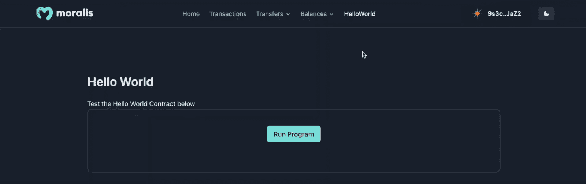

# 如何写一份索拉纳智能合同？

> 原文：<https://moralis.io/how-to-write-a-solana-smart-contract/>

Solana 是一个可编程的区块链，这意味着网络支持智能合约，这也是我们在本文中将关注的地方。更具体地说，这篇文章将告诉你如何立即写一份索拉纳智能合同！此外，结合如何编写 Solana 智能合同的说明，本文将进一步介绍如何使用一个简单的测试应用程序来部署和运行合同。为了让这更容易理解，我们将使用 [Moralis](https://moralis.io) 以太坊样板，让我们可以不费吹灰之力就启动应用程序。但是这可能听起来令人困惑，因为它是一个以太坊模板；然而，不要担心，以太坊样板是索拉纳兼容！

编写、部署和调用 Solana 智能契约的可访问性部分源于 Moralis 提供的企业级[web 3 API](https://moralis.io/web3-apis-exploring-the-top-5-blockchain-apis/)。如果你想了解更多关于这些优秀开发工具的信息，我们会推荐你查看 [Solana API](https://docs.moralis.io/reference/solana-api) ，让你轻松创建复杂的 Solana 项目。例如，通过 API，你可以快速学会如何[建造一个索拉纳·NFT 探索者](https://moralis.io/how-to-build-a-solana-nft-explorer/)。

尽管如此，为了遵循这个"*如何写一份索拉纳智能合同？*“教程，你会需要一个 Moralis 账号。因此，如果你还没有注册，请立即注册。这将提供对平台的各种 API 的直接访问，使您所有的未来开发工作更加容易！

## 什么是索拉纳智能合约？

简而言之，Solana 智能合约是在 Solana 网络上运行的合约。但是，要回答“什么是索拉纳智能合约？”更充分的问题，这可能是一个好主意，开始潜入索拉纳和智能合同分别错综复杂。所以，让我们通过仔细看看索拉纳网络来发起这篇文章吧！


Solana 于 2017 年由 Solana Labs 首次推出，Solana Labs 是该网络背后的组织。Solana 是一个开源的、可编程的区块链，表明该网络支持智能合约。区块链强调速度和可伸缩性，因为与以太坊相比，Solana 可以更经济、更快速地处理交易。

索拉纳的原生货币叫做 SOL，用来保证网络的安全和保障。此外，让区块链独一无二的一个因素是，索拉纳实施了两种共识机制:PoH(历史证据)和 PoS(利害关系证据)。这种混合共识机制允许索拉纳在保持低成本的同时保持较高的交易速度。

对 Solana 有了简单的了解后，是时候深入研究智能合约了。因此，让我们试着回答这个问题，“什么是智能合同？”。

智能合约，也称为 Web3 合约，是存储在区块链网络上的程序。一旦满足预定义的条件，这些程序就会执行预定义的操作。因此，智能合同是两个或多个参与者之间自动达成协议的理想选择，这样每个参与者都可以确定特定的结果。此外，由于代码调解智能合约，它表明参与者不需要担心中介或不必要的损失。

在 Solana 的上下文中，智能合同本质上是存储在 Solana 网络上的合同。现在，有了这些，让我们仔细看看如何写一份索拉纳智能合同！

## 写一份索拉纳智能合同——完全分解

现在，您对 Solana 智能合约已经比较熟悉了，接下来的小节将更深入地探讨 Solana 智能合约的开发。随着我们的发展，我们将向您展示如何从测试应用程序中编写、部署和调用智能合约。该应用程序将是一个简单的“Hello World！”用户可以按下“运行程序”按钮来调用智能合同的项目。此外，这就是 UI(用户界面)的外观:


该应用程序利用了来自 Moralis 的以太坊样板，允许我们更有效地为智能合约构建这个测试应用程序。例如，该模板具有 Moralis 的 [Web3 认证 API](https://moralis.io/authentication/) ，允许我们轻松实现各种认证机制。如果你想了解更多不同的选择，例如，你可以查看我们的指南，了解如何[使用 RainbowKit](https://moralis.io/how-to-add-a-sign-in-with-rainbowkit-to-your-project-in-5-steps/) 添加登录！

然而，一旦用户点击上面的“运行程序”按钮，它应该提示他们的 [Web3 钱包](https://moralis.io/what-is-a-web3-wallet-web3-wallets-explained/)，允许他们通过签署消息来调用智能合同。一旦签署，该应用程序将返回智能合同的数据日志。在这种情况下，应用程序返回“Hello World！!"消息:


为了使本教程的结构更加简单，我们将编写 Solana 智能合同的过程分为以下三个部分:

*   安装 Rust 和 Solana CLI
*   创建和部署智能合同
*   调用智能合约-测试应用程序

值得注意的是，我们将在整篇文章中使用 macOS 设备。因此，如果您有 Windows，请记住该过程可能偶尔会有所不同。尽管如此，如果这听起来很有趣，并且您想自己编写一个 Solana 智能合同，请加入我们，了解您需要的关于 Solana 智能合同开发的一切！

### 安装 Rust 和 Solana CLI

在本教程的第一部分，我们将展示如何设置 Rust 和 Solana CLI。如果您已经安装了这些，请随意跳过这一部分，直接进入下一部分。否则，请加入我们，我们将向您展示如何设置 Rust。

首先，打开一个新的 Unix 终端并运行以下命令:

```js
curl --proto '=https' --tlsv1.2 -sSf https://sh.rustup.rs | sh
```

运行该命令后，您必须在几种安装类型之间进行选择。在这种情况下，我们建议通过输入“1”并按回车键来选择默认选项:


一旦 Rust 成功安装，下一步就是安装 Solana CLI。要安装 CLI，您只需要几个命令，您可以通过在终端中输入以下命令并按 enter 键来开始:

```js
sh -c "$(curl -sSfL https://release.solana.com/stable/install)"
```

当安装完成后，您需要设置“ *env path* ”，您可以在终端日志中找到它。


从那里，通过以下命令创建一个新的本地 Solana 密钥对:

```js
mkdir ~/my-solana-wallet
solana-keygen new --outfile ~/my-solana-wallet/my-keypair.json
```

一旦您的机器上有一个 Solana 钱包，通过以下输入获取钱包地址:

```js
solana address
```

通过输入以下命令，设置 devnet 集群以用于本地事务:

```js
solana config set --url https://api.devnet.solana.com
```

最后，通过在终端中运行以下命令，将测试 SOL 令牌空投到钱包中:

```js
solana airdrop 1
```

这就是本教程的初始部分。我们现在将深入到教程的中心部分，并向您展示如何编写一份索拉纳智能合同！

### 创建和部署智能合同

现在是时候写一份索拉纳智能合同了。要启动此过程，请打开您首选的 IDE。我们将使用 VSC (Visual Studio 代码)；但是，您可以自由选择任何您可能更习惯使用的 IDE。在 IDE 打开的情况下，创建一个新文件夹并启动一个新终端。如果你像我们一样使用 VSC，你可以点击顶部的“终端”并点击“新终端”:


接下来，通过在终端中输入以下命令，创建一个新的 Rust 项目:

```js
cargo init hello_world --lib
```

一旦您按下 enter 键并运行该命令，就会产生一个简单的货物库，它将被添加到您的 IDE 目录中。这是它在 VSC 的样子:


在那里，使用以下命令导航到正确的位置:

```js
cd hello_world
```

然后，您可以通过添加以下代码片段来更新“Cargo.toml”文件:

```js
[lib]
name = "hello_world"
crate-type = ["cdylib", "lib"]
```

它现在应该是这样的:


接下来，删除“src/lib.rs”文件中的所有代码。在那里，您可以通过运行以下命令将 Solana 程序包添加到项目中:

```js
cargo add solana_program
```

剩下的工作就是将合同代码添加到“src/lib.rs”文件中。首先，您需要导入 Solana 程序:

```js
use solana_program::{
    account_info::AccountInfo,
    entrypoint,
    entrypoint::ProgramResult,
    pubkey::Pubkey,
    msg,
};
```

接下来，用“ *process_instruction* 函数定义“*入口点*”:

```js
entrypoint!(process_instruction);
```

最后，创建“ *process_instruction* ”函数本身，并添加用于记录“ *Hello World！！*"消息:

```js
pub fn process_instruction(
    program_id: &Pubkey,
    accounts: &[AccountInfo],
    instruction_data: &[u8]
) -> ProgramResult {
    msg!("Hello, world!");
    Ok(())
}
```

这将是“src/lib.rs”文件最终版本的代码:

```js
use solana_program::{
    account_info::AccountInfo,
    entrypoint,
    entrypoint::ProgramResult,
    pubkey::Pubkey,
    msg,
};

entrypoint!(process_instruction);
pub fn process_instruction(
    program_id: &Pubkey,
    accounts: &[AccountInfo],
    instruction_data: &[u8]
) -> ProgramResult {
    msg!("Hello, world!");
    Ok(())
}
```

在那里，通过在终端中输入以下命令来构建项目:

```js
cargo build-bpf
```

项目构建完成后，通过“ *solana program deploy* ”命令部署智能合约，并指定。/target/deploy/hello_world.so "路径:

```js
solana program deploy ./target/deploy/hello_world.so
```

运行该命令将返回程序 ID，您将在最后一部分用到它:


### 调用智能合约-测试应用程序

在最后一节中，我们将向您展示如何创建应用程序来调用和测试您刚刚创建的 Solana 智能合同。我们将克隆一个已经开发的模板，使这个过程尽可能无缝。在那里，您只需要通过添加您的 Moralis Web3 API 密钥和程序 ID 来稍微配置代码。不过，您会在下面找到该应用程序的 GitHub 存储库:

**Solana 智能合约测试 App Docs—[https://github . com/johnvsnagendra/Solana-Smart-Contract-hello world](https://github.com/johnvsnagendra/solana-smart-contract-helloWorld)T3】**

首先，打开上面的链接，单击绿色的“Code”按钮，复制存储库 URL:


然后，您可以再次打开您最喜欢的 IDE，创建一个文件夹，并启动一个新的终端。从那里，通过使用 repo URL 输入以下命令，将项目克隆到您的本地目录:

```js
git clone “REPOSITORY_URL”
```

克隆项目后，打开包含几个环境变量的“. env.local.example”文件。在这种情况下，您需要将您的 Moralis Web3 API 密钥添加到变量" *MORALIS_API_KEY* "中。要获取密钥，请登录 Moralis。然后，导航到“Account ”,选择“Keys”选项卡，并复制 Web3 API 密钥:


将 API 键添加到环境变量后，可以导航到“/src/components/templates/hello world/hello world . tsx”文件。从那里，向下滚动到第十九行，并实现您在部署合同时获得的程序 ID。


#### 测试应用程序

将这两个组件添加到代码中后，您应该能够在浏览器中启动和测试应用程序。此外，如果一切正常，您现在应该能够点击“运行程序”按钮，签署一条消息，并运行智能合同。同样，你应该收到“你好，世界！!"留言！



如果您正在寻找测试应用程序的完整代码的更详细的分解，请查看下面的 YouTube 剪辑。在本视频教程中，开发人员提供了整个代码的更详细的演练。反过来，它应该有希望回答你的任何问题。而且，你还可以加入 Moralis 的 Discord 频道，获得我们社区工程师的优秀指导！

[https://www.youtube.com/embed/cLuX5CvXLuY?feature=oembed](https://www.youtube.com/embed/cLuX5CvXLuY?feature=oembed)

## 总结——如何写一份索拉纳智能合同？

本文演示了如何编写、部署和调用 Solana 智能合同。为了调用和测试合同，本文展示了如何使用 Moralis 的以太坊样板构建一个简单的测试应用程序。此外，由于 Moralis 的可访问性，您只需三个步骤就可以编写、部署和调用 Solana smart 契约:

1.  安装 Rust 和 Solana CLI
2.  创建和部署智能合同
3.  调用智能合约-测试应用程序

按照上面的步骤，您可以编写一个 Solana 智能合约，将其部署到 Solana devnet，启动一个应用程序并调用智能合约。此外，只需点击一个按钮，你就可以通过应用程序调用并测试智能合约。一旦点击应用程序用户界面中的按钮，它会提示你的 Web3 钱包签署一条消息并调用智能合约。反过来，一句“你好世界！!"消息应该出现。


如果你觉得这篇文章有帮助，仔细看看 Moralis 的 [Web3 博客](https://moralis.io/blog/)上的一些附加内容。例如，如果你对为其他网络开发 dapp 感兴趣，你会发现 Moralis 是[构建 Web3 应用](https://moralis.io/fastest-way-to-build-a-web3-app/)最快的方法。如果这让你兴奋，看看我们的指南，解释如何使用 Moralis 的[多边形样板](https://moralis.io/polygon-boilerplate-how-to-build-polygon-dapps/)和 [BNB 链样板](https://moralis.io/bnb-chain-boilerplate-how-to-build-bnb-chain-dapps/)构建 dapps！此外，查看如何将领先的 [Web3 网站模板](https://moralis.io/web3-template-build-a-dapp-using-a-web3-website-template/)用于众多网络！此外，如果您想关注 NFTs，请确保查看[多链 NFT API](https://moralis.io/multichain-nft-api-how-to-build-cross-chain-dapps/) 。有了它，您可以快速轻松地构建跨链 NFT dapp！

因此，无论您是想写一份 Solana smart 合同还是构建更复杂的 Web3 项目，[立即注册 Moralis](https://admin.moralis.io/register) 并获得更容易获得的开发人员体验！