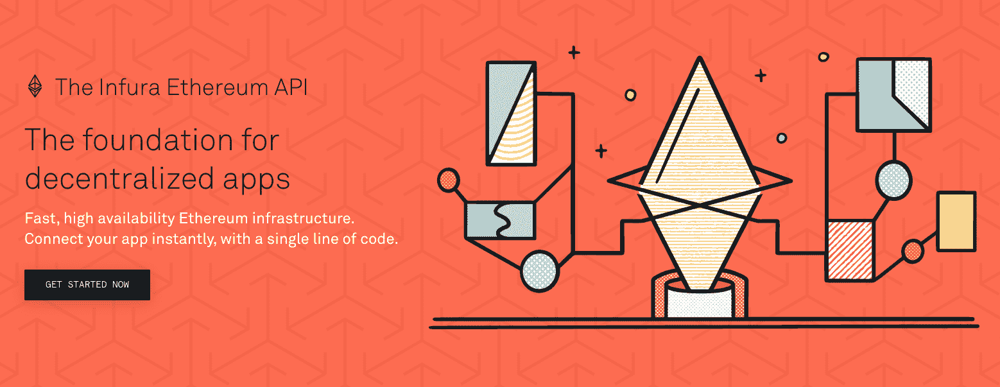
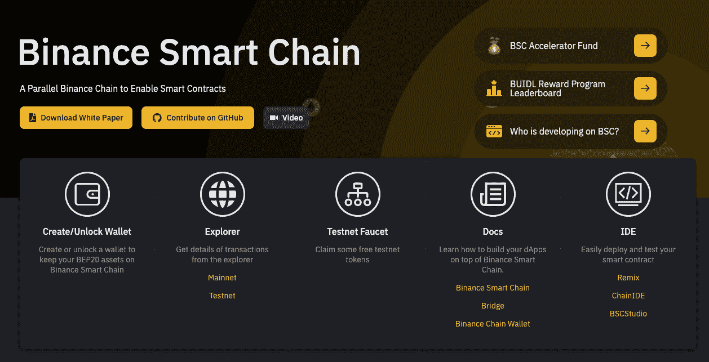
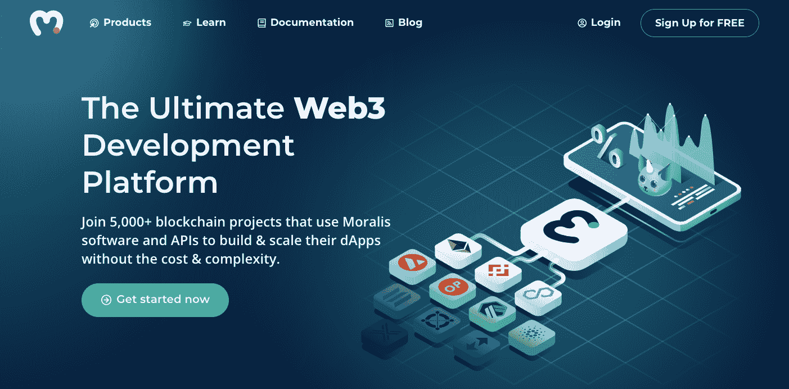
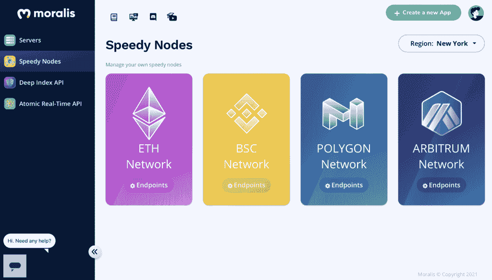
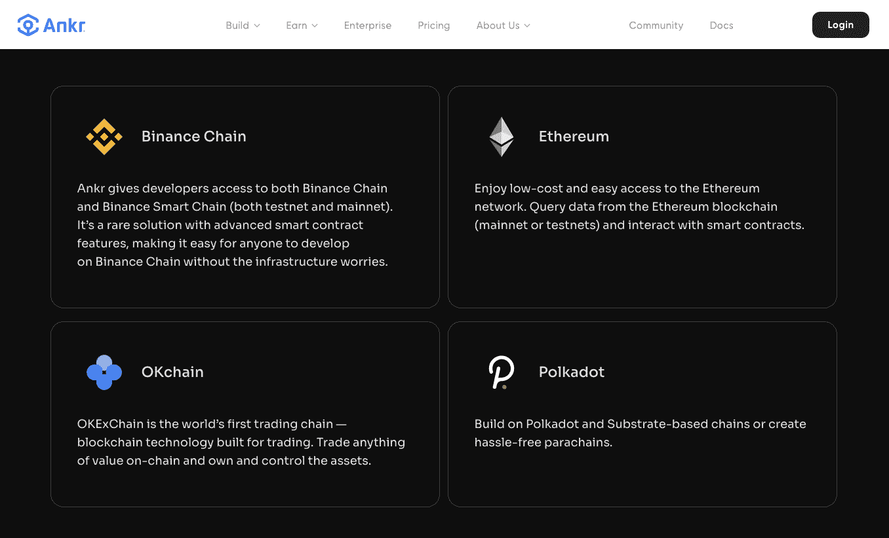
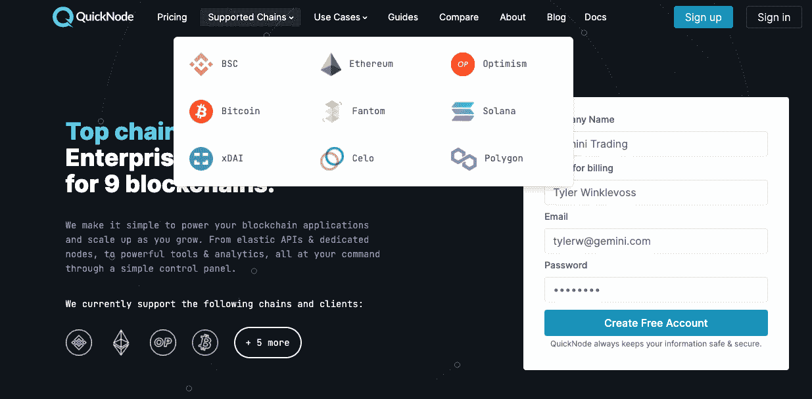

# Infura BSC 替代品 Infura BSC 的最佳替代品

> 原文：<https://moralis.io/infura-bsc-alternatives-the-best-alternative-to-infura-for-bsc/>

**如果你一直在使用 Infura 的 Web3 工具在** [**以太坊**](https://moralis.io/full-guide-what-is-ethereum/) **上开发，你可能想知道是否有类似功能的“Infura for BSC”替代品可以在币安智能链(BSC)上开发。虽然以太坊仍然是 Web3、DeFi 和 dApps 项目的主导链，但像 BSC 这样的区块链越来越受欢迎。因此，该行业对“用于 BSC 的 Infura”替代品**、**的需求越来越大，有助于刺激此类替代链上的项目。此外，要探索 BSC 的特性，必须考虑使用“Infura BSC”替代方案，而不是只支持以太坊的方案。因此，在本文中，我们将更深入地了解首要的“BSC Infura”替代方案——Moralis。**

如果您是区块链开发的新手，您可能已经听说过 Infura，它是一个受欢迎的区块链节点提供商。[区块链节点提供商](https://moralis.io/infura-alternatives-and-blockchain-node-providers/?utm_source=blog&utm_medium=post&utm_campaign=Want%2520the%2520Latest%2520in%2520%253Cspan%253EBlockchain%2520Development%253F%253C%252Fspan%253E)让区块链的开发和使用变得更加容易，让您从试图从头开始建立自己的节点的不方便的初始步骤中解脱出来。那些有运行或尝试[连接以太坊节点](https://moralis.io/how-to-connect-to-ethereum-nodes/)经验的人知道，这是一个麻烦、漫长的过程，有许多困难，尤其是同步。如果您不想让后端基础设施需求拖累您，最好的办法是使用诸如 Infura 或“用于 BSC 的 Infura”之类的工具，如 Moralis。在本文的后面，我们将向您展示每种服务如何工作的公平比较，以便您可以决定哪种服务适合您。

为什么开发人员想要在 BSC 而不是以太坊上工作？区块链开发者越来越倾向于 BSC，因为它的速度快，交易费用低，生态系统越来越大。BSC 还在相对较短的时间内建立了稳固的声誉和社区信任。因此，为 BSC 开发人员提供节点和 API 支持以满足对“用于 BSC 的 Infura”服务不断增长的需求是很重要的。

## 观看关于 Infura BSC 替代品的视频

如果您想观看一段信息丰富的视频，解释为什么 Moralis 是“BSC 的最佳选择”,那么请务必观看来自 [Moralis 的 YouTube 频道](https://www.youtube.com/channel/UCgWS9Q3P5AxCWyQLT2kQhBw)的以下视频:

https://youtu.be/WyTLg4c7wEA

# 为什么您需要“用于 BSC 的 Infura”替代品

区块链生态系统正在迅速多样化，开发人员希望将互操作性集成到他们所做的一切中。因此，Web3 构建的下一波浪潮正在转向跨链。因此，考虑到这一点,“用于 BSC 的 Infura”替代方案必须能够与其他区块链无缝交互。因此，为了避免未来的集成问题，跨链兼容性需要从一开始就成为任何区块链开发计划的一部分。

## 什么是 Infura？

当您搜索“Infura for BSC”或“Infura BSC 替代方案”时，回顾一下 Infura 是什么以及它能为区块链开发者提供什么是很有帮助的。

Infura 是 dApps 访问以太坊区块链最流行的方式，无需运行完整的节点。它为后端基础设施提供了可伸缩性特性。大约 63%的 dApps 通过 Infura 连接到以太坊，领先于自托管区块链节点和其他第三方提供商。使用 Infura 的著名 dApps 或 Web3 项目有:

*   [MetaMask](https://moralis.io/metamask-explained-what-is-metamask/)
*   松露
*   隐猫
*   uPort
*   阿拉贡
*   灵知
*   OpenZeppelin

#### in fura——IaaS 提供商

一些开发人员更喜欢将运行完整节点的负担转移给 IaaS(也称为“[基础设施即服务](https://moralis.io/iaas-explained-what-is-infrastructure-as-a-service/)”)提供商，如 Infura。虽然这种服务有优点也有缺点，但许多开发人员明白其明显的好处，因为他们可以在创纪录的时间内创建、测试和部署他们的 dApps。他们不需要处理本地运行和管理他们自己的完整节点的头痛问题。像 Infura 这样的服务如何吸收区块链发展中的这一繁琐步骤？简单来说，Infura 有一个完整的以太坊节点集合，并让开发者连接到这些完整的节点。

再者，Infura 有全栈的“微服务”。这些包括一个完整的开发人员仪表板，一个以太坊接口，通过客户端兼容的 JSON-RPC，在 WSS 和 HTTPS 支持 mainnet 和各种 testnets，以及以太坊数据访问，用于更高层的订阅。它还通过使用支持 IPFS 的分布式存储解决了区块链数据存储问题。

简而言之，它在区块链的基础上解决了以下问题:

*   速度
*   连接和管理节点
*   节点同步
*   数据存储

像 Infura 这样的服务和其他类似的服务对于规避典型的区块链发展困难是很重要的。这些包括旋转节点、连接到区块链和同步。

#### infura 和以太坊

Infura 每天传递大约 65 亿个 JSON-RPC 请求，这证明了它在以太坊生态系统中的重要性。然而，它对以太坊的排他性，肯定是一个优点和一个缺点。它限制了它在一个区块链平台上的使用，给从事跨链项目的开发人员带来了问题。

毫无疑问，Infura 是一个先锋，也是一个伟大的平台。迄今为止，它仍然是最著名的以太坊区块链节点提供商。然而，如果你想扩展你的视野， [Infura 替代方案](https://moralis.io/infura-alternatives-and-blockchain-node-providers/?utm_source=blog&utm_medium=post&utm_campaign=Want%2520the%2520Latest%2520in%2520%253Cspan%253EBlockchain%2520Development%253F%253C%252Fspan%253E)比如一个“用于 BSC 的 Infura”选项对于加速和创建你的 Web3、DeFi 和 dApp 构建的跨链能力将是非常有价值的。

## 为什么要建立在 BSC 之上？

如前所述，币安智能链(BSC)正在开发人员中赢得强大的追随者。BSC 带来了许多优势，这进一步强化了“用于 BSC 的 Infura”替代方案的用例。这些优势包括:

## 1.速度

开发人员和用户必须在事务完成之前处理验证时间。这导致了延迟，这成为以太坊的一个问题，因为它有着广泛的追随者和大量的基于它的项目。BSC 旨在减少确认时间，从而减少交易时间。它还具有更高的效率和更低的延迟，以便与其他区块链竞争。

BSC 直观地支持智能合约，使开发人员更容易创建分散的应用程序或 dApps。此外，BSC dApps 能够处理大量交易。此外，即使在高流量情况下，该平台也能提供改进的可扩展性。使用 Infura 替代方案，创建 BSC dapp 变得更加容易。

BSC 与最初的“币安链”并行构建，是交叉兼容的。因此，它可以很容易地连接到币安链，使快速确认。更重要的是，这种双链架构可能会对开发人员有吸引力，这取决于他们希望在应用程序中包含的功能。

## 2.交易费用

较低的费用引起了用户和开发者的共鸣。凭借其本机令牌和生态系统，BSC 在任何给定的一天都比以太坊更不拥挤。此外，BSC 的区块链费用也明显低于以太坊。当试图铸造新代币或执行其他简单交易时，以太坊的汽油费可能会成为一个限制或问题，例如当一个人需要接收或发送 ERC-20 代币时。在 NFTs 和 NFT 平台的情况下，这是以太坊上一个流行的用例，带来了持续的燃气费问题，替代区块链可能是解决方案。对于这样的区块链，Infura BSC 替代方案可能会加快平台开发。

是否有可能使用 Infura BSC 替代方案构建 NFTs 和 NFT 平台，并降低交易费用？绝对的！

为了理解 NFT，并深入研究有关铸造和销售以太币气体费用的问题，您可能希望从这篇文章开始，文章的主题是"[什么是 NFT？](https://moralis.io/non-fungible-tokens-explained-what-are-nfts/)之后是关于 [NFT 编程的基础课程](https://moralis.io/nft-programming-for-beginners/)。此外，你可以了解在你的项目中使用 Moralis 家 [NFT API](https://moralis.io/ultimate-nft-api-exploring-moralis-nft-api/) 的独特优势。Moralis 超越了节点支持，为您提供全面的 Web3 工具包，帮助您在几分钟内启动项目，而不是几周！此外，你可以选择在哪个区块链上进行构建，这样你就可以规避高昂的交易费用。

## 3.生态系统

在全球范围内，BSC 被认为是增长最快的生态系统之一，因为它具有一些可取的特性，如更便宜、更快速的交易。2021 年 1 月，BSC 每天的交易量高达 30 万笔。这一数字在 2021 年 8 月呈指数级增长，最高达到每天 1200 万笔交易。据计算，2021 年 4 月至 8 月的日均交易量为 700 万笔。从以太坊到 BSC 的轻松迁移进一步加速了这种增长。此外，对于开发者和用户来说，看到这种成功的发生无疑是令人鼓舞的。

## 4.TVL

BSC 的 TVL 或“锁定总价值”在 2021 年 8 月达到 289 亿美元，增长率为 300%，而今年早些时候还不到 100 亿美元。高 TVL 意味着对 BSC 使用智能合同、治理 DeFi 平台以及 BSC 大规模支持 DeFi 生态系统的能力的信任和信心增加。

## 支持增长的“平衡计分卡”替代方案

所有这些优势都指向一件事:开发人员认为 BSC 是以太坊的可靠替代方案。这样一个不断增长的生态系统需要一个 Infura BSC 替代方案，帮助开发人员加快构建速度，避免延迟。实际上，Infura for BSC alternatives 可以帮助开发人员在尽可能短的时间内轻松启动 BSC 项目。

## 未来是跨链的

值得在 Infura 中查找 BSC 替代方案以及可以支持多个区块链的平台。而且，这一切都归结为“[web 3](https://moralis.io/the-ultimate-guide-to-web3-what-is-web3/)是什么？”这一切都是关于“区块链互联网”，其中连接性、交叉兼容性和敏捷性是将您的构建提升到下一个级别的关键。

如今有这么多选择，没什么理由把自己局限于一个区块链。

## “平衡计分卡信息系统”备选方案示例

1.  Moralis

Moralis 是“BSC 的 Infura”选项的跨链等价物。作为 Infura BSC 的替代产品，它提供了节点支持基础设施。然而，与其他提供商不同，Moralis 提供了一个比典型的节点提供商或 IaaS 平台更全面的 Web3 基础设施，这些节点提供商或 IaaS 平台已经跟随 Infura 进入了这个领域。

Moralis 被设计成“最终的 Web3 开发平台”。这是一个全面的 Web3 开发套件，其功能将带您从一个想法到一个无限可扩展的 dApp。此外，Moralis 提供所有支持，使您的构建更容易，并减轻您在以太坊、币安智能链(BSC)、Polygon、Arbitrum 等主要链上运行区块链节点的负担。

正如 Infura 一样，Moralis 通过 IPFS 支持和所有其他特性来提供数据存储，这使得 Infura 成为以太坊开发者的优秀平台。然而，对于 Moralis，跨链兼容性从一开始就是计划的一部分，并且是 Moralis 的一个内置特性。这应该让你对使用 Moralis 及其未来愿景时的可能性有所了解，以扩展其服务，包括最有前途的区块链，而不仅仅是以太坊或前面提到的任何其他地方。它还向您展示了它为您的 dApp 提供的可伸缩性水平，这是其他 Web3 后端基础设施提供商无法比拟的。因此，Moralis 是为了成为下一代区块链节点提供商而构建的，它将提供更多令人兴奋的特性。

#### 用例

Moralis 不断增加其 Web3 堆栈，使其更容易[创建自己的 NFT](https://moralis.io/how-to-create-your-own-nft-in-5-steps/) 和[构建分散应用](https://moralis.io/how-to-build-decentralized-apps-dapps-quickly-and-easily/?utm_source=blog&utm_medium=post&utm_campaign=Want%2520the%2520Latest%2520in%2520%253Cspan%253EBlockchain%2520Development%253F%253C%252Fspan%253E)、NFT 市场、多链钱包、DeFi 仪表板和更多类型的 Web3 项目。Moralis 的超快速和免费服务确保随着您的 dApp 质量呈指数增长，成本保持在最低水平，因为它允许您专注于您的前端。

最终，Moralis 用户享受到了两个世界的精华:一个是精心设计的前端，另一个是完全支持的、健壮的、跨链兼容的、可无限扩展的后端——只需一行代码就可集成。

#### Moralis 快速节点

[Moralis Speedy Nodes](https://moralis.io/speedy-nodes/) 是 Moralis 平台的一个重要特点。它带来了“[启蒙更新](https://moralis.io/moralis-1-0-released-introducing-the-moralis-enlightenment-update/?utm_source=blog&utm_medium=post&utm_campaign=Want%2520the%2520Latest%2520in%2520%253Cspan%253EBlockchain%2520Development%253F%253C%252Fspan%253E)”，这是该平台的一个重要里程碑，因为它使任何人都能够以非凡的速度和可靠性运行任何顶级网络的区块链节点。它们让您可以访问以太坊、BSC、Polygon 和 Arbitrum 端点，是您寻找 Infura BSC 替代方案的最佳选择。

使用 Moralis 时，您可以确保隐私和安全。它不记录用户请求或 IP 地址。审查您的节点提供商的隐私政策以确保没有意外是很重要的。

#### Moralis 特征

*   轻松[用户认证](https://docs.moralis.io/moralis-server/getting-started/quick-start#authentication)。
*   具有 [IPFS 支持](https://docs.moralis.io/moralis-server/files/ipfs)的分散式数据存储。
*   云函数–在云中执行的自定义 JavaScript 函数。
*   实时数据库——允许存储 JSON 数据和用户之间的实时同步。
*   实时事件–实时 webhook 或 WebSocket 警报。
*   跨链兼容性–在多个链上轻松流畅地同步用户、数据和事件。
*   还有更多！

2.  “用于 BSC 的 Infura”平台的其他示例

另外两个众所周知的 BSC 备选 Infura 是 Ankr 和 QuickNode。让我们简单地检查一下这两者:

#### 锚！锚

Ankr 提供了区块链节点支持，并增加了互操作性特性。它有免费和付费选项，并声称与区块链合作，如 BSC，以太坊，OKChain 和 Polkadot。Ankr 也参与云计算领域的竞争，并且是第一个运行区块链技术和硬件基础设施的公司。

Ankr 的一个独特之处在于它有其原生令牌，该令牌在 2018 年作为 ICO 发布，目前在其生态系统内被用作支付方式。根据 Ankr 的网站，令牌在它的分散式打桩协议“Stakr”中具有未来的效用。如果你对令牌激励的生态系统感兴趣，那么你会发现 Ankr 很有趣。如果您喜欢没有本机令牌的系统或者更简单的系统，您可以探索其他提供者。

#### 快速笔记

QuickNode 目前支持九种不同的区块链，包括以太坊和 BSC。它被几个流行的区块链平台用作 IaaS 或节点提供商。然而，这个平台的一个缺点是它没有完全免费的选项，最便宜的一层是每月 9 美元。尽管如此，QuickNode 称自己是一个快速的替代者，得到了知名金融科技公司和区块链公司的信任。这无疑是另一个值得探索的 Infura BSC 替代方案。

## 最佳“BSC 信息”备选方案——摘要

在提供以太坊支持的同时，Moralis 还提供全面的多链或跨链支持，以适应任何类型的区块链设计或架构。

除了前面提到的功能外，Moralis 还具有以下优势，这使其在提供以下服务方面比其他区块链节点提供商更具优势:

*   自由层
*   全面的 IaaS 支持任何区块链构建，而不仅仅是节点支持
*   面向 dApps、Web3 应用和区块链项目的无限可扩展基础设施
*   以太坊、BSC、多边形、雪崩等跨链兼容支持
*   成熟的替代方案，数千个项目依赖于其强大的基础设施
*   面向未来的特性，确保它与下一代 Web3 项目相关

Moralis 代表了为 Web3 量身定制的区块链开发的范式转变。随着时间的推移，随着 Web3 生态系统的成熟，开发人员越来越多地寻找整体基础设施解决方案，而不仅仅是节点提供商。具体来说，开发者在平台选择方面想要更多。考虑“BSC 的 Infura”替代以太坊之外的所有其他需求是有道理的。

[今天就向 Moralis 报名](https://admin.moralis.io/register)！它是快速且完全免费的，你可以亲眼看看它是如何在“企业级”上彻底革新 Web3 开发的，超越了现有的任何其他平台！