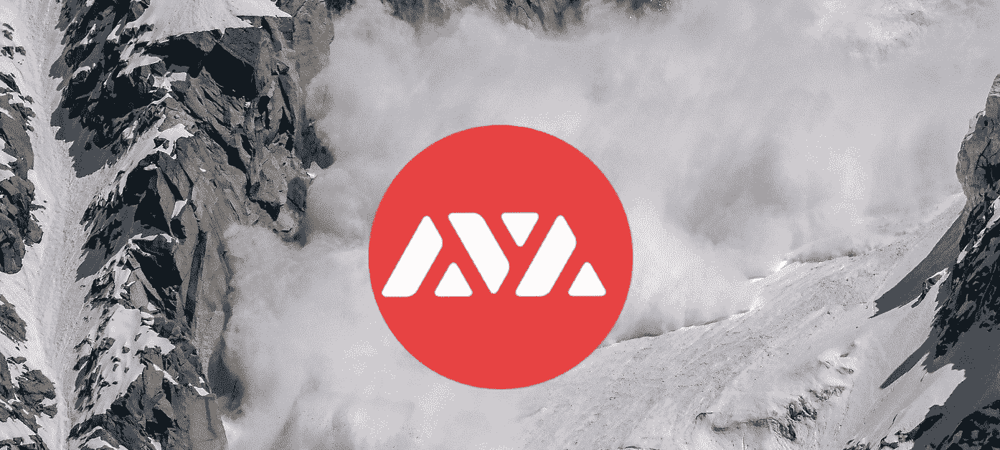
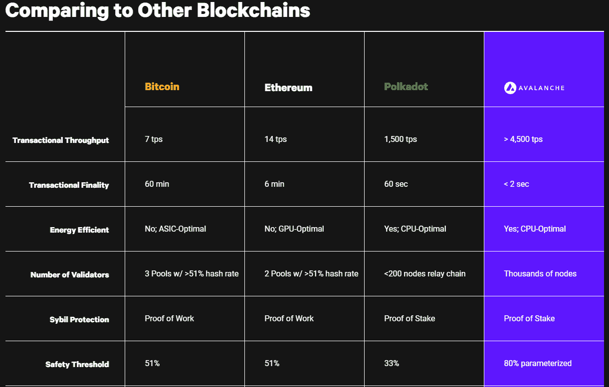
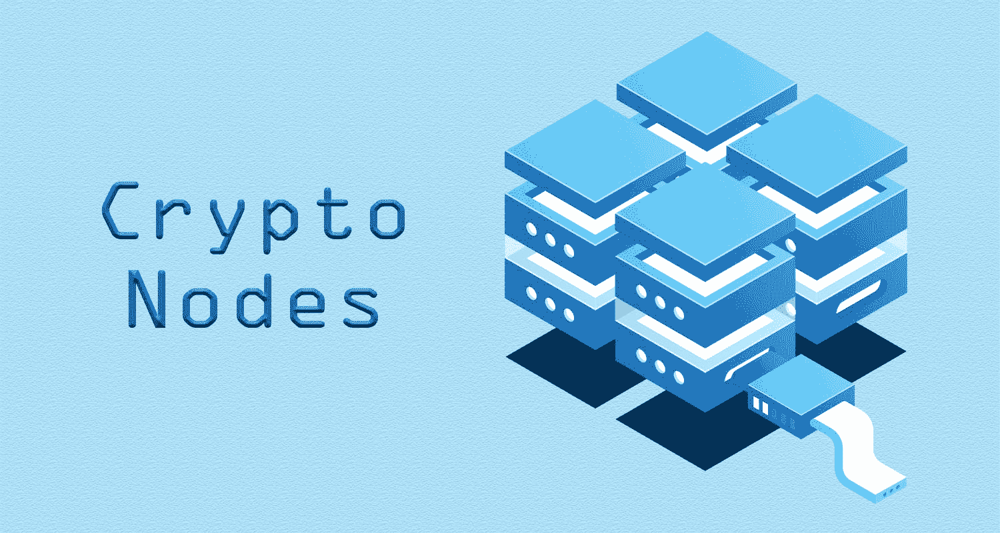
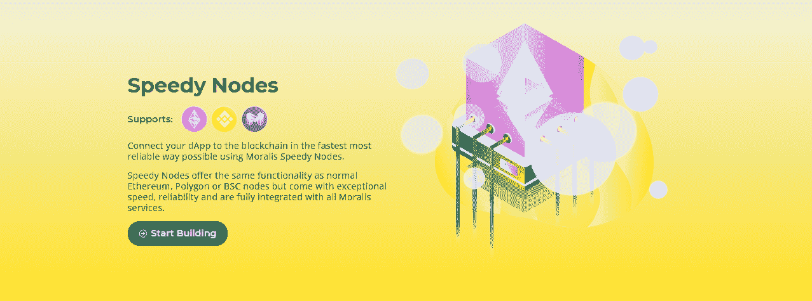
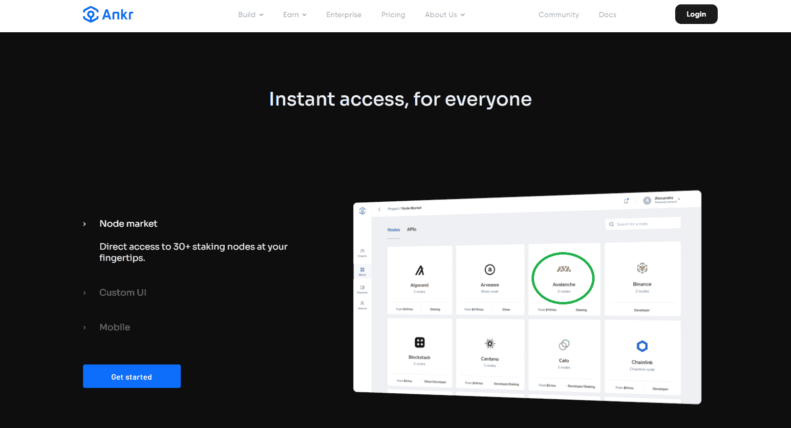
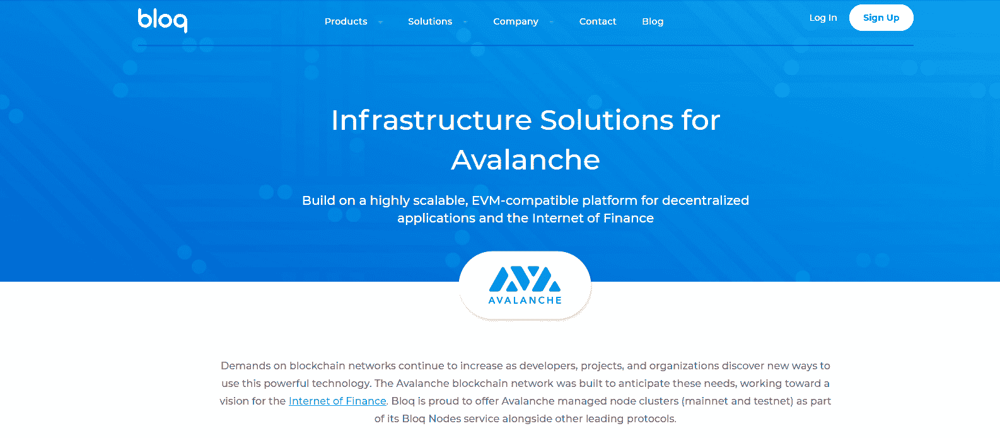

# in fura for Avalanche–探索 Infura Avalanche 的替代方案

> 原文：<https://moralis.io/infura-for-avalanche-exploring-infura-avalanche-alternatives/>

**[**去中心化应用**](https://moralis.io/decentralized-applications-explained-what-are-dapps/) **(dApps)、Web3 apps 和 DeFi 项目的出现，意味着区块链编程变得比以往任何时候都更热。然而，众所周知，区块链开发可能很麻烦，尤其是在设置节点方面。因此，开发人员通常使用** [**区块链节点提供者**](https://moralis.io/infura-alternatives-and-blockchain-node-providers/) **来避免浪费时间运行和设置他们自己的节点。也许最知名的节点提供商当** [**建筑以太坊 dApps**](https://moralis.io/ultimate-guide-how-to-build-ethereum-dapps/) **是 Infura。然而，以太坊高昂的燃气费和拥堵导致开发商转向其他收费较低的区块链，雪崩就是其中之一。随着开发人员开始构建 Avalanche，他们需要一个用于 Avalanche 替代方案的 Infura。因此，当我们在本文中探索 Infura Avalanche 替代方案时，我们将向您展示一个针对 Avalanche 的 Infura 选项，它已被证明是开发人员的首选——Moralis。****

**提供 [Web3](https://moralis.io/the-ultimate-guide-to-web3-what-is-web3/) 基础设施和工具的可靠的 [IaaS](https://moralis.io/iaas-explained-what-is-infrastructure-as-a-service/) (基础设施即服务)提供商有很多，但是他们中的大多数，就像 Infura 一样，主要关注以太坊。此外，只有少数 Infura Avalanche 可供选择，我们将在本文中进一步讨论。然而， [Moralis](https://moralis.io/) 的 Web3 开发平台是雪崩选项最先进的 Infura。此外，正如 Moralis 今年早些时候宣布的那样， [Moralis Speedy Nodes](https://moralis.io/speedy-nodes/) 和 Moralis 的 ultimate Web3 [SDK](https://moralis.io/exploring-moralis-sdk-the-ultimate-web3-sdk/) 提供了对 Avalanche 的全面支持。事实上，Moralis 已经成为 BSC 的首选产品，但是 Moralis 的跨链兼容性意味着您可以将 Moralis 用于其他解决方案，如 Avalanche。因此，请务必今天就[创建您的免费 Moralis 帐户](https://admin.moralis.io/register),并开始在 Avalanche 上部署您的 dApps，使用 Moralis——Avalanche 替代方案的头号基础设施。**

**

## 什么是雪崩？

在我们帮助您决定应该使用哪种雪崩选项的 Infura 之前，让我们了解一下这种快速增长的区块链的一些基础知识。

Avalanche 是最受欢迎和最著名的可编程区块链之一，通常被称为“以太坊替代品”。此外，它是一个开放的、可编程的智能合同平台，适用于分散的应用程序。它使用了利益证明(PoS)验证概念，这比以太坊目前使用的工作证明(PoW)概念更节能。这使得雪崩成为生态友好型区块链的绝佳选择。此外，利益相关证明的概念还确保交易费用较低，这意味着即使是预算紧张的开发者和用户也可以利用该链。

### 为什么要建立在雪崩之上？

除了低费用和环保之外，Avalanche 还能让你在以太坊上启动 [dApps，即时确认交易，每秒可以处理数千笔交易。此外，它还允许您部署定制的区块链(私有和公共)，最适合您的应用程序的需求。因此，您可以构建自己的虚拟机，并指定它应该如何运行。](https://moralis.io/how-to-build-dapps-on-ethereum/)

此外，由于 Avalanche 与 Solidity 兼容，你可以使用所有你喜欢的工具，比如 T2 松露、T4 混合和温柔。最重要的是，雪崩桥(被称为“AB”)允许你在区块链之间轻松转移雪崩和以太坊资产。

无论你喜欢去中心化金融(DeFi)，为机构、企业和政府建立 Web3 基础设施，用 Moralis 的 [NFT API](https://moralis.io/ultimate-nft-api-exploring-moralis-nft-api/) 创建 [NFTs](https://moralis.io/non-fungible-tokens-explained-what-are-nfts/) 和 NFT 市场，或者任何其他类型的 Web3 应用，你都可以在 Avalanche 上建立这一切。此外，虽然您可能会走上运行自己的节点的耗时之路，但对于大多数开发人员来说，使用 Infura 来替代 Avalanche 更有意义。

有了上面的信息，你就能明白为什么许多开发者在寻找 Infura Avalanche 的替代品了。了解雪崩可以让我们进一步讨论“雪崩的信息”。然而，在我们仔细研究三种 Infura 雪崩替代品之前，我们希望确保您了解为什么您需要 Infura 雪崩替代品，以及 Infura 到底是什么。

## 为什么您需要 Infura 来替代雪崩

首先，您需要知道使用一个可靠的[节点](https://moralis.io/node-js-explained-what-is-node-js/)提供者(无论是 Infura 还是任何其他知名的提供者)，尤其是如果它提供了额外的工具，可以帮助您显著加快 dApp 部署。通过让其他人处理节点，您可以专注于创建下一代 Web3 应用程序，而不用担心它如何到达区块链。此外，如果一个平台还提供了一个具有强大的[API](https://moralis.io/introducing-the-moralis-web3-api-v2/)的广泛的 Web3 SDK，你基本上跳过了整个后端编程。因此，您有机会将您的注意力和资源集中在创建出色的用户体验上。

此外，Infura 不支持 Avalanche 链，而是主要关注以太坊开发，并且不提供适当的跨链功能。因此，如果您想避免运行自己的节点这一麻烦的任务，除了考虑使用 Infura 替代 Avalanche 之外，您别无选择。考虑到这一点，在选择最佳 Infura Avalanche 替代方案时，它应该涵盖适当的跨链功能，并提供最快的可用节点。只有确保你的 dApps 可以很容易地部署在其他流行的链上，你的 Web3 应用程序才能经得起未来的考验。

尽管如此，开发人员部署 dApps 的速度极大地促进了特定链的增长和整个区块链的主流采用。因此，雪崩备选方案的 Infura 是雪崩区块链被采用的关键，后者通过使其更加多样化为整个加密领域增加了价值。

### 什么是 Infura？

既然你在寻找雪崩的替代品，你可能已经知道 Infura 是什么了。然而，对于那些不熟悉 Infura 的人，或者即使你需要一个提醒，让我们回顾一下 Infura 是什么。Infura 是 dApps 访问以太坊区块链最流行的方式之一，无需运行完整的节点。此外，它为后端基础设施提供了可伸缩性特性。因此，大约 63%的 dApps 通过这个节点提供商连接到以太坊。一些知名的使用 Infura 的 Web3 项目包括 [MetaMask](https://moralis.io/metamask-explained-what-is-metamask/) ，Truffle，CryptoKitties，uPort，Aragon，Gnosis，OpenZeppelin 等。

Infura 是一个 IaaS 提供商，它使开发人员能够减轻运行完整节点的负担。如果开发者想快速创建、测试和部署 Web3 应用，Infura 就能胜任。Infura 和其他节点提供商，包括各种 Infura Avalanche 替代产品，有一个完整的节点集合，供开发人员连接。

除了提供以太坊节点，Infura 还提供了广泛的“微服务”来进一步协助开发者。以下是 Infura 最重要的“微服务”列表:

*   一个完整的开发者仪表板。
*   以太坊接口，通过客户端兼容的 JSON-RPC 在 WSS 和 HTTPS 支持 mainnet 和各种测试网。
*   更高层订阅的以太坊数据访问。
*   使用支持 [IPFS](https://moralis.io/what-is-ipfs-interplanetary-file-system/) 的分布式存储解决区块链数据存储问题。

通过提供这些类型的服务，Infura 解决了速度、连接和管理节点、节点同步和数据存储的问题。因此，当搜索最佳 Infura Avalanche 替代方案时，您应该确保它接近覆盖与 Infura 相同的功能，甚至超越它的范围。

# 雪崩替代品的 Infura 示例

我们将要讨论的雪崩期权的三个例子是 Moralis、Ankr 和 Bloq。虽然它们都为开发人员提供了雪崩节点，但其中一个非常突出。然而，Moralis 不仅仅是一个节点提供商；它是如此之多。这个终极的 Web3 开发平台改变了我们看待 Web3 编程的方式。因此，我们将稍微仔细地看看 Moralis 提供了什么。

## Moralis——最好的雪崩替代品

在某种程度上，Moralis 相当于雪崩替代方案的交叉链 Infura。当然，它提供了节点支持基础设施。然而，Moralis 提供了一种比其他典型的节点提供商或遵循 Infura 领导的 IaaS 平台更全面的 Web3 基础设施。

Moralis 被建成“最终的 Web3 开发平台”；因此，它毫无保留。首先，Moralis 为您提供了广泛的 Web3 SDK。这给了你所有你可能需要的支持，使 dApp 开发过程明显更快更容易。此外，它使您能够跳过在以太坊、币安智能链(BSC)、Polygon、Arbitrum、Avalanche 等主要链上运行区块链节点的过程。

像 Infura 一样，Moralis 也通过 IPFS 整合了分散的数据存储。此外，无论是什么让 Infura 成为以太坊开发者的优秀平台，Moralis 也拥有它。然而，Infura 有一个地方让开发人员失望了——跨链兼容性。然而，与 Moralis，这方面和无缝过渡，从一个链到另一个是从一开始就纳入。跨链互操作性是由 Moralis 内置的。此外，在 Web3 后端基础设施提供商中，Moralis 提供了无与伦比的可扩展性。总而言之，仅跨链互操作性和高水平的可伸缩性就使 Moralis 成为下一代区块链节点提供商，并具有许多其他令人兴奋的功能。

### Moralis 的用例

Moralis 有一个专门的开发团队，他们不断地为平台的 Web3 堆栈添加内容。这包括新的 API 和其他强大的工具来[创建你自己的令牌](https://moralis.io/how-to-create-your-own-erc-20-token-in-10-minutes/)(可替代和不可替代[NFTs])、NFT 市场、去中心化应用、多链钱包、DeFi 仪表板和许多其他类型的 Web3 项目。通过使用 Moralis 的免费和超快速服务，您可以确保您的 dApp 的低成本和高质量。此外，您可以交付更好的用户体验，并可以将全部精力投入到前端开发中。

无论你接手什么样的 Web3 项目，Moralis 都会为你提供一个健壮的、跨链兼容的、无限可扩展的后端。最棒的是，您可以将它与一行代码集成在一起。

### Moralis 快速节点

Moralis Speedy Nodes 是 Moralis 的节点提供功能，最早与 Moralis 的" [Enlightenment Update](https://moralis.io/moralis-1-0-released-introducing-the-moralis-enlightenment-update/) "一起提供，使任何人都可以以非凡的速度和可靠性为任何顶级网络运行区块链节点。目前，Moralis 允许您访问以太坊、BSC、多边形、Arbitrum 和雪崩端点。这一特性使得 Moralis 成为你寻找 Infura Avalanche 替代品的最佳选择。

另一个值得注意的方面是 Moralis 的隐私和安全政策。它不记录用户请求或 IP 地址，这意味着您的用户受到保护。当寻找 Infura 的雪崩替代品时，一定要查看他们的隐私政策。

### Moralis 特征

以下是 Moralis 的一些主要特征:

*   具有 [IPFS 支持](https://docs.moralis.io/moralis-server/files/ipfs)的分散式数据存储。
*   轻松[用户认证](https://docs.moralis.io/moralis-server/getting-started/quick-start#authentication)。
*   在云中执行的自定义 [JavaScript](https://moralis.io/javascript-explained-what-is-javascript/) 函数(云函数)。
*   实时数据库，允许存储 JSON 数据和用户之间的实时同步。
*   实时事件、实时 webhook 或 [WebSocket](https://moralis.io/websockets-explained-what-is-websocket/) 警报。
*   跨链兼容性，可在多个链上轻松流畅地同步用户、数据和事件。

## 雪崩平台的其他 Infura 示例

如前所述，大多数节点提供商都效仿 Infura，主要关注以太坊的区块链。因此，在寻找 Infura 雪崩替代品时，没有太多的选择。幸运的是，Moralis 能够发现 Avalanche 这样的高质量链，并立即添加了对它的完全支持。然而，我们找到了另外两家知名的雪崩保险公司。

### 锚！锚

Ankr 提供了区块链节点支持和互操作性特性。此外，它给你免费的某些功能，但要获得完全的访问，你需要与它的付费选项。Ankr 支持许多链，包括 BSC、以太坊、OKChain、Polkadot、Avalanche 等。此外，Ankr 还将自己定位在云计算领域。此外，它还是第一个运行区块链技术和硬件相结合的基础设施的公司。

此外，Ankr 有其原生令牌，于 2018 年作为 ICO 发布。这实际上是 Infura 雪崩替代方案的独特之处之一。Ankr token 被用作其生态系统内的支付方式。此外，根据 Ankr 的网站，令牌将在它的分散式打桩协议“Stakr”中具有效用。因此，如果你对令牌激励的生态系统感兴趣，Ankr 可能会让你感兴趣。如果您更喜欢没有本机令牌的系统或者更简单的系统，请确保探索其他提供商。

### 吹

Bloq 是雪崩替代物的另一个信息。它通过为 mainnet 和 testnet 提供雪崩管理的节点集群，使您能够在这个以太坊替代链上进行构建。此外，Bloq 使用其“快速同步”技术，确保您将启动时间减少到几分钟。像所有可靠的节点提供者一样，它确保最新的软件版本、补丁和对网络事件的响应得到适当的管理。在 Bloq 的官方网站上，他们指出 Bloq 的按需基础设施减少了构建和参与雪崩协议的“资本支出”和“OPEX”。

除了 Avalanche，Bloq 还支持比特币、比特币现金、以太坊、以太坊经典、莱特币和 Algorand。他们向用户承诺，只需几个步骤，他们就可以启动自己的专用节点集群，从而访问任何受支持的区块链。

## 探索 Infura 的雪崩替代品——总结

我们仍然在游戏的早期就开始宣布最好的可编程区块链。然而，在这一点上，以太坊仍然承载着大多数 dApps。尽管如此，其他高质量的区块链提供更低的交易费，吸引了越来越多的开发者，使 Avalanche 成为令人印象深刻的以太坊替代方案。看起来雪崩有一个光明的未来。因此，没有更好的时间开始在这场雪崩中部署 dApps，使用 Infura 替代雪崩。

使用 Moralis 作为您的“雪崩信息”意味着您不必设置和运行自己的节点。最重要的是，你将能够使用 Moralis 的整个工具箱和令人印象深刻的后端基础设施。这允许你通过简单地从 [Moralis 的文档](https://docs.moralis.io/)中复制和粘贴单行代码来获得后端功能。因此，您将能够完全专注于 Web3 项目的前端部分。因此，您将节省时间和金钱，但更重要的是，您将在创纪录的时间内提供更好的 dApps。

此外，Moralis 完全是关于跨链互操作性的，所以当你在 Avalanche T1 上创建应用时，它不会一成不变。相反，您可以轻松地将 Web3 应用程序部署在多个链上。所以，一定要成为许多已经使用这个终极 Web3 开发平台的知名项目(比如 SuperFarm)中的一员。只需创建您的免费 Moralis 账户，并开始[建设可怕的雪崩 dApps](https://moralis.io/how-to-build-avalanche-dapps-in-minutes/) 今天！

**