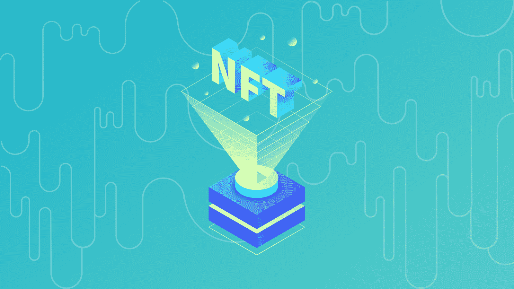
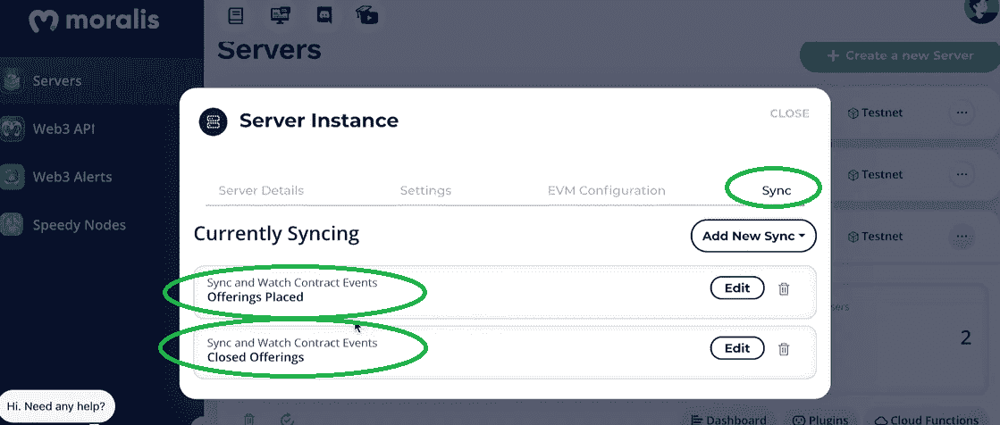
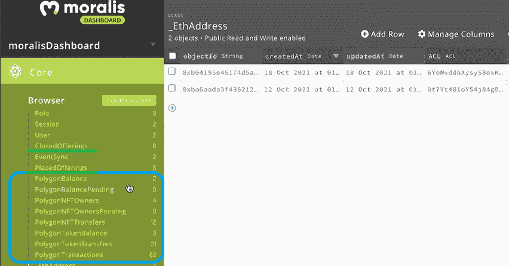

# 将 Mint 功能集成到 JS 界面 Mint 开发

> 原文：<https://moralis.io/integrate-mint-function-to-js-interface-nft-development/>

任何涉及加密领域的人可能都会同意，2021 年是****年。尽管比特币和以太坊获得了巨大收益，但非金融交易却风靡一时。现在，当我们走向 Web3 的主流应用时，学习** [**NFT 令牌开发**](https://moralis.io/nft-token-development-the-ultimate-guide/) **是一项在有抱负的区块链开发者中日益流行的技能。此外，随着对 JavaScript (JS)的深入理解，现在可以快速、轻松地集成 NFT 开发中所需的特定功能。其中一个功能是 mint 功能，它在构建 NFT 基础设施时起着相当重要的作用。因此，知道如何将 mint 功能集成到 JS 接口是你应该掌握的技能。****

**接下来，您将了解更多关于终极 [Web3](https://moralis.io/the-ultimate-guide-to-web3-what-is-web3/) 开发平台——[Moralis](https://moralis.io/)(也称为[crypto 的 Firebase】)。这是一个工具，它使精通 JavaScript 的开发者能够在几分钟内部署各种优秀的 dApps。通过使用 Moralis，您可以克服 RPC 节点](https://moralis.io/firebase-for-crypto-the-best-blockchain-firebase-alternative/)的所有[限制。本质上，Moralis 使您能够通过复制和粘贴简短的代码片段来覆盖所有与区块链相关的后端。后者在](https://moralis.io/exploring-the-limitations-of-rpc-nodes-and-the-solution-to-them/) [Moralis 文档](https://docs.moralis.io/)中有清晰的描述。此外，如果你真的想成为一名区块链开发者，请确保在前进之前创建你的免费 Moralis 账户。这样，你将访问 [Moralis 的 SDK](https://moralis.io/exploring-moralis-sdk-the-ultimate-web3-sdk/) ，包括它的[终极 NFT API](https://moralis.io/ultimate-nft-api-exploring-moralis-nft-api/) 。NFT API 使你能够毫不费力地将 mint 函数集成到 JS 接口中。**

**

## 为什么铸造 NFT 很重要？

你对什么是 NFT 已经有一个清晰的概念了吗？NFT 造币厂是什么样的？如果是的话，那么你就知道为什么铸造 NFTs 很重要了。那样的话，你也知道为什么要学习把 mint 功能集成到 JS 接口中了。因此，你已经准备好卷起袖子，寻找更多关于如何使用 Moralis 的细节。但是，如果您还不了解这些基础知识，请务必完成这一部分。

不可替换令牌(NFT)是一种特殊的加密资产。此外，NFTs 包括一个文件(JPG、PNG、MP3、MP4、PDF 等。)并将它及其元数据存储在特定的区块链上。虽然两个 NFT 可能包含同一个文件，但它们的元数据总是唯一的。因此，永远不会有两个相同的非功能性测试；因此，术语“不可替代”。此外，就像可替换的令牌一样，NFT 可以在各种可编程链上创建，以太坊仍然是首选。此外，以太坊上的可替换令牌遵循 [ERC-20 令牌标准](https://moralis.io/erc20-exploring-the-erc-20-token-standard/)，而以太坊上的 NFT 使用 [ERC-721](https://moralis.io/erc-721-token-standard-how-to-transfer-erc721-tokens/) 或 [ERC-1155](https://moralis.io/erc1155-exploring-the-erc-1155-token-standard/) 。*在创建 NFT 时，对这些标准有一个基本的了解是至关重要的，所以一定要查看相关链接。*

### NFT·明廷解释说

这些都很好，但是“铸造”到底是什么意思呢？这个术语是从政府铸造金属硬币的概念中借用的。然而，在可替换和不可替换令牌的情况下，铸造指的是通过使用适当的[智能合约](https://moralis.io/smart-contracts-explained-what-are-smart-contracts/)在相关链上保存令牌的细节(元数据)来创建令牌的区块链交易。考虑到这一点，没有铸币，就没有 NFTs。

当然，当 NFT 用于数字艺术和收藏品时，分配给这些 NFT 的文件是至关重要的。因此，你可能会听到数字设计师声称他们知道如何创建 NFT。虽然，事实上，他们在大多数情况下只知道如何创建 JPEG 或 PNG。后者只是一个文件，直到与其他所需的细节相结合，并基本上在以后铸造。因此，一定要学会[如何铸造 NFT](https://moralis.io/how-to-mint-nfts-full-tutorial-to-minting-an-nft/)，无论是以集中还是分散的方式。至此，我们准备关注如何将 mint 函数集成到带有 Moralis 的 JS 接口中。

## 将 Mint 函数集成到带有 Moralis 的 JS 接口中

至此，您知道 Moralis 是最终的 Web3 开发平台。然而，您可能不知道这也是关于跨链互操作性的。因此，它使开发人员能够在领先的可编程区块链上部署 dApps 和 mint NFTs。这意味着您的前端开发技能，结合 MetaMask 基础知识，将使您到达终点。此外，Moralis 提供了 MetaMask 和 IPFS 的完全集成，这是一种用于存储内容的分散式协议。IPFS 的集成使得开发者能够使用 Moralis 以完全分散的方式铸造甚至[批量铸造 NFT](https://moralis.io/how-to-bulk-mint-nfts-batch-minting-guide/)。

由于 Moralis 负责你的后端，你可以将全部的注意力和资源投入到制作最好的用户界面上。这使你能够创建一个出色的 dApp，吸引新用户并留住老用户。以防你忘了，吸引或排斥用户的是用户体验。因此，能够把最大的注意力放在这方面是无价的。

接下来，我们将仔细看看一些示例项目，它们应该能帮助你激发你的“创造力”。这些例子将向您展示如何将 mint 函数相当容易地集成到 JS 接口中。尽管如此，你也将学习如何[懒惰薄荷 NFTs](https://moralis.io/how-to-lazy-mint-nfts/) 和如何包括 [NFT 稀有](https://moralis.io/how-to-develop-an-nft-rarity-ranking-dapp/)。但是，在使用 Moralis 将 mint 功能集成到 JS 接口之前，您需要完成一些初始设置步骤。

### 初始设置和您的 Moralis 服务器

如果您想使用 Moralis 构建一个 NFT 交易接口，并将 mint 功能集成到 JS 接口中，您需要首先创建您的 Moralis 服务器。以下是完成初始设置需要遵循的步骤:

1.  [**创建你的免费 Moralis 账户**](https://admin.moralis.io/register)——点击左边的链接，你就可以创建你的免费 Moralis 账户了。在接下来的页面中，只需输入您的电子邮件地址，创建您的密码，然后点击确认链接完成整个过程，确认链接将发送到您的电子邮件中。*另一方面，如果你已经有了一个 Moralis 账号，只需* [*登录*](https://admin.moralis.io/login) *。*

2.  [**创建 Moralis 服务器**](https://docs.moralis.io/moralis-server/getting-started/create-a-moralis-server)–进入 Moralis 管理区域后，在导航选项卡中选择左侧的“服务器”选项。接下来，单击右上角的“+创建新服务器”按钮。然后从下拉菜单中选择最适合您需求的网络类型(见下图)。*无论何时，当你在开发你的想法的时候，你都可以选择“测试网服务器”选项(* [*连接以太网测试网*](https://moralis.io/ethereum-testnet-guide-connect-to-ethereum-testnets/) *)。*

您将看到一个弹出窗口，询问服务器的详细信息。在这里，您需要输入您的服务器名称(这可以是您想要的任何名称)，选择您的区域、网络类型、链，并通过单击“添加实例”来启动您的服务器:

3.  **访问服务器详细信息**–启动服务器后，您可以通过点击“查看详细信息”按钮来访问其详细信息:

通过单击复制图标，您可以复制这些详细信息(一个接一个):

4.  **初始化 Moralis** *(在处理特定项目时完成此步骤)*–通过填充您的编码文件(".env "[如果使用了 [Web3 样板文件](https://moralis.io/web3-boilerplate-beginners-guide-to-web3/)，"。js“，”。html“，”。jsx”等。)通过 Moralis 服务器详细信息，您可以获得 Moralis 涵盖的所需后端功能:

### 与 Moralis 同步并观察合同事件

同步和索引智能合约事件的能力是 Moralis 提供的另一个极好的捷径。请记住，您可以在不使用“同步”功能的情况下将 mint 功能集成到 JS 界面中。然而，它是创建更先进的 NFT 交易界面的重要组成部分。因此，让我们确保您学会如何使用“同步”选项。

一旦您准备好了 Moralis 服务器，创建同步事件就非常容易了。您可以通过服务器的“查看详细信息”来访问此功能。接下来，您需要单击“同步”选项卡。在下面的截图中，你可以看到一个合适的 NFT 接口需要两个“监听器”。一个用于检测新报价何时发出(卖出)，另一个用于了解报价何时结束(买入)。当然，你也可以添加与 NFT 造币厂相关的听众。此外，通过单击“添加新同步”按钮并输入所需的详细信息，可以添加新的“同步”事件。后者包括一个智能合同 ABI。*如需了解更多详情，请点击本部分顶部的链接。*

除了“同步”功能，Moralis 还为您配备了一个数据库(Moralis dashboard)。这给了你一个简单的方法来访问与你的用户和相关的链上事件相关的实时链上数据。这样，您就可以获得所有的详细信息，包括令牌余额、交易历史、未决交易、NFT 等等。当然，这也是来自上述听众的信号出现的地方:

有了两个监听器和数据库，您就有了创建 NFT 交易界面所需的所有链上数据，如下视频所示:

https://youtu.be/EMOYpgl5S1w

## 如何将 Mint 功能集成到 JS 界面

准备好您的 NFT 交易接口(您可以使用我们上面的例子)，继续将 mint 功能集成到 JS 接口。只需遵循以下视频中 Moralis 专家的指导即可。他将向你展示如何从零开始建立一个 NFT 明特 dApp。但是，您可以使用该指南将 mint 功能添加到您现有的界面中。此外，通过在新的标签页或窗口中打开此处分享的视频，您可以在视频的描述中访问每个相关项目(在 GitHub)的完整代码。

https://youtu.be/WdQHnb_5m5Q

### 继续你的 NFT 发展

在上面两个视频指南的帮助下，你应该能够创建自己的 NFT 交易和铸造界面。然而，使用 Moralis 可以很容易地整合其他优秀的特性。例如，你可以加入惰性铸造。在这种情况下，上市的非关税壁垒不会立即铸造，而是在购买时铸造。这样，只有当 NFT 真正售出时，与铸造交易相关的费用才会发挥作用。此外，在那个时候，费用可以由 NFT 创作者、买家或 NFT 平台支付。

***懒造币教程:***

https://youtu.be/n6rPr0sStTI

NFT 的另一大特色是 NFT 的稀有性，尤其是当提到像 Bored Ape Yacht Club 这样具有收藏价值的 NFT 时。在 Moralis 专家的带领下，您可以轻松地将 NFT 稀有度排名和过滤整合到您的 NFT 平台中。

***NFT 稀有度排名教程:***

https://youtu.be/TXpfRRHwjak

尽管如此，如果您想了解创建和启动自己的 NFTs 的细节，请务必查看以下教程:

https://youtu.be/tBMk1iZa85Y

## 将 Mint 功能集成到 JS 界面–总结

在这篇文章中，我们已经讨论了很多内容。在这一点上，你知道什么是 NFT，什么是 NFT 铸币，为什么它是重要的，以及如何设置 Moralis 来帮助你与你的 NFT 发展。因此，您现在知道，有了 Moralis 的 NFT API，将 NFT 功能与出色的前端体验结合起来比以往任何时候都更容易。此外，Moralis 的专家向您展示了如何创建自己的 NFT 交易界面，以及如何将 mint 功能集成到 JS 界面中。此外，您还有机会跟随视频教程，将懒惰铸币和 NFT 稀有添加到您的 NFT 平台。尽管如此，您还有机会学习如何创建和启动您自己的 NFT。

如果你想在 NFT 发展项目之外拓展你的区块链技能，我们建议你访问 [Moralis YouTube 频道](https://www.youtube.com/c/MoralisWeb3)和 [Moralis 博客](https://moralis.io/blog/)。这两个渠道都提供了大量有价值的免费内容，包括详细的示例项目。例如，我们的一些最新文章讨论了 [ERC20 传输](https://moralis.io/erc20-transfer-how-to-transfer-erc20-tokens/)、[智能合约索引的图形替代方案](https://moralis.io/the-graph-alternative-for-smart-contract-indexing/)，如何[连接到 Arbitrum 节点](https://moralis.io/full-guide-how-to-connect-to-arbitrum-nodes/)，如何[连接到雪崩节点](https://moralis.io/how-to-connect-to-avalanche-nodes/)，在 Angular 中构建[以太坊 dapp](https://moralis.io/how-to-build-ethereum-dapps-in-angular/)，如何[快速贷款](https://moralis.io/how-do-flash-loans-work-full-walkthrough/)工作，如何[构建跨链桥](https://moralis.io/how-to-build-a-cross-chain-bridge/)，如何在以太坊上进行[无气体交易](https://moralis.io/how-to-do-gasless-transactions-on-ethereum/)

除了免费的区块链发展教育，你可能要考虑一个更专业的方法。因此，你可以报名参加[Moralis 学院](https://academy.moralis.io/)的一些高质量课程。后者使您能够最大限度地优化您的加密教育。除了优秀的课程，你还有机会接触经验丰富的导师。因此，Moralis 学院是最好的方式去全职加密宜早不宜迟。

**