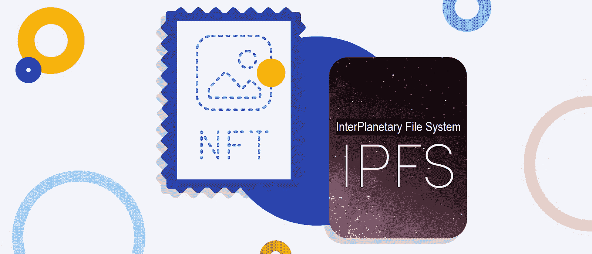
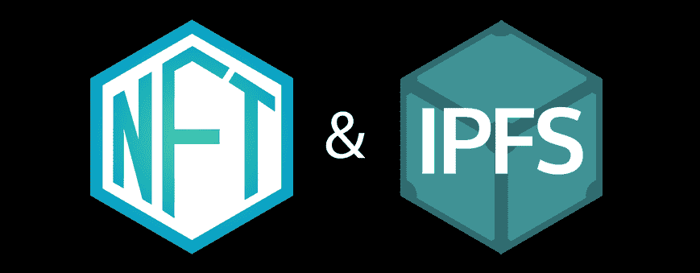
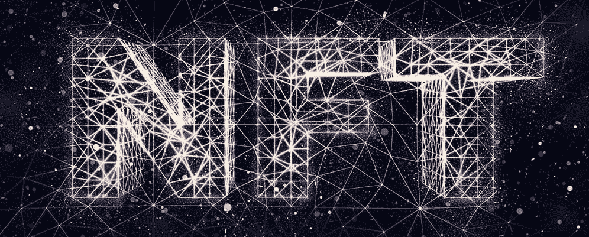
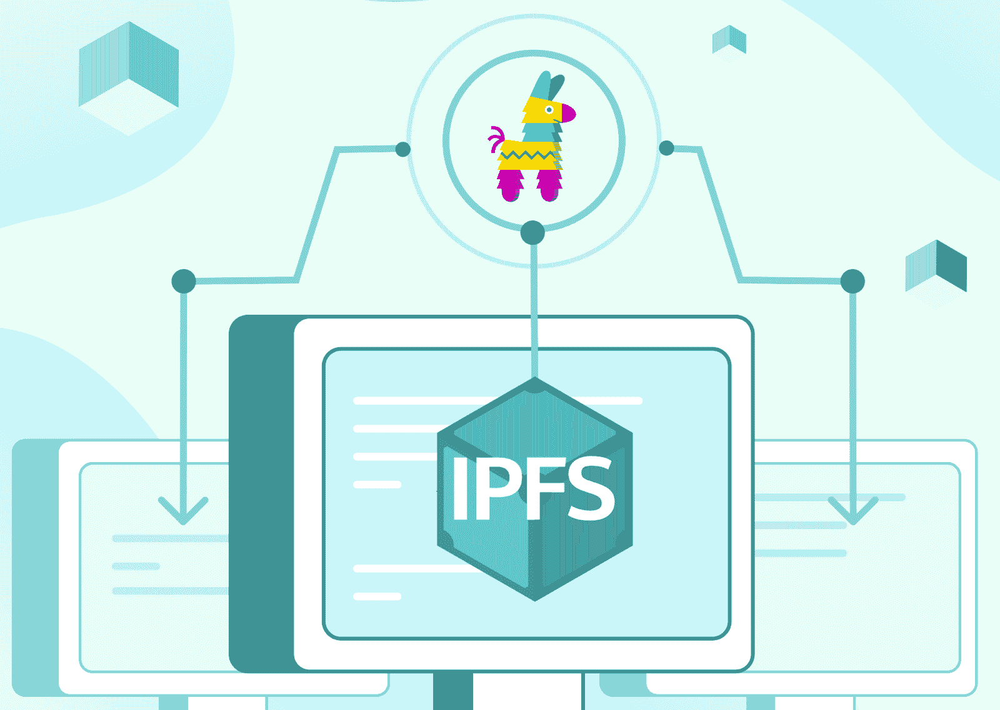
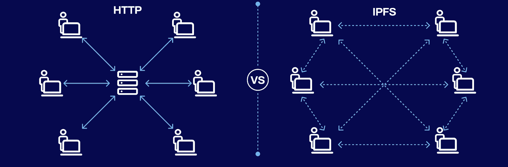
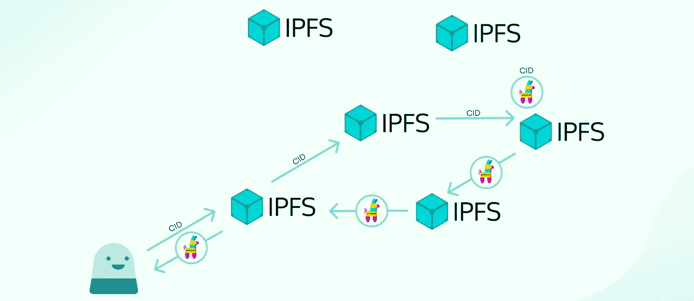
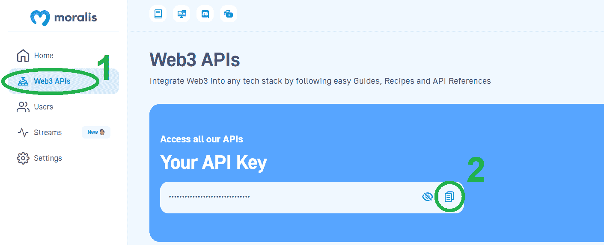
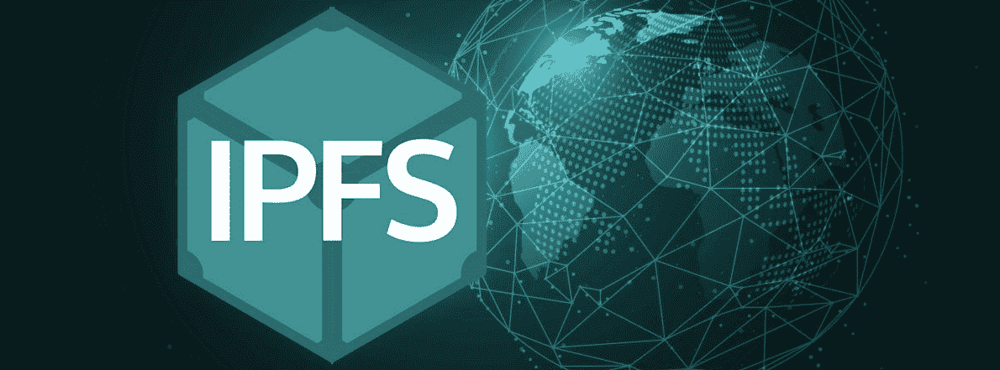

# IPFS·NFT——如何将 IPFS 用于 NFT 元数据

> 原文：<https://moralis.io/ipfs-nft-how-to-use-ipfs-for-nft-metadata/>

NFT 元数据的存储解决方案多种多样，从流行的集中式存储服务到出色的分散式存储解决方案。在本文中，我们将关注一个脱颖而出的分散化替代方案——IPFS。此外，我们将看看开发人员如何使用以下端点来创建“IPFS NFT”的结果:

```js
const response = await Moralis.EvmApi.ipfs.uploadFolder({ abi });
```

如果你以前使用过 [Moralis](https://moralis.io/) ，你可能知道如何实现上面的代码片段。然而，这可能是你第一次听说 Moralis。如果是这样，请完成今天的“NFT·IPFS”教程，并学习如何将 IPFS 用于 NFT 元数据。此外，要完成本教程，你需要一个免费的 Moralis 帐户和大约五分钟的时间。

[**Sign Up with Moralis and Unlock the Power of Blockchain**](https://admin.moralis.io/register)

### 概观

在接下来的章节中，我们将首先确保大家都知道什么是 NFTs、NFT 元数据和 IPFS。毕竟，如果你想自信地回答“什么是 IPFS·NFT？”问题，你需要理解这些概念。我们还会通知您是否关注 IPFS 非功能性测试。因此，当你读到今天的教程部分时，你会知道 NFTs 和 IPFS 的来龙去脉。反过来，你可以决定是否要在未来的项目中使用 NFT·IPFS 储物解决方案。



如果你决定完成今天的教程，你将学习如何使用 JavaScript (JS)或 TypeScript (TS)创建和上传 IPFS NFT 元数据。首先，您将了解需要满足哪些先决条件。然后，我们将带您完成这一过程中的三个步骤。此外，我们将为您提供所有的命令行和一个示例脚本，让您不费吹灰之力就能到达终点。最终，您可以通过简单地复制粘贴我们的代码行和命令，将示例 NFT 元数据上传到 IPFS。



## 探索 NFTs 和 IPFS

如上所述，你需要知道 NFT 和 IPFS 是什么，才能正确理解 IPFS·NFT。因此，我们将利用接下来的三个部分来确保您清楚地了解 IPFS 和 NFTs 的交集。所以，事不宜迟，让我们从近距离观察 NFTs、代表 NFT 的文件和 NFT 元数据开始吧！



### NFTs、代表 NFT 的文件和 NFT 元数据

不可替换令牌(NFT)是一种特殊的加密资产。与可替换令牌不同，它们是不可互换的，因为每个 NFT 都拥有唯一的链上签名。因此，NFT 被用来代表数字艺术和数字收藏品就不足为奇了。然而，值得指出的是，NFT 可以表示任何独特的数字或物理项目。这种表示通常是通过将代表 NFT 的文件分配给 NFTs 来完成的。但是，需要注意的是，这些文件并不存储在区块链上。毕竟，这将带来经济和技术上的后果，因为区块链不是为存储大文件而设计的。

相反，开发人员使用云存储解决方案来存储代表 NFT 的文件。IPFS 是实现这一目标的最佳分权方案之一(详见下文)。此外，在正确存储文件后，开发人员获得它们的 URL，并将它们添加到 NFT 元数据中。此外，后者包括一些关于 NFTs 的其他细节，通常以 JSON 文件的形式出现。就像代表 NFT 的文件一样，开发人员倾向于以同样的方式存储 NFT 元数据文件。因此，IPFS NFT 元数据存储往往是最常见的解决方案。

NFT 智能合同中实际包含的细节是到 NFTs 元数据(URIs)的链接。当然，智能合约还包括其他标准化的信息。然而，细节取决于 NFT 的类型(ERC-721，ERC-1155，SPL 等。).最后，一旦 Web3 开发人员部署了 NFT 智能合同，他们就创建了(mint)NFT。在此过程中，链上事务将 NFT 元数据链接(URIs)存储在区块链上。

现在，您对什么是 NFT、代表 NFT 的文件和 NFT 元数据有了更好的理解，是时候探索 IPFS 了。



### 什么是 IPFS？

星际文件系统，或 IPFS，是一个分布式系统，用于上传、存储和访问网站、应用程序、数据和文件。此外，Protocol Labs 开发了这个点对点(P2P)超媒体协议来保存和增长人类的知识。毕竟，IPFS 让网络更有弹性、更易升级、更开放。

此外，作为 P2P 文件共享协议，IPFS 使用户能够以分散的方式托管和访问内容。此外，用户操作者拥有全部数据的一部分，这为存储和共享文件或其他内容创造了一个独特和创新的系统。另外，请注意，IPFS 不像传统的 HTTP 系统那样基于位置。相反，它利用了内容寻址策略。因此，IPFS 生态系统中的所有内容都有一个唯一的哈希作为内容标识符(CID)。因此，IPFS 用户可以找到任何文件、网站、数据等。，基于其内容而不是位置。从本质上讲，为了找到特定的数据，IPFS 利用对所请求的内容唯一的加密散列。此外，IPFS 还通过将内容链接在一起来识别内容。



### IPFS 是如何运作的

如果您想更深入地了解 IPFS 是如何操作的，请确保使用该协议的文档。但是，快速了解以下三个原则将有助于您理解 IPFS NFTs:

*   **通过内容寻址识别**–使用 IPFS 时，内容是通过“内容”而不是“位置”找到的。这是可能的，因为 IPFS 协议中的每条内容都有一个 CID(内容来源的唯一散列)。
*   **通过 Dag(有向无环图)进行内容链接**–IPFS 使用 Merkle DAGs，其中所有节点都有一个标识符，其形式为节点内容的散列。此外，IPFS 通常将用户的内容分割成块的各个部分，以构建 Merkle DAG 表示。这意味着不同的文件部分可以来自多个来源，并且仍然可以有效地进行身份验证。在某种程度上，这类似于使用 BitTorrent，它允许您同时从几个对等点获取文件。
*   **通过 DHT(分布式哈希表)发现内容**–IPFS 利用 DHT 来发现用户查询的内容由哪些对等体托管。此外，由于哈希表本质上是值的键的数据库，所以 DHT 是在分布式网络中跨对等体分割的表。因此，要找到内容，您需要查询这些对等点。



## 什么是 IPFS·NFT？

至此，您已经知道什么是 NFTs 和 IPFS 了。因此，你可能已经对 IPFS 非功能性翻译有了一个很好的概念。然而，由于“IPFS·NFT”这个术语可能有点令人困惑，仅仅理解什么是 NFT 和 IPFS 意味着什么可能还不够。因此，有必要解释一下。

IPFS·NFT 不是 IPFS“拥有”或“铸造”的不可替代的象征。相反，术语“IPFS NFT”指的是所有使用 IPFS 来存储代表 NFT、NFT 元数据或两者的文件的 NFT。此外，以同样的方式，“IPFS NFT 元数据”侧重于使用 IPFS 存储的 NFT 元数据文件。

### NFT 存储应该使用 IPFS 吗？

通过为代表 NFT 的文件和/或 NFT 元数据文件使用集中存储解决方案，一些特定的项目和 NFT 实用程序实际上可以为用户提供额外的价值。然而，参与 Web3 开发的每个人都应该努力达到适当的分权水平。因此，我们认为分散式存储解决方案是我们的发展方向。谈到这些解决方案，IPFS 往往是最好的选择。现在，在您开始使用 NFT IPFS 解决方案之前，请确保您了解将 IPFS 用于 NFT 存储的主要利弊。IPFS 的一个主要缺点是它不能永久存储文件，因为它没有使用区块链技术。然而，这正是 Filecoin 巧妙补充 IPFS 的地方。


另一方面，IPFS 也有一些明显的优势:

*   **高效低价**–IPFS 的 P2P 系统可以同时从多个节点检索内容，因此效率极高。这也能够节省大量带宽。毕竟，效率的提高有助于降低系统成本。
*   **弹性**–IPFS 简化了创建数据镜像网络的过程，从而提供了高度弹性的系统。此外，由于内容寻址，IPFS 的内容可以自动版本化。
*   **分散化**–信息审查和单点故障问题是集中式存储解决方案和 Web2 的核心问题。因此，IPFS 的去中心化性质通过提供一个扁平和开放的网络消除了这些问题。
*   **可用性**–通过促进弹性网络的创建，IPFS 实现了更持久的可用性。例如，这增加了发展中国家或那些慢速咖啡店 WiFi 连接的连接性。


## IPFS·NFT——如何通过 Moralis 将 IPFS 用于 NFT 元数据存储

是时候开始本教程的行动步骤了！我们将带您完成一个简单的三步流程，让您在几分钟内创建并上传 IPFS NFT 元数据。如果你还记得文章顶部的代码片段，你大概已经知道这部分的主角是 Moralis ' "[*upload folder*](https://docs.moralis.io/reference/uploadfolder)" IPFS API 端点。后者使 NFT IPFS 存储更加简单，是 NFT 开发的有用工具。

但是，在我们给你机会跟随我们并上传示例元数据之前，请确保完成以下先决条件:

*   安装 Node v.14 或更高版本。
*   准备好您最喜欢的代码编辑器或 IDE。我们倾向于使用 Visual Studio 代码(VSC)。
*   安装你喜欢的包管理器*(“NPM”、“yarn”，或者“pnpm”)*。

### 步骤 1:获取您的 Web3 API 密钥并安装 Moralis SDK

如果您还没有这样做，现在就[创建您的免费 Moralis 账户](https://admin.moralis.io/register)。这样，您就可以访问您的管理区域，在那里您可以获得您的 Web3 API 密钥:



我们将很快向您展示将上面复制的 API 密钥粘贴到哪里。但是让我们首先确保您为您的项目安装了 Moralis SDK，该项目主要关注 NFT 和 IPFS。幸运的是，您可以用一个命令来完成这个任务(使用与您的包管理器相匹配的命令):

```js
npm install moralis
```

```js
yarn add moralis
```

```js
pnpm add moralis
```

### 步骤 2:使用一个示例“Index.js”脚本

有了 Moralis SDK，您就可以创建一个“IPFS NFT 元数据”脚本，该脚本适当地合并了“ *uploadFolder* ”端点。下面几行代码可以完成这个任务:

```js
const Moralis = require('moralis').default;
const { EvmChain } = require('@moralisweb3/evm-utils');

const runApp = async () => {
  await Moralis.start({
    apiKey: "YOUR_API_KEY",
    // ...and any other configuration
  });

    const abi = [
    {
        path: "metadata.json",
        content: {
        name: "NFT Name",
        description: "This will be the NFT description.",
        image: "ipfs://bafybeihewi4brhhmjqvquwdqnlzhnamfh26txwmw2fe4nfswfckpthowna/brandResoursesMage2.svg",
        attributes: [
          {
            "trait_type": "Base", 
            value: "Starfish"
          }, 
          {
            "trait_type": "Eyes", 
            value: "Big"
          }, 
          {
            "trait_type": "Mouth", 
            value: "Surprised"
          }, 
      },
    },
    ];

  const response = await Moralis.EvmApi.ipfs.uploadFolder({ abi });

  console.log(response.toJSON());
}

runApp();
```

要使用上面的代码行，您必须用在第一步中获得的 Web3 API 密钥替换“ *YOUR_API_KEY* ”占位符。此外，查看上面的代码行，您可以看到“ *abi* 的详细信息。这是我们定义路径和内容以及与我们的示例 IPFS NFT 元数据相关的所有细节的地方。

此外，上述脚本还包括一个示例图像，我们已经上传到 IPFS。您可以使用 Brave 浏览器查看它:


当然，如果您要使用上面的示例脚本来上传您的 IPFS NFTs，您可能想要替换指示名称、描述和 NFT 属性的占位符。此外，您还想使用自己的图像，将其上传到 IPFS，并用它替换上面的 IPFS 地址。

*注意:上面几行代码重点在于使用 JavaScript。但是，您可以访问* [*文档页面，将 NFT 元数据上传到 IPFS*](https://docs.moralis.io/docs/how-to-upload-nft-metadata-to-ipfs) *并复制 TypeScript 中的代码行。*

### 步骤 3:执行示例 NFT 和 IPFS 程序

你已经到了“NFT·IPFS”教程的最后阶段。假设您正在使用上面的 JavaScript 示例脚本，您只需要在终端中输入以下命令:

```js
node index.js
```

*注意* *:如果您使用的是“index.ts”脚本，您将需要使用“npx ts-node index.ts”命令。*

最后，使用您的终端探索结果。确保复制它返回的路径，并使用 Brave 浏览器查看您的 NFT 的元数据。



## IPFS NFT–如何将 IPFS 用于 NFT 元数据–摘要

我们在今天的文章中谈了相当多的内容。我们首先解释了理解什么是 IPFS NFT 所需的基础知识。因此，您现在知道了什么是 NFTs、NFT 元数据和 IPFS。你也学到了 IPFS 的工作原理。为了帮助您决定是否应该将 IPFS 用于 NFT 存储，我们还研究了这种分散存储解决方案的一些主要优缺点。最后，我们带你通过我们的“NFT IPFS”三步教程，在那里你学会了如何创建和存储 IPFS NFT 元数据。

为了充分利用在此获得的知识和技能，我们鼓励你尝试并创造你自己的 NFT 范例。然后，通过使用 Moralis Web3 [Auth API](https://moralis.io/authentication/) 、 [NFT API](https://moralis.io/nft-api/) 和 [Streams API](https://moralis.io/streams/) 构建包含这些 NFT 的 dapp(去中心化应用程序)，将事情推进到下一个层次。当然，你可以在 [Moralis 文档](https://docs.moralis.io/)、 [Moralis YouTube 频道](https://www.youtube.com/c/MoralisWeb3)和 [Moralis 博客](https://moralis.io/blog/)中找到如何做到这一点的确切说明。后两种途径也非常有助于拓展你在区块链的发展视野。例如，一些最新的主题集中在如何[获得 NFT 元数据](https://moralis.io/get-nft-metadata-how-to-get-the-metadata-of-an-nft/)，[通过三个步骤从集合中获得所有的 NFT](https://moralis.io/how-to-get-all-nfts-from-a-collection-in-3-steps/)，[如何获得地址拥有的所有 NFT](https://moralis.io/how-to-get-all-nfts-owned-by-an-address-3-step-process/)，在 Solana 上创建 NFT 的最简单方法[等等。](https://moralis.io/the-easiest-way-to-create-nfts-on-solana/)

尽管如此，你可能渴望尽快成为全职加密员。如果是这样，通过获得区块链认证，你可以大大增加在这个颠覆性行业获得梦想工作的机会。因此，一定要报名参加[Moralis 学院](https://academy.moralis.io/all-courses)，从掌握[以太坊基础](https://academy.moralis.io/courses/ethereum-101)开始。