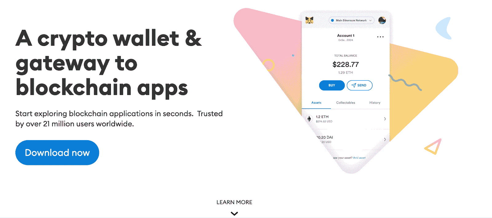
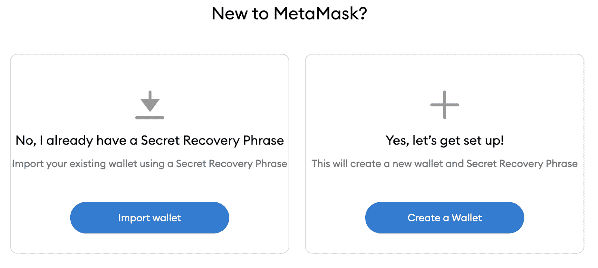
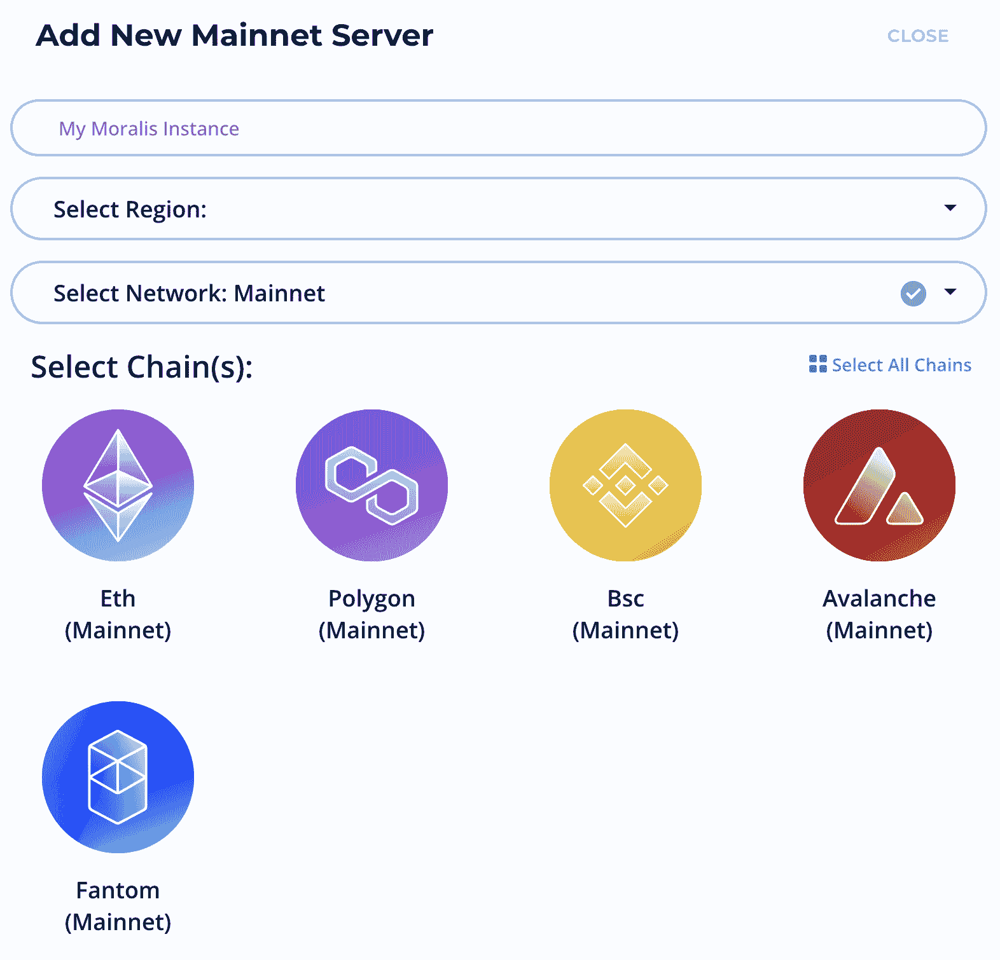
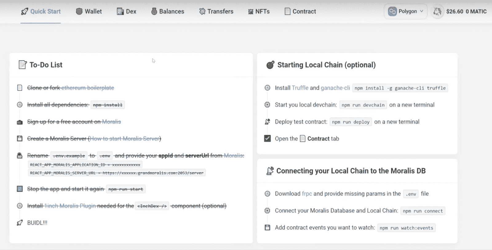

# 面向开发人员的元掩码——如何使用元掩码启动 Web3 应用

> 原文：<https://moralis.io/metamask-for-developers-how-to-launch-web3-apps-with-metamask/>

去中心化的网络正在增长，新的 Web3 应用程序也在不断开发，以扩展各种链的生态系统。开发者创造新的去中心化交易所(dex)、[](https://moralis.io/non-fungible-tokens-explained-what-are-nfts/)****、可替换代币、游戏等。，每天都在为 Web3 领域提供进一步的功能。乍一看，Web3 开发似乎是一项艰巨的任务；然而，它不一定要有合适的工具、平台和操作系统。开发人员使用的最成熟的工具之一是** [**元掩码**](https://moralis.io/metamask-explained-what-is-metamask/)**——一个提供访问 Web3 生态系统的加密钱包。因此，我们将通过这篇文章来进一步了解如何使用 MetaMask 和 Moralis 启动 Web3 应用程序。****

**在本教程中，我们将仔细研究如何从头开始创建 dApp，为此，我们将利用 [Moralis](https://moralis.io/) 。Moralis 是 dApp 开发的最佳操作系统，该平台使 Web3 开发变得更加容易。从传统的角度来看，对于 Web3 开发来说，后端开发是最具挑战性的。然而，Moralis 的 Web3 平台提供了一个已经开发的后端基础设施，使开发人员利用 MetaMask 和启动 Web3 应用程序成为一个简化的过程。**

**此外，Moralis 还提供了一套优秀的开发工具，可以在 Web3 应用程序的整个开发过程中使用。一些例子是对 [IPFS](https://moralis.io/what-is-ipfs-interplanetary-file-system/) 的本地支持、跨链兼容性、[价格 API](https://moralis.io/introducing-the-moralis-price-api/) 和 [NFT API](https://moralis.io/ultimate-nft-api-exploring-moralis-nft-api/) 。所以，如果你想开始在区块链发展，你旅程的下一步是与 Moralis 签约。这样做是免费的，您将立即获得该平台的好处！**

### **什么是 MetaMask？**

**在我们开始使用 MetaMask 启动 [Web3](https://moralis.io/the-ultimate-guide-to-web3-what-is-web3/) 应用程序之前，让我们简单了解一下 MetaMask 是什么。元掩码有两种形式:移动应用程序或 web 浏览器扩展。在本教程中，我们将使用 MetaMask 作为 web 浏览器扩展，因为这样做可以使使用 MetaMask 进行 Web3 开发变得更加容易。**

**

元掩码的功能是双重的；首先，它可以用作加密货币钱包来持有、交易和购买加密货币。此外，作为一个钱包，该扩展提供了大多数必要的功能来管理您所有的加密资产。其次，MetaMask 还充当 dApps(去中心化应用)的广泛[以太坊](https://moralis.io/full-guide-what-is-ethereum/)生态系统的网关。此外，以太坊还有几个第二层缩放解决方案，比如 Polygon，其中也使用了 MetaMask。因此，元掩码不仅仅局限于以太坊网络。

MetaMask 目前在全球有超过 2100 万用户使用，该扩展/应用程序提供了对基于区块链的应用程序的安全访问。MetaMask 还为其数据管理感到自豪，因为用户可以完全控制他们的信息。这意味着只有用户可以访问他们的数据，他们自己决定分享什么，什么是他们想要保密的。

因此，如果你想访问基于区块链的 Web3 应用程序，如 [Compound](https://compound.finance/) 、 [Maker](https://makerdao.com/en/) 、【MKR】、 [OpenSea](https://opensea.io/) 、 [Uniswap](https://uniswap.org/) 等等，那么你肯定会从下载 MetaMask 中受益。获取元掩码相对简单；然而，我们将利用下面的部分来分解下载过程，并仔细看看 MetaMask 是如何作为钱包工作的。

### 如何设置元掩码

要开始使用 MetaMask，你需要做的第一件事是访问[官方网站](https://metamask.io/)并下载扩展。为此，只需点击“立即下载”按钮，并将扩展安装到您想要的网络浏览器。



扩展就绪后，您可以通过点击“Get Started”来开始这个过程。这会给你提供两种选择；1)导入钱包，2)创建钱包。因此，如果您已经有一个加密钱包，可以导入您现有的一个秘密恢复短语，并添加一个密码。但是，如果您对加密领域完全陌生，并且没有钱包，您可以选择第二种方法从头创建一个新的钱包。为此，您只需输入您选择的密码，作为回报，您将收到一个种子短语。然后会要求您确认秘密恢复短语，一旦完成，您将收到您的第一个 MetaMask 钱包。

*注意:请务必记下种子短语并妥善保存，因为这将是您在将来需要时取回元掩码钱包的唯一机会。*



### 使用元掩码

有了一个账户，你就可以完全管理你所有的加密货币。而且，你可以在界面顶部找到一个地址。这将是您钱包的地址，这意味着当有人向您发送加密资产时会用到它。

在界面的更下方，你还会发现三个“操作”按钮，一个用于购买，一个用于发送，一个用于交换。此外，还有两个单独的选项卡；“资产”和“活动”。在“资产”选项卡下，您将找到添加到您帐户的所有资产，在“活动”选项卡下，您将找到您帐户所有交易的完整历史记录。

最后，您还会在 MetaMask 扩展的顶部找到一个“网络”下拉菜单。在这里，您可以更改并添加更多网络到您的钱包中。


## 开发人员的元掩码

MetaMask 不仅在管理加密资产方面非常出色，而且对于开发人员来说也是一个优秀的工具。为了让某人与我们的 Web3 应用程序交互，允许用户验证自己是非常重要的。这个过程有几种不同的选择；然而，最常用的选项是元掩码。此外，当使用 Moralis 时，可以相对容易地用 MetaMask 对用户进行认证。实际上，由于有了 [Moralis SDK](https://moralis.io/exploring-moralis-sdk-the-ultimate-web3-sdk/) (软件开发工具包)，用一行代码就可以认证用户。


然而，面向开发人员的元掩码只是认证用户的众多替代方法之一。还有其他解决方案，如 WalletConnect，开发人员可以在他们的 dApp 中实现。假设你想更多地了解这个过程；然后查看以下来自 Moralis 博客的关于如何用 WalletConnect 连接用户的指南。这一过程与使用 MetaMask 验证用户身份没有明显的区别，但是值得一试，以了解其中的区别并了解更多关于 WalletConnect 的信息。

## 如何使用 MetaMask 启动 Web3 应用程序

MetaMask 作为开发人员的一个工具是非常有益的，并提供了一个更容易访问的开发过程。将 MetaMask 集成到 dApps 中并不容易，但是使用 Moralis，通过一行代码就可以做到。此外，在本教程中，我们将从头开始创建一个完整的 Web3 应用程序，它可以发送、交换、传输、查看余额等等。因为我们将使用 Moralis，这个过程变得非常容易。事实上，我们只是要在 Visual Studio 代码(VSC)中创建新项目，并导入一个样板文件。

然而，如果你更喜欢观看 YouTube 视频，解释如何使用 MetaMask 启动 Web3 应用程序，请查看来自 [Moralis YouTube 频道](https://www.youtube.com/channel/UCgWS9Q3P5AxCWyQLT2kQhBw)的以下视频:

https://www.youtube.com/watch?v=9kdVAeZ7knk

该视频首先解释什么是元掩码以及如何获得钱包，然后举例说明开发人员使用元掩码的潜力。尽管如此，您也可以选择继续阅读，因为我们将在本文中带您完成整个过程。

### 面向开发人员的元掩码–创建 Moralis 服务器

如果你还没有，这个过程的第一步是注册 Moralis。注册是完全免费的，只需要几秒钟。一旦您有了一个帐户，我们就可以通过点击 Moralis 管理面板顶部的“创建新服务器”来创建一个服务器。这样做将提供一个带有几个选项的下拉菜单；但是，我们将选择“Mainnet 服务器”替代方案。

单击此按钮后，我们需要输入一个名称，选择一个地区，然后选择“网络”。对于本教程，我们将选择所有可用的网络，因为 Moralis 是跨链兼容的。此外，完成所有选择后，我们可以通过单击右下角的“Add Instance”按钮启动服务器。



创建服务器可能需要一些时间；但是，该实例将在几分钟内启动。现在，有了服务器，我们可以继续下一步，包括通过导入样板代码创建一个 Web3 应用程序。

### 面向开发人员的元掩码–安装以太坊样板

首先，你可以在 [Moralis GitHub 页面](https://github.com/MoralisWeb3)找到[以太坊样板](https://github.com/ethereum-boilerplate/ethereum-boilerplate)代码。一旦打开，你需要点击绿色的“代码”按钮。这将打开一个带有样板文件链接的小下拉菜单。您可以复制这个链接，然后打开 Visual Studio 代码。

一旦进入 Visual Studio 代码，您就可以打开一个新的终端和“Git Bash ”,并输入以下命令:

```js
git clone https://github.com/ethereum-boilerplate/ethereum-boilerplate.git
```

上面命令中的链接是从 GitHub 页面复制的样板链接。这将克隆 GitHub 存储库，以便我们可以安装样板文件。因此，有了克隆的样板文件，我们可以通过输入以下内容进入正确的目录:

```js
cd ethereum-boilerplate/
```

一旦我们进入正确的目录，我们可以通过下一个命令简单地安装它:

```js
yarn install
```

此命令将安装所有依赖项。在安装过程中，我们可以转到 Visual Studio 代码左侧的菜单，只需删除“. env.example”文件即可更改其名称。例子”。而且，在”。env "文件，您会看到两个基本行:

```js
REACT_APP_MORALIS_APPLICATION_ID = 
REACT_APP_MORALIS_SERVER_URL =
```

这两者目前都等于零，这意味着我们需要分配应用程序 ID 和服务器 URL。要找到这些信息，您需要回到 Moralis 管理面板。在那里，您可以单击“Servers”选项卡，然后单击有问题的服务器的“View Details”按钮。然后，您只需将 URL 和 ID 信息复制并粘贴到样板代码中。就是这样；您只需几分钟就可以开发出一个完整的 dApp！

### 面向开发人员的元掩码–启动 dApp

现在，Web3 应用程序已经完成，我们可以通过在终端中输入以下命令来启动 dApp:

```js
yarn run start
```

这将启动带有元掩码的 Web3 应用程序，最终结果应该如下所示:



如您所见，在 Web3 应用程序的顶部有一个导航栏，其中有几个不同的选项。在右上角，还有一个认证按钮。如果用户点按此按钮，他们将被要求使用 MetaMask 进行鉴定。

此外，还有“钱包”、“指数”、“余额”等附加标签。，这些都是开箱即用的全功能产品。因此，这证明了与 Moralis 家合作是多么容易。所有这些都已经添加到 dApp 中，这意味着当涉及到例如[区块链语言](https://moralis.io/best-languages-for-blockchain-development-full-tutorial/)如 [JavaScript](https://moralis.io/javascript-explained-what-is-javascript/) 或 [Solidity](https://moralis.io/solidity-explained-what-is-solidity/) 时，你不需要高级开发经验。

现在剩下的就是让你根据自己的喜好定制 Web3 应用了。例如，您可以删除元素、添加新元素或修改现有的替代元素。所以，如果你想成为一名区块链开发者，你可以仔细看看 T2 的 Moralis 博客，寻找更多的灵感！

## 如何使用 MetaMask 启动 Web3 应用程序–总结

与 Moralis 家合作时，建立 dApps 并不一定很困难。在本文中，我们展示了如何利用 MetaMask 在几分钟内启动简单的 Web3 应用程序，这要归功于该平台的工具和以太坊样板代码。我们需要做的就是创建一个 Moralis 服务器，安装样板文件，并初始化 Moralis。然而，这仅仅触及了 Moralis 的表面。为了进一步说明 Moralis 的力量，请查看下面的文章:T2 如何免费铸造 NFT，T4 如何构建跨链 dApp，或者 T6 如何主持 dApp。

所以，如果你想为你的下一个区块链项目节省时间和资源，就马上和 Moralis 签约吧。它是完全免费的，您可以在几分钟内开始开发，所以不要犹豫！**