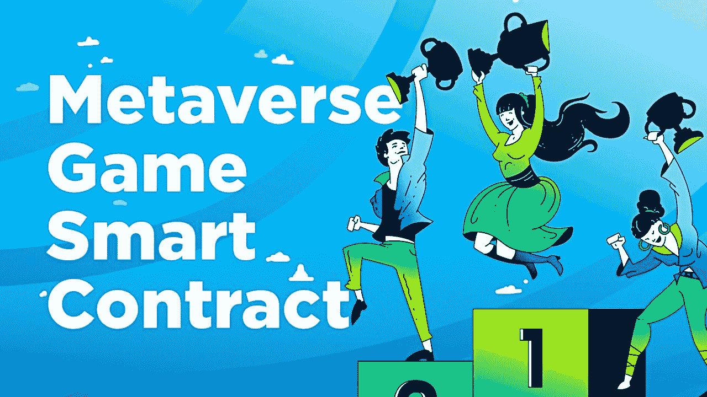
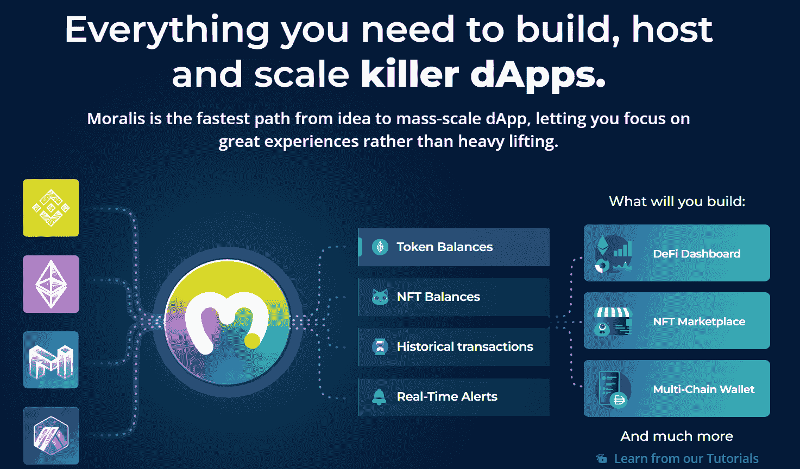
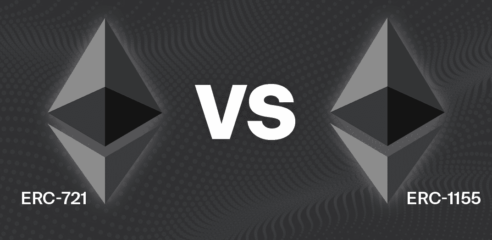
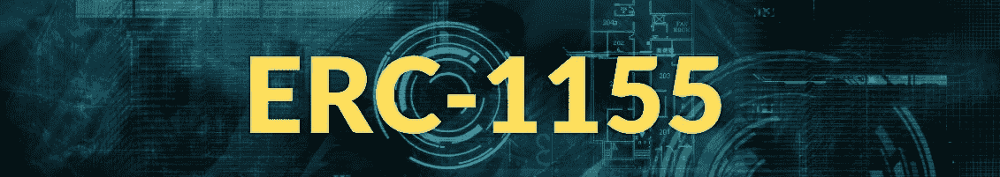

# 元宇宙智能合同-如何建立一个元宇宙游戏智能合同

> 原文：<https://moralis.io/metaverse-smart-contract-how-to-build-a-metaverse-game-smart-contract/>

**可编程区块链上的智能合约，如** [**以太坊**](https://moralis.io/full-guide-what-is-ethereum/) **，是自动执行特定动作的关键，这些动作将在满足预定义条件时执行。此外，他们确保事情以公平的方式顺利进行。虽然有各种各样的智能合约，但我们在这里将重点关注元宇宙智能合约示例。尽管目前的恐惧和不确定性在目前的密码市场，元宇宙的发展继续飙升。不管市场状况如何，人们都会玩游戏，这一事实可能与此有很大关系。现在，由于我们仍然处于游戏的早期，这可能是学习游戏智能合约编程的最佳时机。此外，出于本教程的目的，我们已经创建了几个元宇宙智能合同示例。向前看，我们将一起经历它们。**

在熟悉了我们的元宇宙智能合约之后，我们还将向您展示如何使用 [Remix](https://moralis.io/remix-explained-what-is-remix/) 来部署它们。有了这些知识，你就可以[创建一个元宇宙](https://moralis.io/how-to-create-a-metaverse-dapp-with-unity/) dApp 了。通过使用[Moralis 元宇宙 SDK](https://moralis.io/metaverse/) ，你可以无缝地使用你的新游戏智能合约。然而，如果你想提高你的技能和信心，一定要看看我们的其他教程。它们带有样板代码，您可以在许多情况下复制这些代码。因此，你可以在几分钟内就有一个功能性的 [Web3](https://moralis.io/the-ultimate-guide-to-web3-what-is-web3/) 游戏开始运行。例如，你可以[构建一个中世纪的元宇宙游戏](https://moralis.io/how-to-build-a-medieval-metaverse-game/)。

通过承担这些简单的示例项目，您将增强自己的技能，并熟悉强大的 Web3 开发工具。此外，尽管 Web3 的技术栈每天都在发展，但 T2 的 Moralis 伦理仍然是终极工具。这个“ [Firebase for crypto](https://moralis.io/firebase-for-crypto-the-best-blockchain-firebase-alternative/) ”可以帮你节省 87%的开发时间。因此，今天就注册并尝试一下吧！



## 元宇宙智能合同-基础

在我们深入研究元宇宙智能合同示例之前，我们希望确保我们都在同一页上。因此，让我们首先介绍一些基础知识。能够回答"[什么是智能合约？](https://moralis.io/smart-contracts-explained-what-are-smart-contracts/)、[什么是元宇宙？](https://moralis.io/what-is-the-metaverse-full-guide/)“自信地将事情大大简化。

我们已经提到智能合约的存在是为了在区块链实现自动化操作。此外，它们还确保交易等事件按照设定的规则和标准发生。此外，每个令牌创建背后都有一个智能合约。此外，智能合约也是所有 dapp([去中心化应用](https://moralis.io/decentralized-applications-explained-what-are-dapps/))的支柱。本质上，智能合约是一种软件，一旦满足了预定义的条件，它就会触发某些动作。因此，他们也为无数行业提供了消除中间商的解决方案。*有关智能合约的更详细解释，请使用上面的链接。*


另一方面，在其“最真实”的形式下(想想准备好的玩家一)，元宇宙现在只是一个理论。因此,“元宇宙”这个词开始被用于更广泛的网络世界。在这些数字世界中，用户可以互动并参与不同的活动。因此，根据这个模糊的定义，许多多人游戏可以被认为是“元游戏”。然而，当前元宇宙开发的主要焦点是在加密领域。

通过使用这种颠覆性技术，metaverses 可以轻松包含数字货币系统。反过来，在元宇宙创造的价值可以转移到现实世界。此外，区块链还让人们有机会真正拥有自己的游戏内资产，这可以用 [NFTs](https://moralis.io/non-fungible-tokens-explained-what-are-nfts/) 来表示。此外，建立在区块链之上的 metaverses 可以去中心化，这应该是最终目标。*使用上面的链接深入探究“什么是元宇宙？”讨论。*


### 什么是元宇宙智能合约？

既然你知道什么是智能合约，什么是元宇宙，把这两个概念放在一起就不难了。因此，元宇宙智能合同是指以任何方式用于创建或运行元宇宙的任何智能合同。即使是旨在元宇宙内制造非功能性交易的 NFT 智能合约也会被视为元宇宙智能合约。由于游戏，尤其是 Web3 游戏，被认为是元合约，“游戏智能合约”只是元宇宙智能合约的另一个术语。

此外，按照这种命名法，我们还讨论了[道智能合约](https://moralis.io/dao-smart-contract-example-dao-guide/)示例、[可重入智能合约](https://moralis.io/what-is-reentrancy-reentrancy-smart-contract-example/)示例、【】ERC-721 智能合约、[可升级智能合约](https://moralis.io/what-are-upgradable-smart-contracts-full-guide/)等。此外，作为一名区块链开发人员，您应该学会如何轻松使用各种智能合约。幸运的是，有许多工具可以使这变得非常简单。首先，你可以使用开源平台，比如 [OpenZeppelin](https://moralis.io/what-is-openzeppelin-the-ultimate-guide/) ，来获得智能合同模板。此外，如前所述，Remix 使您能够轻松部署智能合约。但是，您还应该学会[同步和索引智能合约事件](https://moralis.io/sync-and-index-smart-contract-events-full-guide/)。这就是 Moralis 的“同步”功能发挥作用的地方。当你把后者和 Moralis 的仪表板(数据库)结合起来时，你基本上就能索引区块链了。因此，一旦我们介绍了下面的元宇宙智能合同示例，请确保使用这些非凡的工具来充分利用它们。



## 元宇宙智能合同示例

掌握了基础知识，您现在知道智能合约是记录事件并将其转换为不可变的链上数据的关键。因此，游戏中资产的所有权可以得到妥善管理。因此，一位 Moralis 专家创建了几个智能合同示例，我们将在此仔细研究。此外，我们把它们都放在 GitHub 上，这样你就可以很容易地访问它们。这也意味着你可以在游戏中使用它们。尽管如此，为了确保你能轻松跟上，先从克隆我们的 [NFT 游戏沙盒](https://github.com/ashbeech/moralis-nft-game)开始。此外，我们将使用 Visual Studio 代码(VSC)；但是，可以随意使用任何其他代码编辑器。

在 NFT 游戏沙盒中，您将看到我们将重点关注的两个游戏智能合约示例。这些是“[小行星](https://github.com/ashbeech/moralis-nft-game/blob/main/contracts/Asteroid.sol)和“[小行星](https://github.com/ashbeech/moralis-nft-game/blob/main/contracts/Character.sol)”。此外，这两个元宇宙智能合约都是 NFT 智能合约。《Asteroid.sol》使用 [ERC-1155 令牌标准](https://moralis.io/erc1155-exploring-the-erc-1155-token-standard/),《character . sol》使用 [ERC-721 标准](https://moralis.io/erc-721-token-standard-how-to-transfer-erc721-tokens/)。这两种标准各有优势。简而言之，ERC-1155 通常更适合游戏地，而 ERC-721 更适合角色。



## 使用 ERC-721 的博弈智能合约示例

在“Character.sol”的顶部，我们有一个 pragma 指令。这告诉契约的编译器使用哪个版本的 Solidity:

```js
pragma solidity ^0.8.0;
```

以下是其他合同的导入。这是我们大量使用 OpenZeppelin 的地方。因此，我们节省了大量时间:

```js
import "@openzeppelin/contracts/token/ERC721/extensions/ERC721URIStorage.sol";
import "@openzeppelin/contracts/utils/math/SafeMath.sol";
import "@openzeppelin/contracts/utils/Counters.sol";
import "@openzeppelin/contracts/access/Ownable.sol";
```

通过利用上面导入的智能合约的功能，我们可以跳过智能合约中的大量编码。接下来，我们有实际开始智能合约的行。这也是我们从上面导入的契约中定义继承的地方:

```js
	contract Character is ERC721URIStorage, Ownable {
  using Counters for Counters.Counter;
  using SafeMath for uint256;
```

然后，我们创建状态变量来设置智能合约的其余功能。此外，这些变量大多是公开的。例如，这是设置每次转移的代币最大限额和费用最大限额的地方:

```js
  uint256 fee = 0.00 ether; // <-- any fees we want to change on txs
  uint256 public constant maxSupply = 10000; // <-- max supply of tokens
  uint256 public maxMintAmountPerTx = 1; // <-- max mints per tx
  uint256 public perAddressLimit = 100; // <-- max
  string public notRevealedUri = "ipfs://INSERT_YOUR_CID/character-hidden.json"; // <-- link to metadata for e.g. hidden opensea listing of token
  bool public paused = false; // <-- stop interaction with contract
  bool public revealed = true; // <-- is the collection revealed yet?
  address public contractOwner; // <-- game dev/studio wallet address
```

### 我们的游戏智能合约代码演练-记录角色的属性和功能

接下来，我们定义一个“struct”类型来表示角色属性的记录。这使我们能够在游戏的世界中跟踪我们的角色:

```js
 struct Char {
    uint256 id;
    uint256 dna;
    uint8 level;
    uint8 rarity;
    uint256 evac;
    string tokenURI;
  }
```

我们还需要将上述结构映射到一个可公开访问的“var ”,这使我们能够检索关于字符的链上信息:

```js
Char[maxSupply] public _tokenDetails;

event NewChar(address indexed owner, uint256 id, uint256 dna);
mapping(address => uint256) public addressMintedBalance;

constructor() ERC721("Character", "CHAR") {
  contractOwner = msg.sender; 
}
```

从那时起，我们开始关注将声明我们的智能契约的逻辑的函数。我们从一个效用函数开始，生成一个随机数，用于我们角色的 id 和稀有度。关于我们的“Character.sol”元宇宙智能合约中使用的功能的更多细节，请观看下面的视频，从 4:29 开始。在 5:33，你也将看到“写”功能，更新我们的角色在链上的属性。此外，这些函数触发玩家可执行和管理员可执行的动作。



## 使用 ERC-1155 的博弈智能合约示例

现在是时候仔细看看我们的“小行星. sol”元宇宙智能合同了。这款游戏智能契约的大致结构与《Character.sol》颇为相似。因此，我们也从 pragma 行开始:

```js
pragma solidity >=0.6.12 <0.9.0;
```

接下来，我们引入了其他智能合约:

```js
import "@openzeppelin/contracts/token/ERC1155/ERC1155.sol"; //
import "@openzeppelin/contracts/utils/math/SafeMath.sol";
import "@openzeppelin/contracts/access/Ownable.sol";
import "@openzeppelin/contracts/utils/Counters.sol";
import "@openzeppelin/contracts/utils/Strings.sol";
```

然后，我们从上面导入的契约中定义继承:

```js
contract Object is ERC1155, Ownable {
  using Counters for Counters.Counter;
  using SafeMath for uint256;
  using Strings for string;
  Counters.Counter private _tokenIDS;
```

下面是我们定义公共变量的行:

```js
  uint256 public cost = 0.00 ether;
  uint256 public maxSupply = 10000;
```

接下来，我们定义一个结构类型，然后映射它。然后，这最终将我们带到了“constructor()”:

```js
  constructor()
    ERC1155("ipfs://QmPJvYnCSeZUyqdiNpEgv4KWBVWK1SEh2Y8X1uScXWCCYg/{id}.json")
  {
    name = "Asteroid";
    symbol = "AROID";
    tokensInCirculation = 0;
  }
```

这就是 ERC-1155 发挥重要作用的地方。它使我们能够通过使用 [IPFS](https://moralis.io/what-is-ipfs-interplanetary-file-system/) 以分散的方式存储每块游戏中的土地。此外，在其核心，ERC-1155 是专为批量铸造。因此，它比 ERC-721 更符合我们的目的。*更多详情，请看下面 8:20 的视频。*


## 使用 Remix 部署游戏智能合约

一旦您准备好了智能合约，您就可以使用 Remix 以一种非常无缝的方式部署它们。这个基于浏览器的工具很容易使用。此外，您可以使用之前给出的元宇宙智能合约示例的链接，然后将整个代码复制到 Remix。在那里，首先创建一个新文件，然后粘贴代码并保存它。一旦您的代码被保存，您就可以编译您的游戏智能合约示例。现在，您已经准备好继续进行部署了。当然，要确保你已经准备好了元掩码和足够的 testnet 令牌来支付交易费用。尽管如此，要获得详细的指导，请使用下面 9:53 的视频。

*这是我们在整篇文章中引用的视频* *:*

https://www.youtube.com/watch?v=xcCMTb5jpKE

## 元宇宙智能合同–如何建立元宇宙游戏智能合同–摘要

此时，你已经是元宇宙智能合约的半个专家了。您已经了解了它们是什么，并且通过几个游戏智能合同示例获得了正确的理解。一路上，你也学到了 Moralis。因此，你现在知道这个 [Web3 后端平台](https://moralis.io/exploring-the-best-web3-backend-platform/)可以覆盖你所有与区块链相关的后端需求。此外，在观看视频时，您已经有机会了解如何使用 Remix 在几分钟内部署智能合同。

展望未来，我们鼓励您参与一些示例项目，以运用您的元宇宙智能联系知识。另一方面，您可能希望探索其他区块链发展主题。对于这两种途径， [Moralis YouTube 频道](https://www.youtube.com/c/MoralisWeb3)和 [Moralis 博客](https://moralis.io/blog/)正是你所需要的。这两个渠道都提供了大量有价值的内容。因此，它们无疑是免费加密教育的最佳方式之一。例如，我们最近的一些话题深入探讨了 [Web3 电子商务](https://moralis.io/web3-e-commerce-create-a-web3-e-commerce-platform-in-5-steps/)以及如何构建[Web3 亚马逊市场](https://moralis.io/how-to-build-a-web3-amazon-marketplace/)，如何[将 Unity 应用程序连接到 web 3 钱包](https://moralis.io/how-to-connect-a-unity-app-to-a-web3-wallet/)， [Alchemy API 替代方案](https://moralis.io/alchemy-api-alternatives-web3-development-platforms/)，如何[快速创建 BNB 链令牌](https://moralis.io/how-to-create-a-bnb-chain-token-in-5-minutes/)，克隆[比特币基地钱包](https://moralis.io/cloning-coinbase-wallet-how-to-create-a-coinbase-clone/)，如何[创建索拉纳令牌](https://moralis.io/how-to-create-a-solana-token-in-5-steps/)， [NFT 铸造页面](https://moralis.io/how-to-launch-an-nft-minting-page-full-walkthrough/)

另一方面，你可能想尽快成为一名区块链开发者。如果是这样的话，采取更专业的方法通常效果最好。因此，考虑报名参加[Moralis 学院](https://academy.moralis.io/)。除了获得专业的[课程](https://academy.moralis.io/all-courses)，你还将获得个性化的学习路径。此外，你将成为一个最支持和热爱区块链社区的一部分。此外，您将获得专家指导，以进一步推动您的进步。

