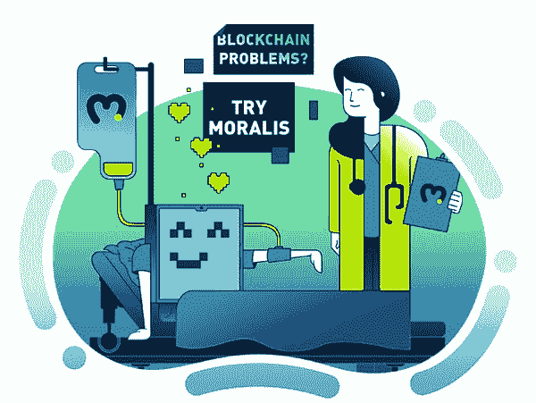

# Moralis 杂志# 1——Moralis 是星际的

> 原文：<https://moralis.io/moralis-magazine-1-moralis-is-interplanetary/>

**Moralis 研究团队非常高兴能与您分享这份新出版物！每周我们将深入探讨紧迫的区块链编程问题，并向您展示 Moralis 如何使解决这些问题变得简单。继续阅读**

我们在 Moralis 的目标是支持你和你的项目。在我们共同打造金融未来的过程中，请将我们视为您的“僚机”。

**本周起:**

****本周，我们来看看 IPFS 文件托管，以及如何使用 Moralis 来有效地利用这一优秀的存储技术。****

****什么是 IFPS？****

****[星际文件系统](https://moralis.io/what-is-ipfs-interplanetary-file-system/) (IPFS)是用于存储和共享数据的协议和对等网络；分布式文件系统。****

********

****它被誉为标准网络协议 HTTP 和 HTTPS(引用位置)的替代品。****

****当一个互联网用户给他们的浏览器一个域名(例如:【http://www.google.com】)时，这个域名指向一个托管内容的服务器的 IP 地址。****

******IPFS 数据存储在哪里，我如何找到它？******

****用户想要发布的每一条内容都被散列，并带有一些元数据。该散列创建了一个称为 CID 或“内容 ID”的唯一标识符。IPFS 的内容是分散的，分布在不同的节点上，信息不能被记录下来。****

****它无处不在，而且是不可改变的，这意味着用户不能改变内容而仍然保留相同的内容 ID(除非是 IPNS)。****

****IPFS 参与者不需要一个固定的位置来存储 IPFS 数据，他们只需要内容 ID，并通过网络查找数据。内容 ID 是一个散列，所以它不关心内容(数据)位于何处(IPNS——与 IPFS 相似——是基于位置的)。****

****IPFS 是如何工作的？****

****简单的答案是“分布式哈希表”或 DHT。它们将内容 ID 映射到对等地址(类似于公共 IP 地址和端口)，因此基本上有一堆 DHT 服务器将这些 DHT 提供给连接到服务器的客户端。****

****它们转发消息说“这个内容 ID 存在于这个对等体中”，或者“这个内容 ID 存在于这个 IP 地址中”。因此，如果我们转到像 ipfs://x 这样的地址，这将要求“x”的 CID，它将查询 DHT 表以检索具有该特定 CID 的所有对等体，然后连接到这些对等体以允许用户使用内容。****

******消费 IPFS 内容******

****IPFS 客户端查询本地 DHT 表以查看内容的位置，并正常返回 IP 地址和端口的集合。可能本地 DHT 表什么都没有，没有更新，所以什么都没有返回。****

****在这种情况下，你会开始问你的同事“有人知道在哪里可以找到这些内容吗？”****

****假设您获得了 IP 地址和端口(内容驻留的位置)，然后客户端连接到一些或所有对等端，并可以开始下载内容。****

******内容如何下载？******

****这是一个 torrent(点对点)协议。客户端从每个对等点下载大量内容，加快了下载过程。该协议将内容分成特定的块，每个块都有一个特定的哈希，客户端从对等点请求各个块。****

****您开始打开与多个对等方的多个连接，并开始并行下载内容。一旦客户端有了内容，它也用 CID 更新它的本地 DHT 表。用户可以决定是托管还是“吸血”(只消费的概念——你基本上下载内容，然后杀死种子)。Brave 浏览器包含启用或禁用托管的功能。****

******你如何找到同龄人？******

****当你第一次安装一个 IPFS 客户端时，IPFS 协议会给你一个对等点，这就是你进入网络的方式。****

****第一步是通过“引导”连接到其本地对等点，一旦它们开始托管内容，它们就通过一个相当复杂的过程更新其 DHT 表的对等点。详细阅读。****

******换个内容怎么办？******

****内容是不可变的。如果您对任何内容进行更改，您将需要生成一个新的内容 id，并且您必须更新 DHT 表并重新填充用户，这并不容易。对此的一个解决方案是，改为散列用户的公钥。****

****通过这种方式，公钥将被映射到名称服务器，公钥散列将指向内容。所以人们会继续使用你的公钥散列而不是内容 id。这是 IPNS(星际域名服务器)。IPNS 是可变的，可以改变。****

******如何删除内容？******

****如果您是托管该内容的唯一节点，那么您可以取消固定它，这将从您的本地 DHT 中删除该条目。然而，一旦另一个节点下载了该内容，您就不能再删除它了——这一点需要注意。****

****有触发自动下载内容的饥饿节点，所以如果你上传到 IPFS，很有可能内容不能再被删除。****

****如何发布到 IPFS？****

****如果您有内容要发布并想在 IPFS 上分享，您的内容首先会被散列成一个唯一的内容 id。您的本地 DHT 表会将您的 CID 更新为您的 IP 地址，并且您将作为唯一一个托管该内容的人开始。****

****然后，内容会在所有连接的对等点上传播——假设您希望公开访问。只传播 DHT 表，不传播内容本身。默认情况下，搜索您的 CID 的人不会托管内容。在用户下载内容之前，您是唯一的所有者。****

****你可以使用命令行软件包管理器来安装 IPFS。例如 mac 上的“brew”。一旦安装了 IPFS，你就可以启动一个节点来托管内容并直接从网络上读取。它还会向您显示您拥有的所有同事。如果需要，您甚至可以直接从终端消费内容。或者，您可以从命令行创建内容，并使用 brave 访问它。****

****或者， 你可以用 Moralis 家 …****

********

****MORALIS 网站上有关于 IPFS 的详细文档，这将有助于您在 dApp 中使用它。你也可以在 Moralis YouTube 频道查看这些有用的视频:****

******如何将元数据等“对象”保存到 IPFS******

****[https://www.youtube.com/embed/c9SalynPw-g?feature=oembed](https://www.youtube.com/embed/c9SalynPw-g?feature=oembed)****

******如何将“文件”保存到 IPFS******

****[https://www.youtube.com/embed/jPa0a7-6uUw?feature=oembed](https://www.youtube.com/embed/jPa0a7-6uUw?feature=oembed)****

******如何组合“文件”和“对象”并上传到 IPFS******

****[https://www.youtube.com/embed/jRjFn__kVJM?feature=oembed](https://www.youtube.com/embed/jRjFn__kVJM?feature=oembed)****

****感谢阅读！我们希望本周的 Moralis 杂志对你有用。

**继续建造！******

****下次见💚****

****Moralis 研究小组****