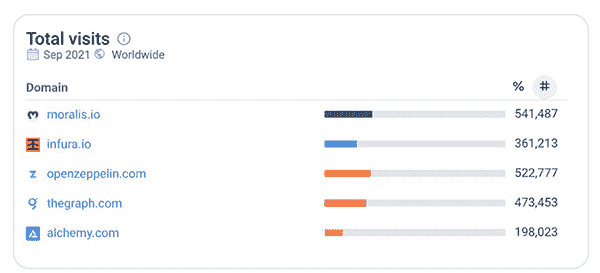

# Moralis 杂志# 10——无聊的 Moralis 法师

> 原文：<https://moralis.io/moralis-magazine-10-bored-moralis-mages/>

再次感谢你本周加入我们。我们一起(Moralis 道)支持和使用最健壮和最强大的 Web3 框架。

**Moralis 是一个强大的 Web3 框架**，但是作为 Moralis DAO，我们不仅仅是这样。我们希望通过为您提供快速构建应用程序所需的工具和组件来帮助您提升开发水平。

你们每个人都是非凡事物的一部分，这本杂志就是要让 Moralis 的力量为你所用！

**我们都是 Moralis 家**，在这里互相支持。如果你不是已经活跃在[Moralis 说教不和谐](https://discord.com/invite/P9N9HF97hH)的话，今天就是为你引荐的日子。

在 Moralis 道的冲突中，你会发现一堆 Moralis 专家和法师同伴。发布您的项目并从社区获得反馈，参与编码挑战，并了解最新的 Moralis 特性和更新。

你如何利用所提供的工具和专业知识取决于你自己，我们希望这本杂志能激发一些想法。

你在用 Moralis 建造什么？你卡住了吗？向我们提出问题和意见。谁知道呢，我们甚至可能会在未来的杂志上直接回复你！

[**发送您的问题给我们**](https://ivanontech.typeform.com/to/R9K5lnGe)

## **突发新闻！**

召唤所有 Moralis 法师——每周挑战正在进行中！

每周我们都会举办一场“[无聊的 Moralis 家法师](https://opensea.io/collection/boredmoralismages)”NFT 赠送。这些独家 NFT 由我们的专业设计团队制作，不在任何地方出售。获得这些稀有数字艺术品的唯一途径是通过代码验证。

没错！是时候卷起袖子让我们看看你是什么做的了！有 Moralis 在你身边，你能建造的东西是无限的。

如果你有兴趣参与，这里有一些提示可以帮助你完成任务:

*   我们正在寻找能最大限度发挥 Moralis 潜力的人。使用新的[插件](https://moralis.io/plugins/)或最近发布的功能也是一个优势。

*   无论如何，你都希望有一个构建良好的(直观的)用户界面，所以它不仅仅是一个 Moralis 后端功能，而是一个有用的产品。额外的分数是授予一个干净有趣的用户界面是用户友好的。

*   最后，我们将特别关注 dApps 所做的“额外努力”，不仅构建了一个功能，还在视觉吸引力方面投入了额外的努力(例如，有趣而有效地使用颜色和按钮位置)。

别忘了，在 Moralis 法师学院学习的时候，记住，整洁很重要。详情请查看 Moralis 道不和谐的“[每周挑战](https://discord.com/channels/819584798443569182/877589745503461426)”频道。

Moralis 领先！

本周，Moralis 在全球总页面访问量中独占鳌头！

我们很自豪能够成为区块链基础设施领域最重要的领导者之一，我们向您保证，我们只是刚刚起步。

如果你渴望更多有趣的内幕细节，请务必每周收听我们每周三举办的[Moralis 法师直播](https://www.youtube.com/playlist?list=PLFPZ8ai7J-iQrghCxgymkS9Eicfe82ijt)！

* * *

…但是等等，还有更多…你刚刚加入我们吗？也许你正在深入研究 Moralis？我们为你准备了一个热门的新课程。介绍:

### 史诗般的 Moralis 课程！

“史诗 Moralis 课程”是一本“从零开始”的指南，使用 Moralis 的最新和最先进的功能。现在就来看看这个激动人心的系列的第一版:

https://youtu.be/J13TCO4tXUc?utm_source=customerio&utm_medium=email&utm_campaign=moralis-magazine10

这只是未来的一瞥，完整的课程将包括**家庭作业，来自我们自己的 Ivan on Tech 的主要内容，来自我们的 Moralis 开发者 Chris 的深入课程，**以及更多**。**所有这些都旨在加速您的知识增长，提升您作为区块链开发者的水平。是时候接电话了！

感谢阅读！我们希望本周的 Moralis 杂志对你有用。

继续建造！

下次见💚

Moralis 研究小组