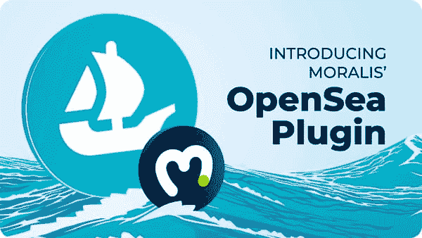
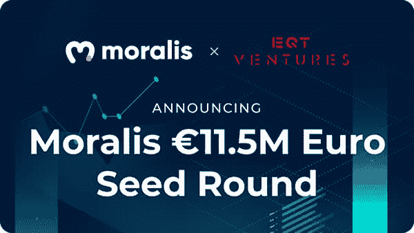

# Moralis 杂志# 12–大规模 NFT 部署

> 原文：<https://moralis.io/moralis-magazine-12-mass-nft-deployment/>

再次感谢你本周加入我们。我们(Moralis 道)一起支持和使用最健壮和最强大的 Web3 框架。

**Moralis 是一个强大的 Web3 框架**，但是作为 Moralis DAO，我们不仅仅是这样。我们希望通过为您提供快速构建应用程序所需的工具和组件来帮助您提升开发水平。

你们每个人都是非凡事物的一部分，这本杂志就是要让 Moralis 的力量为你所用！

**我们都是 Moralis 家**，在这里互相支持。如果你不是已经活跃在[Moralis 说教不和谐](https://discord.com/invite/P9N9HF97hH)的话，今天就是为你引荐的日子。

在 Moralis 道的冲突中，你会发现一堆 Moralis 专家和法师同伴。发布您的项目并从社区获得反馈，参与编码挑战，并了解最新的 Moralis 特性和更新。

你如何利用所提供的工具和专业知识取决于你自己，我们希望这本杂志能激发一些想法。

你在用 Moralis 建造什么？你卡住了吗？向我们提出问题和意见。谁知道呢，我们甚至可能会在未来的杂志上直接回复你！

[**发送您的问题给我们**](https://ivanontech.typeform.com/to/R9K5lnGe)

## 在 Moralis 学院成为一名专业的 Moralis 法师！

对于我们的开发者学院来说，这是激动人心的一周，现在更名为:[Moralis 学院](https://academy.moralis.io/)！

如果你对加密货币或区块链技术完全陌生，Moralis 学院是最好的起点。在 Moralis 学院，我们从零开始教学——不需要以前的经验！没有编程背景？没问题，我们会从头到尾指导你。告诉你的朋友和家人；现在是我们都成为 Moralis 法师的时候了！

已经熟悉 JavaScript 了？别担心，下一次更新是特别为你准备的。

本季度，我们将发布第一个官方 Moralis 课程。本课程的目的是把你从一个 Moralis 用户变成一个 Moralis 专家。只有最精通 Moralis 的法师才会获得“专家”的称号。

很快我们可能会召唤你成为下一个 Moralis 家法师。

## OpenSea 插件现已推出

Moralis 开发的最新令人兴奋的领域是插件。插件使 Moralis 开发人员能够轻松快速地将他们的 dApps 连接到支持的第三方工具。可用插件的官方列表可以在[Moralis 插件](https://moralis.io/plugins/)标签中找到。

此外，新的 Moralis [OpenSea 插件](https://moralis.io/plugins/opensea/)还包括[批量 NFT 铸造](https://moralis.io/how-to-bulk-mint-nfts-batch-minting-guide/)工具。现在，我们正在庆祝 OpenSea 最新插件的发布。使用该插件，您可以获得订单信息，购买和销售 NFTs 今天就来看看吧！使用 Moralis 的 premier [NFT API](https://moralis.io/ultimate-nft-api-exploring-moralis-nft-api/) 创建 NFT 市场也比以往任何时候都容易。

### Moralis，为未来投资

上周，Moralis Web3 在由 EQT Ventures 牵头的创始轮融资中筹集了超过 1100 万美元。查看博客文章了解更多详情:[https://moralis . io/moralis-closes-e11-500 万-seed-round-to-super charge-dapp-development/](https://moralis.io/moralis-closes-e11-5-million-seed-round-to-supercharge-dapp-development/)。

### 手机 Moralis

对于所有移动开发者和 Moralis 法师，我们很自豪地宣布 Moralis 现在提供对 React Native 的全面支持[！寻找谁将构建本周获胜的 dApp(必须使用 React Native 构建的 dApp)。这里有一段视频可以让你入门:【https://www.youtube.com/watch?v=FRilwynjW1c】](https://moralis.io/moralis-introduces-react-native-support/)
。

获胜者将获得独家 NFTs，仅通过代码证明提供(也称为每周挑战获胜者)。请务必查看我们的 React 原生模板，以创建[移动以太坊 dApps](https://moralis.io/create-mobile-ethereum-dapp-with-react-native-template/) ！

* * *

如果您想晚一点加入我们，请务必观看上周关于 Moralis 变种人的视频:

https://www.youtube.com/watch?v=KBV4FrCv4ps

**莫利斯变种人继续说道:让我们部署** 

如果您来晚了，请务必查看:

[**>上周关于 Moralis 家变种人**](https://www.youtube.com/watch?v=KBV4FrCv4ps&utm_source=customerio&utm_medium=email&utm_campaign=moralis-magazine12) **的视频。**

如果你正在寻找更多相关的深入信息，看看由我们无畏的 Moralis 网 3 领导者开发的两个教程:

https://www.youtube.com/watch?v=FFFFeV-2LTEhttps://www.youtube.com/watch?v=tBMk1iZa85Y

* * *

感谢阅读！我们希望本周的 Moralis 杂志对你有用。

继续建造！

下次见💚

Moralis 研究小组