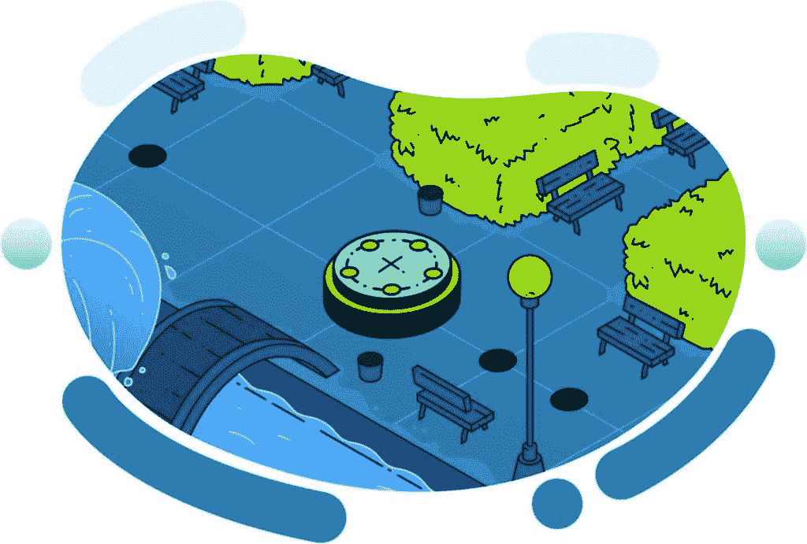
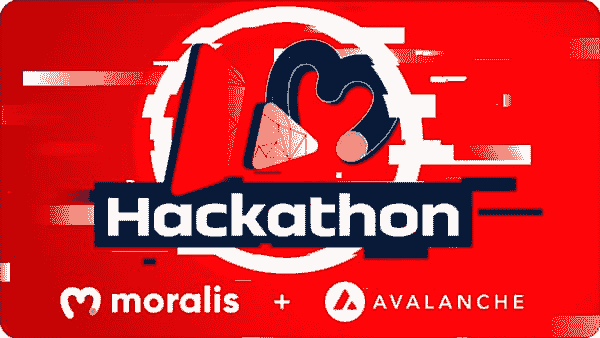
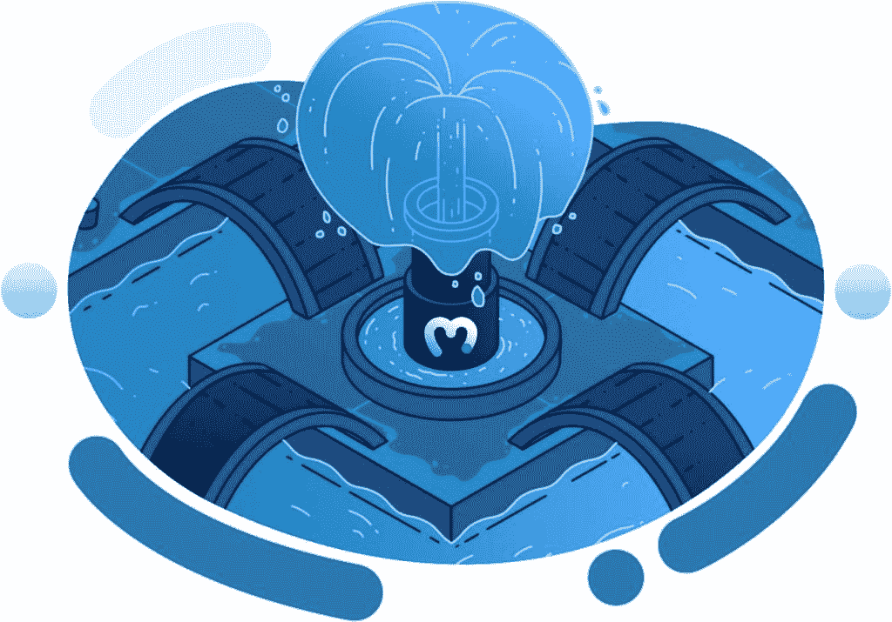

# Moralis 杂志# 14–以太坊样板 101

> 原文：<https://moralis.io/moralis-magazine-14-ethereum-boilerplate-101/>

在 [Moralis 博客](https://moralis.io/?s=magazine&asp_active=1&p_asid=1&p_asp_data=1&current_page_id=3594&qtranslate_lang=0&filters_changed=0&filters_initial=1&asp_gen%5B%5D=title&asp_gen%5B%5D=content&asp_gen%5B%5D=excerpt&customset%5B%5D=post)上可以找到我们过去杂志的完整收藏。

再次感谢你本周加入我们。我们一起(Moralis 道)支持和使用最健壮和最强大的 Web3 框架。

**Moralis 是一个强大的 Web3 框架**，但是作为 Moralis DAO，我们不仅仅是这样。我们希望通过为您提供快速构建应用程序所需的工具和组件来帮助您提升开发水平。

你们每个人都是非凡事物的一部分，这本杂志就是要让 Moralis 的力量为你所用！

**我们都是 Moralis 家**，在这里互相支持。如果你不是已经活跃在[Moralis 说教不和谐](https://discord.com/invite/P9N9HF97hH)的话，今天就是为你引荐的日子。

在 Moralis 道的冲突中，你会发现一堆 Moralis 专家和法师同伴。发布您的项目并从社区获得反馈，参与编码挑战，并了解最新的 Moralis 特性和更新。

你如何利用所提供的工具和专业知识取决于你自己，我们希望这本杂志能激发一些想法。

你在用 Moralis 建造什么？你卡住了吗？向我们提出问题和意见。谁知道呢，我们甚至可能会在未来的杂志上直接回复你！

[**发送您的问题给我们**](https://ivanontech.typeform.com/to/R9K5lnGe)

# Fantom 支持即将推出

Moralis 服务器用户们，你们注意到了吗？Fantom 现在被列在受支持的 Moralis 服务器选项中。

我们正在努力构建剩余的特性，建议生产环境等到正式发布(预计很快会发布)。

雄心勃勃的构建者和测试者们，你们今天就可以创建一个 Fantom 服务器，并开始将 Fantom 支持集成到你们的 Moralis 驱动的 dApps 中。

注意: *这是一个早期的“alpha”版本，功能可能不完整。更多详情请见《Moralis 道不和谐》。*

## 雪崩黑客马拉松正在快速接近

雪崩黑客马拉松就在眼前。今天就报名参加:[https://moralis.io/avax-hackathon/](https://moralis.io/avax-hackathon/)。

奖金池为 85，000 美元，并且还在增加。与 Moralis 网 3 一起建设，成为雪崩未来的一部分。你够“法师”吗？

### 雪崩 dApps 基金

雪崩开发者的好消息！一个 2 亿美元的 dApp 基金已经确定，可以提供给那些在 Avalanche 上建设的人。

https://twitter.com/IvanOnTech/status/1455960803727773710

查看我们自己的教程，立即开始构建 Avalanche！

https://www.youtube.com/watch?v=4zElz9ddHZ4

## 下周挑战:克隆 Zapperfi 或 Zerion 最佳解决方案胜出！

获胜者将于明天在 [Moralis 的 YouTube 频道](https://www.youtube.com/c/MoralisWeb3)上直播。

直播是由我们自己的 Ivan on Tech 每周举办的 Moralis 开发者派对！每周的活动以问答环节结束(有时甚至会有特别的赠品)。

查看官方 Moralis YouTube 频道了解更多详情。你不会想错过这个机会的！

* * *

到目前为止，您可能已经听说过 Moralis 的以太坊样板——这是一个样板代码，旨在帮助您比以往更快更好地构建。

加入我们，Ash 将带领我们深入了解这项技术…

## **以太坊样板 101**

样板文件只是一个起点；你从这里开始建立什么取决于你自己。因此，请充分利用这种开箱即用的全功能 Web3 体验。

Moralis 法师，使用本指南快速施放你的 dApps。有了以太坊样板，你就成功了；新的地平线在等待！

https://www.youtube.com/watch?v=gc0kEjjWobc

从这里开始使用以太坊样板:[https://ethereumboilerplate.com/](https://ethereumboilerplate.com/)。

* * *

## **Q&A——快攻**

接下来，我们将回答上周 Moralis 杂志读者提出的几个问题。

* * *

#### 如果我不懂编程语言，如何开始用 Moralis 构建？

最好的起点是[Moralis 学院](https://academy.moralis.io)。

##### 通过参加 [**JavaScript 编程 101**](https://academy.moralis.io/courses/javascript-programming-for-blockchain-developers) **课程，你将在不知不觉中一头扎进代码并开发出自己的 dApp。**

在 Moralis 学院，我们从头开始教你 JavaScript。我们的理念是，如果你想快速看到结果，JavaScript 是最好的语言之一！

* * *

## 我能用 Moralis 建造什么？

**Moralis 帮助开发者快速将区块链和加密货币连接到他们的网站，但远不止于此。通过使用 Moralis 服务器，您可以从一个全功能的后端中受益，它可以完整地托管您的项目。****简单网站、密码交流等。一旦你知道如何利用 Moralis 网 3 的力量，这些都是可能的(也是容易的)发展。**

**为了帮助你开始学习，请查看上周杂志/博客上的“学习轨迹”链接**

* * *

感谢阅读！我们希望本周的 Moralis 杂志对你有用。

继续建造！

下次见💚

Moralis 研究小组