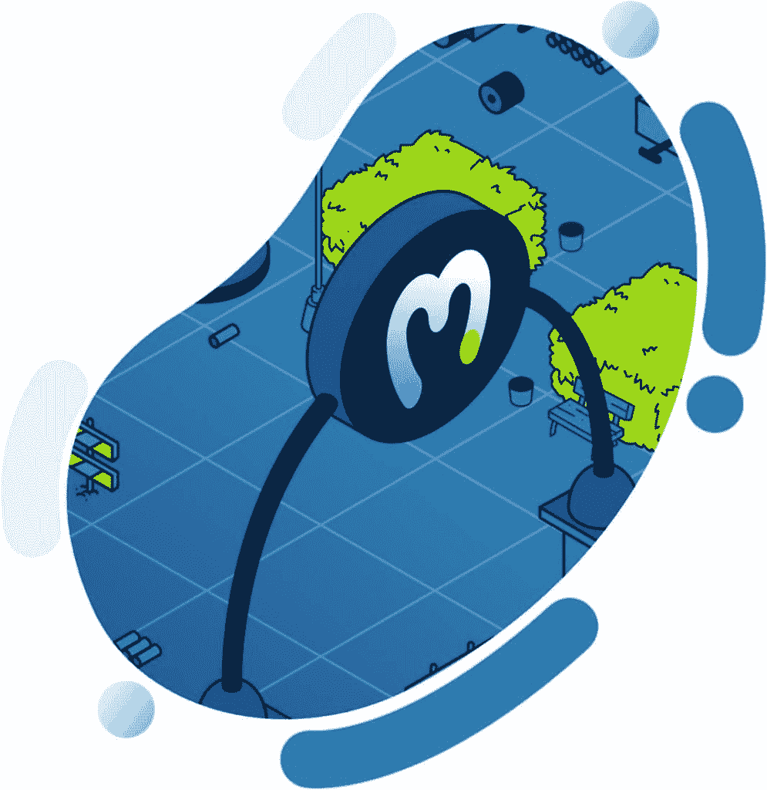
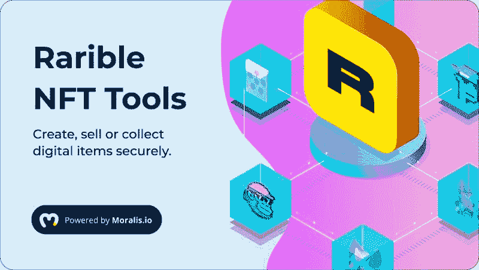
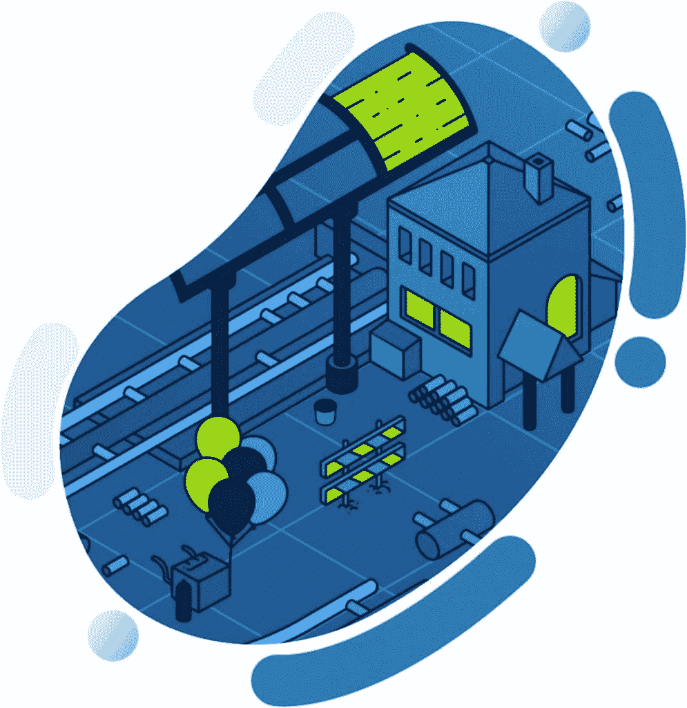

# Moralis 杂志第 15 期——建立社交媒体网站

> 原文：<https://moralis.io/moralis-magazine-15-building-a-social-media-website/>

再次感谢你本周加入我们。我们一起(Moralis 道)支持和使用最健壮和最强大的 Web3 框架。

**Moralis 是一个强大的 Web3 框架**，但是作为 Moralis DAO，我们不仅仅是这样。我们希望通过为您提供快速构建应用程序所需的工具和组件来帮助您提升开发水平。

你们每个人都是非凡事物的一部分，这本杂志就是要让 Moralis 的力量为你所用！

**我们都是 Moralis 家**，在这里互相支持。如果你不是已经活跃在[Moralis 说教不和谐](https://discord.com/invite/P9N9HF97hH)的话，今天就是为你引荐的日子。

在 Moralis 道的冲突中，你会发现一堆 Moralis 专家和法师同伴。发布您的项目并从社区获得反馈，参与编码挑战，并了解最新的 Moralis 特性和更新。

你如何利用所提供的工具和专业知识取决于你自己，我们希望这本杂志能激发一些想法。

你在用 Moralis 建造什么？你卡住了吗？向我们提出问题和意见。谁知道呢，我们甚至可能会在未来的杂志上直接回复你！

[**发送您的问题给我们**](https://ivanontech.typeform.com/to/R9K5lnGe)

**突发新闻！**

## 用 Moralis 更快、更好、更便宜地建造

对于 Moralis 的核心发展来说，这是令人兴奋的一周。

随着我们的团队努力扩展我们不断增长的生产基础设施，统计数据出来了！

Moralis 用户平均节省开发时间 87%！

总的来说，这相当于使用 Moralis 构建时节省了 8000 多万美元的开发成本！

在 Moralis 主页上查看这些数据和更多信息:[https://moralis.io/](https://moralis.io/)。

稀有插件现已推出

Moralis 插件是将现有 API 集成到 Moralis 驱动的 dApps 中最热门、最快的方式。例如，1inch 插件为向 Web3 dApps 添加交换功能提供了一种快速简单的方法。

最近，我们增加了一个稀有插件。这个插件允许构建者执行(否则)复杂的区块链函数，如延迟铸造、创建销售订单和修改支付(ERC-20 代替 ETH)。

你可以通过下面的链接查看这个新插件:[https://moralis.io/plugins/rarible-nft-tools/](https://moralis.io/plugins/rarible-nft-tools/)。

立即升级您的 NFT Web3 dApp，通过 Moralis 的 Rarible 插件提供定制功能！

## 帮助我们建立 Moralis——立即提交拉动请求

Moralis 是一个社区运动，我们每个人都是其中的一部分。当然，这是真的，当你使用 Moralis 的 Web3 框架来构建你自己的 dApp 时。然而，这并不是成为 Moralis 建设的一部分的唯一途径。

*有野心的构建者可以直接通过 GitHub 向我们以太坊样板提交改进请求:*[*https://GitHub . com/以太坊-样板/以太坊-样板*](https://github.com/ethereum-boilerplate/ethereum-boilerplate) *。*

如果您还不熟悉以太坊样板文件，请查看上周的帮助入门文章:[https://moralis . io/moralis-magazine-14-以太坊-样板文件-101/](https://moralis.io/moralis-magazine-14-ethereum-boilerplate-101/)

比赛在本周举行，因为最佳(被批准的)拉请求将成为本周无聊的 Moralis 家法师 NFT 竞赛的获胜者:[https://opensea.io/collection/boredmoralismages](https://opensea.io/collection/boredmoralismages)。

* * *

**女士们先生们——重头戏！让我们准备建造吧！！！**

今天，我们使用 Moralis 的 Web3 框架从头开始克隆 Reddit！

这不是演习；通过使用 Moralis，你可以建立自己的社交网络，我们自己的 Moralis 专家丹尼尔将在这里指导我们，因为我们…

## **与 Moralis 家建立社交网络**

https://www.youtube.com/watch?v=52BvLrj-KrE

在社交网络教程中，我们使用 Web3 登录，每个帐户都通过用户的加密货币钱包进行身份验证。这种类型的登录和帐户验证也可以独立应用。

接下来加入我们，获取 Ash 的独家杂志教程:

https://youtu.be/vxo2m7a6vxY

* * *

**Q&A——快攻**

接下来，我们将回答上周从《Moralis》杂志读者那里收到的一个问题。

* * *

### 我如何开始？

要真正“坚持到底”使用加密货币，你需要对区块链的工作原理有一个深入的了解(至少是这样)。**在 Moralis Academy，我们首先教授 JavaScript，然后扩展到其他编程语言，然后扩展到 Solidity 编程(一种用于 EVM 智能合约编程的基于 JavaScript 的语言)。**

**如果你想先了解一下 ERC-20 的部署情况，可以从 Moralis 的文档中查阅以下指南:**[**https://docs . Moralis . io/guides/deploy-and-track-ERC 20-events**](https://docs.moralis.io/guides/deploy-and-track-erc20-events)**。**

如果你很难跟上上面提到的向导，不要担心。有了 Moralis 学院，你可以从零开始-不需要任何先验知识！

你还在等什么？今天报名:****。****

* * *

 **感谢阅读！我们希望本周的 Moralis 杂志对你有用。**

**继续建造！**

**下次见💚**

**Moralis 研究小组**