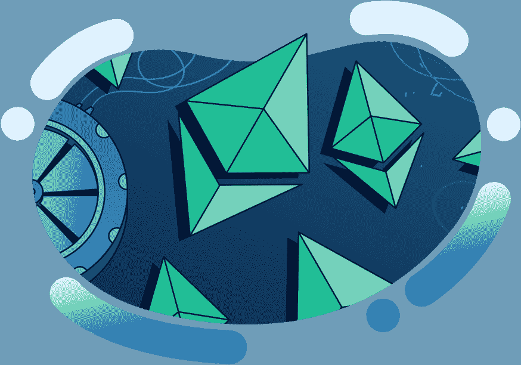
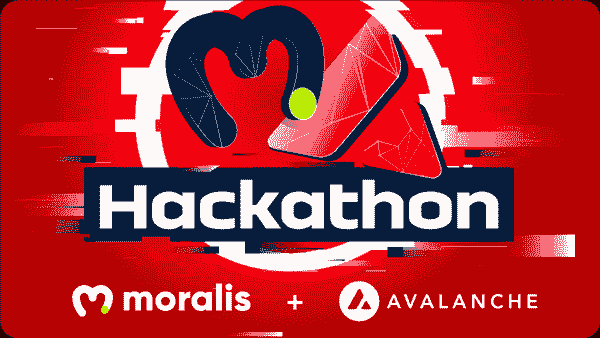

# Moralis 杂志第 16 期——Moralis 手机信使

> 原文：<https://moralis.io/moralis-magazine-16-moralis-powered-mobile-messenger/>

# 什么是 Moralis？

我们(Moralis DAO)支持并使用现有的最健壮和最强大的 Web3 框架。

**Moralis 是一个强大的 Web3 框架**，但是作为 Moralis DAO，我们不仅仅是这样。我们希望通过为您提供快速构建应用程序所需的工具和组件来帮助您提升开发水平。

Moralis 杂志假期系列下周开始！

你不会想错过未来几周的《Moralis》杂志，因为我们为所有的 Moralis 法师准备了大量的宝藏！因此，在这个假期加入我们，享受 dApp 建筑冒险的舒适小屋。

你在用 Moralis 建造什么？你卡住了吗？向我们提出问题和意见。谁知道呢，我们甚至可能会在未来的杂志上直接回复你！

[**发送您的问题给我们**](https://ivanontech.typeform.com/to/R9K5lnGe)

## 全球韦伯——由 Moralis 建造

这些天，“元宇宙”似乎在每个人的脑海中，大量的数字世界正在发展，每个人都承诺他们自己的虚拟世界的愿景，以进行互动。

项目“[全球韦伯](https://twitter.com/Worldwide_WEB3)”最近出现在现场。这是一个可操作的 2D 世界，由世界领先的 Web3 框架 Moralis 提供后端支持。

然而，不要相信我们的话，自己去看看吧！只需要一个 Web3 钱包(比如 MetaMask)就可以开始了。

#### 游戏开发者的 Moralis 观

全球韦伯只是众多不同的区块链游戏中的一个例子，这些游戏可以在后台使用 Moralis。

为了增加开发者的可访问性，正如上周宣布的，Moralis/Unity SDK 正在开发中。这将允许将 Web3 功能快速集成到基于 Unity 的游戏中。

### 迫不及待——现在就想开发一款基于 Moralis 的多人游戏吗？

我们有工具来帮助您！查看这些教学视频，了解详细信息和技巧，由独一无二的 Ivan on Tech 制作:

https://www.youtube.com/watch?v=QoBHweBw2Gshttps://www.youtube.com/watch?v=FIutG9R38ko

本周的挑战是构建一个多人游戏:[https://github.com/ethereum-boilerplate/multiplayer-poc](https://github.com/ethereum-boilerplate/multiplayer-poc)。当你的游戏准备好了，一定要让我们看看你做了什么！获胜的参与者将从我们的稀有收藏品中获得一个独家无聊的 Moralis 法师 NFT。

## 雪崩黑客马拉松来了！

已经承诺成为一个大事件，你不想错过[Moralis 雪崩黑客马拉松](https://moralis.io/avalanche-hackathon/)。随着超过 350，000 美元奖金的争夺，我们正在寻找，领域，并资助雪崩发展的未来；并确保你拥有获得成功的最佳工具:Moralis 网 3。

更多详情见官方公告:[https://moralis . io/presenting-the-moralis-avalanche-hackathon/？UTM _ source = Twitter&UTM _ medium = socials&UTM _ campaign = AVAX-HACK-PR](https://moralis.io/presenting-the-moralis-avalanche-hackathon/?utm_source=Twitter&utm_medium=socials&utm_campaign=AVAX-HACK-PR)。

## 我们都是 Moralis 家

你们每个人都是非凡事物的一部分，这本杂志就是要让 Moralis 的力量为你所用！

我们都是 Moralis 家，在这里互相支持。如果你不是已经活跃在[道貌岸然道不和](https://discord.com/invite/P9N9HF97hH)的话，今天就是让你登场的日子。

在 Moralis 道的冲突中，你会发现一堆 Moralis 专家和法师同伴。发布您的项目并从社区获得反馈，参与编码挑战，并了解最新的 Moralis 特性和更新。

### 加入多链怪物/Moralis 学院赠品

Moralis 和多链怪物正在赠送 PMON 代币和免费 Moralis 学院访问！这是一个双赢的局面，你所要做的就是发推文和标签来获得资格:[https://Twitter . com/MoralisAcademy/status/1465321295462207494](https://twitter.com/MoralisAcademy/status/1465321295462207494)。

赠品不会持续太久；今天一定要进！

* * *

如果你和我们一起建设，你已经建立了一个 Moralis 网络钱包，做了一些地址跟踪，创建了一些提醒，甚至可能开始了你自己的 DEX 或 Web3 社交网络项目。如果你错过了这些教程，请在 Moralis 博客上查看我们过去的杂志。

接下来，我们将进入移动开发，以充分利用 Moralis 的 React 本机支持，因为我们一起建立了一个…

### **基于 Moralis 的消息应用**

https://www.youtube.com/watch?v=5HIsa26LnYY&t=731s

如果你需要一本关于使用 Moralis 开发移动应用的入门书，请查看我们的以太坊移动样板和[概述](https://www.youtube.com/watch?v=jGUY5Hq8tFo)。

你如何利用所提供的工具和专业知识取决于你自己，我们希望这本杂志能激发一些想法。

* * *

感谢阅读！我们希望本周的 Moralis 杂志对你有用。

继续建造！

下次见💚

Moralis 研究小组