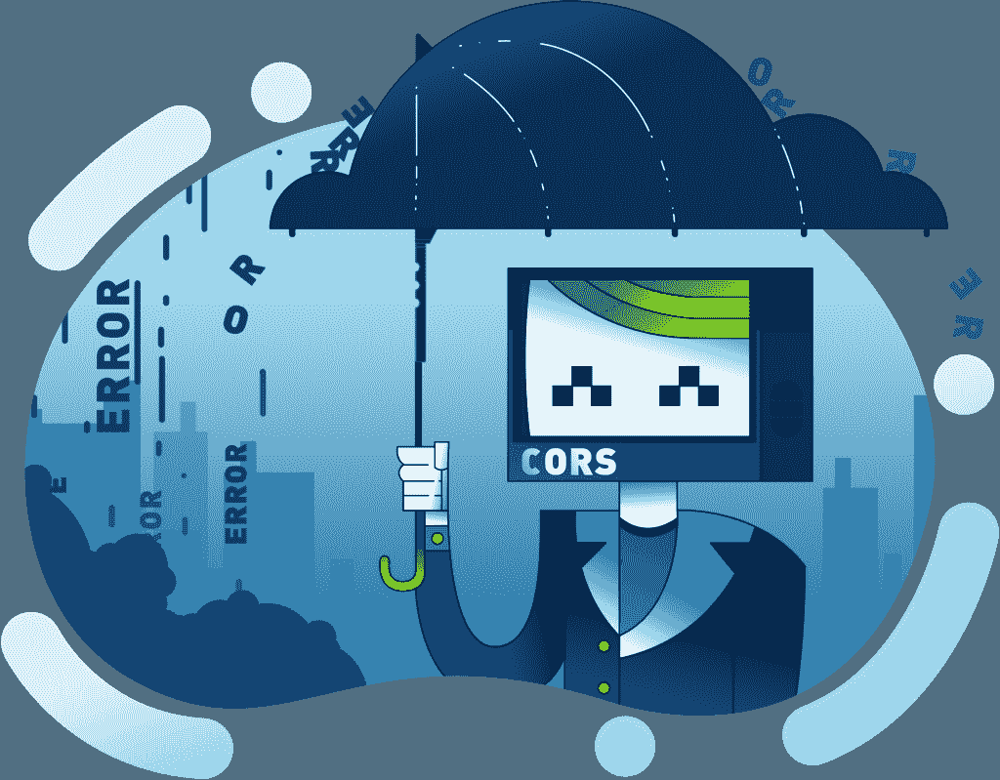

# Moralis 杂志# 2–克服 CORS 错误

> 原文：<https://moralis.io/moralis-magazine-2-overcome-cors-errors/>

每周我们都会深入探讨紧迫的区块链编程问题，并向您展示 Moralis 如何让解决这些问题变得简单。

Moralis 家在此为您提供支持，并渴望成为您的“僚机”，与我们一起打造金融的未来。

如果你错过了我们关于 IPFS 的第一期，你可以在这里看《Moralis》杂志的第一版。

**看哪** :Moralis 斯法师回来了！在这里阅读史诗 [Moralis 家法师的故事](https://moralis.io/return-of-the-moralis-mage/) ！

本周起: SOP 和 和

本周我们来看看 SOP 和 CORS 错误，以及如何修复它们。

# 什么是“同源政策”？

同源策略(SOP)是指标准 web-app 安全模型的一部分，它确保网页之间的交互(以及提供和生成的数据)只能发生在共享相同“源”(或数据引用方法)的页面之间。

更改数据访问位置，如端口、主机名和其他变量，将导致 SOP 检查失败。如果失败，在页面之间传递数据的尝试将会停止。

# 什么是 CORS 错误？

当用户试图在违反 SOP 的站点之间传递数据时，将会产生错误。当遇到这种类型的错误时，就会出现问题，因为这两个页面之间的数据交换是有意的。

T2】

# 如何解决 CORS 错误？

当你运行一个本地主机服务器来测试一个应用程序并试图访问数据时，它是跨源的

在测试中，可以通过关闭浏览器中的 CORS 来避免 CORS 错误。但是，这种变通方法不足以解决生产中的错误。

CORS 只是网络浏览器从一个站点调用另一个站点的一种安全措施。用户不能更改 CORS 设置，因为 CORS 设置是由发出请求的网站提供的。

对第三方资源的请求不应由浏览器处理，而应由后端(Moralis 云功能)处理，只有在信息准备好并提供给网站后，才能提供给用户。

在 mozilla 社区资源中可以找到关于 CORS 的更多细节(一般来说，与 web3 没有直接关系):[【https://developer.mozilla.org/en-US/docs/Web/HTTP/CORS】](https://developer.mozilla.org/en-US/docs/Web/HTTP/CORS)

对于 CORS 来说，唯一合适的解决方案是将处理转移到后端，而不是从浏览器进行请求处理。

忽略这一经验法则是不安全的，如果不加以纠正，可能会导致以后的漏洞利用。例如:如果在您的网站代码中使用 fetch 请求，用于访问 NFT 元数据(基于提供的地址)，可能第二天(在利用漏洞之后)反而开始将私有数据发送到改变的位置。

看一段全新的教学视频，学习如何克服 CORS 错误:

[https://www.youtube.com/embed/2nF76NMQ9JA?feature=oembed](https://www.youtube.com/embed/2nF76NMQ9JA?feature=oembed)

或者，构建者可以选择使用新的 Moralis Web3API，该 API 可用于获取 NFT 元数据(以及其他内容),并可有效避免本期杂志中出现的许多问题:

[https://www.youtube.com/embed/lX9A6yQXZ_8?feature=oembed](https://www.youtube.com/embed/lX9A6yQXZ_8?feature=oembed)

感谢阅读！我们希望本周的 Moralis 杂志对你有用。

继续建造！

下次见💚

Moralis 研究小组