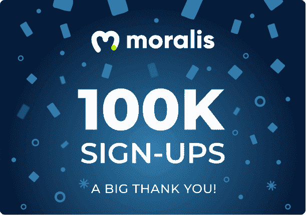

# Moralis 杂志# 20–新年快乐！

> 原文：<https://moralis.io/moralis-magazine-20-happy-new-year/>

在 [Moralis 博客](https://moralis.io/?s=magazine&asp_active=1&p_asid=1&p_asp_data=1&current_page_id=3594&qtranslate_lang=0&filters_changed=0&filters_initial=1&asp_gen%5B%5D=title&asp_gen%5B%5D=content&asp_gen%5B%5D=excerpt&customset%5B%5D=post)上可以找到我们过去杂志的完整收藏。

### 什么是 Moralis？

我们(Moralis DAO)支持并使用现有的最健壮和最强大的 Web3 框架。

**Moralis 是一个强大的 Web3 框架**，但是作为 Moralis DAO，我们不仅仅是这样。我们希望通过为您提供快速构建应用程序所需的工具和组件来帮助您提升开发水平。

新年快乐

哇！已经 2021 年底了！在过去的一年里，我们都见证了迄今为止最重要的 Web3 进步的诞生:Moralis。如果你使用 Moralis 来构建你自己的 dapps，你已经知道它拥有的力量。无论是资深程序员，还是刚刚入门，这本杂志都是为了装备所有的开发人员(无论水平如何)。

准备好，2022 年可能是你成为下一个 Moralis 专家的一年！

你在用 Moralis 建造什么？你卡住了吗？向我们提出问题和意见。谁知道呢，我们甚至可能会在未来的杂志上直接回复你！

[**发送您的问题给我们**](https://ivanontech.typeform.com/to/R9K5lnGe)

## **Moralis 正在成长，现在+100K 用户强大！**

https://twitter.com/MoralisWeb3/status/1475406129974988801

Moralis 的用户群正在增长，现在已经超过了五位数！随着过多的改进已经在管道中，Moralis 准备好了轰轰烈烈地开始 2022 年。如果你想成为不可思议的 Web3 运动的一部分，不是作为旁观者，而是作为建设者；那你需要 Moralis！

为了庆祝我们在 2021 年的诞生和成长，我们将租借一位非常特别的 Moralis 利斯法师 NFT，Moralis 利斯的女族长！这款新的 NFT 是为了纪念我们今年成为核心 Web3 产品，以及我们的[持续增长](https://moralis.io/sustainability)到 2022 年。

我们是来做 Web3 框架的，数字表明你是来加入我们的！

2022 年是时候震撼地球了。你能打电话吗？

### 我应该建立什么？

Ivan on Tech 分享他的创业想法！需要一些帮助吗？我们有一些想法来激发智力。现在就加入我们吧，独一无二的 Ivan on Tech 分享了他自己的一些创业想法和概念。

https://www.youtube.com/watch?v=NuV13bh2PMo&t=1828s

请关注 Moralis 网 3 Youtube 频道，了解未来的炉边谈话，包括与 Ivan 在技术上的现场问答！

### 自定义域支持即将推出！

最早在一月份，Moralis 将发布自定义域支持。这个新的更新将允许开发者在引用 Moralis 函数时使用他们自己的域。改善开发和用户体验。

这项功能加入了预计在 2022 年第一季度为 Moralis 推出的其他改进的简短列表。另一个包含的特性是无限扩展，在上周的杂志中提到过。

你们每个人都是非凡事物的一部分，这本杂志就是要让 Moralis 的力量为你所用！

我们都是 Moralis 家，在这里互相支持。如果你不是已经活跃在[道貌岸然道不和](https://discord.com/invite/P9N9HF97hH)的话，今天就是让你登场的日子。

在 Moralis 道的冲突中，你会发现一堆 Moralis 专家和法师同伴。发布您的项目并从社区获得反馈，参与编码挑战，并了解最新的 Moralis 特性和更新。

* * *

## **正在进行的黑客马拉松**

黑客马拉松正在如火如荼地进行。如果您落后了，并且希望赶上社区研讨会活动，我们会为您提供帮助。以下研讨会由我们的团队成员和 Moralis x Avalanche 黑客马拉松的支持者主持:

https://www.youtube.com/watch?v=is1NAVVqWYshttps://www.youtube.com/watch?v=APHFgE_HwLAhttps://www.youtube.com/watch?v=ieV146r8FL0https://www.youtube.com/watch?v=Oxb4u3FkkTkhttps://www.youtube.com/watch?v=wMgO9E4SEY4

## **即将推出**

你如何利用所提供的工具和专业知识取决于你自己，我们希望这本杂志能激发一些想法。

* * *

感谢阅读！我们希望本周的 Moralis 杂志对你有用。

继续建造！

下次见💚

Moralis 研究小组