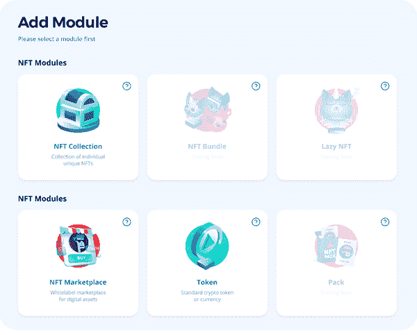

# Moralis 杂志第 22 期——游戏开发商法典

> 原文：<https://moralis.io/moralis-magazine-22-game-developer-codex/>

我们过去杂志的完整收藏可以在 [Moralis 博客](https://moralis.io/?s=magazine&asp_active=1&p_asid=1&p_asp_data=1&current_page_id=3594&qtranslate_lang=0&filters_changed=0&filters_initial=1&asp_gen%5B%5D=title&asp_gen%5B%5D=content&asp_gen%5B%5D=excerpt&customset%5B%5D=post)上找到。

### 什么是 Moralis？

我们(Moralis DAO)支持并使用现有的最健壮和最强大的 Web3 框架。

**Moralis 是一个强大的 Web3 框架**，但是作为 Moralis DAO，我们不仅仅是这样。我们希望通过为您提供快速构建应用程序所需的工具和组件来帮助您提升开发水平。

## 轰轰烈烈地开始新的一年！

欢迎 Web3 开发者和 Moralis 法师！我们很高兴您能再次加入我们本周的 Moralis 杂志！随着 2022 年的全面展开，Moralis 核心开发团队正在加大油门！准备好；随着这么多令人兴奋的升级和进步的管道，Moralis 是准备好了吹你的头发回来！

你在用 Moralis 建造什么？你卡住了吗？向我们提出问题和意见。谁知道呢，我们甚至可能会在未来的杂志上直接回复你！

[**发送您的问题给我们**](https://ivanontech.typeform.com/to/R9K5lnGe)

## **对 Moralis / Unity3D 的 WebGL 支持已上线**

在上周的直播中宣布，Moralis 现在支持 web GL([https://github . com/ether eum-boilerplate/ether eum-unity-boilerplate/releases/tag/v 1 . 0 . 2](https://github.com/ethereum-boilerplate/ethereum-unity-boilerplate/releases/tag/v1.0.2))。通过使用 Moralis 和 Unity3D 的力量，开发人员现在可以开始创建我们从未见过的 3D 元宇宙体验！

如果 WebGL 对你来说完全是“希腊式”的，看看这个视频，只需 100 秒就能上手:[https://youtu.be/f-9LEoYYvE4](https://youtu.be/f-9LEoYYvE4)。

## **今天测试 Moralis 硝基**

Moralis 硝基是活的，现在在测试中。以全新的后端技术和进步为动力，Moralis Nitro 是专为减少同步时间和提高整体性能而开发的。[点击](https://forum.moralis.io/t/moralis-nitro-beta-testing/7489)查看 Moralis Nitro beta 测试。

如果你想帮助测试这个令人兴奋的新升级，请加入 Moralis DAO Discord 的@beta-access 频道了解更多详情:[https://discord.gg/chKUXZ9Q](https://discord.gg/chKUXZ9Q)。

### 即将到来的 Moralis 进步

但是等等，还有更多…

WebGL 支持和 Moralis Nitro 并不是唯一的升级产品；很快，我们将为 Moralis Web3 框架套件推出其他合适的组件。查看下面的预览列表:

1.  **服务器定制**–您是否需要连接到 dApp 的每个地址的特定数据集？也许您想排除与您无关的旧数据，以减少处理时间。这种类型的定制和更多将很快可用。
2.  **天平和 NFTs 数据库**–尽管仍在开发中，新的 NFT 数据库将把 NFT 管理和跟踪提升到一个新的水平。准备好；Moralis 无与伦比的 NFT 工具箱即将变得更好！
3.  **Moralis 模板**–即将推出的模板承诺为各种常见的 dApps 带来一键部署选项。你准备好一键启动一个完整的市场了吗？！

## Moralis 来赞助 NFTHack 黑客马拉松！

Moralis 总是参加开发者聚会，并且永远不会忘记带来一些东西来分享。我们现在只进行了一半的 Moralis x Avalanche 黑客马拉松(详情请见此处)，同时我们也在 NFT hack:[https://nft.ethglobal.co/](https://nft.ethglobal.co/)铺开红地毯。我们鼓励申请者尽快联系我们；该活动定于 1 月 14 日至 16 日举行。

随着这么多事情的发生，Moralis 在这里帮助建筑商发光发亮！

你们每个人都是非凡事物的一部分，这本杂志就是要让 Moralis 的力量为你所用！

我们都是 Moralis 家，在这里互相支持。如果你不是已经活跃在[道貌岸然道不和](https://discord.com/invite/P9N9HF97hH)的话，今天就是让你登场的日子。

在 Moralis 道的冲突中，你会发现一堆 Moralis 专家和法师同伴。发布您的项目并从社区获得反馈，参与编码挑战，并了解最新的 Moralis 特性和更新。

* * *

…现在是 Moralis 法师，主要活动…

### **Moralis NFT 游戏开发重新定位！**

假设您浏览了我们早期的一个关于 Moralis 游戏开发的教程(由 Moralis 开发主管 Filip 提供),但是最近开始使用以太坊样板。在这种情况下，你可能想知道，“我如何调和这两者？”。

如果这是你的困惑，不要再看了，因为我们自己的 Moralis 家专家 Ash 再次带我们进入另一个 Moralis 家法师建造冒险的兔子洞！

链接此处

你如何利用所提供的工具和专业知识取决于你自己，我们希望这本杂志能激发一些想法。

* * *

感谢阅读！我们希望本周的 Moralis 杂志对你有用。

继续建造！

下次见💚

Moralis 研究小组