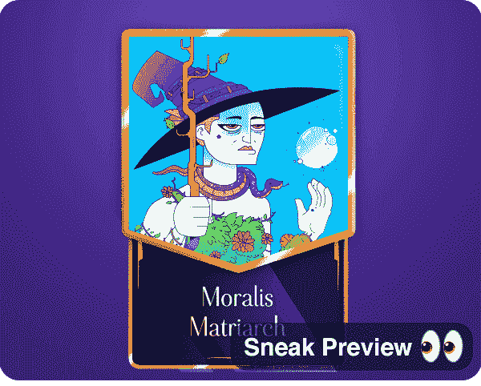

# Moralis 杂志# 23–网络 3 游戏起源

> 原文：<https://moralis.io/moralis-magazine-23-web3-gaming-genesis/>

在 [Moralis 博客](https://moralis.io/?s=magazine&asp_active=1&p_asid=1&p_asp_data=1&current_page_id=3594&qtranslate_lang=0&filters_changed=0&filters_initial=1&asp_gen%5B%5D=title&asp_gen%5B%5D=content&asp_gen%5B%5D=excerpt&customset%5B%5D=post)上可以找到我们过去杂志的完整收藏。

### 什么是 Moralis？

我们(Moralis DAO)支持并使用现有的最健壮和最强大的 Web3 框架。

**Moralis 是一个强大的 Web3 框架**，但是作为 Moralis DAO，我们不仅仅是这样。我们希望通过为您提供快速构建应用程序所需的工具和组件来帮助您提升开发水平。

## 做好准备 Web3 之战开始了！

欢迎 Web3 开发者和 Moralis 法师们来到本周的 Moralis 杂志！无论你是在建立一个黑客马拉松提交，你自己的副业项目，还是刚刚开始 dApp 开发，Moralis 的核心团队都在这里帮助你！我们迫不及待地想看看你今年将会构建什么，我们会回来给你带来更多的精英 Web3 工具和技巧。

你在用 Moralis 建造什么？你卡住了吗？向我们提出问题和意见。谁知道呢，我们甚至可能会在未来的杂志上直接回复你！

[**发送您的问题给我们**](https://ivanontech.typeform.com/to/R9K5lnGe)

## **10 万用户——下一站:100 万**

正如上周在 Ivan on Tech 的“QnA 和心连心”直播中宣布的那样，Moralis 现在拥有多达 100，000 名用户，并且增长没有放缓的迹象！今年，我们再次将目标定得很高，到年底将满足于不低于 1，000，000 名用户！

https://www.youtube.com/watch?v=vj59t_uRsCg

我们很高兴你在这里，现在是时候告诉大家:

“加入我们，成为 Web3 革命的一部分，否则就有被抛在后面的风险。Moralis 是 web 开发的未来——一个不缺少成功的未来！”

## **无聊的 Moralis 家法师升级**

无聊的 Moralis 家法师 NFT 套装升级了！所有新制作的 NFT 都将使用我们新的定制 3D 卡增强和动画制作。

无聊的 Moralis 法师不能从我们这里购买；相反，它们只能通过代码证明来获得。查看 Moralis 家的官方不和频道，了解本周比赛的详情。

感兴趣的人可以在 OpenSea 上查看对布景的改进。

未分发的 NFTs(带学徒卡预告):https://open sea . io/0x fad 8 C4 D1 b 26 f 280 ca 7 a3 F3 f 05 e 0 FBA 1954 e 69 c 93

[全收藏](https://opensea.io/collection/boredmoralismages)

## **新的 JavaScript SDK**

新的 JavaScript SDK 已经发布，可供公众使用，目前处于测试阶段。不过别信我们的话，你自己看看:[https://forum . moralis . io/t/moralis-js-SDK-v1-0-0-beta-ethers-js-support/7182](https://forum.moralis.io/t/moralis-js-sdk-v1-0-0-beta-ethers-js-support/7182)。

新的 SDK 支持 Ethers.js 而不是 Web3.js，是一次突破性的升级。早期采用者可以从今天开始升级版本中受益！

### **由你的异能组合而成**

本周无聊的 Moralis 家法师 NFT 大赛正在如火如荼地进行着。我们将从成功整合新的 JavaScript SDK 和 Moralis Nitro(两者都是新的 Moralis 升级)的参与者中选出一名获胜者。

查看 Moralis 论坛，了解 Moralis Nitro 入门的更多细节:[https://forum.moralis.io/t/moralis-nitro-beta-testing/7489](https://forum.moralis.io/t/moralis-nitro-beta-testing/7489)。

你们每个人都是非凡事物的一部分，这本杂志就是要让 Moralis 的力量为你所用！

我们都是 Moralis 家，在这里互相支持。如果你不是已经活跃在[道貌岸然道不和](https://discord.com/invite/P9N9HF97hH)的话，今天就是让你登场的日子。

在 Moralis 道的冲突中，你会发现一堆 Moralis 专家和法师同伴。发布您的项目并从社区获得反馈，参与编码挑战，并了解最新的 Moralis 特性和更新。

* * *

…现在是 Moralis 法师，主要活动…

### **用 Moralis 部署游戏内资产**

我们的 Moralis 专家 Ash 又来了，为 Web3 游戏开发者提供了更多的工具！这个视频是 Ash 的游戏开发系列的下一步，在这里我们学习如何增强我们现有的 dApps，同时将以太坊样板带到下一个级别。本周，我们将为游戏中的 NFT 物品创建一个拖放 UI。看看这个:

https://www.youtube.com/watch?v=a3zIFrJl7UU

本周教程的元素建立在上周的步骤之上。如果您加入我们的时间较晚，此链接将帮助您跟上进度:

https://www.youtube.com/watch?v=2nM1dTm2zww

你如何利用所提供的工具和专业知识取决于你自己，我们希望这本杂志能激发一些想法。

* * *

感谢阅读！我们希望本周的 Moralis 杂志对你有用。

继续建造！

下次见💚

Moralis 研究小组