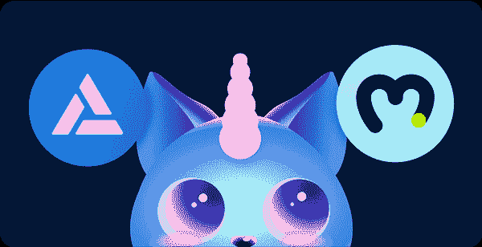
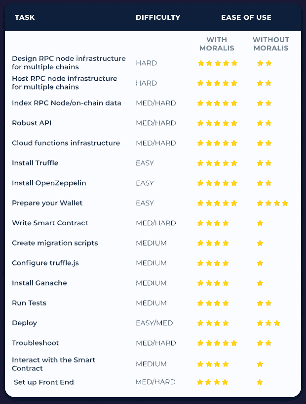
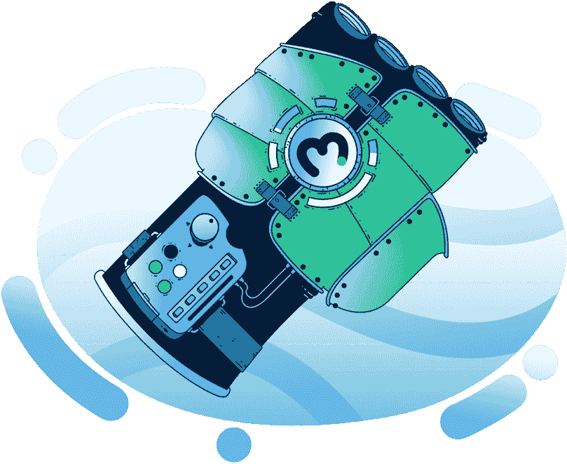

# Moralis 杂志# 24–把握你的网络 3 命运

> 原文：<https://moralis.io/moralis-magazine-24-seize-your-web3-destiny/>

在 [Moralis 博客](https://moralis.io/?s=magazine&asp_active=1&p_asid=1&p_asp_data=1&current_page_id=3594&qtranslate_lang=0&filters_changed=0&filters_initial=1&asp_gen%5B%5D=title&asp_gen%5B%5D=content&asp_gen%5B%5D=excerpt&customset%5B%5D=post)上可以找到我们过去杂志的完整收藏。

## 什么是 Moralis？

我们(Moralis DAO)支持并使用现有的最健壮和最强大的 Web3 框架。

**Moralis 是一个强大的 Web3 框架**，但是作为 Moralis DAO，我们不仅仅是这样。我们希望通过为您提供快速构建应用程序所需的工具和组件来帮助您提升开发水平。

## **Moralis 游戏是炒作！**

欢迎回来，Moralis 法师们，来到又一个拥挤的 Moralis 建筑周。如果你来这里是为了 Ash 的 Moralis 游戏开发系列的下一个版本，滚动到最后一个全新的独家教程。

铸造 NFTs 变老了，快！我们将向您展示如何通过下一个大事件:NFT 游戏来更多地参与 NFTs！借助 NFTs + Moralis 的强大功能，从构建您自己的 NFT 游戏到将游戏内资产转移到不同的游戏，我们将帮助您完成这一切，比以往任何时候都更容易。继续阅读，看看我们在做什么！

你在用 Moralis 建造什么？你卡住了吗？向我们提出问题和意见。谁知道呢，我们甚至可能会在未来的杂志上直接回复你！

[**发送您的问题给我们**](https://ivanontech.typeform.com/to/R9K5lnGe)

## **Solana API 现已发布(Moralis 模板即将发布…** )

Moralis Solana API 的第一个版本现在已经发布，准备供 Moralis 开发人员使用！Solana 拥有一个蓬勃发展的新 DeFi 生态系统，具有独特的优势和属性，使其成为开发者和用户的理想选择。

虽然一些开发人员更喜欢以太坊 mainnet 的强大安全保证和熟悉度，但新的 Solana API 是专门为 Moralis 开发人员设计的，他们希望构建一个最先进的网络。

详情请点击此处链接，今天就开始:[https://admin.moralis.io/solanaApi](https://admin.moralis.io/solanaApi)。

此外，您是否希望启动一个新的 dApp 或 Web3 项目？保持警惕；新的 Moralis“一键式”模板即将发布。

### **Moralis API vs 炼金术 API**

那么，Moralis API 如何支持其他(类似的)解决方案呢？虽然我们不认为其他 API 解决方案本身是竞争对手，但为正确的工作选择正确的工具是很重要的。

加入我们，Moralis 专家 Chris 在最新发布的 API 交叉比较中一步一步地指导我们。您将了解到 Moralis API 非常强大，并且有很好的文档记录，允许您毫不费力地为您的应用程序检索大量与区块链相关的数据。Chris 随后展示了 Moralis 不仅仅是一个 API 提供商，而且它作为领先的 [Web3 开发平台](https://moralis.io/)更上一层楼。

https://www.youtube.com/watch?v=MS6yeEVL1XQ

**想法💭倒数第二👾opensea(打开)💸**

您知道吗，将您自己的 NFT 部署到 OpenSea 只需不到 50 行代码就可以实现。😲

**有或没有**以前的区块链开发经验-我们的脚本让它变得如此简单，任何人都可以做到这一点！

成为一名 NFT 贵族，与 Moralis 家轻松相处💚

使用 Moralis，只需点击几下鼠标，使用不到 50 行代码就可以部署您的 NFT。

或者，你也可以不做，最终得到一个类似这样的待办事项列表👇🏼

当 1-2-3 这么简单的时候，你为什么要让自己变得更难呢？

你们每个人都是非凡事物的一部分，这本杂志就是要让 Moralis 的力量为你所用！

我们都是 Moralis 家，在这里互相支持。如果你不是已经活跃在[道貌岸然道不和](https://discord.com/invite/P9N9HF97hH)的话，今天就是让你登场的日子。

在 Moralis 道的冲突中，你会发现一堆 Moralis 专家和法师同伴。发布您的项目并从社区获得反馈，参与编码挑战，并了解最新的 Moralis 特性和更新。

* * *

…现在是 Moralis 法师，主要活动…

## **打造趣味游戏**

Ash 带着一个关于如何让我们的游戏变得有趣的教程回来了！使用最新的技术和工具进行构建是令人兴奋的，而有了 Moralis，您将拥有业界领先的 Web3 集成工具。添加游戏中的 NFT 物品、玩家皮肤等等都是可能的。

当添加新的集成时，记住以对玩家有意义的方式构建它们是很重要的。签署交易的不必要的提示会降低游戏的乐趣，而一个恰当的提示实际上可能会使体验更加身临其境和令人满意。

准备好；Ash 不会演示和教我们如何在不影响游戏乐趣和可玩性的情况下增加区块链的价值

你如何利用所提供的工具和专业知识取决于你自己，我们希望这本杂志能激发一些想法。

* * *

感谢阅读！我们希望本周的 Moralis 杂志对你有用。

继续建造！

下次见💚

Moralis 研究小组