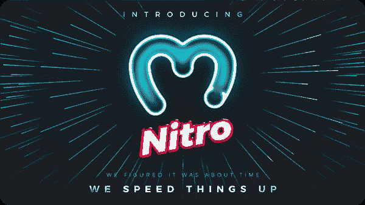

# Moralis 杂志第 25 期——现在每个人都行动起来！

> 原文：<https://moralis.io/moralis-magazine-25-everybody-dapp-now/>

在 [Moralis 博客](https://moralis.io/?s=magazine&asp_active=1&p_asid=1&p_asp_data=1&current_page_id=3594&qtranslate_lang=0&filters_changed=0&filters_initial=1&asp_gen%5B%5D=title&asp_gen%5B%5D=content&asp_gen%5B%5D=excerpt&customset%5B%5D=post)上可以找到我们过去杂志的完整收藏。

### 什么是 Moralis？

我们(Moralis DAO)支持并使用现有的最健壮和最强大的 Web3 框架。

**Moralis 是一个强大的 Web3 框架**，但是作为 Moralis DAO，我们不仅仅是这样。我们希望通过为您提供快速构建应用程序所需的工具和组件来帮助您提升开发水平。

## **Moralis 家法师们，欢迎回来！**

问候开发者和 Moralis 法师，之前就有人说过“时不我待”。

没有哪个行业比新兴技术更了解这一点；你，Moralis 家法师，是矛尖！没有比现在更好的时机了，我们带着另一本杂志回来了，旨在让你在 Web3 开发中保持成功。我们走吧！

你在用 Moralis 建造什么？你卡住了吗？向我们提出问题和意见。谁知道呢，我们甚至可能会在未来的杂志上直接回复你！

[**发送您的问题给我们**](https://ivanontech.typeform.com/to/R9K5lnGe)

### **Web3 技术栈**

如果你曾经是一名 IT 学生，那么你很可能接触过一个或多个技术栈。技术栈描述了构成信息系统的层次结构、协议和组件。你可能已经知道，Moralis 代表了最终的 Web3 技术堆栈。

这种思维方式在使用 Web3 时也很常见。想看看怎么样吗？加入我们，Moralis Web3 创始人 Ivan on Tech 一次一个组件地分解 Web3 技术堆栈:

https://www.youtube.com/watch?v=1i5wOpAg-lc

## 小心！Moralis 人来了

下一个在我们的独家无聊 Moralis 法师 NFTs 线来迈尔斯 Moralis！

一个有趣的模仿每个人最喜欢的老谋深算的网络吊索！

迈尔斯·Moralis 利斯不仅是最新的 not 他是最新挑战的一部分，Moralis 法师，就像你一样，正在竞争在不到一周的时间内建立一个全新的 Web3 游戏。提交的作品应该突出我们的支流泰坦(又名 Miles Moralis)将被考虑参加[本周的赠品](https://opensea.io/assets/matic/0x2953399124f0cbb46d2cbacd8a89cf0599974963/113461209507512867518933452141320285231135646094834536306130710971828649590785)。

### **NFT 同步教程(每周比赛)**

你已经是 Moralis NFT 的骄傲持有者了吗？如果是这样的话，现在可以将你的 NFT 同步到你的 Moralis 道不和谐账户了，这样你就可以自豪地在你的法师同伴中展示它了。

详情查看官方视频教程:

https://www.youtube.com/watch?v=JNZf3-mjWy8

## **早期 Moralis Nitro 用户将获得奖励！**

你是已经在使用 [Moralis Nitro](https://moralis.io/moralis-releases-moralis-nitro/) 的早期使用者吗？如果没有，你还在等什么？鼓励早期采用，穿越这些未知水域的人将获得奖励！请记住，在 Moralis 不和谐中总是可以得到帮助的。

点击链接立即开始使用 Moralis Nitro:[https://forum.moralis.io/t/moralis-nitro-beta-testing/7489](https://forum.moralis.io/t/moralis-nitro-beta-testing/7489)。

你们每个人都是非凡事物的一部分，这本杂志就是要让 Moralis 的力量为你所用！

我们都是 Moralis 家，在这里互相支持。如果你不是已经活跃在[道貌岸然道不和](https://discord.com/invite/P9N9HF97hH)的话，今天就是让你登场的日子。

在 Moralis 道的冲突中，你会发现一堆 Moralis 专家和法师同伴。发布您的项目并从社区获得反馈，参与编码挑战，并了解最新的 Moralis 特性和更新。

* * *

…现在是 Moralis 法师，主要活动…

### **更新 NFT 资产**

在我们的游戏中添加 Web3 工具时，比如 NFT 资产，让游戏中的动作直接影响这些玩家拥有的资产的属性是至关重要的。

本周再次加入我们，Moralis 专家阿什揭示了 NFT 游戏内部运作背后的秘密；向我们展示了如何使用 Moralis 和 Web3 更新游戏中 NFT 资产的元数据:

https://www.youtube.com/watch?v=NC7T1Li9wjE&utm_source=customerio&utm_medium=email&utm_campaign=magazine25

你如何利用所提供的工具和专业知识取决于你自己，我们希望这本杂志能激发一些想法。

* * *

感谢阅读！我们希望本周的 Moralis 杂志对你有用。

继续建造！

下次见💚

Moralis 研究小组