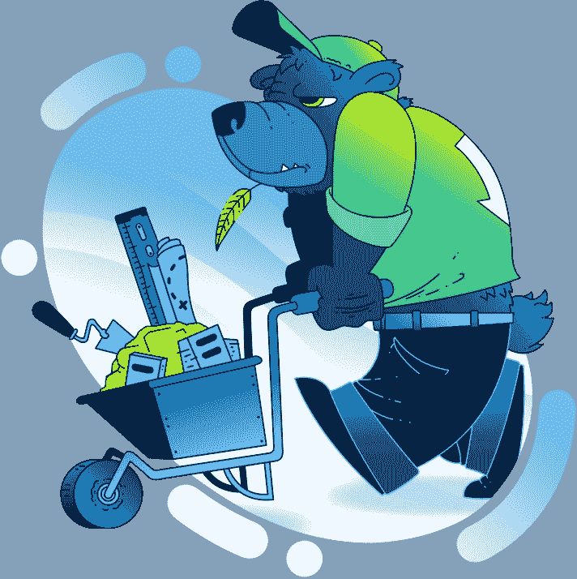
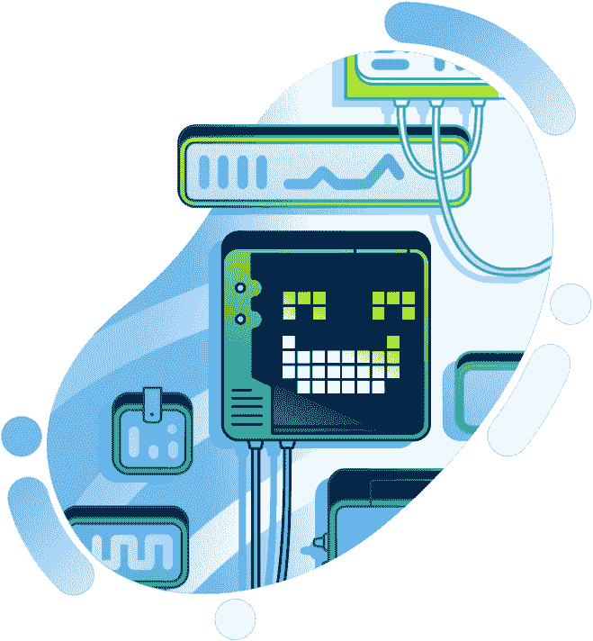

# Moralis 杂志第 26 期——在熊市中成长！

> 原文：<https://moralis.io/moralis-magazine-26-build-in-the-bear-market/>

## **熊市中的建筑**

我们以前说过，现在还要再说一遍:“熊市是为了建设。”无论你是对游戏、DeFi 还是 Web3 的任何领域感兴趣，Moralis 都提供了支持你的定制工具。与交易社区不同，建筑社区没有周期。我们一直都很热情。当熊市战胜牛市时，我们让熊市成为建设者，随着我们共同建设美好的未来，熊市变得越来越强大！

你在用 Moralis 建造什么？你卡住了吗？向我们提出问题和意见。谁知道呢，我们甚至可能会在未来的杂志上直接回复你！

[**发送您的问题给我们**](https://ivanontech.typeform.com/to/R9K5lnGe)

### **Ethers.js vs Web3.js**

今天在红色角落的是 Ethers.js，蓝色角落的是 Web3.js，这两个 JavaScript 库会如何叠加？加入我们，Moralis 专家 Chris 将带领我们深入 JS 图书馆实验室，提供两种解决方案的并排比较，以及何时最好使用其中一种:[https://www.youtube.com/watch?v=n1IXEp9q9AE](https://www.youtube.com/watch?v=n1IXEp9q9AE)。

## **Moralis 模板宝库**

您是否厌倦了每个开发项目都从零开始？

Moralis 有你一直在寻找的工具！查看我们不断增长的 Web3 开发模板集合；每一个都是定制的，可以让你的项目以闪电般的速度起步。使用 Moralis 模板时，您从一开始就为成功做好了准备！

React 模板:[https://github . com/ether eum-boilerplate/ether eum-boilerplate](https://github.com/ethereum-boilerplate/ethereum-boilerplate)

React 原生模板:[https://github . com/ether eum-boilerplate/ether eum-react-Native-boilerplate](https://github.com/ethereum-boilerplate/ethereum-react-native-boilerplate)

Unity 游戏引擎模板:[https://github . com/ether eum-boilerplate/ether eum-unity-boilerplate](https://github.com/ethereum-boilerplate/ethereum-unity-boilerplate)

NFT 市场模板:[https://github . com/ether eum-boilerplate/ether eum-NFT-market place-Template](https://github.com/ethereum-boilerplate/ethereum-nft-marketplace-template)

其他较小的 Moralis 标准模板:[https://github.com/ethereum-boilerplate](https://github.com/ethereum-boilerplate)

对我们的样板来说是全新的吗？看看这个视频指南:

https://www.youtube.com/watch?v=gc0kEjjWobc&t=1s

你们每个人都是非凡事物的一部分，这本杂志就是要让 Moralis 的力量为你所用！

我们都是 Moralis 家，在这里互相支持。如果你不是已经活跃在[道貌岸然道不和](https://discord.com/invite/P9N9HF97hH)的话，今天就是让你登场的日子。

在 Moralis 道的冲突中，你会发现一堆 Moralis 专家和法师同伴。发布您的项目并从社区获得反馈，参与编码挑战，并了解最新的 Moralis 特性和更新。

* * *

## **游戏构建者教程回顾**

2022 年已经是 Web3 游戏大量开发的一年。像 Worldwide Webb 等由 Moralis 驱动的项目继续吸引着新用户，而且热度正在上升！

如果你不想错过成为游戏开发未来一部分的机会，Moralis Web3 是你成功的门票。

如果您还没有，请查看我们关于 Web3 游戏开发的快速入门教程系列:

https://youtube.com/playlist?list=PLFPZ8ai7J-iSpYRMprJGQ0LhzBqncswro

此外，这里是我们的 Web3 游戏增强系列的回顾。每一个视频都包含了一些实用的技巧，你可以马上把它们加入到你的项目中。

**ERC 介绍-1155:**

https://youtu.be/2nM1dTm2zww

**创建 NFT 游戏资产:**

https://youtu.be/a3zIFrJl7UU

**更新 NFT 游戏资产简介:**

https://youtu.be/NC7T1Li9wjE

如果你渴望更多，不要害怕！Ash 和我们精英 Moralis 开发团队的其他成员正在努力工作，为您带来构建身临其境的 Web3 游戏的最新技术。这个特别的教程已经开发了一个多星期了，是你不想错过的！

你如何利用所提供的工具和专业知识取决于你自己，我们希望这本杂志能激发一些想法。

* * *

感谢阅读！我们希望本周的 Moralis 杂志对你有用。

继续建造！

下次见💚

Moralis 研究小组