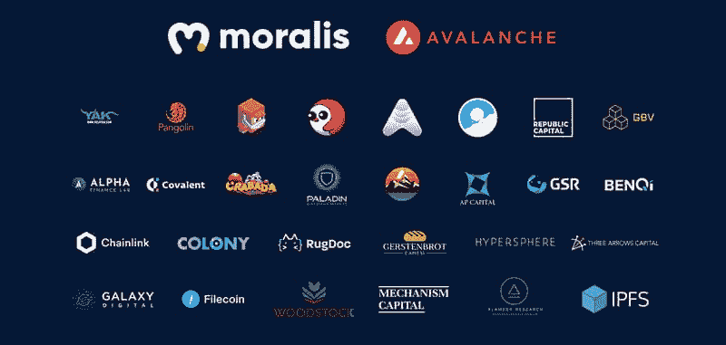
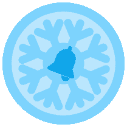

# Moralis 杂志# 28–Moralis 雪崩黑客马拉松结果

> 原文：<https://moralis.io/moralis-magazine-28-moralis-avalanche-hackathon-results/>

我们(Moralis DAO)支持并使用现有的最健壮和最强大的 Web3 框架。

**Moralis 是一个强大的 Web3 框架**，但是作为 Moralis DAO，我们不仅仅是这样。我们希望通过为您提供快速构建应用程序所需的工具和组件来帮助您提升开发水平。

### **和我们一起庆祝，为接下来的**做准备

Moralis 刚刚完成了迄今为止最大的活动。在 Avalanche 以及一长串合作伙伴和风险投资者(见下文)的帮助下，我们成功完成了 50 万美元的黑客马拉松！

虽然这样一个伟大的社区活动的结束是苦乐参半，但没有必要感到悲伤。Moralis 不会去任何地方，即使你在最近的活动中没有获奖，我们也在这里确保当你与 Moralis 一起建设时，你正在实现你的目标和梦想(因为那是真正的胜利)。

你在用 Moralis 建造什么？你卡住了吗？向我们提出问题和意见。谁知道呢，我们甚至可能会在未来的杂志上直接回复你！

[**发送您的问题给我们**](https://ivanontech.typeform.com/to/R9K5lnGe)

### **Moralis x 雪崩黑客马拉松颁奖典礼结果！**

昨天，我们很荣幸地为 Moralis x Avalanche 黑客马拉松举办了官方颁奖仪式。如果你错过了盛大的活动，我们鼓励你看看重播:

https://www.youtube.com/watch?v=8fnzkkj2eBw

活动进行了两个多小时，我们的评审小组不知疲倦地审查了十名决赛选手，每个人都巧妙地展示了他们的 dApps，一次一个。

以下每位获奖者都是顶级奖项的获得者，并将获得此处列出的奖项:[https://moralis.io/hackathon-prizes/](https://moralis.io/hackathon-prizes/)。

以下是最终结果:

**第三名:**洞穴学院【https://astrocave.vercel.app/ T2】

**第二名:**雪花网[https://sneagle . Network/](https://snowflakes.network/)

**第一名:**沉思[https://musing.io/](https://musing.io/)

黑客马拉松奖金的获奖者(由参与合作伙伴颁发)将于本周晚些时候公布。

### **本周挑战(延长)**

本周的 Moralis weekly challenge 以 Web3UI kit 为中心，这是一组精选的开源 Moralis 工具，可以帮助您以专业和视觉愉悦的方式完成 UI 体验。

[web 3ui 工具包类似于以太坊样板](https://github.com/ethereum-boilerplate/ethereum-boilerplate?utm_source=customerio&utm_medium=email&utm_campaign=moralis-magazine28)([https://github . com/以太坊-样板/以太坊-样板](https://github.com/ethereum-boilerplate/ethereum-boilerplate))。因此，它是为满足您的特定需求和愿望而定制的。这两个项目的代码都是开源的，鼓励外界对这两个项目做出贡献！

现在，为了赢得目前正在进行的挑战，参与者被要求尽可能多地使用 Web3UI 工具包。尝试利用您将找到的用户登录脚本和其他功能。除了整合工具包，你的创造力是关键！愿最好的 dApp 赢！

*获胜者将获得无聊的 Moralis 家法师合集的专属 NFT:***。**

*你们每个人都是非凡事物的一部分，这本杂志就是要让 Moralis 的力量为你所用！*

*我们都是 Moralis 家，在这里互相支持。如果你不是已经活跃在[道貌岸然道不和](https://discord.com/invite/P9N9HF97hH)的话，今天就是让你登场的日子。*

*在 Moralis 道的冲突中，你会发现一堆 Moralis 专家和法师同伴。发布您的项目并从社区获得反馈，参与编码挑战，并了解最新的 Moralis 特性和更新。*

* * *

## ***Moralis 游戏建设者:新内容！***

*如果你一直在关注我们的 Moralis 专家 Ash，那么你已经知道在 Moralis，我们为游戏开发者开发工具。每周，我们都在努力寻找将 Web3 工具集成到游戏中的最佳方式！*

*

那些与我们一起建设的人知道，元宇宙不是我们等待出现在我们面前的东西；这是我们正在积极建设的东西。

本周，Ash 向我们展示了如何构建、部署和测试 NFT 游戏智能合约。确保利用这些技巧，你可以在任何游戏引擎(Unity，Phaser 等)中使用它们。).布伊德勒，准备好你的机械键盘；是时候编码了！

https://www.youtube.com/watch?v=xcCMTb5jpKE

你如何利用所提供的工具和专业知识取决于你自己，我们希望这本杂志能激发一些想法。

* * *

感谢阅读！我们希望本周的 Moralis 杂志对你有用。

继续建造！

下次见💚

Moralis 研究小组*