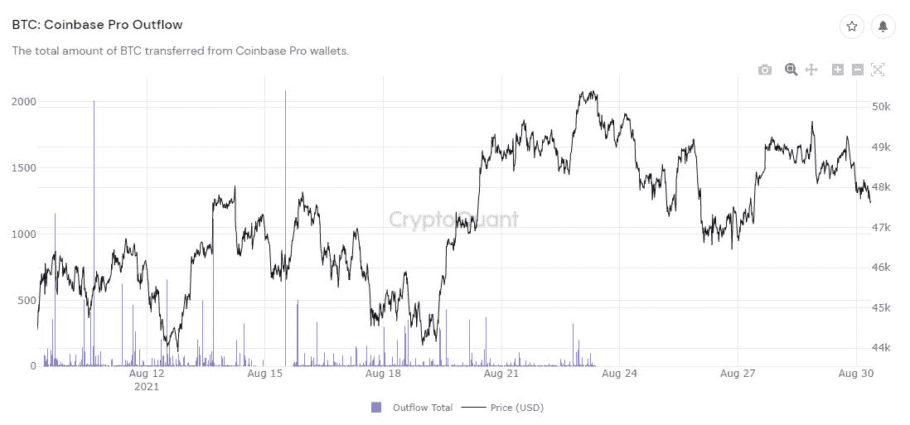
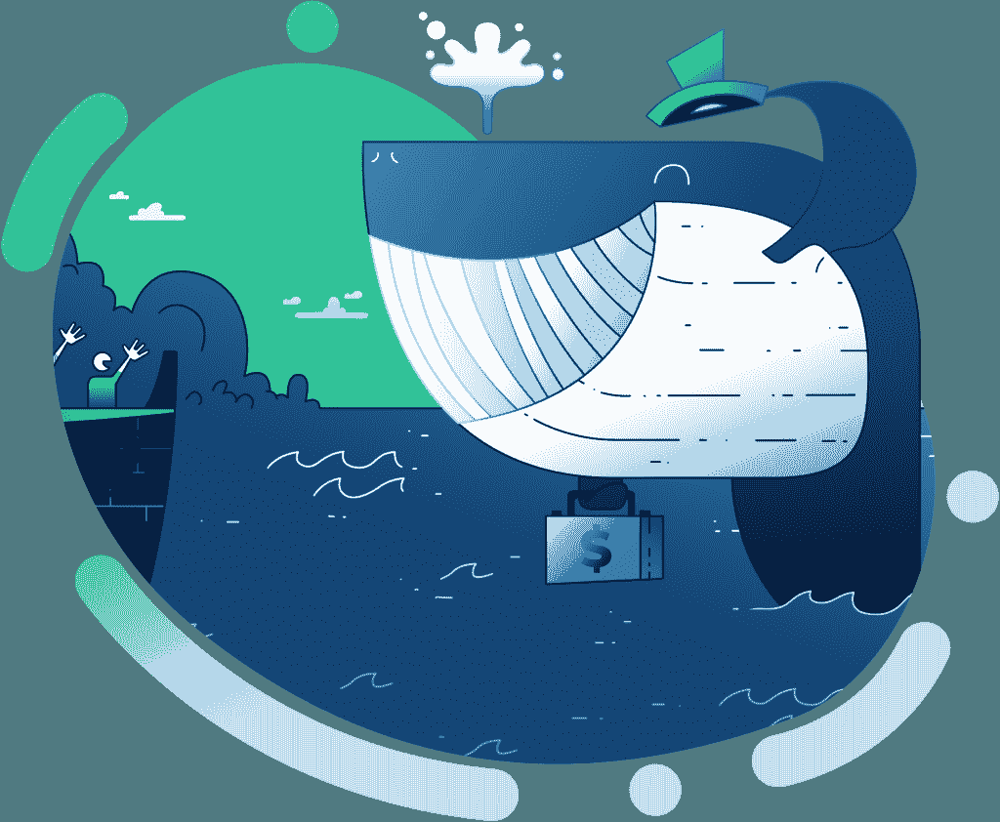

# Moralis 杂志# 3——自动观鲸

> 原文：<https://moralis.io/moralis-magazine-3-automated-whale-watching/>

每周，我们都喜欢深入区块链编程。从执行实验，到修复区块链数据访问问题(以及这之间的一切)——我们将向您展示 Moralis 如何使解决这些问题变得简单。本周，我们将深入研究自动赏鲸。

Moralis 在此为您提供支持，并渴望成为您的“僚机”,与您一起打造金融的未来。

如果你错过了我们的前两期，现在去看看还为时不晚！

第一期:IPFS；[问题 2: CORS 错误](https://moralis.io/moralis-magazine-2-overcome-cors-errors/)。

# 本周最新消息:自动观鲸

众所周知，加密巨鲸(拥有数百万美元加密资产的人)能够在开仓和平仓时移动并直接影响市场。

通过观察这些大玩家的行动，有可能做出明智的市场决策。这些决定可以成为盈利交易策略的基础。

## 如何观鲸…

从最基本的形式来看，加密赏鲸可能就像监视一个拥有大量资产的地址一样简单。这种方法的问题是，用户如何知道他们正在观看的特定鲸鱼实际上是否是市场运动的良好指标？

为了简化鲸鱼选择和监控过程，许多用户选择监控一个公开的加密鲸鱼运动信息来源。例子包括:Twitter 上的鲸鱼警报，或 Telegram 上的加密量子警报。

https://twitter.com/whale_alert(推特)

https://t.me/s/cryptoquant_alert(电报)

像这样的鲸鱼警报提供者的优势是，发布的信息通常是经过充分研究和可靠的。

然而，由于每个人都在同一时间接收信息，对信号“先发制人”的能力被严重削弱，而且往往是不可能的。正因如此，专家用户搜索更专属的提醒频道。

我们可以将这些警报作为更深入研究的基础，以提取更多可操作的信息，而不是只看表面价值。

CryptoQuant 的扩展资源(基于层级并需要付费)提供了一种隔离算法。提供的指标可用于预测市场变动，例如“比特币基地专业外流”在最近的时间段(从 8 月 27 日开始)有一个大的峰值:

另一种常见的做法是使用警报的时间戳作为手动搜索区块链的基础。这种方式的搜索往往需要与多个区块探索者交互，包括:[https://blockchair.com](https://blockchair.com/)(用于时间过滤)；https://bitinfocharts.com/和 https://oxt.me/(它们的标签数据可与其他国家进行比较)。

一旦确定了地址，下一步就是尝试确定地址的类型；通过研究该地址的交易，我们可以知道它是用于长期保存资产(可能是冷存储)还是短期保存资产(热钱包)。

最后，有了这些前提知识，我们可以围绕地址构建自己的警报，甚至可以在特定类型的地址接收或发送资金时建立触发器。

自动化这一过程是一项艰巨的任务。谢天谢地，Moralis 是完美的一揽子解决方案。

Moralis 提供建立您自己的警报的能力，同时避免虚荣/错误的标签。这使得 Moralis 用户能够更好地坚持区块链的核心原则:不要相信，要核实。

现在就加入我们，探索如何使用 Moralis 来建造一个观鲸发电站，以及我们如何在现有的基础上进行扩展。

因此，我们很自豪地介绍“Moralis 观鲸”的第一部分，这是一个多部分视频系列。

这个视频是定制钱包监控系统的第一步，在功能上优于上面提到的任何一个观鲸例子…