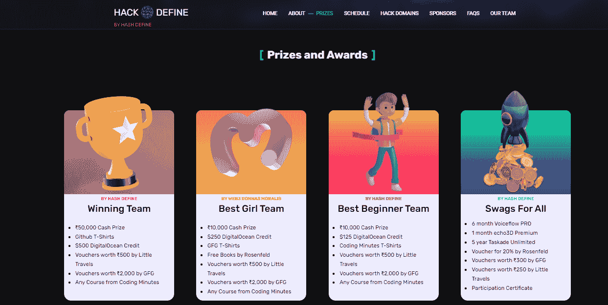

# Moralis 杂志第 38 期——Moralis 项目

> 原文：<https://moralis.io/moralis-magazine-38-moralis-powered-projects/>

Moralis 是为每个人准备的。事实上，每个程序员都可以利用 Moralis。这是什么意思？

就像 JavaScript(每个程序员都可以使用，能够完成无限量的计算任务)是世界范围内占主导地位的 Web2 编程语言一样，Moralis for Web3 也是如此。

JavaScript 的广泛采用带来了 Web2 中的动态浪潮，为网站上的最终用户打开了一个全新体验的世界。它支持动态内容并实时展示新内容，这是真正的突破。

Moralis 将为 Web3 做同样的事情，允许用户与他们自己的主权资产进行可视化交互，这些资产位于分散的区块链。此外，随着我们努力使 Moralis 越来越好，Moralis 工作流程中包含的强大工具每天都在改进。今天使用 Moralis，你正在驾驭一台名副其实的机甲，一台能够(并将)重新定义我们日常生活方式的机器。但不是靠它自己；我们需要你！

成为运动的一部分或者被运动改变；选择权在你。

你在用 Moralis 建造什么？你卡住了吗？向我们提出问题和意见。谁知道呢，我们甚至可能会在未来的杂志上直接回复你！

[**发送您的问题给我们**](https://ivanontech.typeform.com/to/R9K5lnGe)

### **Moralis 驱动的游戏制作——展示:战斗矮人**

今天令人兴奋的消息！我们从我们自己的 Moralis 家法师那里得到了独家新闻，他制作了一个由 Moralis 家魔法驱动的优秀游戏！

ElonsDev 开发了一款名为 Battle Derps 的奇妙游戏，上周在我们的每周例会上，Moralis 团队的所有人都有幸测试了这款游戏。我们玩得很开心，所以我们联系了 ElonsDev，看看他的建筑经验是怎么来的，Battle Derps 是怎么诞生的。

ElonsDev 在 2016 年左右第一次接触 crypto，从此就迷上了！去年 3 月，他加入了 Ivan on Tech，研究如何学习编写智能合同。在短短的时间内，他完成了所有的 Web3 和 dapp 课程。然后，他在币安智能连锁(现在的 BNB 连锁)上开发了一个令牌生成器应用程序。

他迷上了网络 3🤩

当 Moralis 主持 Aavegotchi game jam 的时候，他开始进入游戏开发领域——这也是创造战斗矮人的想法诞生的地方。

*"* *Moralis 是我能够在不学习全栈开发和数据库架构的情况下构建下一代应用和游戏的唯一方法，这些应用和游戏可以离线存储数据。它可能至少节省了 3-6 个月的开发/学习时间。*

*有一个非常令人兴奋的路线图为前方的战斗准备，我们迫不及待地想看到它成形！*

*最后，下面是 ElonsDev 关于用 Moralis 构建的观点:*

*“它现在是我技术堆栈的一部分，如果没有它，我很可能再也不会建造另一个项目了。Moralis 的一些优点是，它是免费的，还有令人惊叹的 Discord 社区开发人员和不断的视频，这些视频包含了可以扩展的项目想法，可以在该领域产生真正的创收产品。”*

*如果你想玩这个游戏或者为自己创造一个战斗精灵，去[battlederps.com](https://battlederps.com/)并在 Twitter 上关注 [@elonsdev](https://twitter.com/elonsdev?s=20&t=lP3jFnn2zDTH18zF132BCg) 了解更多信息！*

## ***Moralis 项目–Flash 更新***

*现在参与 Moralis 项目还为时不晚，参与者可以从“Moralis 名人堂”系列中获得独家 NFT:[https://opensea.io/collection/moralis-hall-of-fame](https://opensea.io/collection/moralis-hall-of-fame)。*

*刚刚开始？点击此处查看上周的 Moralis 项目(鼓励迟些参与，所有参与者都有 NFT 资格):*

*https://www.youtube.com/watch?v=YN8HAlM6YW0

想要更多吗？一个全新的项目将于本周末落下！

https://www.youtube.com/watch?v=HrlpTJD_CF0

### **即将发生的事件！**

就在 Hack For Inclusion (H4I)附近，我们正在举办知识丰富的研讨会，我们非常兴奋，因为我们将举办另一场由 Moralis 支持的名为“HackDefine”的精彩黑客马拉松——请查看[此处](https://www.hackdefine.com/)。

此外，如果你碰巧在 2022 年 10 月 5 日至 2022 年 11 月 5 日期间住在 Prayagraj，并想在 Web3 中找到我们内部的 Moralis Mage 寻求任何帮助，请在此发送 DM 给他[。](https://twitter.com/Shiv_24561)

我们也有一些来自我们网站的好消息。他们赞助了 HackDefine 的“最佳女团”大奖；查看下图！

我们这个月还有两个由 Moralis 的 Web3 Donnas 赞助的聚会，通过与女超人 DAO 合作来鼓励 Web3 中的女性，计划于 07/05/2022 在孟买举行。此外，计划于本月晚些时候在德里举行另一次会议。关注 Twitter 上的 Web3 Donnas，了解更多更新！

你们每个人都是非凡事物的一部分，这本杂志就是要让 Moralis 的力量为你所用！

我们都是 Moralis 家，在这里互相支持。如果你不是已经活跃在[道貌岸然道不和](https://discord.com/invite/P9N9HF97hH)的话，今天就是让你登场的日子。

在 Moralis 道的冲突中，你会发现一堆 Moralis 专家和法师同伴。发布您的项目并从社区获得反馈，参与编码挑战，并了解最新的 Moralis 特性和更新。

* * *

### **专业的 Web3 游戏开发先睹为快！**

在过去的一周里，Moralis 专家 Ash 一直在与一家游戏工作室密切合作，帮助他们通过 Moralis 在 Unity 游戏中利用 NFT 的力量。在他的合作过程中，工作室希望他们的可玩角色和可要求的土地被构造成 NFT，可以在游戏前端之外的市场上交易，如 OpenSea。

由于游戏还没有发布，目前还没有多少珍贵的细节。然而，今天，Ash 在这里向我们介绍这款新的 Moralis 游戏背后的智能合同——一份专门设计为可组合游戏资产工厂的合同。

发现如何铸造所有类型的游戏中的资产，包括半可替代的资产，如特定的武器-游戏可能需要多个。*