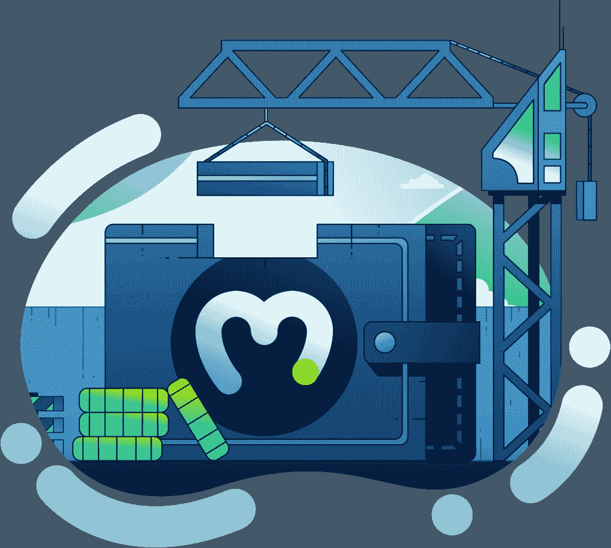

# Moralis 杂志# 4——用 Moralis 打造钱包

> 原文：<https://moralis.io/moralis-magazine-4-building-a-wallet-with-moralis/>

每周我们都会深入区块链编程，并向您展示 Moralis 如何让区块链开发变得轻而易举。从进行实验到解决区块链数据访问问题(以及这两者之间的所有事情)—[Moralis](https://moralis.io)会处理所有事情！本周，我们将专门来看看如何用 Moralis 来打造一个钱包！

Moralis 在此为您提供支持，并渴望成为您的“僚机”,与您一起打造金融的未来。

本周我们将回归基础。加入我们，探索密钥安全性和自定义钱包实用程序。

第一期:IPFS；[问题 2: CORS 错误](https://moralis.io/moralis-magazine-2-overcome-cors-errors/https://moralis.io/moralis-magazine-2-overcome-cors-errors/)；[第三期:自动化观鲸](https://moralis.io/moralis-magazine-3-automated-whale-watching/)

## 本周最新消息:Moralis 驱动的网络钱包

什么是加密钱包？

大多数人会说，“这是你的加密货币。”这是准确的，但不能说明全部情况。

作为区块链专家，我们知道硬币不是存放在钱包里，而是在区块链上。我们的钱包更像是钥匙链，可以打开我们位于区块链的私人保险箱。但是加密钱包自带的工具呢，比如发送和接收功能？

当然，只有“持有”资产的能力，钱包是不完整的，它还需要转移资产。这些功能通常可以通过浏览器扩展钱包直接获得。然而，对于更健壮的选项和更深入的配置，我们可以使用 Moralis。

有了 Moralis，我们不再局限于外部钱包平台。通过将我们的钥匙连接到由 Moralis 驱动的定制钱包，我们可以构建我们需要的功能，并以最适合我们的 [dApps](https://moralis.io/how-to-build-decentralized-apps-dapps-quickly-and-easily/) 的方式工作。

在我们深入细节之前，让我们回顾一下我们的种子密钥将在我们的 Moralis 钱包中扮演的角色。

### 了解钱包

加密货币钱包最基本的形式是一个种子短语。

种子短语是钱包创建中的最高原语。诸如密钥库、私钥和公共地址之类的东西都可以从种子短语中派生出来。

种子短语有 12 个和 24 个单词，这两种选择都被认为是安全的(也存在 12/24 模型的变体，其中可能包括一个额外的自定义单词)。

在本概述中，我们将回顾一个 12 字的关键短语。作为一个例子，这里我们有一个种子短语，为演示目的而生成(密钥不安全:不要使用):

**1。在**时

**2。增强**

**3。到达**

**4。库克**

**5。独木舟**

**6。选择**

**7。浪涌**

**8。电流**

**9。囚犯**

10。获胜者

**11。罐子**

**12。赚取**

使用这个种子短语(以及标准以太坊派生路径:M/44'60'/0'/0)，我们可以查看一个地址列表(从种子派生)。以下五个地址源自种子短语:

0x DCE 71 B2 b33d 787529175176029704 C6 BD 7457 c2e

0 XB 802 FD 2c 50 b 121 f5f 5270 e 5a 8 aa 10 F4 f 13 b 994 a 4

0xd 1490 da 3949 cc8e 97040 f 3259722 cbad F8 d3ef 30

0xb 064 e 34 cc 83 bbbdfb1e 36 f 936562 f 77 cc 82 a 6267

0x 458 b 77 a 0857781 ff1cb 4902 c 03 FEC 47 ff 7762240

看第一个地址(0x DCE 71 b 2 b 33d 787529175176029704 c 6 BD 7457 c 2 e)，结合我们的种子短语，我们知道:

公钥为:0x 0351 aee cef 73 aff 58 AEC 632 cf 5 e 15 fcf 744 df 9 edaa 60 B3 e 02 b 62487244 c 29 C1 BDA

私钥是:0x 08 EC 9d 8 a 4504d 0 b 0a 7013 e 24657 b 21065 c 7346 DD 34 db 27 c 6 cebdcca 6835 a f1 ef

(可以为每个地址确定相同的信息，所需要的只是种子短语。)

除了这五个地址之外，还可以从同一个种子短语中生成无限数量的附加地址。也可以确定用于解锁每个地址的私钥。种子短语提供了对这两者的直接和完全的访问。

## 创建钱包

一旦我们考虑了种子短语背后的意义，我们就必须考虑这个短语是如何产生的。基本上有三种用于生成种子短语的常用方法。

前两种是通过软件实现的。

浏览器扩展钱包，如[元掩码](https://moralis.io/metamask-explained-what-is-metamask/)，允许用户在首次启动钱包时创建新的种子短语。其他手机钱包也有类似的功能。

或者，一些网站提供通过浏览器或使用 web 工具(在线或本地)生成种子短语的选项。其中一个服务是 MyEtherWallet(用于生成我们的示例短语)。

对于这些选择，用户必须小心谨慎，以确保他们的工作站是安全的。如果第三方观察到种子短语的产生，他们不仅可以访问该种子生成的第一个地址，还可以访问每个后续地址。如果键盘记录器和其他恶意代码导致活动密钥数据泄漏，它们可能会产生灾难性的影响。

出于这个原因，许多用户选择第三种选择:一种能够离线生成种子密钥的设备，或“硬件钱包”。

硬件钱包寻求确保只有签名的交易被暴露给因特网，而私钥数据由硬件设备单独持有。各种不同的设计正在使用中，每一个都声称为此提供了最佳的解决方案。

用户必须深入了解自己的钱包硬件(如果使用的话)以及它如何存储密钥和发送交易，因为具体步骤和注意事项可能因设备而异。

澄清一点:离线种子生成被认为比在线种子生成更安全、风险更低。然而，确切的安全级别是基于用户的特定行为的。

### 用 Moralis 构建钱包界面

今天的应用程序是为“[以太坊初学者开发](https://moralis.io/ethereum-development-for-beginners/)系列”构建的应用程序的扩展。这是一个静态的 HTML/CSS/JS 网站，使用 bootstrap 模板和类，当然还有 Moralis。

此外，还有一个登录表单[通过元掩码](https://moralis.io/how-to-authenticate-with-metamask/)验证用户。用户通过身份验证后，它会将用户重定向到仪表板/钱包页面。从这里开始，左边有几个可用的功能来使用和交互。

在使用该应用程序之前，我们建议您遵循以下基本步骤:

*   下载源代码并使用 Visual Studio 代码和“Live Server”扩展运行它。
*   启动 Moralis 服务器，使用自己的“服务器 URL”和“应用程序 ID”。

另外，请注意，应用程序最初是为了与 Rinkeby Testnet 上的令牌进行交互而编写的，因为我在那里存储了令牌。但是，您可能更喜欢不同的链条。如果是这样，您需要将 chain 参数(在 JavaScript 函数中)更改为不同的链(例如 Ropsten、BSC、Polygon 或 ETH)。

这些函数的可用文档非常出色，您可以在此找到更多支持构建钱包和发送资产的文档:

[https://docs.moralis.io/moralis-server/sending-assets](https://docs.moralis.io/moralis-server/sending-assets)

https://www.youtube.com/watch?v=zd0pBsmJI8s

感谢阅读！我们希望本周的《Moralis》杂志和使用 Moralis 打造钱包的指导对你有所帮助。

继续建造！

下次见💚

Moralis 研究小组