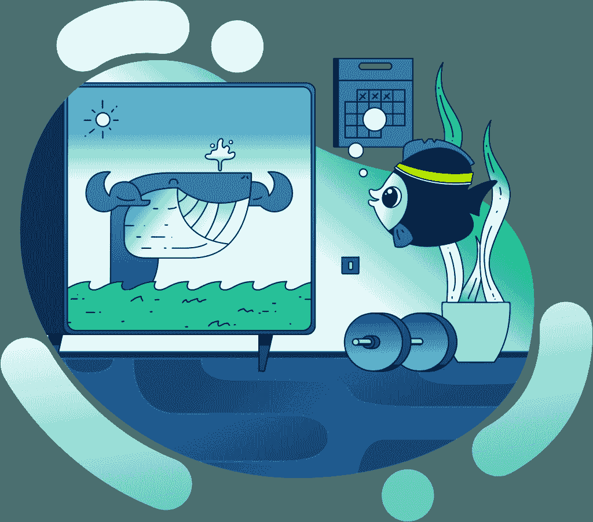

# Moralis 杂志# 5-读者反馈

> 原文：<https://moralis.io/moralis-magazine-5-reader-feedback/>

每周我们都会深入区块链编程，向您展示 Moralis 如何让区块链开发变得轻而易举。从执行实验到修复区块链数据访问问题(以及中间的一切)——Moralis 会处理好！

Moralis 在这里支持你。在我们共同打造金融未来的过程中，请将我们视为您的“僚机”。

本周，我们将回答一些我们从读者那里收到的问题。

我们还将看看如何扩展我们两周前推出的观鲸 dApp 的功能。

如果你有下一节没有回答的问题，现在还不晚！

将您的问题发送给我们！

让我们知道你喜欢什么，你想听到更多关于什么！

## Moralis 法师问答

**问:**我用 BSC dApp 铸造了一个令牌；我如何在区块链上验证它？

**A** :在我们的 Moralis 文档中，有一个针对希望[将资产部署到 BSC](https://moralis.io/how-to-create-a-bsc-token-in-5-steps/) 的用户的完整概述。本指南的最后步骤包括使用元掩码查看新创建的 BSC 令牌的详细信息。

* * *

问:我如何在 CoinGecko(或 CMC)上市？

**答:**由于 coinmarketcap.com 和 coingecko.com 都是私人所有和运营的网站，他们保留根据自己的优先顺序列出(或不列出)任何资产的权利。

在最近的一次 Ivan on Tech 对 CoinGecko 创始人的采访中，这位创始人解释说，对列出资产感兴趣的各方可以使用申请表:

https://youtu.be/5WLsw5MoI1w?t=369

* * *

**问:**怎样才能用 Moralis 挣钱？

**答:**Moralis 利斯与其说是“铲子”，不如说是“瑞士军刀”。由于这个原因，我们想要发展一个我们想要完成的想法，因为这样的话，Moralis 肯定会有一个工具来帮助我们。

在 crypto 中赚钱的一种方法是通过投机，而投机的一种方法是“观鲸”。如果你正在寻找一个开始的想法，考虑建立你自己的观鲸 dApp。你可以在这里观看解释这一点的第一个教程视频:[链接这里]。期待本版的最后一集系列的下一集！

* * *

**问:**我是一个对 NFTs 感兴趣的艺术家。我该怎么做才能学到更多，或者说我该如何发展技术背景才能真正入门？

**答:**无论你是一名艺术家、非编码深度思考者，还是一名新的开发人员，入门都可能令人生畏。

如果你试图开始使用 Moralis，但发现它是一个挑战，我们有其他资源可以帮助你建立加密(和编码)基础。看看下面这篇文章，帮助你确定哪条路最适合你:[https://ivanontech . zendesk . com/HC/en-us/articles/360022062620-Moralis-vs-Ivan-on-Tech-Academy-Which-one-should-I-choose-](https://ivanontech.zendesk.com/hc/en-us/articles/360022062620-Moralis-vs-Ivan-on-Tech-Academy-Which-one-should-I-choose-)。

请看看我们对 NFTs 和艺术行业的介绍，帮助你开始深入这个领域:[https://academy . ivanontech . com/blog/区块链-和-nfts-in-the-art-industry](https://academy.ivanontech.com/blog/blockchain-and-nfts-in-the-art-industry) 。

* * *

…没有任何进一步的麻烦…

## 主要事件

两周前，我们演示了如何使用 Moralis 构建观鲸 dApp 的基础。

如果您错过了第一个视频，请点击此处:

https://youtu.be/-M1GR45GykQ

按照上一个视频中的步骤，我们现在有了各种监视地址的警报。

在下一个教程中，我们将扩展到包括电子邮件、Twitter 和电报提醒，这是我们一劳永逸的 Moralis 观鲸 dApp 的下一步。

一旦完成，我们将拥有由 [Web3](https://moralis.io/the-ultimate-guide-to-web3-what-is-web3/) 触发器驱动的实时警报，产生来自区块链事件的真实世界效果。

准备好你的官能 Moralis 法师，冒险继续…

https://youtu.be/vxSTIXtrWvc

感谢阅读！我们希望本周的 Moralis 杂志对你有用。

继续建造！

下次见💚

Moralis 研究小组