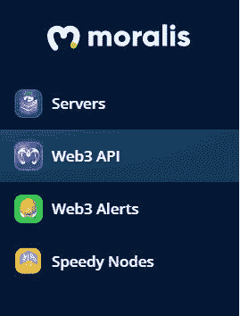
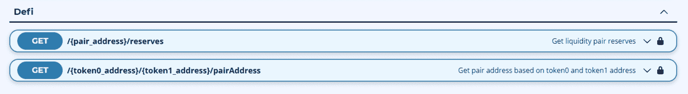

# 《Moralis 杂志》第 8 期——与 Moralis 私人公司一起打造钱包。3

> 原文：<https://moralis.io/moralis-magazine-8-build-a-wallet-with-moralis-pt-3/>

感谢你本周加入我们。我们一起(Moralis 道)支持和使用最健壮和最强大的 Web3 框架。

**Moralis 是一个强大的 Web3 框架**，但是作为 Moralis DAO，我们不仅仅是这样。我们希望通过为您提供快速构建应用程序所需的工具和组件来帮助您提升开发水平。

你们每个人都是非凡事物的一部分，这本杂志就是要让 Moralis 的力量为你所用！

**我们都是 Moralis 家**，在这里互相支持。如果你不是已经活跃在[Moralis 说教不和谐](https://discord.com/invite/P9N9HF97hH)的话，今天就是为你引荐的日子。在 Moralis 道的冲突中，你会发现一堆 Moralis 专家和法师同伴。发布您的项目并从社区获得反馈，参与编码挑战，并了解最新的 Moralis 特性和更新。

你如何利用所提供的工具和专业知识取决于你自己，我们希望这本杂志能激发一些想法。

你在用 Moralis 建造什么？你卡住了吗？向我们提出问题和意见。谁知道呢，我们甚至可能会在未来的杂志上直接回复你！

[**发送您的问题给我们**](https://ivanontech.typeform.com/to/R9K5lnGe)

**突发新闻！**

## 新 Moralis 流动性终点

使用单行代码，现在可以访问给定 AMM 对的“总储量”;和给定对的地址。

Moralis API 用户欢欣鼓舞！Moralis SDK 最近引入了新的 DeFi 端点。该团队将很快制作关于该功能的教程，所以请确保订阅 [Moralis 的 YouTube 频道](https://www.youtube.com/channel/UCgWS9Q3P5AxCWyQLT2kQhBw)并打开通知设置。此外，Moralis[NFT API](https://moralis.io/ultimate-nft-api-exploring-moralis-nft-api/)仍然是增强你的[NFT 编程](https://moralis.io/nft-programming-for-beginners/)的最佳方式！开发去中心化应用，如何[构建以太坊 dApps](https://moralis.io/ultimate-guide-how-to-build-ethereum-dapps/) 或者 [BEP20 token 开发](https://moralis.io/bep20-token-development-full-guide/)前所未有的简单！

注册的 Moralis 用户可以通过位于 Moralis 控制面板左侧的 Web3 API 选项卡访问这两个功能:

在那里，向下滚动到“DeFi”部分:

所有的 API 函数(包括新的端点)在 SDK 中都是可用的。凭借 Moralis 的 SDK 提供的许多功能，它为 Moralis Mages 提供了最定制和最强大的构建体验。

你刚刚开始使用 Moralis 服务器吗？

查看我们的详细概述，一步一步的指南，利用后端 Moralis 服务器的全部功能构建完整的 dApps:

https://youtu.be/jdx2H1alijQ?t=2076

* * *

…现在，你们期待已久的时刻到了…

## **主事件！**

特别发布:Moralis 支持功能双功能！

我们的第一个支持函数是 Filip 的 DEX 构建教程的后续。在这里，Chris 将介绍如何添加搜索功能:

https://youtu.be/vEmDyUZl4Kc

### 奖金教程

想学习如何添加用户名和密码登录到一个 Moralis 的网站？克里斯向我们展示了:

https://www.youtube.com/watch?v=wQR4MpG2zdU

感谢阅读！我们希望本周的 Moralis 杂志对你有用。

继续建造！

下次见💚

Moralis 研究小组