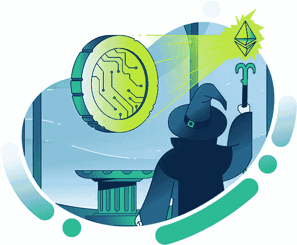

# Moralis 杂志# 9–与 Moralis 一起发布加密货币

> 原文：<https://moralis.io/moralis-magazine-9-launch-a-cryptocurrency-with-moralis/>

再次感谢你本周加入我们。我们一起(Moralis 道)支持和使用最健壮和最强大的 Web3 框架。

**Moralis 是一个强大的 Web3 框架**，但是作为 Moralis DAO，我们不仅仅是这样。我们希望通过为您提供快速构建应用程序所需的工具和组件来帮助您提升开发水平。

你们每个人都是非凡事物的一部分，这本杂志就是要让 Moralis 的力量为你所用！

**我们都是 Moralis 家**，在这里互相支持。如果你不是已经活跃在[Moralis 说教不和谐](https://discord.com/invite/P9N9HF97hH)的话，今天就是为你引荐的日子。

在 Moralis 道的冲突中，你会发现一堆 Moralis 专家和法师同伴。发布您的项目并从社区获得反馈，参与编码挑战，并了解最新的 Moralis 特性和更新。

你如何利用所提供的工具和专业知识取决于你自己，我们希望这本杂志能激发一些想法。

你在用 Moralis 建造什么？你卡住了吗？向我们提出问题和意见。谁知道呢，我们甚至可能会在未来的杂志上直接回复你！

[**发送您的问题给我们**](https://ivanontech.typeform.com/to/R9K5lnGe)

**突发新闻！**

### Fantom 全面支持即将到来！

正如在最近的直播中提到的，Moralis 将很快支持 Fantom 生态系统:[https://www.youtube.com/watch?v=vwhm3FxhvQ8](https://www.youtube.com/watch?v=vwhm3FxhvQ8)

该版本发布后，用户将能够使用 Moralis 服务器、API 调用甚至 Moralis Speedy 节点与 Fantom 进行交互。更多更新将很快推出！

Moralis 法师行动号召——chain link 黑客马拉松(2021 年 10 月 22 日)

准备好，Moralis 家法师们；一场新的黑客马拉松即将来临！

Chainlink 自豪地举办了一场[40 万美元的黑客马拉松](https://chain.link/hackathon)，比赛将于 2021 年 10 月 22 日至 11 月 28 日举行。

Moralis 核心团队将为此赛事贡献 5 万美元的奖金。这是竞争优势之上的额外奖励，在后端使用 Moralis 时是可能的。

* * *

…现在，你们期待已久的时刻到了…

## **如何使用 Moralis 推出加密货币！**

首先，我们必须选择我们的道路:

“我如何推出自己的加密货币？”是许多加密货币新用户提出的一个普遍问题。

作为开发人员，我们知道创造一种加密货币比简单地在区块链部署一份合同要复杂得多。建立社区和提供公用设施也是项目成功的重要部分。然而，如果你是一名新的开发者，探索如何推出自己的 ERC-20 代币(本质上是一种加密货币)可以帮助你在开始旅程时建立兴奋感。

以太坊主网(最高的安全性，最高的成本):

https://www.youtube.com/watch?v=KNBneUpFaGo&t=1s

| (使用 Ropsten Testnet 执行的步骤) |

币安智能链(安全性更低、速度更快、成本更低):

https://www.youtube.com/watch?v=h4gQD7R1r94&ab_channel=MoralisWeb3

多边形(安全性低、速度快、成本最低):

https://www.youtube.com/watch?v=l_cUaIVtgEc

感谢阅读！我们希望本周的 Moralis 杂志对你有用。

继续建造！

下次见💚

Moralis 研究小组