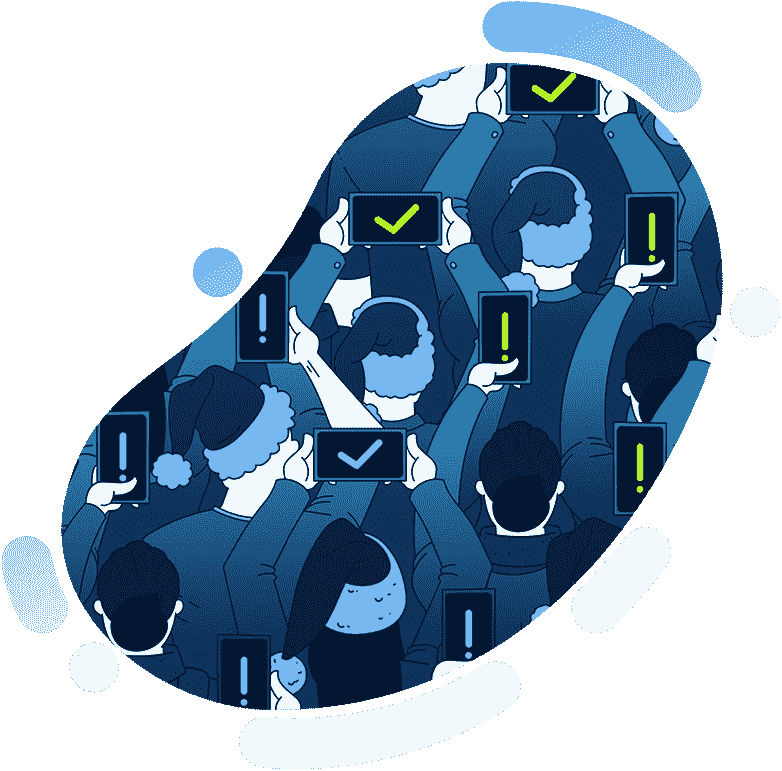
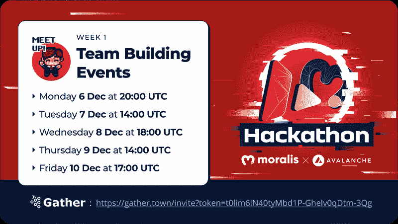
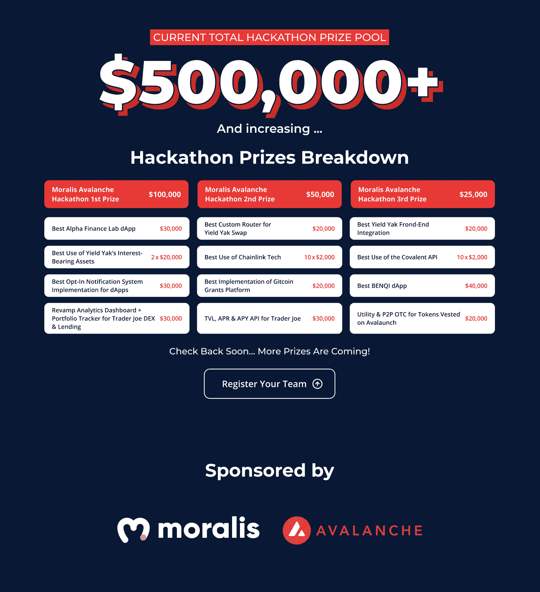

# Moralis 杂志第 17 期——一年中最美好的时光

> 原文：<https://moralis.io/moralis-magazine-issue-17-the-most-wonderful-time-of-the-year/>

### 什么是 Moralis？

我们(Moralis DAO)支持并使用现有的最健壮和最强大的 Web3 框架。

**Moralis 是一个强大的 Web3 框架**，但是作为 Moralis DAO，我们不仅仅是这样。我们希望通过为您提供快速构建应用程序所需的工具和组件来帮助您提升开发水平。

Moralis 杂志假日系列已经到来！

### 第一周:黑客马拉松热身周！

假期即将来临，在 Moralis，我们已经准备好庆祝区块链发展的又一个辉煌的一年！这一周，我们正在为本季最大的活动——Moralis x 雪崩黑客马拉松做准备！

来自世界各地的合作伙伴、建筑商和 Moralis 家们正聚集在一起，建造最新、最激动人心的区块链项目。每个项目都建立在快速和熟练的雪崩区块链生态系统上。

今天就加入活动吧！你不仅会体验到雪崩契约链(C 链)的力量，还会有机会与其他志同道合的程序员一起塑造它的未来。

你在用 Moralis 建造什么？你卡住了吗？向我们提出问题和意见。谁知道呢，我们甚至可能会在未来的杂志上直接回复你！

[**发送您的问题给我们**](https://ivanontech.typeform.com/to/R9K5lnGe)

### **现在还不算晚——今天就加入 Moralis x 雪崩黑客马拉松吧！**

这是热身周，这意味着我们正在组建团队，并与可能希望与我们合作的其他人进行磋商。

请参阅下面的“团队建设活动”时间表，了解更多信息。此外，这些虚拟会议和问候是专门为你介绍来自世界各地的其他 Moralis 建设者。

Solo builders 欢迎您！如果你喜欢自己动手，不要害怕！与团队协作是完全可选的，团队和单独的贡献者都可以提交 dApp(欢迎所有人)。

长时间关注所有事件！

为了帮助您及时了解本周的所有活动，我们制作了一份 VIP 日程表。单击以下链接查看所有独家活动，并将日历与您自己的日历同步:

### Moralis x 雪崩团队建设活动

你正在寻找同伴来帮助你建造你的密码杰作吗？不要害怕；莫利斯支持你！我们将在整周时间里直播元宇宙团队建设活动。然而，如果你错过了昨天或今天的活动，现在还不晚！在剩下的三个预定期间，团体将继续形成——我们迫不及待地想在那里见到你…

## 有奖合作伙伴

无论你是与他人合作还是独自建设，Moralis 都是一个共同努力使加密货币和区块链发展更好、更容易的社区。

我们想借此机会感谢所有的黑客马拉松赞助商；如果没有你，这个事件就不可能发生！

共价只是[我们已经得到的惊人的赞助商之一](https://moralis.io/covalent-partners-with-the-moralis-avalanche-hackathon/?utm_source=customerio&utm_medium=email&utm_campaign=moralis-magazine17)。[剩下的你可以在这里找到](https://moralis.io/avalanche-hackathon/?utm_source=customerio&utm_medium=email&utm_campaign=moralis-magazine17)。

高级奖池！

黑客马拉松参与者可以获得大奖！看看下面的奖金池:

## Moralis——一项环保倡议

Moralis 支持可持续发展和环保实践。随着区块链成为主流，电力消耗失控的可能性是真实的。要阅读我们对这一重要主题的看法，并了解我们为改善长期可持续发展所采取的措施，请看我们最近的声明:[https://moralis.io/sustainability/](https://moralis.io/sustainability/)。

你们每个人都是非凡事物的一部分，这本杂志就是要让 Moralis 的力量为你所用！

我们都是 Moralis 家，在这里互相支持。如果你不是已经活跃在[道貌岸然道不和](https://discord.com/invite/P9N9HF97hH)的话，今天就是让你登场的日子。

在 Moralis 道的冲突中，你会发现一堆 Moralis 专家和法师同伴。发布您的项目并从社区获得反馈，参与编码挑战，并了解最新的 Moralis 特性和更新。

### 即将推出——Moralis 至上…

3 明智(无聊)的 Moralis 家法师 NFTs

我们无聊的 Moralis 家法师收藏(由我们每周 Moralis 家竞赛获胜者独家拥有的 NFT 套装)继续增长。接下来的三个 NFT 将是一个由三部分组成的系列的一部分，因为它们带来了 Moralis 知识和培训的礼物。

* * *

这是给予的季节！

…我们很自豪地赠送我们的第一份 Moralis 法师节日礼物:

### **即时调查**

从以前的 Moralis 杂志中，我们了解到使用以太坊样板([https://github . com/ether eum-boilerplate/ether eum-boilerplate](https://github.com/ethereum-boilerplate/ethereum-boilerplate))开始使用自己的 dApp 是多么容易。此外，我们一直在努力寻找新的工具和方法来快速有效地使用 Moralis。

在接下来的视频中，我们自己的 Moralis 专家 Ash 将向我们展示如何快速将投票/调查功能集成到我们的 Web3 dApps 中；看看吧！

你是新来的吗？我们为你准备了全新的“从头开始”的 Moralis 课程。这是一个长达 6 小时的课程，将改变你的生活！一旦完成，你将准备好深入到这个季节我们要分享的所有节日珍宝中:圣诞树::圣诞礼物:

https://www.youtube.com/watch?v=MY4WYoZPr-U&t=505s

你如何利用所提供的工具和专业知识取决于你自己，我们希望这本杂志能激发一些想法。

* * *

感谢阅读！我们希望本周的 Moralis 杂志对你有用。

继续建造！

下次见💚

Moralis 研究小组