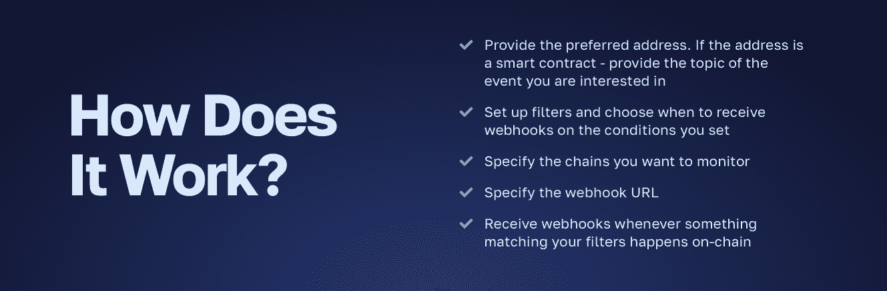
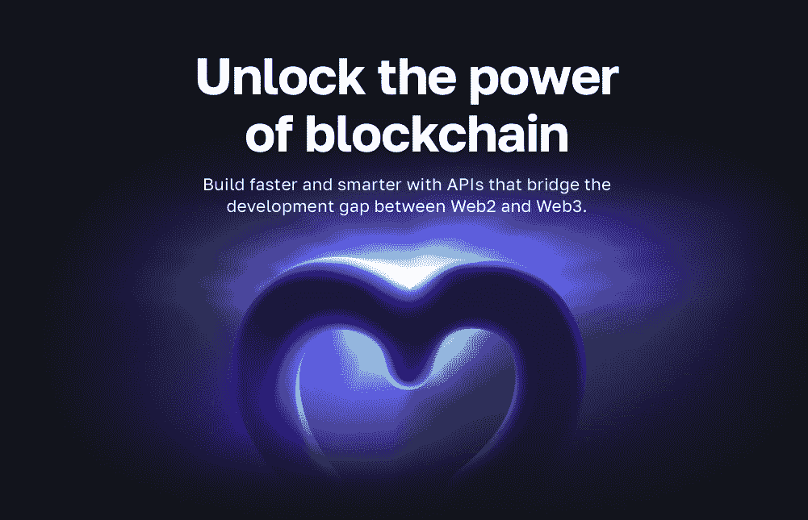
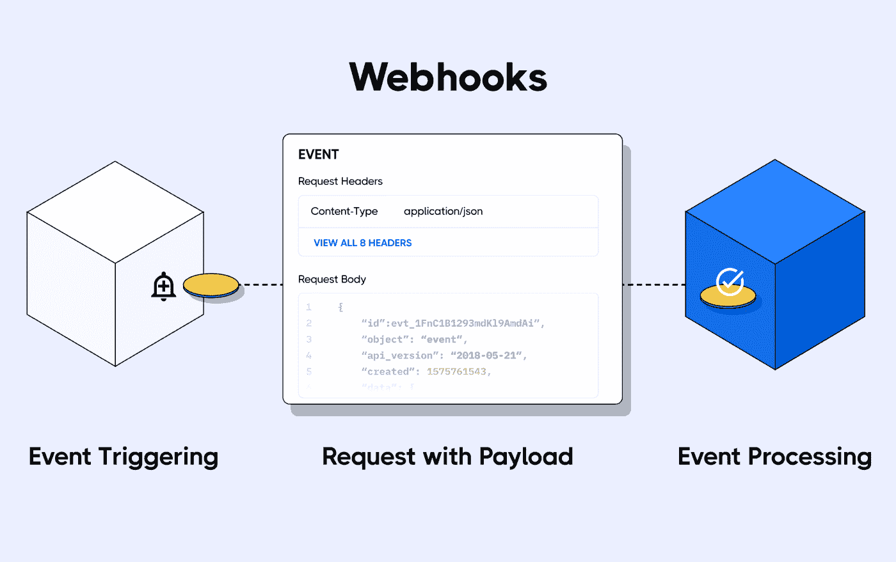
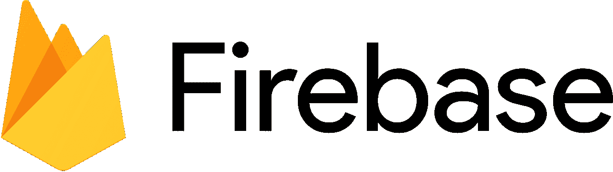

# moralis web hooks——web 3 web hooks 简介

> 原文：<https://moralis.io/moralis-webhooks-an-introduction-to-web3-webhooks/>

使用 Moralis 的企业级 Streams API，您可以避免构建复杂的数据管道、建立抽象、连接到 RPC 节点等麻烦。相反，您会收到一个无缝的工作流程来设置 Moralis webhooks，用于实时钱包通知、监控资产、代币销售等等！那么，流 API 是如何工作的呢？



上图中步骤的可访问性如下所示，在这里您可以找到通过 Moralis 的 JavaScript SDK 以编程方式设置 Web3 流的完整代码。该流根据地址监控钱包活动，确保您收到所有交易的 Moralis webhooks:

```js
import Moralis from 'moralis';
import { EvmChain } from "@moralisweb3/evm-utils";

Moralis.start({
  apiKey: 'YOUR_API_KEY',
});

const stream = {
  chains: [EvmChain.ETHEREUM, EvmChain.POLYGON], // List of blockchains to monitor
  description: "monitor Bobs wallet", // Your description
  tag: "bob", // Give it a tag
  webhookUrl: "https://YOUR_WEBHOOK_URL", // Webhook URL to receive events
}

const newStream = await Moralis.Streams.add(stream);
const { id } = newStream.toJSON(); // { id: 'YOUR_STREAM_ID', ...newStream }

// Now we attach Bobs address to the stream
const address = "0x68b3f12d6e8d85a8d3dbbc15bba9dc5103b888a4";

await Moralis.Streams.addAddress({ address, id });
```

[**Create Moralis Webhooks Now**](https://admin.moralis.io/register)

### 概观

应用程序、平台和其他系统有几种通信方式。然而，webhooks 是最有效的选择之一。在我们高度互联的在线空间中，Webhooks 是必不可少的，它确保分离的系统可以共享数据。在分散式 web 中，webhooks 通常被称为“Web3 webhooks”，它在实现分散式应用程序(dapps)和区块链网络之间的通信方面发挥着同样重要的作用。由于分散式 webhooks 在区块链空间中扮演着重要的角色，开发者需要高效的工具来设置它们。如果这听起来令人兴奋，并且您想了解更多关于这些 webhooks 的复杂情况，请加入我们这篇文章，让我们更深入地探讨这个主题！

除了探究区块链 webhooks 的来龙去脉，这篇文章还特别介绍了一个使用 Moralis 的 Streams API 设置它们的教程。到本文结束时，您将知道如何设置 Web3 流来接收 Moralis webhooks 并监视各种区块链事件！此外，Streams API 是 Moralis 的众多[web 3 API](https://moralis.io/web3-apis-exploring-the-top-5-blockchain-apis/)之一，有助于实现更加无缝的区块链开发体验。如果你真的想进入 Web3 开发，你也应该探索一下其他的界面。例如，检查一下 [EVM API](https://moralis.io/evm-api/) ，允许你立刻创建 EVM 兼容的 dapps！如果这听起来令人兴奋，看看我们的指南如何[建立一个 Web3 应用](https://moralis.io/fastest-way-to-build-a-web3-app/)！

尽管如此，不管你是想建立 Moralis 网还是想开发 dapps，都要注册 Moralis 网。使用 Moralis 帐户，您可以获得更加无缝的开发人员体验，使您能够充分利用区块链技术的力量！



## 什么是 Web3 Webhooks？

本节将从探索传统的 webhooks 开始，因为这对于充分理解 Web3 webhooks 的概念是必要的。简而言之，webhooks 是由源系统(发送方)中的特定事件触发的发送到目标系统(接收方)的 HTTP 请求。



在一个高度互联的网络空间中，系统不可能孤立地发挥最佳功能。因此，对允许在线系统有效交换数据的互通解决方案有很高的需求。系统和平台有几种通信方式；然而，webhooks 是一些最高效和最有效的替代方案。

当使用 webhooks 时，源系统通过 HTTP 请求与目标系统通信，当给定的事件发生时，这些请求被传送到一个 URL。此外，源系统通常通过所谓的“请求有效载荷”来共享额外的事件细节。

现在，对传统的 webhooks 有了更深刻的理解，让我们看看它们在 Web3 环境中需要什么。因此，我们将回答这个问题，“什么是 Web3 webhooks？”下面！

就像传统的 webhooks 一样， [Web3 webhooks](https://moralis.io/web3-webhooks-the-ultimate-guide-to-blockchain-webhooks/) 也有同样的目的，实现跨系统的相互通信。然而，由于分散式 web 是建立在可编程的区块链之上的，所以可以想象会有细微的差别。区块链开发人员使用加密空间内的 Web3 webhooks 来监听链上发生的各种事件。反过来，它们接收与这些活动相关联的实时请求有效负载。一些突出的例子是资产转移、发出事件的智能合同、执行动作的某些钱包等。


你可以想象，区块链网络钩子在 Web3 生态系统中扮演了一个重要的角色，让戴普斯和区块链能够交流。因此，对于 Web3 开发人员来说，拥有快速设置 webhooks 的有效工具来在系统之间推送数据是有益的，这正是 Moralis 的 Streams API 的作用所在！

## Moralis 的 Streams API——创建 Moralis Webhooks 的最简单方法

由于 dapps 和其他 Web3 项目是基于区块链的，它们需要链上数据来优化工作。然而，从传统的角度来看，查询区块链数据是一项相对繁琐的任务。为什么？因为它需要开发人员构建抽象、运行有问题的 RPC 节点、设置复杂的数据管道等。幸运的是，这不再是一种情况，因为您可以利用像 Moralis 的 Web3 [Streams API](https://moralis.io/streams/) 这样的工具来设置 Moralis webhooks！


使用 Streams API，您现在可以在几分钟内轻松设置 Web3 流来接收 Moralis webhooks。因此，将链上数据传输到 dapps 和其他 Web3 项目的后端变得前所未有的简单。此外，由于 Moralis 的跨链功能，Streams API 可以兼容多个网络。这包括以太坊，BNB 链，多边形，雪崩，等等。

无论何时，您都可以在这些网络和其他第 2 层(L2)平台上设置流来接收 Moralis webhooks:

*   有人参与你的代币销售。
*   资产被交换、标记、接收、发送等。
*   一场战斗在你的区块链游戏中开始。
*   或基于您的过滤器的任何其他智能合约事件触发器。

那么 Streams API 是如何工作的呢？

1.  请提供地址。如果提供的地址是智能合同，请提供您想要接收其信息的事件的主题。
2.  应用过滤器确定何时接收 Moralis webhooks。
3.  选择您要监控的链。
4.  指定您的网页挂钩 URL。
5.  当事件触发链上匹配您的过滤器时，接收 Moralis webhooks。

下面的部分将在一个实际的例子中应用每个步骤，以使上面的内容更容易理解。如果这听起来令人兴奋，请加入我们，我们将向您展示如何创建流来立即接收 Moralis webhooks！

## 如何设置 Moralis 网 3 网页挂钩

对区块链 webhooks 和 Streams API 有了更好的理解后，让我们进入本文的中心部分。因此，我们将向您展示如何设置 Moralis 网挂钩。如果你从这里开始学习，你将学会如何将链上数据直接传输到所有未来区块链项目的后端！

创建 Web3 流主要有两种选择:用 JavaScript SDK 编程或者通过 Moralis 的管理面板。本教程着重于前者，向您展示如何以编程方式设置 Moralis webhooks，将任何链上数据流入您的项目！


为了展示使用 Moralis 的 Streams API 的可访问性，本教程特别说明了如何创建一个 Moralis webhook 来监视特定 Web3 wallet 的传入和传出交易。然而，这只是一个例子。如果您完成了本教程，您将能够轻松地从任何区块链中查询其他数据类型。更重要的是，如果你想学习如何通过 Moralis 管理面板创建流，你可以通过查看官方的 [Streams API 文档](https://docs.moralis.io/docs/what-is-streams-api-1)找到完整的分解。

事不宜迟，让我们直接进入教程，向您展示如何通过 Moralis webhooks 以编程方式将链上数据流入您的应用程序！

### 以编程方式创建 Moralis 网挂钩

本节说明如何以编程方式创建 Web3 流，以便在发生与某个 wallet 相关的转移事件时接收 Moralis webhooks。为了实现这一点，我们使用了 Moralis 的 Streams API 和 JavaScript SDK。如果这听起来令人兴奋，请加入我们，从头到尾剖析这一过程！

首先，打开您首选的集成开发环境(IDE)并设置一个 JavaScript 项目。在项目文件夹中，创建一个新文件并安装所有 Moralis 依赖项。如果您使用 NodeJS，请打开一个终端并运行以下命令:

```js
npm install moralis
```

使用 JavaScript 项目，打开文件，通过在文件顶部添加以下代码片段来初始化 Moralis JavaScript SDK:

```js
import Moralis from 'moralis';
import { EvmChain } from "@moralisweb3/evm-utils";

Moralis.start({
  apiKey: 'YOUR_API_KEY',
});
```

通过检查上面的代码，您会很快注意到您需要通过替换“*YOUR _ API _ KEY*”*来添加您的 Moralis API 密钥。*您可以通过注册 Moralis 并导航至“Web3 APIs”选项卡来获取密钥:


将密钥添加到 JavaScript 文件并初始化 Moralis 后，您可以创建一个新的" *stream* "对象，您必须向其中添加一些参数。具体来说，您需要指定链、描述、标签和 webhook URL。为了澄清事情，它可能是这样的:

```js
const stream = {
  chains: [EvmChain.ETHEREUM, EvmChain.POLYGON], // List of blockchains to monitor
  description: "monitor Bobs wallet", // Your description
  tag: "bob", // Give it a tag
  webhookUrl: "https://YOUR_WEBHOOK_URL", // Webhook URL to receive events,
}
```

最重要的是，称之为 Moralis。Streams.add(stream) "函数，并将“ *stream* ”对象作为参数传递。结合调用函数，添加一个新的“ *{ id }* ”对象和您要监视的钱包地址:

```js
const newStream = await Moralis.Streams.add(stream);
const { id } = newStream.toJSON(); // { id: 'YOUR_STREAM_ID', ...newStream }

// Now we attach bobs address to the stream
const address = "0x68b3f12d6e8d85a8d3dbbc15bba9dc5103b888a4";

await Moralis.Streams.addAddress({ address, id });
```

因此，您现在应该有一个 JavaScript 文件，其代码类似于下面的代码:

```js
import Moralis from 'moralis';
import { EvmChain } from "@moralisweb3/evm-utils";

Moralis.start({
  apiKey: 'YOUR_API_KEY',
});

const stream = {
  chains: [EvmChain.ETHEREUM, EvmChain.POLYGON], // List of blockchains to monitor
  description: "monitor Bobs wallet", // Your description
  tag: "bob", // Give it a tag
  webhookUrl: "https://YOUR_WEBHOOK_URL", // Webhook url to receive events,
}

const newStream = await Moralis.Streams.add(stream);
const { id } = newStream.toJSON(); // { id: 'YOUR_STREAM_ID', ...newStream }

// Now we attach bobs address to the stream
const address = "0x68b3f12d6e8d85a8d3dbbc15bba9dc5103b888a4";

await Moralis.Streams.addAddress({ address, id });
```

从这里开始，剩下的就是运行程序了。为此，在 JavaScript 文件中打开一个新的终端“ *cd* ，并运行下面的命令:

```js
node “FILE_NAME”
```

### 必需的测试 Webhook

每当你创建一个新的流，无论你是通过编程还是通过 Moralis 的管理面板，你都会收到一个 Moralis 测试 webhook。因此，要使流可操作，您需要返回状态代码 200。你可以在下面找到测试体的样子:

```js
{
  "abi": {},
  "block": {
    "hash": "",
    "number": "",
    "timestamp": ""
  },
  "txs": [],
  "txsInternal": [],
  "logs": [],
  "chainId": "",
  "tag": "",
  "streamId": : "",
  "confirmed": true,
  "retries": 0,
  "erc20Approvals": [],
  "erc20Transfers": [],
  "nftApprovals": [],
  "nftTransfers": []
}
```

一旦您返回状态代码，您就成功地设置了您的 Web3 流来接收 Moralis webhooks。因此，只要指定的地址涉及传入或传出的交易，您就会收到 Moralis webhooks，请求有效负载发送到您的 webhook URL！

恭喜你！现在，您已经成功地以编程方式创建了第一个流来接收 Moralis webhooks。因此，您现在可以使用 Moralis 的 Streams API 和相同的基本原则将任何链上数据传输到您的 Web3 项目的后端！

但是，如果您在本教程的任何时候遇到了任何问题，请查看官方的 Moralis 流 API 文档。这样做的话，你所有的问题都有望得到解答。否则，您也可以加入 Moralis 的 Discord 频道，从我们才华横溢的社区工程师那里获得顶级帮助。

## Moralis Webhooks Firebase 集成

现在您已经熟悉了 Streams API，可以使用这个接口来设置 Moralis webhooks。因此，您现在可以监听和监控区块链活动，包括智能合约事件、令牌转移、正在铸造的 NFT 等。尽管您可以轻松地设置 Moralis webhooks，但您仍然需要一种在后端存储数据的方法。这就是 Firebase 集成进入等式的地方。



借助 Moralis 的 Firebase 集成，您可以快速开始使用 Moralis webhooks。此外，你可以这样做，而不必设置自己的 Web3 后端基础设施。Firebase 通过提供完整的托管解决方案来处理繁重的工作。因此，您可以使用 Streams API 通过 Moralis webhooks 将链上数据无缝地传输到 Firebase 后端，以实时监控区块链活动！

如果你想了解更多关于 Moralis 的 Streams Firebase 集成的信息，可以看看下面的视频。通过观看此剪辑，您将了解如何结合使用 Streams API 和 Firebase 来监听任何区块链事件。

[https://www.youtube.com/embed/EieJVLhpvsI?feature=oembed](https://www.youtube.com/embed/EieJVLhpvsI?feature=oembed)

## moralis web hooks–摘要

在本文中，您将探索 webhooks 的复杂性。这告诉您，它们是基于某些事件从源系统发送到目标系统的 HTTP 请求。因此，它们能够在 Web2 和 Web3 空间内实现跨系统通信。本文还提供了一个教程，教您如何通过 Streams API 使用 JavaScript SDK 以编程方式设置 Moralis webhooks！

如果您已经学习了这么多，那么您现在已经熟悉了 webhooks 以及如何设置它们。因此，您可以创建 Web3 流来接收 Moralis webhooks，以监控特定的链上事件。这包括钱包活动、资产转移、游戏内活动等等！此外，由于 Moralis 的 Firebase 集成，您可以轻松地将区块链数据直接传输到您的 Firebase 后端。

如果你觉得这个教程有帮助，我们推荐你在 Moralis [Web3 博客](https://moralis.io/blog/)查看更多内容。例如，学习如何[创建 AWS Lambda 函数](https://moralis.io/creating-a-lambda-function-learn-how-to-create-an-aws-lambda-function/)或探索[游戏公园](https://moralis.io/aws-gamesparks-guide-what-is-gamesparks/)的复杂性。你也可以通过我们在[以太坊网钩](https://moralis.io/ethereum-webhooks-what-they-are-and-how-to-use-webhooks-for-ethereum/)和[多边形网钩](https://moralis.io/polygon-webhooks-how-to-use-webhooks-on-polygon/)上的指南了解更多关于网钩的信息！

最后，如果你想建立 Moralis webhooks，[立即注册 Moralis](https://admin.moralis.io/register) 。你可以免费创建你的账户，只需要几秒钟！