# 多链 NFT API–如何构建跨链 NFT dapp

> 原文：<https://moralis.io/multichain-nft-api-how-to-build-cross-chain-dapps/>

要构建跨链 NFT dapp，使用多链 NFT API 是项目成功的必要条件。如标题所示，我们将把这篇文章献给不可替换令牌的领先的跨链 API，Moralis 的多链 NFT API。反过来，您会注意到 Moralis 的 API 如何使 dapps 的开发变得简单明了。此外，使用 API，您可以享受以下功能:

*   企业级性能、精度和多链 NFT 支持。
*   开发时间节省高达 80%！
*   支持多种令牌标准。
*   自动解析元数据。
*   几个游戏引擎的兼容性。

此外，正如“多链”和“跨链”术语所暗示的，这个 API 允许您在不同的网络上开发 NFT dapp。同样，有了这个多链 NFT API，你可以随时*跨越*到其他支持的链。

要开始使用最好的跨链 API，您需要的只是您的 Moralis Web3 API 密钥。幸运的是，在你[创建了你的免费 Moralis 账户](https://admin.moralis.io/register?utm_source=blog&utm_medium=post&utm_campaign=Ultimate%2520NFT%2520API%2520%25E2%2580%2593%2520Exploring%2520Moralis%25E2%2580%2599%2520NFT%2520API)之后，你就可以获得那个密钥了。当然，我们将在本文中进一步向您展示如何做到这一点。然而，我们需要从一些基础知识开始今天的主题，并确保你们都跟上了速度。因此，在我们开始使用 Moralis 的多链 NFT API 之前，让我们看看什么是 NFT API。

[**Sign Up for Moralis Magazine**](https://moralis.io/joindiscord/) 

## 什么是 NFT 空气污染指数？

解释某件事情实际需要什么的最好也是最简单的方法之一就是把事情分解。因此，我们需要分别看一下“NFT”和“API”这两个术语。所以，我们先从 API 说起，API 是“应用编程接口”的简称。后者是使软件能够与其他软件交互的任何类型的接口。此外，API 实现了不同的指令集，这些指令集被传输或翻译以便相互理解。因此，很明显，API 在确保稳定环境中的一致编码方面起着重要的作用。毕竟，合适的 API 使开发人员能够在每次请求时交付可预测的所有可复制功能。

另一方面，“NFT”代表“不可替代的令牌”——一种特殊的加密资产。它们的独特性使得 NFT 不可思议(正如“不可替代”这个词所暗示的)，并且这个属性提供了广泛的应用。数字艺术、收藏品、分散式游戏、在线售票和会员认证，仅举几例。此外，非英语国家教师已经在实施“游戏挣钱”(P2E)概念方面发挥了重要作用。此外，一些 NFT 已经找到了它们在证书颁发和所有权证明方面的用途。因此，我们可以期待 NFTs 在未来的应用。因此，开发人员必须学会利用这些类型的令牌。这就是一个合适的多链 NFT API 让事情变得非常简单的地方。

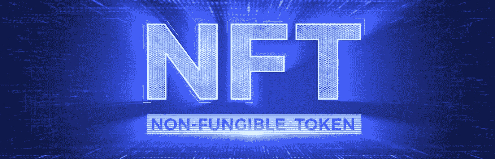

现在你知道什么是 API，什么是 NFT，我们可以把它们放在一起。简而言之，NFT API 是一个专注于处理不可替换令牌的 API。此外，高质量的 NFT API 简化了与这些令牌相关的后端数据采集。请注意，有各种 API 选项可用；然而，只有一种终极多链 NFT API——Moralis 的 NFT API。

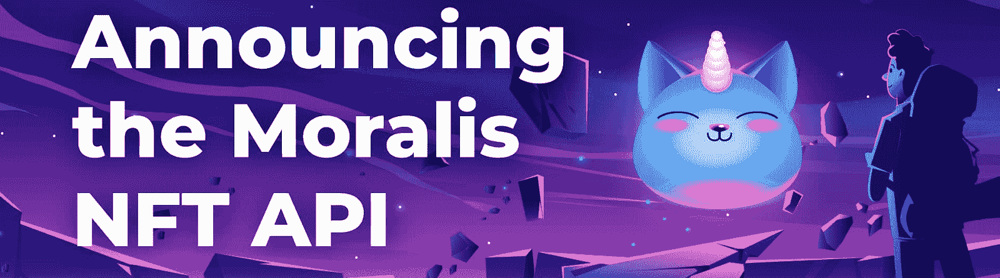

## 介绍最佳的企业级多链 NFT API

Moralis 跨链 NFT API 是一个易于管理和使用的索引 API。大多数其他 API 选项需要使用多个请求。反过来，你需要处理多行代码。另一方面，终极多链 NFT API 为您提供单行代码。此外，简单地复制和粘贴简短的代码片段来覆盖后端的所有繁重工作。

本质上，使用这个跨链 NFT API，您可以毫不费力地获得与特定 NFT 相关的链上数据。因此，您可以构建各种包含 NFT 的分散式应用程序(dapps)。一些常见的 NFT dapp 包括 NFT 钱包，NFT 追踪器，NFT 市场和 NFT 游戏。此外，借助企业级多链 NFT API，您可以不费吹灰之力构建任何 dapps。

在我们继续深入了解 Moralis 的 API 之前，让我们先来看看您可能想要使用这个优秀工具的主要原因。我们之前简单地看了一下。然而，以下是开发人员喜欢这个 API 的关键点:

*   高性能、准确性和跨链支持。
*   节省高达 80%的开发时间。
*   支持 ERC NFT 标准(ERC-721 和 ERC-1155)和非标准 NFT。
*   自动解析元数据。
*   完全兼容 Unity、Unreal 等游戏引擎。

## NFTs 的跨链 API 它是如何工作的？

为了理解 Moralis 的多链 NFT API 是如何工作的，让我们看看在没有它的情况下如何获得 NFT 数据。因此，首先，如果没有 Moralis 的 API，您将需要解析单个智能契约。然后你需要整理所有不规则的数据集。一路上，你必须进行大量的清理和缝合。此外，为了获得所需的 NFT 元数据，您需要进行十次以上的调用。更不用说，还需要查询节点的元数据。如果你对以上任何一种行为有所体验，你就知道这是相当压倒性的。

另一方面，用 Moralis 的跨链 NFT API 获得不可替代的令牌数据归结为一个调用。是的，只需一个电话就可以检索任何支持的区块链的 NFT 信息。您只需选择一个符合您需求的 NFT API 端点，然后进行调用。因此，NFT 元数据、NFT 转让数据和 NFT 所有权数据变得可用。然后，您可以以任何方式将获取的 NFT 数据合并到 dapps 中。例如，您可以使用 NFT API 端点控制网站的某些部分或全部内容。

因此，一般工作流程将遵循以下步骤:

1.  决定您想要使用的开发平台和工具。
2.  安装 Moralis SDK。
3.  获取您的 Moralis Web3 API 密钥并将其添加到您的代码中。
4.  开始进行符合您需求的 NFT API 端点调用。
5.  将获取的链上数据合并到分散的应用程序中。

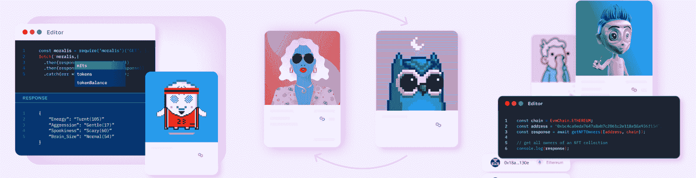

### Moralis 用于区块链网络的不可替代令牌 API 的特点

如上所述，最好的多链 NFT API 为您提供了超过 15 个端点，涵盖了所有类型的功能。此外，这些端点的名称是不言自明的。因此，你不用详细研究它们就知道该用哪一个。

以下是 API 的可用端点:

*   *getNFTTransfersByBlock*
*   *getWalletNFTs*
*   *getWalletNFTTransfers*
*   *getwalletwork collection*
*   *getNFTTrades*
*   *getNFTLowestPrice*
*   *searchNFTs*
*   *getNFTTransfersFromToBlock*
*   *getContractNFTs*
*   *getNFTContractTransfers*
*   *getNFTOwners*
*   *getnft 合同元数据*
*   *reSyncMetadata*
*   同步合同
*   *getNFTMetadata*
*   *getNFTTokenIdOwners*
*   *getNFTTransfers*

我们还要指出，您可以在任何受[支持的链](https://docs.moralis.io/reference/supported-chains-for-nft-api)上使用上述所有特性。以上各项的所有细节都在 Moralis 文档中。然而，为了进一步帮助您，让我们仔细看看最流行的多链 NFT API 端点之一。反过来，它将帮助您更好地找到其他 Moralis APIs 的文档。

### 探索" *getNFTMetadata* "端点

查看下面的截图，您可以看到“ *getNFTMetadata* ”端点页面的详细信息:

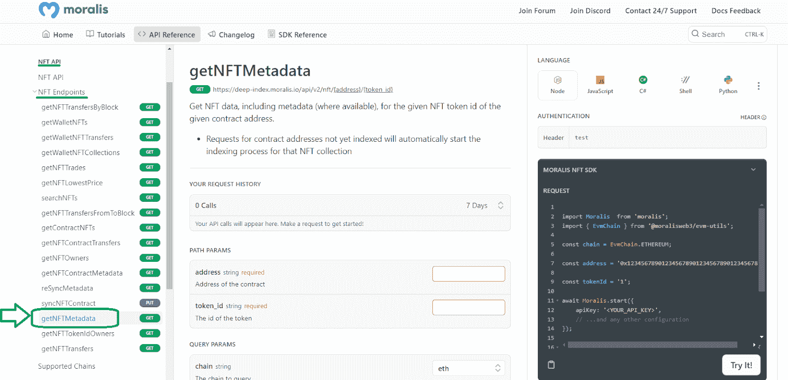

在上图的左边，你可以看到所有的 NFT API 端点。在中心，您可以输入所需的参数来尝试端点。当然，你需要选择你想关注的语言(右上角)。然后，你可以点击“试试看！”才能看到结果。

此外，通过再次查看上面的截图，您可以看到，出于本教程的考虑，我们将重点放在 NodeJS 上。如果你要使用这个选项，你需要使用 Moralis 的 JS SDK。此外，我们将集中在一个随机的 NFT 收集。因此，我们转到以太网扫描并选择“ERC-1155 顶级令牌”选项:

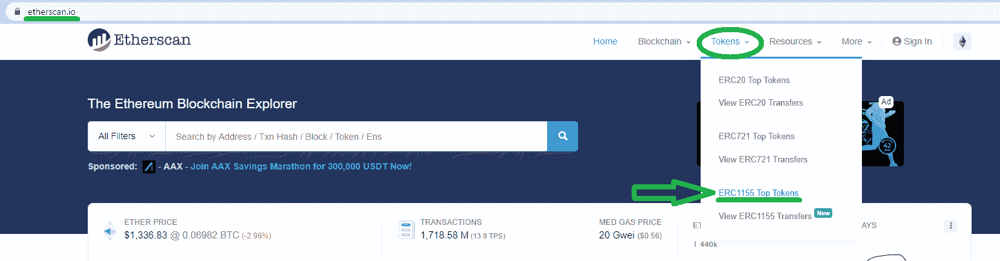

接下来，我们在那里选择一个 NFT 项目(“嘿熊俱乐部”中的“幻想灵魂伴侣有限公司”)。通过选择该令牌，我们可以访问其以太网扫描页面，在这里我们可以复制其合同的地址:

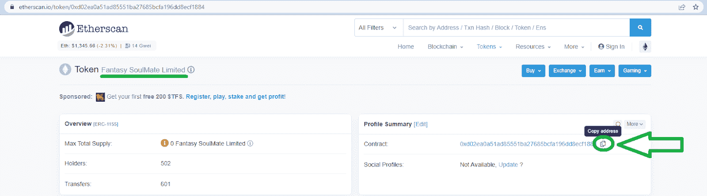

然后，我们返回到“ *getNFTMetadata* ”页面，将上面复制的地址粘贴到指定的输入字段中:

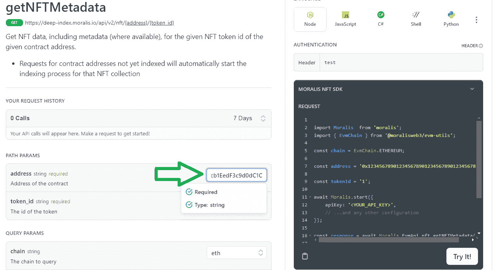

接下来，我们需要输入令牌 ID。因此，我们返回到 Etherscan，向下滚动令牌页面以查看我们的选项。从本质上讲，介于“1”和“100”之间的任何值都可以:

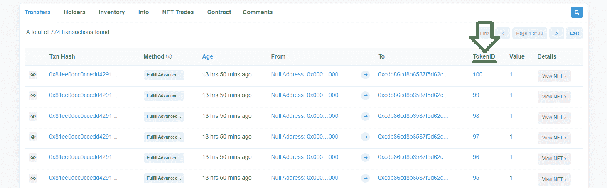

因为我们喜欢数字 20，所以让我们用它作为令牌 ID。最后，我们可以点击“试试看！”按钮:

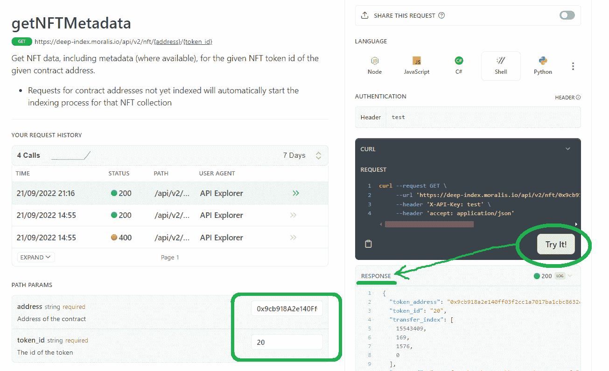

如果我们现在关注响应部分，我们会看到这个多链 NFT API 端点提供的所有信息。

#### “*getNFTMetadata*”API 端点响应

我们示例的响应在顶部为我们提供了令牌地址和令牌 ID(我们的条目值)。在“响应”框的下方，您可以找到许多其他详细信息，包括示例令牌的 URI:

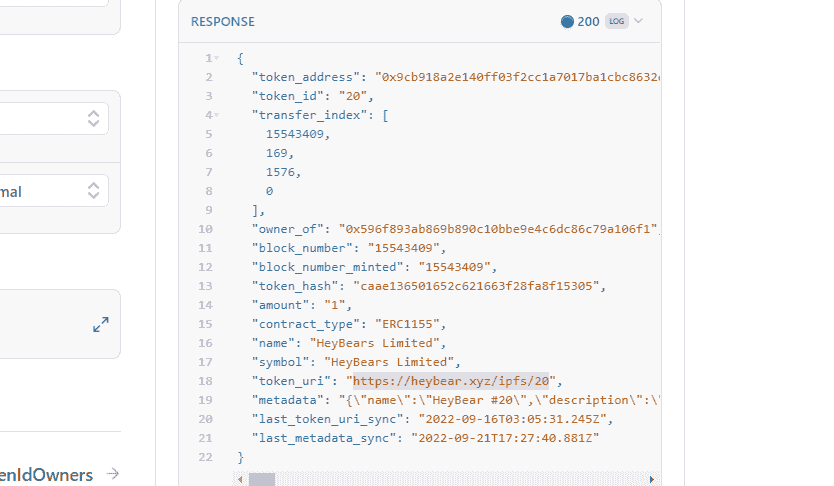

因此，我们可以简单地复制 URI 并将其粘贴到我们的浏览器中，以查看 NFT 的元数据:

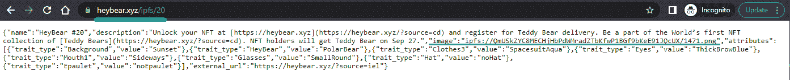

在上面的截图中，我们标记了示例令牌的图像 IPFS 地址。我们可以复制该地址，调整它以匹配 HTTPS 格式，并在我们的浏览器中使用它:

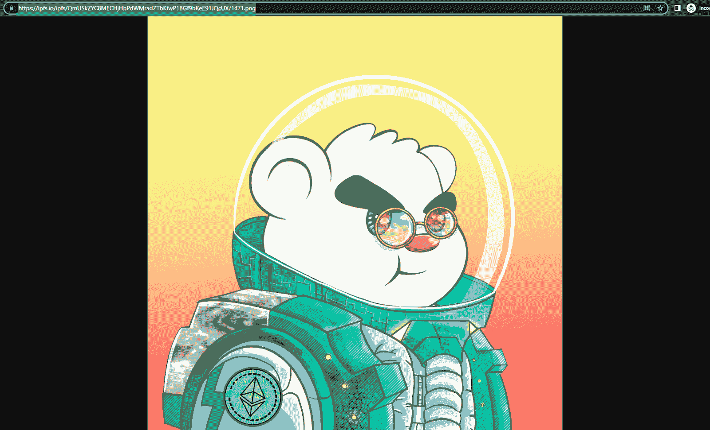

为了便于演示，我们手动处理了示例令牌的元数据(URI 和图像 URL)。但是，您可以编写一些基本代码来自动完成这项工作。因此，您可以毫不费力地在 dapp 中显示 NFT。此外，我们专注于以太坊连锁店的 NFT 系列；然而，我们可以很容易地对任何其他受支持的链使用相同的端点。

## 如何轻松集成多链 NFT API

要轻松集成多链 NFT API，请遵循本节内容，我们将看到这项任务的一个重要组成部分:获取您的 Moralis Web3 API 密钥。最后，您将能够在许多链上获得 NFT 的元数据。集成 API 的具体步骤因编程语言而异。因此，确保使用 Moralis 的文件。然而，在任何情况下，您都需要获得您的 Moralis Web3 API 密钥。此外，要完成这项任务，您需要一个 Moralis 帐户。所以，如果你还没有创建你的免费 Moralis 账户，现在就创建吧。您可以使用介绍中的“创建您的免费 Moralis 帐户”链接或 Moralis 主页上的“[免费开始](https://admin.moralis.io/register)”按钮:

创建您的帐户后，您将能够访问您的管理区。从那里，您将能够通过两个简单的步骤复制您的 API 密钥:

复制了 API 密钥后，您必须返回到您的代码。例如，如果你决定参加我们的教程，你会经常使用一个。env "文件。在该文件中，您必须将您的 API 密钥粘贴到" *MORALIS_API_KEY* "变量的旁边:

准备好 Web3 API 密钥后，您就可以开始实现上面列出的多链 NFT API 端点了。

## 多链 NFT API–如何构建跨链 NFT dapp–摘要

在本文中，我们首先确保您理解了什么是 NFT API，并且了解了什么是 NFT 和 API。接下来，我们介绍了 Moralis 多链 NFT API，在这里您会发现开发人员使用这个 API 的主要原因。在几个优点中，这个跨链 NFT API 可以让您节省高达 80%的开发时间。此外，我们查看了 API 的端点，并仔细查看了“ *getNFTMetadata* ”。最后但同样重要的是，我们还向您展示了如何获取您的 Moralis Web3 API 密钥，这是您使用终极多链 NFT API 的门户。

如果您想更深入地研究 NFT 开发，我们建议您完成 Moralis 文档中的“NFT 用例”教程。但是，您可能有兴趣探索其他区块链发展主题。在这种情况下，去 YouTube 的 Moralis 伦理频道或者 T2 的 Moralis 伦理博客吧。这两个渠道都提供了大量有价值的内容。例如，一些最新的主题教你如何[用 NextJS](https://moralis.io/how-to-connect-metamask-to-website-with-nextjs/) 将 MetaMask 连接到网站，如何[使用 Azure 函数](https://moralis.io/how-to-connect-playfab-with-web3-using-azure-functions/)用 Web3 连接到 PlayFab，如何[克隆 Zapper](https://moralis.io/how-to-clone-zapper-in-less-than-1-hour/) ，如何[将 dapp 连接到 Polygon](https://moralis.io/tutorial-how-to-connect-a-dapp-to-polygon-network/) ，如何设置和[将 dapp 连接到以太坊网络](https://moralis.io/set-up-and-connect-a-dapp-to-the-ethereum-network/)，等等。

当然，你也可以通过注册[Moralis 学院](https://academy.moralis.io/)来接受更专业的加密教育。在那里，你可以完成一系列顶级课程。例如，你甚至可以学习如何[创造你的元宇宙](https://academy.moralis.io/courses/create-your-metaverse)。通过成为区块链认证，你将更接近全职加密一步。