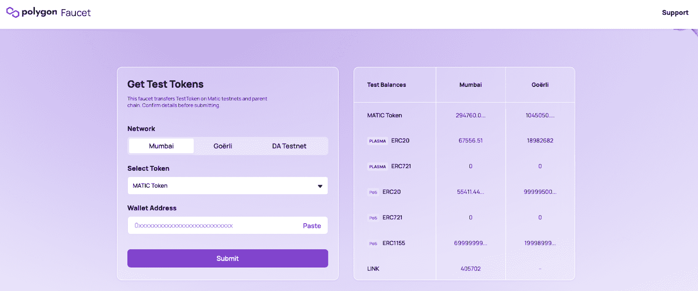
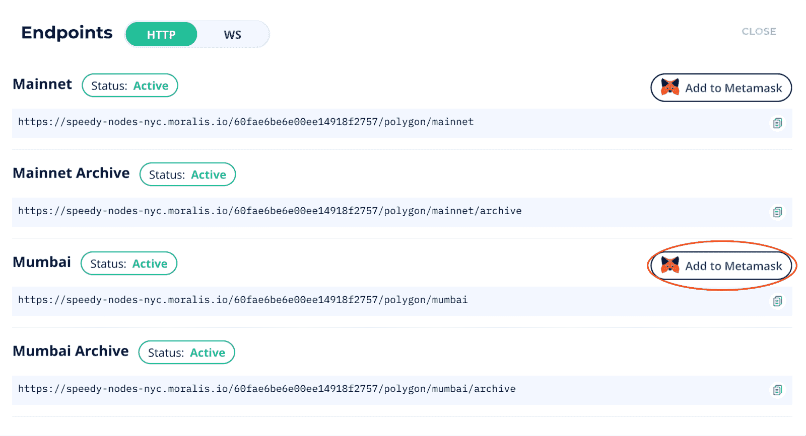
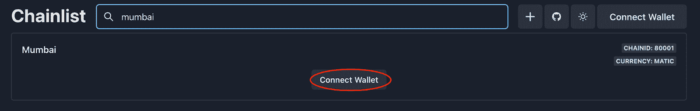
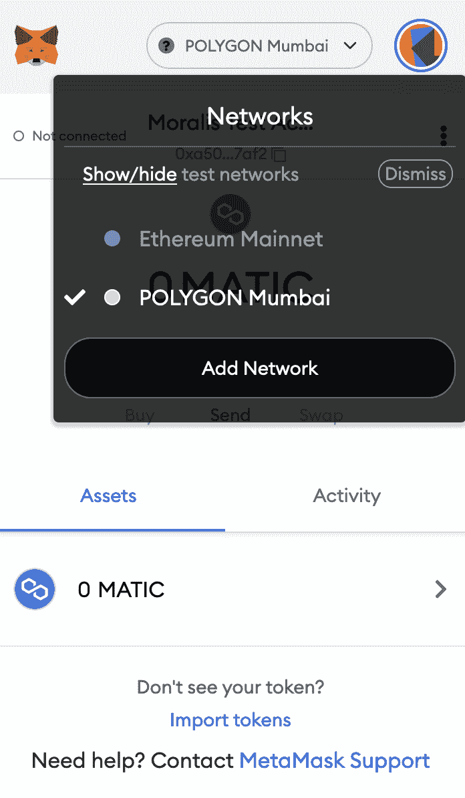
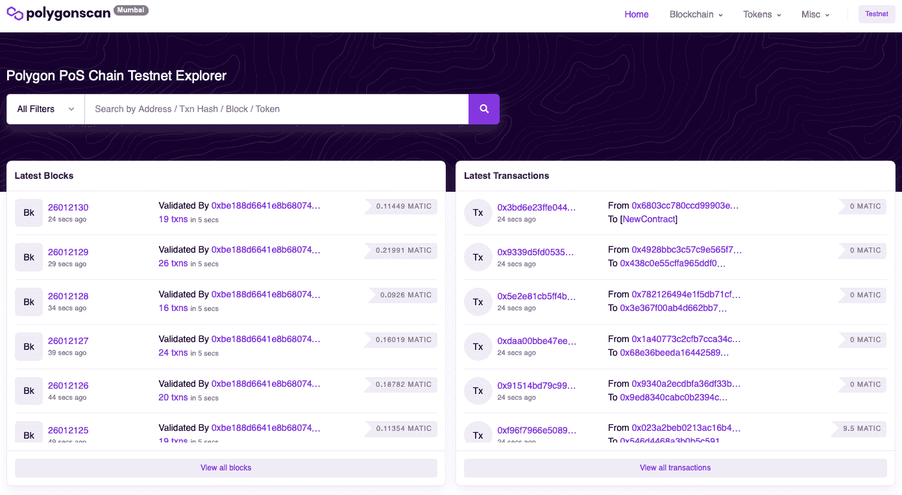

# 孟买测试网水龙头-如何获得免费的测试网自动令牌

> 原文：<https://moralis.io/mumbai-testnet-faucet-how-to-get-free-testnet-matic-tokens/>

**以太坊仍然是最广泛用于** [**Web3**](https://moralis.io/the-ultimate-guide-to-web3-what-is-web3/) **开发的网络。然而，网络普及的不利影响包括拥挤的网络和高昂的** [**以太币煤气费**。](https://moralis.io/ethereum-gas-fees-the-ultimate-2022-guide/) **这激励开发人员将他们的注意力转向其他更经济可行的解决方案，如多边形网络。Polygon 是一个强调低交易费用和高可扩展性的去中心化** [**以太坊**](https://moralis.io/full-guide-what-is-ethereum/) **平台。然而，即使 Polygon 的交易费用相对较低，利用 testnet 进行区块链开发仍然是有益的。在这里，我们将从 Polygon 更近距离地观察孟买测试网，并了解如何通过孟买测试网水龙头获得免费令牌。**

我们将从仔细观察孟买测试网和测试网给 Web3 开发带来的积极方面开始。然后，我们将解释什么是水龙头，为什么它们是必要的。一旦你通读了这篇文章，你会知道更多关于开发多边形网络的 dapps。

而且， [Moralis](https://moralis.io/) 对多边形有原生支持。所以，如果你真的想为 Polygon 网络构建 Web3 项目，你绝对应该和 Moralis 签约。Moralis 操作系统非常适合区块链开发，作为会员，你可以将所有未来项目的平均开发时间缩短 87%。例如，有了一个账户，你就可以访问 [Moralis Speedy Nodes](https://moralis.io/speedy-nodes/) ，它支持 Polygon 的 mainnet 和 Mumbai testnet。因此，这使您可以轻松地连接到多边形节点！

如果你已经熟悉 Polygon、Mumbai testnet 和水龙头，看看关于如何[构建 Polygon dapp](https://moralis.io/how-to-build-polygon-dapps-easily/)和[创建 Polygon 令牌](https://moralis.io/how-to-create-a-polygon-token/)的文章。使用 Moralis，您将能够轻松地为多边形网络开发 dapps 和令牌！

## 什么是孟买测试网？

如果你对 [Web3 development](https://moralis.io/how-to-build-decentralized-apps-dapps-quickly-and-easily/) 有所了解，你就会知道所有的区块链交易都需要支付汽油费。在 mainnet 上开发 dapps 可能会变得非常昂贵，因为启动和测试应用程序需要开发者为每笔交易付费。这就是像孟买这样的试验网介入的地方，以使开发 [dapps](https://moralis.io/decentralized-applications-explained-what-are-dapps/) 更具经济可行性。

Mumbai 是 Polygon 的测试网，它是该网络 mainnet 的复制品。然而，Mumbai 的 testnet 令牌与 Polygon mainnet 的令牌是截然不同的。这些令牌应该是没有价值的，因为它允许开发人员在不投入任何实际资产的情况下进行实验。这也是开发人员确保 dapp 正常工作而不破坏多边形 mainnet 的一种方法。

一旦你启动了你的 dapp 到 Polygon mainnet，在升级你的项目时也可以利用 Mumbai。因此，在对您的主 dapp 做出任何真正的承诺之前，您可以在 Mumbai testnet 上测试所有的更改。同样的原则也适用于智能合约开发，这使得在将智能合约部署到 mainnet 之前测试智能合约更加有益。

如果你想了解更多关于创建合同的知识，请查看我们的指南[如何创建智能合同](https://moralis.io/how-to-create-smart-contracts/)。该教程解释了智能合约开发的复杂性以及所需的必要技能。

## 什么是水龙头，为什么它是必要的？

使用 Mumbai testnet 进行 Polygon dapp 开发有很多好处，可以让您节省宝贵的时间和资源。然而，即使您在 Mumbai testnet 上开发，您仍然需要网络的本机令牌，这就是水龙头进入等式的地方。

水龙头是分发少量代币的应用程序或网站，开发者可以利用这些代币在测试网上支付煤气费。因此，使用 Mumbai testnet 水龙头可以让你完全免费地获得网络的本地令牌。

孟买的本土令牌也叫 MATIC 然而，正如上一节所解释的，它们与 Polygon 的本地标记是分开的和不同的。这意味着它们没有任何交易价值，但有助于 Web3 的开发。

水龙头不是 Polygon 独有的，其他网络也有水龙头。这意味着你可以找到比特币、以太坊、BNB 链等的龙头。因此，有可能为其他类似的测试网获得免费令牌，这使得将相同的原理应用于其他区块链网络变得可行。

所以，现在我们对孟买测试网和水龙头有了更深入的了解，我们可以仔细看看孟买测试网水龙头是如何工作的！

## 孟买测试网水龙头-获得免费测试网自动令牌

在接下来的几节中，我们将带您了解通过孟买 testnet 水龙头收购 MATIC 的过程。为孟买测试网获取 MATIC 相对容易；然而，为了使这个过程更容易理解，我们将把它分成以下三个步骤:

1.  获取元掩码钱包
2.  添加孟买测试网
3.  获取代币

如果你是区块链开发领域的新手，你可能不熟悉元掩码或加密货币钱包。如果是这样的话，我们建议阅读解释 Web3 钱包的文章。那篇文章将向您简要介绍它们是什么，为什么它们有用，以及一些不同的替代方案。

但是，事不宜迟，让我们通过设置元掩码来开始一切吧！

## 第一步:孟买测试网络龙头——获得 MetaMask 钱包

在这个初始步骤中，我们将简要介绍一下[元掩码](https://moralis.io/metamask-explained-what-is-metamask/)的设置过程。然而，如果你已经有了一个 MetaMask 钱包，你可以简单地跳过这一步，进入本教程的第二部分，我们将向你展示如何将 Mumbai testnet 添加到你的钱包中。

元掩码有两个版本；作为移动应用或浏览器扩展。对于这个例子，我们将利用扩展。因此，您必须做的第一件事是将元掩码下载到您的浏览器中。你可以访问 MetaMask 官方网站，点击界面右上角的“下载”按钮。

添加扩展后，您需要创建一个帐户。元掩码将在这里提供两个选项。您可以从头开始创建新的钱包，也可以使用种子短语导入现有的钱包。这两种方法都工作得很好，您所需要做的就是按照 MetaMask 提供的说明去做。但是，如果您决定从头开始创建一个新的钱包，请确保种子短语安全可靠，因为这是您需要找回钱包的前提。

有了一个帐户，你可以在 MetaMask 界面的顶部看到“网络”下拉菜单。如果你点击这个菜单，你会很快注意到孟买测试网不在默认选项之列。这将我们带到下一步，我们需要手动添加孟买测试网到我们的钱包。

## 步骤 2:孟买测试网龙头——添加孟买测试网

本节将介绍将孟买测试网添加到 MetaMask 钱包的两种可选方法，我们将从 Moralis 选项开始。如果你还没有，你需要注册 Moralis。这不仅可以让你轻松地将 Mumbai testnet 添加到你的钱包中，而且将证明它在任何未来的 Web3 开发工作中都是有用的。

有了 Moralis 账户，你需要做的就是导航到“Speedy Nodes”标签，点击多边形网络的“Endpoints”按钮，最后点击 Mumbai 备选方案的“Add to MetaMask”。一旦你点击这个按钮，这应该会提示你的元掩码钱包，你就可以添加网络。

第二个选择是“ [Chainlist.wtf](https://chainlist.wtf/) ”，一旦你导航到网站，你就可以搜索孟买测试网。找到合适的网络后，您可以点击“连接钱包”按钮继续。

这将允许您使用 MetaMask 或 WalletConnect 对[进行认证。如果你正在使用移动应用程序，你可以利用](https://moralis.io/how-to-authenticate-with-metamask/) [WalletConnect](https://moralis.io/what-is-walletconnect-the-ultimate-walletconnect-guide/) 来添加网络。否则，您可以按 MetaMask 替代键，这将提示您的分机。剩下的就是按照 MetaMask 的指示去做了，网络要加到你的钱包里了！

## 第三步:孟买测试网络龙头——获得代币

现在，随着孟买考试网加入我们的钱包，我们可以继续下去，并获得代币本身。但是，在此之前，您需要更改元掩码网络。为此，您需要点击“网络”下拉菜单并选择新添加的 Mumbai testnet。

选择正确的网络后，您还可以继续复制您的钱包地址。有了地址，你就可以导航到“[https://水龙头. polygon.technology](https://faucet.polygon.technology/) ”。剩下的工作就是将你的钱包地址粘贴到适当的字段并提交。

因此，水龙头将为您的帐户提供 0.5 MATIC，您将能够在孟买测试网上启动和测试 dapps 时使用。请注意，代币可能不会立即出现在您的钱包中，但不必担心，因为代币会立即添加到您的钱包中。

这就是通过孟买测试网水龙头获取自动令牌的方法；然而，如果你正在寻找为任何其他链开发 dapps，你应该能够遵循相同的过程，例如，为任何以太坊测试网添加令牌一样容易！

### 用多边形扫描探索多边形

PolygonScan 是多边形网络的权威[区块链探索者，探索者是加密行业中一些最常用的工具。区块链探索者利用来自网络的数据，然后以可访问和可搜索的格式呈现给用户。](https://polygonscan.com/)

本质上，PolygonScan 允许用户探索多边形网络，类似于 [BscScan](https://moralis.io/exploring-bscscan-full-guide/) 为币安所做的或者以太扫描为以太坊所做的。此外，PolygonScan 是由 Etherscan 和 BscScan 背后的同一个团队开发的。因此，如果你熟悉这些区块链探险者中的任何一个，你将不会有任何问题导航其他的。

PolygonScan 允许用户检查各种区块链数据，包括交易、地址、平均油价、每日用气量、平均街区大小等。区块链浏览器还推出了备受欢迎的功能，如直观的交易跟踪以及合同和 ABI 验证。此外，PolygonScan 还可以作为孟买测试网的区块链浏览器使用。因此，在区块链资源管理器上可用于多边形 mainnet 的相同特征也可用于 testnet。这使得在提交到 mainnet 之前启动和测试 dapps 变得更加容易。

此外，PolygonScan 为在多边形网络上使用 dapps 的任何人提供了更好的用户体验。不管你是在交易、出售、购买 [NFTs](https://moralis.io/non-fungible-tokens-explained-what-are-nfts/) ，还是在玩你最喜欢的区块链游戏；PolygonScan 为大家提供了更好的体验。

此外，如果你对区块链游戏开发感兴趣，你绝对应该看看 Moralis 元宇宙 SDK。举例来说，这个套件可以让你立刻[建造一个中世纪的元宇宙游戏](https://moralis.io/how-to-build-a-medieval-metaverse-game/)！

## 孟买测试网水龙头-总结

如果你熟悉 Web3，你会明白所有的区块链交易都需要汽油费。因此，在将资产提交给 mainnet 之前，在测试网上启动和尝试 dapps 是有益的。Polygon 的 Mumbai testnet 就是这样一个网络——该网络 mainnet 的复制品。

然而，孟买和 Polygon 的 mainnet 之间的一个区别是本地令牌。孟买令牌没有任何固有的交易价值，只对 Web3 开发有帮助。由于这个令牌的性质，使用孟买 testnet 水龙头完全免费获得它们是可能的。这表明在测试网上开发 dapps 在经济上更可行，因为你不必使用“真正的”令牌支付汽油费。

通过孟买 testnet 水龙头获得 MATIC 相对容易，我们在本文前面已经演示了如何做到这一点。事实上，通过以下三个步骤可以获得令牌:

1.  获取元掩码钱包
2.  添加孟买测试网
3.  获取代币

然而，对于 Web3 开发来说，Mumbai testnet 水龙头只是许多有用工具中的一个。如果你是认真的，想成为一名区块链开发者，你需要去看看 Moralis。

作为 Moralis 的成员，您将获得市场上一些最好的开发工具。除了我们之前提到的 Moralis 元宇宙 SDK，您还可以访问 Moralis 的 [NFT API](https://moralis.io/nft-api/) 、[价格 API](https://moralis.io/introducing-the-moralis-price-api/) 、对 [IPFS](https://moralis.io/what-is-ipfs-interplanetary-file-system/) 的本地支持等等！

如果你想更深入地了解区块链的发展，[注册 Moralis](https://admin.moralis.io/register) 。创建一个帐户是免费的，你可以马上开始你的开发者之旅！此外，如果你有兴趣成为区块链认证，一定要去看看[Moralis 学院](https://academy.moralis.io/)。在那里，我们提供行业领先的区块链课程，由行业专家进行视频指导！让 Moralis 学院从始至终为您的职业生涯提供动力和保障！