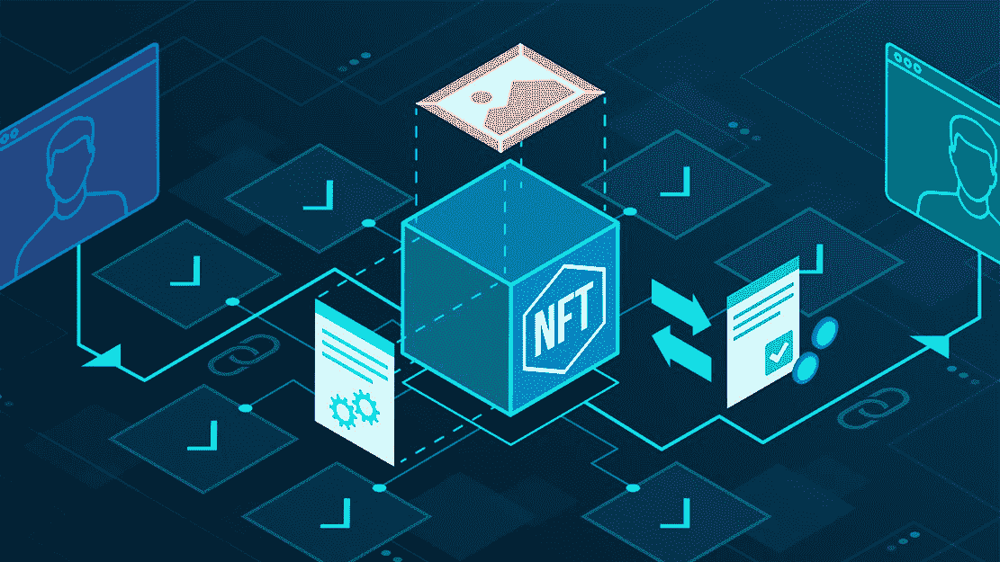
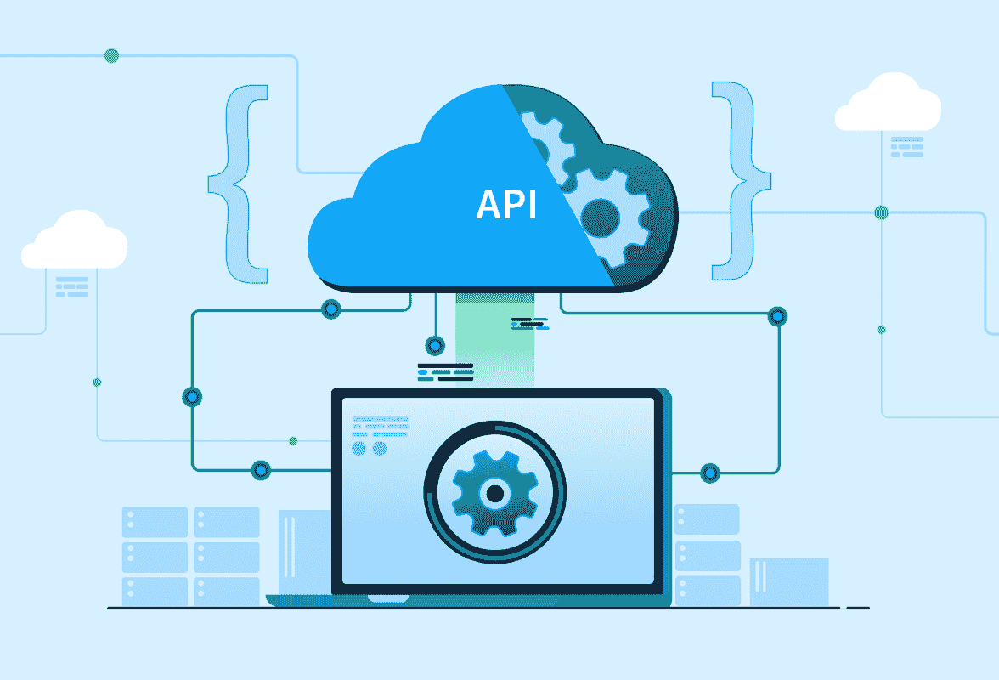
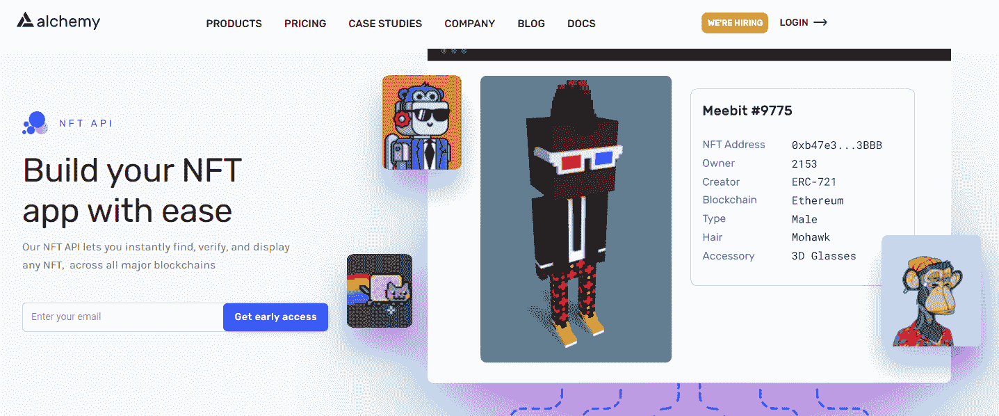
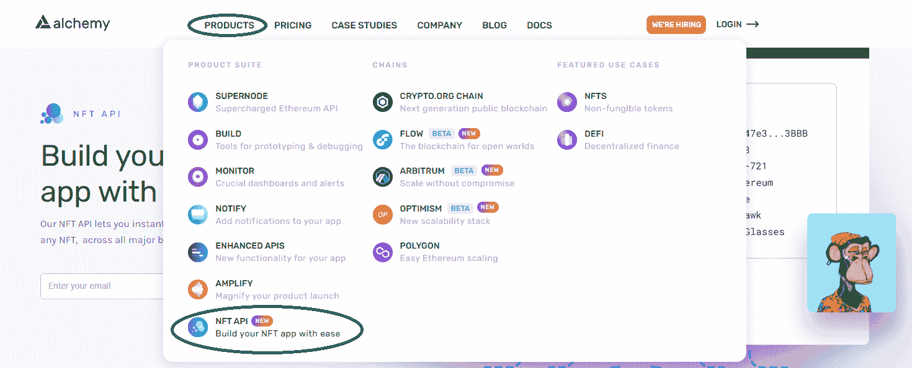
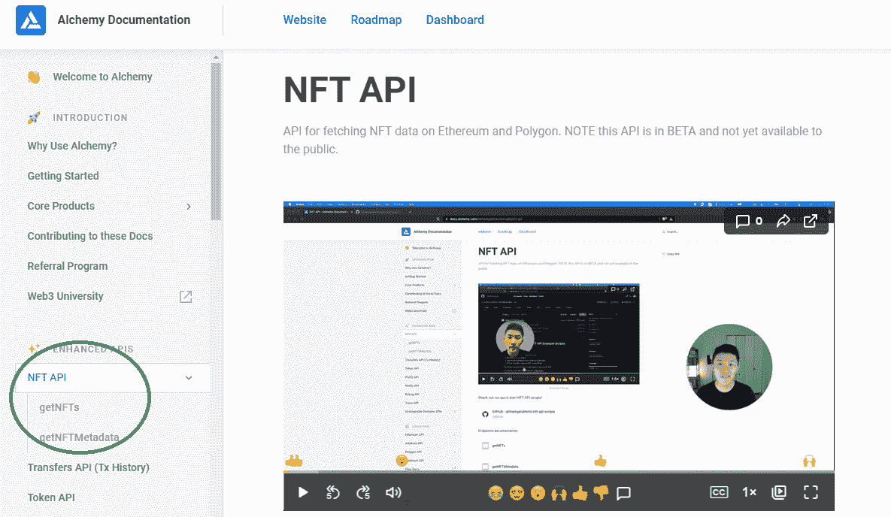
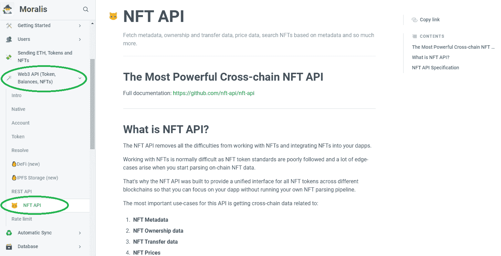
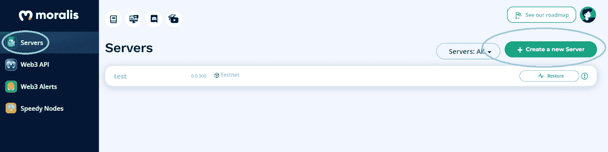
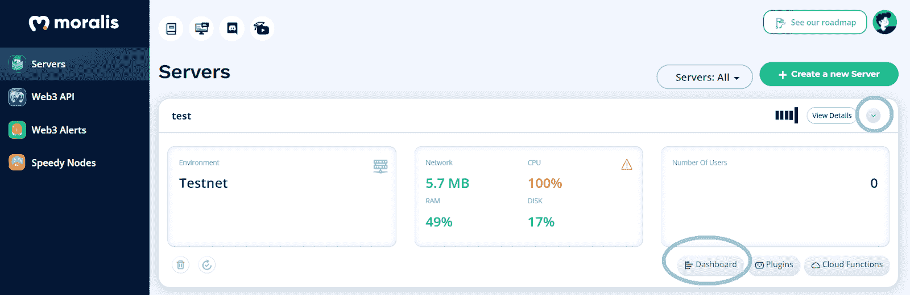
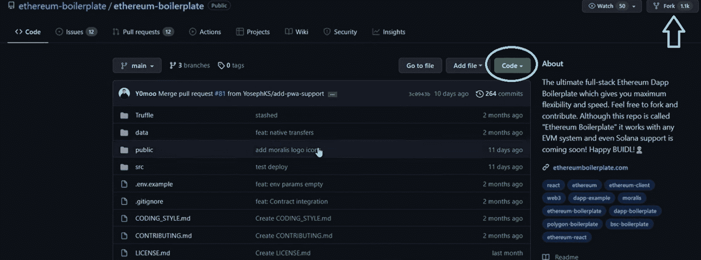
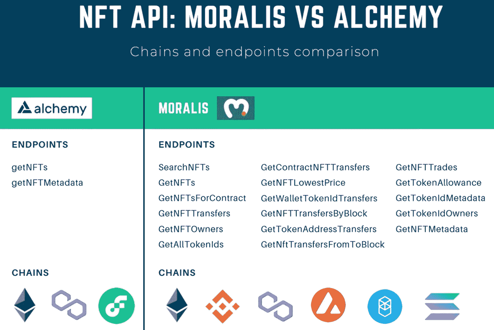

# NFT API 替代品——比较 Alchemy 的 NFT API 和 Moralis 的 NFT API

> 原文：<https://moralis.io/nft-api-alternatives-comparing-alchemys-nft-api-with-moralis-nft-api/>

在下面的文章中，我们将分解你需要知道的关于 NFT API 替代品的所有内容。如果您想直接开始工作，请查看以下 GitHub NFT API:

**【full nf API documentation】[【https://github . com/nf API/nf API】](https://github.com/nft-api/nft-api)**

* * *

不可替代代币( [NFTs](https://moralis.io/non-fungible-tokens-explained-what-are-nfts/) )在 2021 年获得了巨大的认可。因此，NFT API 替代品已经迅速上升到 NFT 发展的前沿。此外，NFT 已经被从运动员到娱乐界名人的每个人所采用。此外，就连 Visa 等公司也搭上了去 NFT 的列车。因此，它可能是数字艺术和收藏品，将船上的一般公众到区块链领域。此外，哪里有兴趣，哪里就有巨大的机会。这意味着大多数名人、有影响力的人和公司都渴望推出自己的 NFTs 和 NFT 市场。这是数字艺术家(非功能性视觉部分)和开发人员(NFT 功能)的高需求领域。因此，了解 NFT API 的最佳替代方案将会给开发者带来他们应得的优势。

幸运的是，有一些早期采用区块链的开发人员渴望为其他开发人员简化事情。于是，像 Alchemy 这样的公司就活了过来。接下来，我们将进一步了解 Alchemy 的 NFT API，它绝对是值得一提的 NFT API 替代品之一。然而，如果你正在寻找一个整体的 [Web3](https://moralis.io/the-ultimate-guide-to-web3-what-is-web3/) 开发解决方案和最先进的 NFT API， [Moralis](https://moralis.io/) 更可能是你的正确选择。在接下来的几节中，您将有机会熟悉这两种 NFT API。因此，您将能够决定两个选项中的哪一个更适合您的 NFT 发展壮举。



## 什么是 NFT 空气污染指数？

在我们仔细研究上面提到的两个 NFT API 备选方案之前，我们需要确保你们都了解基础知识。因此，让我们确保你能自信地回答“什么是 [NFT API](https://moralis.io/ultimate-nft-api-exploring-moralis-nft-api/) ？”。了解了这一点，你就能理解为什么 NFT API 如此重要。你会明白为什么在建设 NFT 项目和处理 [NFT token development](https://moralis.io/nft-token-development-the-ultimate-guide/) 时会有天壤之别。无论你是想[创建一个 NFT 市场](https://moralis.io/how-to-create-an-nft-marketplace/)，[建立一个 NFT 交易界面](https://moralis.io/build-an-nft-trading-interface-full-guide/)，还是甚至一头扎进 [NFT 游戏开发](https://moralis.io/nft-game-development-how-to-build-an-nft-game-app-in-minutes/)，拥有最终的 NFT API 对你来说都是无价的。

那么，什么是 NFT 空气污染指数？好了，让我们把它分解成“NFT”和“API”。正如介绍中提到的，“NFT”代表“不可替代的令牌”。NFT 是特殊类型的加密资产，通过元数据(存储在区块链上的数据)体现唯一性。这使得它们非常适合数字艺术和数字收藏品。当然，NFT 也有更严肃的实际应用的用例。这些包括各种证书和所有权证明。

此外，API 代表“应用程序编程接口”。因此，API 是一个接口，它使一个软件能够与其他软件进行交互。因此，API 作为一种工具，允许各种指令集被传输或翻译，以便相互理解。此外，一组 API 有助于在稳定的环境中进行一致的编码。因此，API 可以预测地在每个请求中提供所有可复制的功能。如果我们扩展“NFT API”的定义，我们将获得一个强大的 NFT 开发工具。最重要的是，NFT API 简化了 NFTs 的后端数据采集。



# 顶级 NFT API 替代品

现在您已经知道了什么是 NFT API，您已经准备好学习关于两个值得一提的 NFT API 替代品的更多内容了。我们将从 Alchemy 的 NFT API 开始，然后转到 Moralis 的 NFT API。因此，你会看到炼金术的 NFT API 是一个很好的选择。但是，与 Moralis 相比，它提供的 NFT 端点数量相当有限。此外，通过 Moralis 的 NFT API，您可以在一个简单易用的软件包中获得更多的 Web3 开发功能。



## 炼金术的 NFT API

在我们仔细研究 Alchemy 的 NFT API 之前，我们想对它们做一个快速的大喊。他们有一个很酷的团队，用一些非常棒的工具帮助区块链开发者。如果你想自己探索 Alchemy 的 NFT API，一定要访问他们的官方网站，选择“产品”下的“NFT API”选项:



正如你在上面的截图中看到的，他们的 NFT API 是一个新添加的特性。因此，它的某些方面仍处于测试阶段。此外，当使用 Alchemy 的 NFT API 时，依赖他们的文档是正确的做法。你可以点击顶部菜单中的“文档”进入后者。然后在侧边菜单中选择“NFT API ”:



在那里，你也有一个视频解释如何与他们的新 NFT API 互动。而且，在上面截图的侧边菜单中可以看到，他们目前有两个端点——“getNFTs”和“getNFTMetadata”。这两个端点目前都可以在以太坊主网、[以太坊测试网](https://moralis.io/ethereum-testnet-guide-connect-to-ethereum-testnets/)、多边形测试网和流量主网上使用。

### 炼金术的 NFT API–getn FTS

该端点获取给定地址当前拥有的所有 NFT。它接受以下参数:

*   "**业主** ": *这是 NFT 业主的地址*
*   " **pageKey** ": *该参数是可选的，作为分页的 UUID。当有更多结果可用时，响应中将返回一个 UUID 页面键。您可以将该 UUID 传递给 pageKey 来获取接下来的 100 个 NFT。另外，请注意，pageKeys 将在 10 分钟后过期。*
*   " **contractAddresses** ": *这是另一个可选参数。这是一个契约地址数组，用于过滤最多 20 个契约的响应。*

以下是“getNFTs”端点的返回结果:

*   "**owned nts**":*这是一个代表该地址所拥有的 NFT 的对象列表。每个响应最多返回 100 个结果。下面是对象的模式:*
    *   *“合同”:*
        *   *“地址”:NFT 合同地址*
    *   *【id】:*
        *   *“令牌 id”:给定 NFT 的令牌 ID*
*   " **pageKey** ": *如上所述，这是可选的，并且仅当有更多的 NFT 要获取时才返回，每页的限制为 100 个 NFT。*
*   " **totalCount** ": *这是给定地址拥有的 NFT 总数。*
*   " **blockHash** ": *这是接收到您的请求时规范头块的散列。*

关于“getNFTs”端点的例子，请访问 Alchemy 的文档。

### Alchemy 的 NFT API–getNFTMetadata

该端点获取与给定 NFT 相关联的元数据。它接受以下参数:

*   "**合同地址** ": *这是给定 NFT 合同的地址。*
*   " **tokenId** ": *这是给定 NFT 的 Id。*
*   " **tokenType** ": *该参数是可选的，尽管如果指定了它可能有助于更快地执行请求。它使请求能够确定 NFT 令牌的类型("* [*ERC721*](https://moralis.io/erc-721-token-standard-how-to-transfer-erc721-tokens/) *"或"*[*ERC 1155*](https://moralis.io/erc1155-exploring-the-erc-1155-token-standard/)*")。*
*   " **refreshCache** ": *这是另一个可选参数。它是布尔型的。要刷新元数据高速缓存(如果您认为元数据响应已过期)，请使用“true”。此外，添加此参数可能会降低响应速度。*

以下是“getNFTMetadata”端点的返回结果:

*   **JSON 对象**带有以下字段:
    *   *“合同”:归还 NFT 的合同*
        *   *“地址”:NFT 合同地址*
    *   *【id】:*
        *   *“token ID”:NFT 的 ID*
        *   *“令牌元数据”:*
            *   *“tokenType”: “ERC721” or “ERC1155”*
*   "**externaldmainviewurl**":*这是表示 NFT 的原始元数据数据的位置的 Url。*
*   "**元数据** ": *此退货不保证。这是 NFT 合约的相关元数据。这对于查看图像 URL、特征和其他细节非常有用。*
*   " **timeLastUpdated** ": *这是元数据字段中返回的信息的上次缓存刷新的 ISO 时间戳。*

*有关“getNFTMetadata”端点的示例，请访问 Alchemy 的文档。*

## Moralis 的 NFT API

就像炼金术一样，Moralis 在 [Moralis 的文档](https://docs.moralis.io/)中为你提供了关于其 NFT API 的所有细节。详细信息位于“Web3 API(令牌、余额、NFTs)”菜单选项下:



而且，Moralis 目前支持[以太坊](https://moralis.io/full-guide-what-is-ethereum/)、币安智能链( [BSC](https://moralis.io/bsc-programming-guide-intro-to-binance-smart-chain-development-in-10-minutes/) )、[多边形](https://moralis.io/how-to-build-polygon-dapps-easily/)、[雪崩](https://moralis.io/how-to-build-avalanche-dapps-in-minutes/)和 Fantom。除了完全支持上市连锁店，Moralis 还支持他们的测试网。此外，新的著名的可编程区块链正在定期添加。例如，对索拉纳的全面支持已经在酝酿中。此外，Moralis NFT API 拥有大量的端点，并不断增加新的端点。以下是 Moralis 提供的 NFT API 端点的完整列表:

*   搜索功能
*   GetNFTs
*   GetNFTsForContract
*   GetNFTTransfers
*   GetNFTTransfersByBlock
*   GetAllTokenIds
*   GetContractNFTTransfers
*   GetNFTLowestPrice
*   GetNFTMetadata
*   getnfrowners
*   GetNFTTrades
*   GetNftTransfersFromToBlock
*   GetTokenAdressTransfers
*   GetTokenAllowance
*   GetTokenIdMetadata
*   GetTokenIdOwners
*   GetWalletTokenIdTransfers

上面列出的所有端点都非常强大，它们消除了查询链上数据背后的所有复杂性。但是，有些端点您会比其他端点使用得更频繁。例如，“GetNFTs”可能是您最常依赖的。因此，让我们仔细看看这个重要的端点。

### Moralis 的 NFT API–getn FTS

关于 Moralis 的“GetNFTs”端点的伟大之处在于它已经包含了 NFT 的元数据。然而，如果你对特定 NFT 收藏背后的合同元数据感兴趣，你需要依赖“GetTokenMetadata”。

“GetNFTs”Moralis 的 NFT API 从当前用户的地址获取所有的 NFT。它支持 ERC721

和 ERC1155 NFT 标准。此外，它为您提供了几个选项，其中“地址”是唯一必需的参数。“GetNFTs”端点返回一个对象，其中包含 NFT 对象的数量和 NFT 对象的数组。

以下是“GetNFTs”的选项:

*   "**地址**"(必选):*这是唯一的必选参数，它是一个用户的地址(即 0x1a2b3x…)。*
*   " **chain** (可选):*您可以在这里指定要从中获取数据的区块链。有效值是所有支持的链的标记或符号。而且，默认值是“Eth”。*
*   "**格式**"(可选):*这是令牌 ID 的格式。十进制和十六进制值都可用，尽管十进制是默认选项。*
*   "**偏移**"(可选):*这使您能够设置所需的偏移。*
*   "**极限**"(可选):*这使您能够设置所需的极限。*

以下是针对上述端点的示例 [Moralis 的 SDK](https://moralis.io/exploring-moralis-sdk-the-ultimate-web3-sdk/) :

```js
const options = { chain: 'matic', address: '0x...' };
const polygonNFTs = await Moralis.Web3API.account.getNFTs(options);

GET /{address}/nft

curl -X 'GET' \
  'https://deep-index.moralis.io/api/v2/0xaddress/nft?chain=eth&format=decimal' \
  -H 'accept: application/json'
  -H 'X-API-Key: YOUR_API_KEY'
```

下面是上面的示例将返回的内容:

```js
[
  {
    "token_address": "0x057Ec652A4F150f7FF94f089A38008f49a0DF88e",
    "token_id": "15",
    "contract_type": "ERC721",
    "owner_of": "0x057Ec652A4F150f7FF94f089A38008f49a0DF88e",
    "block_number": "88256",
    "block_number_minted": "88256",
    "token_uri": "string",
    "metadata": "string",
    "synced_at": "string",
    "amount": "1",
    "name": "CryptoKitties",
    "symbol": "RARI"
  }
]
```

关于其他 Moralis NFT API 端点的详细信息，请查阅 Moralis 的文件。自己挖掘也是自己决定的最好方法，这是 NFT API 备选方案中最好的。

## 如何使用 Moralis NFT API

为了使用 Moralis NFT API，您需要首先[创建您的免费 Moralis 帐户](https://admin.moralis.io/register)。下一步是[创建一个 Moralis 服务器](https://docs.moralis.io/moralis-server/getting-started/create-a-moralis-server):



通过这样做，您可以完全访问 Moralis 的 SDK，包括 Moralis dashboard(数据库):



这也是您可以访问所有链上数据的地方。因此，Moralis 仪表盘为您提供了一种简单的方法来[索引区块链](https://moralis.io/how-to-index-the-blockchain-the-ultimate-guide/)。通过使用“同步”功能(通过“查看详情”访问)，您可以轻松地[同步和索引智能合同事件](https://moralis.io/sync-and-index-smart-contract-events-full-guide/):


一旦您完成了初始设置，最好的方法就是着手一个示例项目。当对非功能性测试有疑问时，使用“什么是 NFT API？”一节，会让你步入正轨。我们的每个示例项目还会引导您完成初始设置。

此外，无论您决定采用我们的一个示例项目还是创建您自己的 dApp，您都有两种选择。你可以使用公开可用的 [JavaScript](https://moralis.io/javascript-explained-what-is-javascript/) ( [React](https://moralis.io/react-explained-what-is-react/) )从头开始你的项目。js 或 Next.js)、HTML 和 [CSS](https://moralis.io/cascading-style-sheets-what-is-css/) 模板。这个选项有点费时，但它让你完全控制前端。然而，如果你正在寻找部署全功能 dApp 的最快方法，从终极的以太坊 dApp 样板开始是正确的方法。通过使用这个实用的 [Web3 样板](https://moralis.io/web3-boilerplate-beginners-guide-to-web3/)，您可以获得各种各样的组件，并且已经设置了一个整洁的 UI。因此，启动你的 dApp 就像在 [GitHub](https://github.com/ethereum-boilerplate/ethereum-boilerplate) 克隆我们的代码一样简单。无论你决定走哪条路，你都可以将你的注意力和资源完全集中在前端。就后端而言，Moralis 会支持你。



## NFT API 替代品-总结

图片胜过千言万语，因此我们让你仔细看看下面的图片。后者简洁地总结了上述两种 NFT API 备选方案的端点和支持链。



如你所见，Alchemy 的 NFT API 仅限于两个端点，并且支持更少的链。因此，毫无疑问，Moralis 是目前所有 NFT API 替代品中最明显的选择。要开始使用这个强大的工具，现在创建您的免费 Moralis 帐户。此外，一定要访问 [Moralis 的 YouTube 频道](https://www.youtube.com/c/MoralisWeb3)和 [Moralis 的博客](https://moralis.io/blog/)来获得免费的区块链发展教育。在那里，你可以深入了解这个改变世界的行业的许多热门方面。例如，我们的一些最新文章探讨了[无汽油交易](https://moralis.io/gasless-transactions-exploring-gasless-transactions-on-ethereum/)、 [Web3 登录](https://moralis.io/how-to-build-a-web3-login-in-5-steps/)和 [Web3 认证](https://moralis.io/web3-authentication-the-full-guide/)、[以太坊汽油费](https://moralis.io/ethereum-gas-fees-the-ultimate-2022-guide/)、 [GameFi 和 play-to-earn (P2E)](https://moralis.io/what-is-gamefi-and-play-to-earn-p2e/) 、 [Web3 钱包](https://moralis.io/what-is-a-web3-wallet-web3-wallets-explained/)、 [Android SDK 替代方案](https://moralis.io/walletconnect-android-sdk-alternative-authenticate-android-apps-withmoralis/)、 [DAO 智能合约示例](https://moralis.io/dao-smart-contract-example-dao-guide/)、 [ERC20 合约](https://moralis.io/what-are-erc20-contracts-full-erc20-contract-guide/)等等

另一方面，也有更专业的方法可用。通过注册 Moralis 学院，你可以更快地到达 T2，成为区块链的开发者。有了顶级的课程、支持性的社区和专业的导师，你应该很快就能成为全职的加密员。

